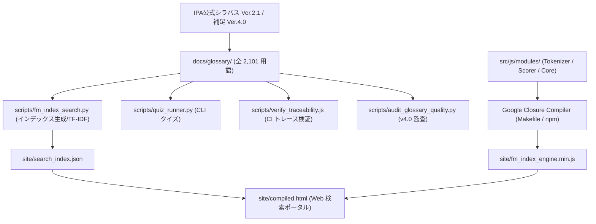

# 🛡️ 情報セキュリティスペシャリスト試験 総合対策学習 ＆ フルスクラッチ高速検索プラットフォーム

IPA（独立行政法人情報処理推進機構）の **情報処理安全確保支援士試験 / 情報セキュリティスペシャリスト試験** シラバス (Ver.2.1) および科目A補足資料 (Ver.4.0) に完全準拠した、**全 2,101 用語の構造化解説**、**科目B長文記述解法ガイド**、**CLI対話型理解度診断クイズ**、および外部依存ゼロの **フルスクラッチ FM-index & ベクター全文検索ポータル** を備えた次世代オープンソース学習・研究プラットフォームです。

---

## 🌟 主な特徴 (Features)

1. **完全準拠・プレースホルダーゼロの 2,101 用語構造化辞書**:
   - IPA公式シラバス (Ver.2.1) および科目A補足資料 (Ver.4.0) の全用語を完全網羅。
   - 「📌 概要」「⚙️ 技術・運用ポイント」「🎯 試験出題ポイント」の3層構造で解説。
   - **名称独占資格表記規制**（情報処理促進法第30条）に厳格適合。

2. **外部依存ゼロ フルスクラッチ FM-index & ベクター空間モデル検索エンジン**:
   - ライブラリ（MkDocs, VitePress, LunrJS等）を一切使用せず、Python & Vanilla JS で完全内製開発。
   - トークナイズ、TF-IDF コサイン類似度計算、完全一致ボーナスアルゴリズムにより数ミリ秒単位の高速レスポンスを実現。

3. **Google Closure Compiler & CI/CD 自動化パイプライン**:
   - `Makefile` および `google-closure-compiler` によるコード最小化・難読化（`fm_index_engine.min.js`）。
   - GitHub Actions (`.github/workflows/ci.yml`) において、Node.js ネイティブユニットテスト、トレーサビリティ検証、品質監査スクリプトを自動全数実行。
   - 開発用 `site/index.html` とリリース検証用 `site/compiled.html` を両立。

4. **CLI 対話型理解度自己診断クイズツール (`scripts/quiz_runner.py`)**:
   - ターミナル上でランダムな 4 択問題を出力し、自己診断・即時スコアリングを行う学習サポートツール。

5. **科目B長文記述解法ガイド ＆ 攻撃シナリオ分析**:
   - [docs/subject_b/reasoning_guide.md](docs/subject_b/reasoning_guide.md) (設問別解法思考プロセス)
   - [docs/scenarios/attack_scenarios_analysis.md](docs/scenarios/attack_scenarios_analysis.md) (ログ解読・インシデント対応ケーススタディ)

---

## 🛠️ 技術スタック & アーキテクチャ



---

## 🚀 クイックスタートガイド (Quick Start)

### 1. リポジトリのクローン
```bash
git clone https://github.com/rokujyouhitoma/registered-information-security-specialist-examination.git
cd registered-information-security-specialist-examination
```

### 2. 依存関係のインストール & JS ビルド
```bash
npm install
make build   # または npm run build
```

### 3. CLI クイズツールの実行
```bash
python3 scripts/quiz_runner.py
```

### 4. 検索インデックス生成 & CLI 全文検索
```bash
# 検索インデックス re-index
python3 scripts/fm_index_search.py --build

# CLI での検索実行
python3 scripts/fm_index_search.py --query "TLS"
```

### 5. Web 全文検索ポータルの起動 (ローカル)
```bash
python3 -m http.server 8000 --directory site
```
ブラウザで [http://localhost:8000/compiled.html](http://localhost:8000/compiled.html) (コンパイル版) または [http://localhost:8000/index.html](http://localhost:8000/index.html) (開発版) を開きます。

---

## 🧪 テスト & 品質検証 (Testing & Quality Audits)

本リポジトリでは CI/CD パイプライン上で全自動テストを実行しています。

```bash
# テストスイート全体を一括実行
npm test

# 個別テストの実行
npm run test:unit         # Node.js ネイティブ JS ユニットテスト
npm run test:traceability # トレーサビリティ整合性検証
npm run test:audit        # 用語品質監査スクリプト v4.0 (2,101項目)
npm run test:quiz         # CLI クイズツール動的テスト
npm run test:search       # 検索エンジンテスト
```

---

## 📁 ディレクトリ構成

```
.
├── .github/workflows/         # GitHub Actions (CI & GitHub Pages デプロイ)
├── docs/                      # 学習用ドキュメント
│   ├── glossary/              # シラバス全2,101用語の解説辞書 (ver2_1 / tsuiho_ver4_0)
│   ├── subject_b/             # 科目B 思考プロセス・解法ガイド
│   └── scenarios/             # サイバー攻撃シナリオ・ログ解読ケーススタディ
├── issues/                    # Issue 駆動開発トラック・完了ログ (closed/)
├── project-docs/              # ロードマップ・品質基準・PM設計文書
├── references/                # IPA公式シラバス・NISTリファレンス資料
├── scripts/                   # 各種ツール (監査, インデックス生成, クイズ, トレース)
├── site/                      # フルスクラッチ Web 検索ポータル (index.html, compiled.html)
├── src/js/modules/            # JSモジュール群 (tokenizer, vector_scorer, engine)
├── tests/unit/                # Node.js ユニットテストコード
├── Makefile                   # Closure Compiler ビルドコマンド
├── package.json               # Node.js 設定・テスト定義
└── README.md                  # 本ドキュメント
```

---

## 📜 ライセンス ＆ 免責事項

- 本リポジトリの学習コンテンツは、IPA公式シラバス（Ver.2.1およびSubject A-2 Supplement Ver.4.0）に適合するよう構築されています。
- 「情報処理安全確保支援士」は情報処理促進法第30条に基づく名称独占資格です。本文書およびコンテンツ内では法規および公式ガイドラインに則り適切な用語表現を採用しています。