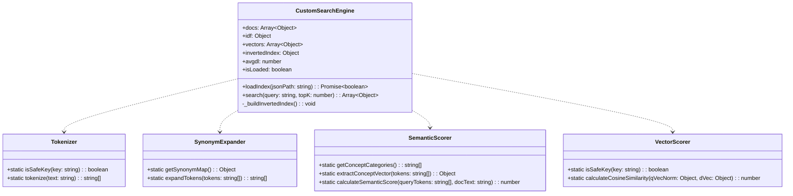

# システム詳細設計書 (Low-Level Design Document: LLD)

本ドキュメントは、システム基本設計書 (HLD) に基づき、各 JavaScript モジュールの詳細なクラス設計、データ構造、通信プロトコル、計算アルゴリズム、プロトタイプ汚染防御ロジックを定義する**システム詳細設計書 (LLD)** です。

---

## 1. モジュールクラス設計 (Module & Class Specifications)

---

## 2. モジュール詳細仕様

### 2.1 `Tokenizer` (`site/js/tokenizer.js`)
- **メソッド**: `tokenize(text: string): Array<string>`
- **正規化ロジック**:
  - 全角・半角記号 (`[!"#$%&'()*+,\-./:;<=>?@\[\\\]^_`{|}~、。！？「」『』（）［］【】\s]+`) をスペース置換。
  - 英字の小文字化 (`toLowerCase()`)。
  - 単語分割（空白区切り）および文字 Bigram 分割の複合抽出。
  - `Map` オブジェクトを使用した重複除外と `isSafeKey` ガード。

---

### 2.2 `SynonymExpander` ([src/js/synonym_expander.js](../src/js/synonym_expander.js))
- **外部データソース**: [src/data/synonyms.json](../src/data/synonyms.json)
- **メソッド**: `setSynonymMap(map)`, `expandTokens(tokens: Array<string>): Array<string>`

---

### 2.3 `SemanticScorer` ([src/js/semantic_scorer.js](../src/js/semantic_scorer.js))
- **外部データソース**: [src/data/concept_config.json](../src/data/concept_config.json)
- **概念カテゴリ**: `['network', 'crypto', 'web_sec', 'cloud', 'governance', 'incident']`
- **計算式**:
  $$\text{Score}_{\text{semantic}} = 2.5 \times \sum_{k \in \text{Categories}} \hat{v}_{\text{query}}[k] \cdot \hat{v}_{\text{doc}}[k]$$

---

### 2.4 `CustomSearchEngine` (`site/js/fm_index_engine.js`)
- **転置インデックス構造**: `invertedIndex[token] = [docId1, docId2, ...]`
- **BM25 スコア計算式**:

$$\text{Score}_{\text{BM25}}(D, Q) = \sum_{i=1}^{n} \text{IDF}(q_i) \cdot \frac{f(q_i, D) \cdot (k_1 + 1)}{f(q_i, D) + k_1 \cdot \left(1 - b + b \cdot \frac{|D|}{\text{avgdl}}\right)}$$

- **パラメータ定数**:
  - $k_1 = 1.2$
  - $b = 0.75$
  - $\text{avgdl} = \text{ドキュメント平均長}$

- **ハイブリッド総合統合スコア公式**:

$$\text{Score}_{\text{final}} = \text{Score}_{\text{BM25\_Synonym}} + 0.5 \cdot \text{Score}_{\text{Cosine}} + \text{Score}_{\text{Semantic}} + \text{Boost}_{\text{ExactMatch}}$$

---

## 3. Web Worker メッセージ通信プロトコル (`site/js/search_worker.js`)

| アクション (Action) | 送信元 ➔ 受信元 | ペイロードデータ (Payload) | 返答ステータス |
| :---: | :---: | :--- | :--- |
| `INIT` | UI ➔ Worker | `{ action: 'INIT', dataPath: 'search_index.json' }` | `{ status: 'READY', totalDocs: number }` |
| `SEARCH` | UI ➔ Worker | `{ action: 'SEARCH', query: string, topK: number }` | `{ status: 'RESULTS', query: string, results: Array }` |
| `ERROR` | Worker ➔ UI | - | `{ status: 'ERROR', error: string }` |

---

## 4. 関連ドキュメント
- [システム基本設計書 (HLD: High-Level Design)](system_high_level_design.md)
- [レイアウト・設計ガイドライン](docs_architecture_and_layout_design.md)

---

## 5. データ駆動設計原則 (Data-Driven Architecture Principle)

本システムの検索・評価ロジックにおいては、プログラムコード (JavaScript / Python) とドメインデータ (辞書、概念分類、キーワードマッピング) を完全に分離する**データ駆動設計原則 (Data-Driven Design)** を厳格に適用しています。

### 5.1 設計ルール
1. **処理系とデータの分離・非結合化**:
   - シノニム辞書 ([src/data/synonyms.json](../src/data/synonyms.json)) や概念カテゴリ・キーワード定義 ([src/data/concept_config.json](../src/data/concept_config.json)) 等のドメインデータは、JavaScript 内にハードコードせず、独立した外部 JSON データファイルとして分離管理する。
2. **動的ロードとデータ注入**:
   - `SynonymExpander` および `SemanticScorer` などのモジュールは、`setSynonymMap(data)` や `setConceptConfig(config)` メソッドを通じて外部から動的にデータを注入して実行する。
3. **ビルド時のアセット自動同期**:
   - `src/data/` 配下のデータソースは、ビルドパイプライン (`scripts/build_html_docs.py`) によって `site/data/` 配下へ自動的に同期・デプロイされる。

### 5.2 メリットと保守性
- **ロジック非依存のデータ更新**: シノニム語彙の追加や概念カテゴリのキーワード調整の際、JS コードを改変することなく JSON の更新のみで即座に精度向上・調整が可能。
- **多言語・複数ランタイム間でのデータ共有**: 同一の JSON データファイルを JavaScript (ブラウザ / Web Worker / Node.js) と Python (ビルド・検証スクリプト) で一元的に共有可能。

---

## 6. 関連ドキュメント
- [システム基本設計書 (HLD)](SYS-01-system_high_level_design.md)
- [UI/UX & レイアウト設計書](ARCH-01-docs_architecture_and_layout_design.md)
- [マスター文書管理台帳・規約](../processes/MNG-01-document_ledger.md)
