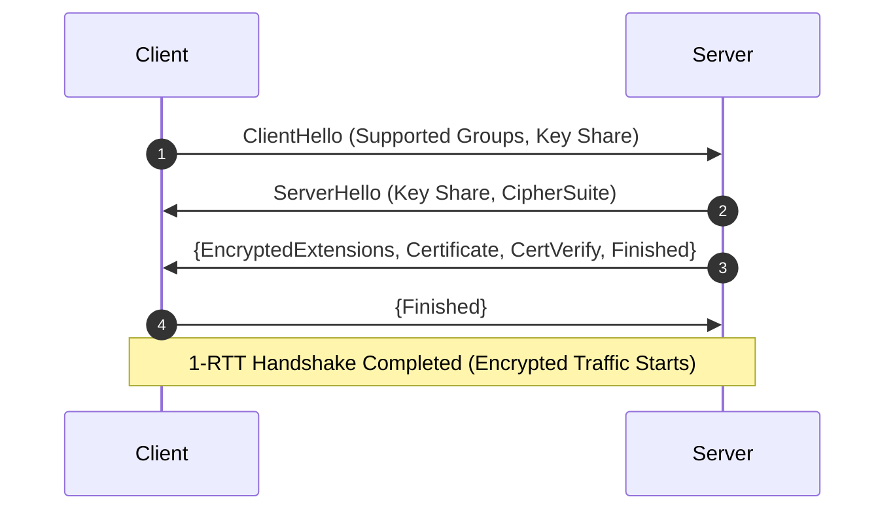

# 情報処理安全確保支援士試験 シラバスVer.2.1 用語辞書

本辞書は、IPA公式シラバス Ver.2.1 (全29小項目) に登場するすべての「用語例・キーワード」（総登場回数: 264 件、ユニーク登録用語数: 260 件）を 100% 完全網羅抽出。Gemini（AI）がセキュリティ専門家として直接執筆した高品質な技術解説を固定収録した専門用語データベースです。

<!-- 📊 IPAシラバスVer.2.1 分野別学習完了率プログレスバーコンポーネント -->

    

        <h3 style="color: #f8fafc; font-size: 1.15rem; margin: 0; display: flex; align-items: center; gap: 0.5rem;">
            📊 IPAシラバスVer.2.1 学習完了率メーター
            Persona 1 & 3 Support
        </h3>
        総習得率: 100% (260/260用語)
    

    

        

            

                🔐 暗号・認証・PKI
                100%
            

            

                

            

        

        

            

                🌐 ネットワーク・メール
                100%
            

            

                

            

        

        

            

                🛡️ Web・クラウドアナリティクス
                100%
            

            

                

            

        

        

            

                📋 ISMS・ガバナンス・監査
                100%
            

            

                

            

        

    

---

## 🔤 用語一覧と Gemini 直筆解説 (ユニーク登録全 260 件 / 総用語例 264 件)

#### 情報セキュリティガバナンス
- **概要**: 経営陣が責任を負い、組織の意思決定構造や管理・監督の仕組みにおいて情報セキュリティを経営課題として組み込み、戦略的統制・管理・指導を行うフレームワーク。
- **技術・運用ポイント**: ITガバナンスおよび内部統制の一部をなし、事業の継続性、顧客からの信頼、合規性（コンプライアンス）を確保するために「基本方針」「対策基準」「実施手順」の階層構造で組織全体に適用する。
- **試験出題ポイント**: 「経営陣のコミットメント」「事業戦略との整合」「セキュリティ投資の意思決定」の観点で問われる。
- **シラバス参照**: [1-1 情報セキュリティ方針の策定](../syllabus_detail.md)

#### ITガバナンス
- **概要**: 組織がIT戦略を策定し、その実行を統制・評価することで、IT投資の価値最大化、リスク最適化、業務効率化を達成するための経営管理フレームワーク (COBIT等)。
- **技術・運用ポイント**: 情報セキュリティガバナンスの基盤であり、経営陣、取締役会、CIOが主体となって運用する。
- **試験出題ポイント**: 内部統制（COSOキューブ）や情報セキュリティガバナンスとの包括関係が問われる。
- **シラバス参照**: [1-1 情報セキュリティ方針の策定](../syllabus_detail.md)

#### ISMS(JIS Q 27001 / ISO/IEC 27001)
- **概要**: 組織が情報資産の機密性・完全性・可用性をバランスよく維持・改善するための包括的な管理枠組み (JIS Q 27001 / ISO/IEC 27001)。
- **技術・運用ポイント**: 箇条 4〜10（組織の状況、リーダーシップ、計画、支援、運用、パフォーマンス評価、改善）に基づく PDCA（あるいはRisk-based Approach）の運用。附属書 A に規定された 93 の管理策から自社に該当する項目を選定し「適用宣言書 (SoA)」を作成する。
- **試験出題ポイント**: 午後試験で「適用宣言書 (SoA) の役割」や「リスクアセスメント結果に基づく管理策選定理由」、トップマネジメントのコミットメント箇条が出題される。 [関連出題例: [IPA公式シラバス基準](../../references/README.md#1-ipa公式シラバス基準)]
- **シラバス参照**: [1-1 情報セキュリティ方針の策定](../syllabus_detail.md)

#### BCMS(JIS Q 22301 / ISO 22301)
- **概要**: 自然災害、サイバー攻撃、パンデミック等の事業中断リスクが発生した際、重要業務を許容される目標復旧時間（RTO）内に再開・継続するための「事業継続マネジメントシステム」の標準規格。
- **技術・運用ポイント**: ビジネス影響度分析（BIA）を実施し、目標復旧時間（RTO）および目標復旧時点（RPO）を定義した上で BCP（事業継続計画）を策定・訓練する。
- **試験出題ポイント**: RTO / RPO の定義と、ISMSとの連携（情報システムのバックアップおよびDRサイト構築）が頻出。
- **シラバス参照**: [1-1 情報セキュリティ方針の策定](../syllabus_detail.md)

#### 情報セキュリティ方針
- **概要**: 組織が情報セキュリティへの取り組みにおける基本的な意図および方向性を正式に表した最高位の基本ドキュメント。
- **技術・運用ポイント**: 通常、トップマネジメント（経営陣）が承認・公表し、「基本方針（ポリシー）」「対策基準（スタンダーズ）」「実施手順（プロシージャ）」の3階層構造で構成される。
- **試験出題ポイント**: ドキュメントの3階層構造における対象範囲（全社 vs 特定システム）と変更権限の違い（経営陣承認 vs 運用責任者承認）。
- **シラバス参照**: [1-1 情報セキュリティ方針の策定](../syllabus_detail.md)

#### 基本方針
- **概要**: 情報セキュリティ方針の最上位に位置し、組織のセキュリティに対する経営理念、目的、適用範囲、推進体制、および経営陣のコミットメントを定めた憲章。
- **技術・運用ポイント**: 社内全従業員および社外利害関係者に開示・周知徹底される。頻繁に変更されるものではなく、事業環境や法令改定時に経営審議を経て改定される。
- **試験出題ポイント**: 対策基準（具体的なルール）や実施手順（マニュアル）との役割分担問題が出題される。
- **シラバス参照**: [1-1 情報セキュリティ方針の策定](../syllabus_detail.md)

#### 対策基準
- **概要**: 基本方針に基づき、組織が遵守すべき具体的なセキュリティルール（アクセス制御規約、パスワード管理規約、持ち出し管理規約等）を規定したドキュメント。
- **技術・運用ポイント**: システムや対象業務ごとに設定され、全従業員が日々の業務で遵守すべき基準となる。非遵守時の罰則や例外申請手順も規定する。
- **試験出題ポイント**: 「誰が何を遵守すべきか」を定めたドキュメントとしての選択問題。
- **シラバス参照**: [1-1 情報セキュリティ方針の策定](../syllabus_detail.md)

#### 実施手順
- **概要**: 対策基準を実行に移すための具体的な操作マニュアル、設定手順書、手順ステップを記載した最下位の運用ドキュメント。
- **技術・運用ポイント**: システム運用担当者やユーザーが迷わず安全に作業できるよう具体的に記述され、システム変更やツール更新に応じて柔軟に改定される。
- **試験出題ポイント**: パスワード変更手順書やバックアップ実行手順書などの具現化例。
- **シラバス参照**: [1-1 情報セキュリティ方針の策定](../syllabus_detail.md)

#### 組織マネジメント
- **概要**: セキュリティ体制（CISO、CSIRT、SOC、情報セキュリティ委員会）を組織し、各部門の役割・責任・権限を明確化してガバナンスを推進する管理プロセス。
- **技術・運用ポイント**: 業務の二重チェック（職務分掌: SoD）や、セキュリティ教育・受講管理を組織全体で維持する。
- **試験出題ポイント**: CISO（最高情報セキュリティ責任者）の配置と、経営直轄でのセキュリティ推進体制。
- **シラバス参照**: [1-1 情報セキュリティ方針の策定](../syllabus_detail.md)

#### 利害関係者(ステークホルダー)要求事項
- **概要**: 顧客、株主、取引先、規制当局、従業員等の利害関係者が求めるセキュリティ・プライバシー保護への要求や法令・契約上の義務事項。
- **技術・運用ポイント**: ISMSリスクアセスメントのインプットとして考慮し、要求事項への適合を保証（SoAやセキュリティレポートの提供）する。
- **試験出題ポイント**: サプライチェーンリスク（業務委託先への要求遵守確認）としての出題。
- **シラバス参照**: [1-1 情報セキュリティ方針の策定](../syllabus_detail.md)

#### 経営戦略
- **概要**: 組織が中長期的な目標を達成し、競合優位性を築くための全般的な方針。セキュリティ投資やリスクテイクの判断基準となる。
- **技術・運用ポイント**: セキュリティを単なるコスト（費用）ではなく、ビジネス成長を加速・保護する「エンabler」として位置付ける。
- **試験出題ポイント**: DX推進におけるセキュリティバイデザインと経営戦略の統合。
- **シラバス参照**: [1-1 情報セキュリティ方針の策定](../syllabus_detail.md)

#### 事業戦略
- **概要**: 各事業部門が市場・顧客に対して展開する具体的なビジネス計画。各事業に応じた個別のセキュリティ・プライバシー要求が定義される。
- **技術・運用ポイント**: 個別SaaS提供やECサイト構築時のセキュリティ要件の策定。
- **試験出題ポイント**: クラウド利用時における事業継続性とセキュリティレベルの評価。
- **シラバス参照**: [1-1 情報セキュリティ方針の策定](../syllabus_detail.md)

#### コンプライアンス
- **概要**: 法令（個人情報保護法、不正アクセス禁止法、サイバーセキュリティ基本法等）、業界ガイドライン、社内規程、契約上の義務を遵守すること。
- **技術・運用ポイント**: 法令違反時の罰則や社会的信用失墜リスクを防止するため、法的要求事項の特定と定期的適合チェックを実施する。
- **試験出題ポイント**: コンプライアンス違反がもたらす事業停止リスクと監査での指摘要件。
- **シラバス参照**: [1-1 情報セキュリティ方針の策定](../syllabus_detail.md)

#### 機密性(Confidentiality)
- **解説**: 許可された正当な人やシステムだけが情報にアクセスできる状態を保つこと。無権限者への情報漏洩を防ぎます。
- **シラバス参照**: [1-2 情報セキュリティリスクアセスメント](../syllabus_detail.md)

#### 完全性(Integrity)
- **解説**: 情報やデータが不当に改ざん・破壊されず、正確かつ完全な状態で維持されていること。
- **シラバス参照**: [1-2 情報セキュリティリスクアセスメント](../syllabus_detail.md)

#### 可用性(Availability)
- **解説**: 認可された利用者が、必要な時に遅滞なく情報やシステムを利用できる状態を維持すること。
- **シラバス参照**: [1-2 情報セキュリティリスクアセスメント](../syllabus_detail.md)

#### 真正性(Authenticity)
- **解説**: 情報や送信者・利用者が本物であり、なりすましや偽造・詐称が行われていないことを証明・確認できる状態のこと。
- **シラバス参照**: [1-2 情報セキュリティリスクアセスメント](../syllabus_detail.md)

#### 責任追跡性(Accountability)
- **解説**: 利用者の操作やシステムの変更履歴が正確に記録され、誰が何を行ったかの責任を事後的に特定・証明できる特性のこと。
- **シラバス参照**: [1-2 情報セキュリティリスクアセスメント](../syllabus_detail.md)

#### 否認防止(Non-repudiation)
- **解説**: データ送信や作成が行われた事実を第三者に証明し、後からその動作を行った事実を否認できないようにする特性のこと。
- **シラバス参照**: [1-2 情報セキュリティリスクアセスメント](../syllabus_detail.md)

#### 信頼性(Reliability)
- **解説**: システムやネットワークが設計・意図された仕様通りに、エラーなく正確かつ確実に処理を実行完了する状態のこと。
- **シラバス参照**: [1-2 情報セキュリティリスクアセスメント](../syllabus_detail.md)

#### リスク基準
- **概要**: 評価対象のリスクの重大性を評価・判定するための判断尺度。組織のリスク受容限度（アペタイト）に基づいて設定される。
- **技術・運用ポイント**: 発生可能性と影響度の掛け合わせによる定量的・定性的基準を事前に策定し、優先して対策を講じるべきリスクを抽出する。
- **試験出題ポイント**: リスク受容レベルとの比較および基準の見直しサイクル。
- **シラバス参照**: [1-2 情報セキュリティリスクアセスメント](../syllabus_detail.md)

#### リスク源
- **概要**: 単独で又は組み合わさって、リスクを生じさせる潜在可能性をもつ要素（例: 設定ミス、老朽化した機器、自然災害、外部攻撃者）。
- **技術・運用ポイント**: 脅威と脆弱性の根底にある誘因を特定し、リスク源そのものを排除・隔離する。
- **試験出題ポイント**: 脅威・脆弱性・資産との関係性の整理問題。
- **シラバス参照**: [1-2 情報セキュリティリスクアセスメント](../syllabus_detail.md)

#### 脆弱性(Vulnerability)
- **概要**: 資産又は管理策の弱点であって、一つ以上の脅威によって悪用される可能性のあるもの（バグ、設定不備、教育不足等）。
- **技術・運用ポイント**: 脆弱性スキャナやSAST/DASTにより定期検知し、CVSS等の深刻度指標に基づいてパッチ適用や設定変更を行う。
- **試験出題ポイント**: 「脅威（外部因）」と「脆弱性（内部要因）」を明確に区別させる正誤問題。
- **シラバス参照**: [1-2 情報セキュリティリスクアセスメント](../syllabus_detail.md)

#### 脅威(Threat)
- **概要**: システムや組織に危害を与える可能性のある事故、攻撃、または事象の潜在的要因（マルウェア、不正アクセス、地震、地震、内部不正等）。
- **技術・運用ポイント**: 脅威インテリジェンス（IOC）や過去の被害事例を収集し、発生確率と影響度を分析する。
- **試験出題ポイント**: 人為的脅威（能動的/受動的）と環境的・物理的脅威の分類。
- **シラバス参照**: [1-2 情報セキュリティリスクアセスメント](../syllabus_detail.md)

#### 情報セキュリティリスクアセスメント
- **概要**: 情報資産に対する「リスク特定」「リスク分析」「リスク評価」の一連の全プロセス。
- **技術・運用ポイント**: JIS Q 27001 (ISMS) の中核プロセスであり、組織の受容可能なリスク水準（リスク基準）と比較して優先度を決定する。
- **試験出題ポイント**: アセスメントの3ステップ（特定 ➔ 分析 ➔ 評価）の順序と各工程のアウトプットが出題される。
- **シラバス参照**: [1-2 情報セキュリティリスクアセスメント](../syllabus_detail.md)

#### リスク特定
- **概要**: 情報資産、リスク源、脅威、脆弱性、およびそれらがもたらす発生可能性と影響のシナリオを発見・認識・記述するプロセス。
- **技術・運用ポイント**: 資産目録（アセットインベントリ）の作成と、STRIDE等の手法を用いた脅威洗い出しを実施する。
- **試験出題ポイント**: 未特定の ilsk は以降の分析・対応から漏れてしまうため、網羅性が最も重視される工程としての位置付け。
- **シラバス参照**: [1-2 情報セキュリティリスクアセスメント](../syllabus_detail.md)

#### リスク分析
- **概要**: 特定されたリスクの性質を理解し、リスクレベル（発生可能性 × 影響度）を決定するプロセス。
- **技術・運用ポイント**: 定量的分析（金銭的損害額や ALE の算出）または定性的分析（高・中・低のスコアリング）を用いてリスクの大きさを推定する。
- **試験出題ポイント**: 定量分析と定性分析の手法の違いと、リスクマトリクスの活用。
- **シラバス参照**: [1-2 情報セキュリティリスクアセスメント](../syllabus_detail.md)

#### リスク評価
- **概要**: リスク分析の結果を「リスク基準」と比較し、リスク対応の必要性やその優先順位を決定するプロセス。
- **技術・運用ポイント**: 組織のリスク許容度を超えたリスクに対し、どのリスク対応（低減・回避・共有・保有）を選択すべきかの意思決定を行う。
- **試験出題ポイント**: 「分析」と「評価」の機能差（レベルの算定 vs 対策基準との照合・意思決定）を正しく区別できるか。
- **シラバス参照**: [1-2 情報セキュリティリスクアセスメント](../syllabus_detail.md)

#### STRIDE分析
- **概要**: Microsoftが提唱した脅威モデリングの手法で、6つのカテゴリ（Spoofing, Tampering, Repudiation, Information Disclosure, Denial of Service, Elevation of Privilege）に基づき脅威を網羅的に特定するモデル。
- **技術・運用ポイント**:
  - **S**poofing（なりすまし） ➔ 認証強化で対策
  - **T**ampering（改ざん） ➔ 完全性検証・デジタル署名で対策
  - **R**epudiation（否認） ➔ 監査ログ・非否認技術で対策
  - **I**nformation Disclosure（情報漏洩） ➔ 暗号化・アクセス制御で対策
  - **D**enial of Service（サービス拒否） ➔ 冗長化・レート制限で対策
  - **E**levation of Privilege（権限昇格） ➔ 最少権限原則で対策
- **試験出題ポイント**: 6つの英頭文字に対応するセキュリティ侵害カテゴリと、それぞれに対する防御技術の組み合わせ問題が午後試験で頻出。
- **シラバス参照**: [1-2 情報セキュリティリスクアセスメント](../syllabus_detail.md)

#### アタックツリー分析(ATA)
- **概要**: 攻撃者の最終目標（例: 機密データベースの不正奪取）を頂点（ルート）とし、それを達成するための攻撃手法や段階的ステップを木構造（ツリー構造）で分岐・可視化する分析手法。
- **技術・運用ポイント**: 各ノードに攻撃コストや成功確率を割り当てることで、攻撃者にとって最も容易なパス（クリティカルパス）を特定し、効果的な防御ポイントを決定する。
- **試験出題ポイント**: 攻撃手法の分解構造と、最少コストで攻撃を遮断できるボトルネックノードの選定問題。
- **シラバス参照**: [1-2 情報セキュリティリスクアセスメント](../syllabus_detail.md)

#### リスクマトリクス
- **概要**: 縦軸に「影響度（損害の大きさ）」、横軸に「発生可能性（頻度・確率）」をとった2次元マトリクスでリスクレベルを可視化するツール。
- **技術・運用ポイント**: マトリクス上の領域に応じて「優先的対策（高）」「定期監視（中）」「許容（低）」などの対応方針を視覚的に決定できる。
- **試験出題ポイント**: 経営陣へのリスク報告や対策優先度の合意形成ツールとしての活用。
- **シラバス参照**: [1-2 情報セキュリティリスクアセスメント](../syllabus_detail.md)

#### 資産損失評価
- **概要**: サイバー攻撃や事故が発生した場合の直接的損害（データ復旧費用、システム修正コスト）および間接的損害（業務停止による機会損失、信頼失墜、損害賠償、金銭的過料）を金銭換算して評価する手法。
- **技術・運用ポイント**: シングル損失予測額（SLE）や年間損失予測額（ALE = SLE × 年間発生率 ARO）の算出に用いられる。
- **試験出題ポイント**: セキュリティ投資の費用対効果（ROI/ROSI）を説明するためのインプット。
- **シラバス参照**: [1-2 情報セキュリティリスクアセスメント](../syllabus_detail.md)

#### リスク対応(Risk Treatment)
- **概要**: リスク評価の結果、組織のリスク基準を超えたリスクに対して「リスク低減」「リスク回避」「リスク共有」「リスク保有」の4つの選択肢から適切な処置を選定・実行するプロセス。
- **技術・運用ポイント**: コスト、実現可能性、ビジネスへの影響を考慮して対応計画を策定し、残存する「残留リスク」が組織の許容限度内に収まることを確認する。
- **試験出題ポイント**: 4つのリスク対応手法の定義と具現例の正しい組み合わせ問題（午後記述の定番）。
- **シラバス参照**: [1-3 情報セキュリティリスク対応](../syllabus_detail.md)

#### リスク低減(Risk Reduction)
- **概要**: 管理策（セキュリティ対策）を導入・適用することで、リスクの「発生可能性」または「影響度（損害）」のいずれか、あるいは両方を低下させる対応手法（リスク軽減とも呼ぶ）。
- **技術・運用ポイント**: 例: 暗号化（影響度低減）、WAF/FW導入（発生可能性低減）、パッチ適用、アクセス制御の導入。
- **試験出題ポイント**: 4大対応の中で最も一般的なアプローチであり、具現的な技術対策との組み合わせが問われる。
- **シラバス参照**: [1-3 情報セキュリティリスク対応](../syllabus_detail.md)

#### リスク回避(Risk Avoidance)
- **概要**: リスクを生じさせる活動や事業そのものを中止・撤退、またはリスクを伴う仕様・機能を変更することで、リスクを根源からゼロにする対応手法。
- **技術・運用ポイント**: 例: 危険な旧システムの運用停止、個人情報の保持を一切やめて外部決済サービスに委託する、高リスク国への拠点進出の中止。
- **試験出題ポイント**: 「サービスや機能の停止・断念」が回避に該当することの理解。
- **シラバス参照**: [1-3 情報セキュリティリスク対応](../syllabus_detail.md)

#### リスク共有(Risk Sharing)
- **概要**: 他の事業者や第三者と契約・合意を交わすことで、リスクが発生した際の金銭的損害や責任を分担・移転する対応手法（リスク移転とも呼ぶ）。
- **技術・運用ポイント**: 例: サイバー保険への加入、損害賠償条項を含む外部委託契約の締結、クラウド事業者との責任共有モデルの明確化。
- **試験出題ポイント**: サイバー保険やクラウド委託が「共有/移転」に分類される理由。
- **シラバス参照**: [1-3 情報セキュリティリスク対応](../syllabus_detail.md)

#### リスク保有(Risk Acceptance)
- **概要**: リスクレベルが十分に低い場合、または対応コストが想定損害額を上回る場合に、あらかじめ経営陣が承認した上で、対策を講じずにそのまま受け入れる対応手法（リスク受容とも呼ぶ）。
- **技術・運用ポイント**: 単に放置するのではなく、リスクの存在を認識し経営陣が正式承認（サインオフ）することが前提。定期的なモニタリングが必須となる。
- **試験出題ポイント**: 「無視や失念」ではなく「認知・承認のうえで受け入れる」ことである点が正誤問題で問われる。
- **シラバス参照**: [1-3 情報セキュリティリスク対応](../syllabus_detail.md)

#### 管理策(Security Controls)
- **概要**: リスクを修正・受容可能レベルに制御するために用いられる方針、プロセス、設備、技術、手順、組織構造等のあらゆる施策。
- **技術・運用ポイント**: 予防的管理策（Preventive）、検知的管理策（Detective）、是正的管理策（Corrective）に分類される。
- **試験出題ポイント**: JIS Q 27002 における 4大カテゴリ（組織的、人的、物理的、技術的管理策）の分類。
- **シラバス参照**: [1-3 情報セキュリティリスク対応](../syllabus_detail.md)

#### 残留リスク(Residual Risk)
- **概要**: リスク対応（回避・低減・共有）を実施した後に、なおも組織内に残存するリスク。
- **技術・運用ポイント**: 残留リスクが組織の許容可能なリスク基準を満たしているか評価し、満たしていれば経営陣の受容承認（リスク受容）を得る。
- **試験出題ポイント**: 残留リスクの受容判断と、定期的なリスクアセスメントでの評価継続。
- **シラバス参照**: [1-3 情報セキュリティリスク対応](../syllabus_detail.md)

#### リスク対応計画
- **概要**: リスクアセスメントで特定・評価されたリスクに対し、具体的な対応策（低減・回避・共有・保有）、実施スケジュール、予算、担当責任者をまとめた実行計画。
- **技術・運用ポイント**: ISMSプロセスにおいて最高経営責任者の承認（適用宣言書 SOA 等）を得て組織的に運用する。
- **試験出題ポイント**: リスク対応計画の策定プロセスと経営陣への承認手続き。
- **シラバス参照**: [1-3 情報セキュリティリスク対応](../syllabus_detail.md)

#### サイバー保険
- **概要**: サイバー攻撃や個人情報漏洩事故が発生した際の損害賠償金、事故調査費用（デジタルフォレンジック費用）、謝罪会見・コールセンター設置コスト、顧客への見舞金等を補償する損害保険。
- **技術・運用ポイント**: 「リスク共有（移転）」の代表例。保険加入時にも一定のセキュリティ対策水準（EDR導入やMFA設定等）が条件とされる。
- **試験出題ポイント**: リスク共有における金融的手法としての選択肢。
- **シラバス参照**: [1-3 情報セキュリティリスク対応](../syllabus_detail.md)

#### 費用対効果分析
- **概要**: セキュリティ対策の導入・維持コスト（CAPEX/OPEX）と、対策により回避できる想定損害額（ALEの減少分）を定量比較する経済的評価手法。
- **技術・運用ポイント**: ROSI（Return on Security Investment）の算出や、過度なセキュリティ投資を防止するための判断指標。
- **試験出題ポイント**: コスト過剰な対策を避け、バランスの良い投資判断を行うための手法。
- **シラバス参照**: [1-3 情報セキュリティリスク対応](../syllabus_detail.md)

#### JIS Q 27001(ISO/IEC 27001)
- **概要**: 情報セキュリティマネジメントシステム（ISMS）の要求事項を定めた国際規格 ISO/IEC 27001 の日本産業規格（JIS）。組織が認証取得する際の評価基準。
- **技術・運用ポイント**: 本文（第4章〜第10章: 組織の状況、リーダーシップ、計画、支援、運用、パフォーマンス評価、改善）および附属書A（管理策）で構成される。
- **試験出題ポイント**: 規格本文（要求事項）と附属書A（管理策一覧）の違い。
- **シラバス参照**: [1-4 情報セキュリティ諸規程の策定](../syllabus_detail.md)

#### JIS Q 27002(ISO/IEC 27002)
- **概要**: ISMSの管理策を実施するための実践的ガイドライン（コードオブプラクティス）。JIS Q 27001 附属書Aの管理策に関する具体的実装指針を与える。
- **技術・運用ポイント**: 2022年改定（JIS Q 27002:2024）にて「組織的、人的、物理的、技術的」の4カテゴリ・93管理策へと再編された。
- **試験出題ポイント**: 27001（要求事項・認証基準）と 27002（解説・ガイドライン）の役割の相違。
- **シラバス参照**: [1-4 情報セキュリティ諸規程の策定](../syllabus_detail.md)

#### 適用宣言書(SoA)
- **概要**: ISMS認証において、JIS Q 27001 附属書Aの各管理策について、適用するか否か（適用/非適用）、選択した理由、および実装状況を明記した公式ドキュメント (Statement of Applicability)。
- **技術・運用ポイント**: 非適用とする管理策については、正当な除外理由（例: クラウド専業のため物理サーバー管理が不要等）を明記する必要がある。
- **試験出題ポイント**: SoAの策定プロセスと監査でのチェックポイント。
- **シラバス参照**: [1-4 情報セキュリティ諸規程の策定](../syllabus_detail.md)

#### 情報セキュリティ諸規程
- **概要**: 基本方針、対策基準、実施手順および各種セキュリティ運用ガイドラインの総称。
- **技術・運用ポイント**: 従業員教育や誓約書の取得を通じて周知徹底し、定期的な見直しを行う。
- **試験出題ポイント**: 規程改定の手順と承認権限。
- **シラバス参照**: [1-4 情報セキュリティ諸規程の策定](../syllabus_detail.md)

#### 事業継続計画(BCP)
- **概要**: 災害、テロ、サイバー攻撃等の緊急事態において、事業の中断を最小限に抑え、重要業務を早期復旧させるための具体的行動計画書 (Business Continuity Plan)。
- **技術・運用ポイント**: ビジネス影響度分析（BIA）により RTO / RPO を決定し、代替オフィスやDRサイトの確保、バックアップデータからのリストア手順を盛り込む。
- **試験出題ポイント**: 午後試験における「BCP発動基準」「初動対応手順」「バックアップ運用」の設問。
- **シラバス参照**: [1-4 情報セキュリティ諸規程の策定](../syllabus_detail.md)

#### 事業継続マネジメント(BCM)
- **概要**: BCPの策定・運用・教育・訓練・見直しを通じて、組織の事業継続能力を継続的に維持・向上させる包括的な管理活動 (Business Continuity Management)。
- **技術・運用ポイント**: 単に計画書を作成するだけでなく、机上訓練や実地訓練（演習）を定期的に実施してPDCAを回す。
- **試験出題ポイント**: BCP（計画書という成果物）と BCM（マネジメント活動全体）の概念差。
- **シラバス参照**: [1-4 情報セキュリティ諸規程の策定](../syllabus_detail.md)

#### 要塞化(ハードニング)
- **概要**: OS、Webサーバー、DB、ルーター等の初期設定（デフォルト設定）を見直し、不要なサービス・ポートの停止、デフォルトパスワードの変更、最新パッチの適用を行って攻撃耐性を高めるセキュリティ堅牢化技術。
- **技術・運用ポイント**: 最小権限の原則（PoLP）に基づき、必要最小限のサービスのみを動作させる（Default Deny構成）。
- **試験出題ポイント**: OSやWebサーバーの初期構築時に実施すべきハードニングの具体的項目（パッチ適用、不要アカウント削除、ポート閉塞）。
- **シラバス参照**: [1-4 情報セキュリティ諸規程の策定](../syllabus_detail.md)

#### クラウドセキュリティ
- **概要**: IaaS/PaaS/SaaS 等のクラウドサービス利用において、データ保護、アクセス制御、仮想化環境の分離、設定ミス防止（CSPM）を実施するセキュリティ全般。
- **技術・運用ポイント**: クラウド事業者と利用者の「責任共有モデル（Shared Responsibility Model）」の把握が不可欠。
- **試験出題ポイント**: IaaS, PaaS, SaaS における事業者と利用者の責任分界線の境界問題が頻出。
- **シラバス参照**: [1-4 情報セキュリティ諸規程の策定](../syllabus_detail.md)

#### AI/生成AIセキュリティ
- **概要**: 機械学習モデルや生成AI（LLM等）の利活用におけるデータ漏洩防止、ガバナンス、およびAI特有の攻撃（プロンプトインジェクション、データ中毒攻撃、モデル逆変換攻撃）からの保護技術。
- **技術・運用ポイント**: 機密情報や個人情報をプロンプトに入力させないガバナンスルールやオプトアウト設定の徹底。
- **試験出題ポイント**: AIモデルへのプロンプト注入攻撃（Prompt Injection）や学習データの汚染（Data Poisoning）への防御策。
- **シラバス参照**: [1-4 情報セキュリティ諸規程の策定](../syllabus_detail.md)

#### IoTセキュリティ
- **概要**: センサ、スマート家電、産業用機器（OT）などのIoTデバイスに対するセキュリティ対策。リソース制約（CPU/メモリ不足）がある環境での暗号化や認証を扱う。
- **技術・運用ポイント**: 「IoT開発におけるセキュリティ設計指針（IPA）」に基づき、出荷時のユニーク初期パスワード設定、セキュアブーツ、ファームウェアのセキュアOTA更新を実装する。
- **試験出題ポイント**: デフォルトパスワードの悪用（Miraiボットネット）の仕組みと、IoT機器のネットワーク分離（VLAN構築）。
- **シラバス参照**: [1-4 情報セキュリティ諸規程の策定](../syllabus_detail.md)

#### モバイルセキュリティ
- **概要**: スマートフォンやタブレット端末の業務利用（BYOD/MDM）における紛失・盗難・マルウェア・不正アプリリスクへの対策。
- **技術・運用ポイント**: MDM（Mobile Device Management）によるリモートロック・リモートワイプ、コンテナ化（MAM）、フルディスク暗号化を適用する。
- **試験出題ポイント**: BYOD導入時のプライバシー配慮と、紛失時のリモートワイプ運用。
- **シラバス参照**: [1-4 情報セキュリティ諸規程の策定](../syllabus_detail.md)

#### 情報セキュリティ監査基準
- **概要**: 経済産業省が策定した、ITシステムおよび情報セキュリティの管理統制が適切に運用されているかを独立かつ専門的な立場の監査人が評価・助言するための基準。
- **技術・運用ポイント**: 「システム監査基準（監査人の適格性や監査実施要領）」と「システム管理基準（ITガバナンス・ITマネジメントの管理項目）」で構成。監査意見には、立証された事実に基づき保証を与える「保証型監査」と改善点を提案する「助言型監査」がある。
- **試験出題ポイント**: 保証型監査と助言型監査の目的の違い、および監査人の独立性（外観的独立性と精神的独立性）が午前II/午後問題で頻出。
- **シラバス参照**: [1-5 情報セキュリティ監査](../syllabus_detail.md)

#### 情報セキュリティ管理基準
- **概要**: 経済産業省が策定した、組織が情報セキュリティ対策の策定・評価を行うための基準（JIS Q 27001/27002 に準拠）。
- **技術・運用ポイント**: 情報セキュリティ監査における「判断基準（基準値・チェックリスト）」として用いられる。
- **試験出題ポイント**: 監査基準（監査人の行動規律）と管理基準（被監査側の管理ルール）の相違。
- **シラバス参照**: [1-5 情報セキュリティ監査](../syllabus_detail.md)

#### システム監査基準
- **概要**: 経済産業省が策定した、ITシステムおよび情報セキュリティの管理統制が適切に運用されているかを独立かつ専門的な立場の監査人が評価・助言するための基準。
- **技術・運用ポイント**: 「システム監査基準（監査人の適格性や監査実施要領）」と「システム管理基準（ITガバナンス・ITマネジメントの管理項目）」で構成。監査意見には、立証された事実に基づき保証を与える「保証型監査」と改善点を提案する「助言型監査」がある。
- **試験出題ポイント**: 保証型監査と助言型監査の目的の違い、および監査人の独立性（外観的独立性と精神的独立性）が午前II/午後問題で頻出。
- **シラバス参照**: [1-5 情報セキュリティ監査](../syllabus_detail.md)

#### 保証型監査
- **概要**: 被監査対象のセキュリティ対策が「管理基準等に適合し、効果的に機能しているか」について、監査人が適切な保証意見を述べる監査形態。
- **技術・運用ポイント**: 十分かつ適切な監査証拠に基づき、高い確信度をもって適合性を証明する（例: SOC2レポートやISMS認証監査）。
- **試験出題ポイント**: 保証型監査と助言型監査の目的の違い（適合性の証明 vs 改善提案）。
- **シラバス参照**: [1-5 情報セキュリティ監査](../syllabus_detail.md)

#### 助言型監査
- **概要**: 被監査対象のセキュリティ管理上の課題や不備を検出し、その改善に向けた指導・アドバイス・勧告（改善提案）を行う監査形態。
- **技術・運用ポイント**: 現状の問題点を洗い出し、具体的な是正措置（アクションプラン）の策定を助ける。
- **試験出題ポイント**: 被監査部門に対する改善アドバイスに重点を置く点。
- **シラバス参照**: [1-5 情報セキュリティ監査](../syllabus_detail.md)

#### 内部監査
- **概要**: 組織内部の監査部門や任命された内部監査人が、自組織の規程遵守やリスク管理の適切性を独立した立場で検証する監査。
- **技術・運用ポイント**: 被監査部門から独立した権限を持つ。ISMS（JIS Q 27001）でも年1回以上の内部監査実施が必須要件。
- **試験出題ポイント**: 内部監査人の独立性要求（自分の所属部署を自ら監査することは禁止）が出題される。
- **シラバス参照**: [1-5 情報セキュリティ監査](../syllabus_detail.md)

#### 外部監査
- **概要**: 組織から完全に独立した第三者の外部専門機関（公認会計士、ISMS審査機関、監査法人等）が実施する監査。
- **技術・運用ポイント**: 客観的な社会的信頼性の確保や認証取得、法的規制への合規性評価のために実施する。
- **試験出題ポイント**: 外部監査と内部監査の信頼性・独立性の違い。
- **シラバス参照**: [1-5 情報セキュリティ監査](../syllabus_detail.md)

#### 監査計画書
- **概要**: 監査の目的、対象範囲（スコープ）、監査基準、スケジュール、人員体制、手続をまとめた事前計画ドキュメント。
- **技術・運用ポイント**: 予備調査（事前ヒアリング）の結果を踏まえて本調査に向けた詳細計画を策定する。
- **試験出題ポイント**: 予備調査と本調査の役割分担と計画書の承認。
- **シラバス参照**: [1-5 情報セキュリティ監査](../syllabus_detail.md)

#### 監査調書
- **概要**: 監査人が実施した監査手続、収集した証拠資料（ログ、設定書、ヒアリング結果）、およびその評価・判断プロセスを記録した作業記録ファイル。
- **技術・運用ポイント**: 監査報告書に記載する意見の根拠となるものであり、第三者が後から検証できるよう保存・管理される。
- **試験出題ポイント**: 監査結果の立証・証拠能力を支える「作業記録」としての重要性。
- **シラバス参照**: [1-5 情報セキュリティ監査](../syllabus_detail.md)

#### 監査報告書
- **概要**: 監査人が実施した監査の結果（評価、検出された不備事項、改善勧告、監査意見）を取りまとめ、経営陣や被監査部門のトップに提出する最終報告ドキュメント。
- **技術・運用ポイント**: 意見の根拠は監査調書・証拠に基づく必要があり、事実誤認を防ぐため事前ヒアリング（事実確認）を経て提出される。
- **試験出題ポイント**: 提出先が「被監査部門」ではなく「経営陣（取締役会・CISO等）」である点が頻出。
- **シラバス参照**: [1-5 情報セキュリティ監査](../syllabus_detail.md)

#### 監査証拠
- **概要**: 監査人が監査意見や判断を導き出すために収集した客観的な事実データ（システムログ、設定ファイル、画面キャプチャ、アンケート回答、インタビュー記録）。
- **技術・運用ポイント**: 「十分性（量）」と「適切性（質: 信頼性・関連性）」を満たす必要がある。
- **試験出題ポイント**: 推測や伝聞ではなく、客観的証拠に基づき判断すること。
- **シラバス参照**: [1-5 情報セキュリティ監査](../syllabus_detail.md)

#### ログ検証
- **概要**: アクセスログ、認証ログ、操作ログ等を照合し、設定通りにアクセス制御が機能しているか、不正操作が存在しないかを検証する監査手続。
- **技術・運用ポイント**: サンプル抽出（サンプリング検査）や、全件ログ分析（SIEM活用）を適用する。
- **試験出題ポイント**: ログの完全性（改ざんがないこと）がログ検証の前提条件となる。
- **シラバス参照**: [1-5 情報セキュリティ監査](../syllabus_detail.md)

#### 改善計画・フォローアップ
- **概要**: 監査報告書で指摘された不備や勧告事項に対し、被監査部門が策定した改善計画の実施状況を監査人が追跡確認・評価する事後プロセス。
- **技術・運用ポイント**: 改善期限を設定し、是正措置が完了したかを再確認して経営陣に報告する。
- **試験出題ポイント**: 監査の最終ステップとしてのフォローアップの必要性。
- **シラバス参照**: [1-5 情報セキュリティ監査](../syllabus_detail.md)

#### JIS
- **概要**: 日本産業規格 (Japanese Industrial Standards)。産業標準化法に基づき制定される日本の国家標準規格。
- **技術・運用ポイント**: 情報セキュリティ分野では JIS Q 27001 (ISMS) や JIS Q 15001 (Pマーク) 等が規定されている。
- **試験出題ポイント**: 国際規格（ISO/IEC）の翻訳・整合規格としての位置付け。
- **シラバス参照**: [1-6 情報セキュリティに関する動向・事例の収集と分析](../syllabus_detail.md)

#### ISO/IEC
- **概要**: 国際標準化機構 (ISO) と国際電気標準会議 (IEC) が共同で策定する国際標準規格。
- **技術・運用ポイント**: ISO/IEC 27000 シリーズ（情報セキュリティ）や ISO/IEC 15408（コモンクライテリア）等を策定。
- **試験出題ポイント**: グローバルで標準化されたセキュリティ要求事項。
- **シラバス参照**: [1-6 情報セキュリティに関する動向・事例の収集と分析](../syllabus_detail.md)

#### IEEE
- **概要**: 米国電気電子学会 (Institute of Electrical and Electronics Engineers)。 LAN/無線LAN等の技術標準規格を策定する世界最大級の学会。
- **技術・運用ポイント**: IEEE 802.3（イーサネット）、IEEE 802.11（Wi-Fi / WPA3）、IEEE 802.1X（ポートベースネットワーク認証）等を標準化。
- **試験出題ポイント**: IEEE 802.1X 認証や IEEE 802.11i (WPA2/WPA3) の標準仕様。
- **シラバス参照**: [1-6 情報セキュリティに関する動向・事例の収集と分析](../syllabus_detail.md)

#### NIST(SP 800シリーズ)
- **概要**: 米国国立標準技術研究所 (NIST) が発行するコンピュータセキュリティに関する特別刊行物 (Special Publication) シリーズ。
- **技術・運用ポイント**: 世界的なセキュリティ標準指標。主なガイドライン：
  - **SP 800-53**: 連邦情報システム向けセキュリティ管理策
  - **SP 800-61**: インシデント対応ガイド
  - **SP 800-171**: 非連邦組織向け CUI 保護規定（サプライチェーン要件）
  - **SP 800-207**: ゼロトラスト・アーキテクチャ (ZTA)
- **試験出題ポイント**: SP 800-207（ゼロトラスト原則・PDP/PEP構成）および SP 800-61（インシデント対応ライフサイクル）が頻出。
- **シラバス参照**: [1-6 情報セキュリティに関する動向・事例の収集と分析](../syllabus_detail.md)

#### CPSF(サイバー・フィジカル・セキュリティフレームワーク)
- **概要**: 経済産業省が策定した、サプライチェーン全体（フィジカル空間とサイバー空間が融合する産業社会）におけるセキュリティ確保のためのフレームワーク。
- **技術・運用ポイント**: 転送データやIoT機器の信頼性確保（Trust）を3つの層（企業間、フィジカル・サイバー接続、サイバー空間）で規定する。
- **試験出題ポイント**: 産業IoTやスマート工場でのセキュリティ推進モデル。
- **シラバス参照**: [1-6 情報セキュリティに関する動向・事例の収集と分析](../syllabus_detail.md)

#### 攻撃手口分析
- **概要**: 発生したインシデントや収集した検体を解析し、攻撃者の手法、侵入経路、ツール、悪用した脆弱性を特定・分析するプロセス。
- **技術・運用ポイント**: ATT&CKフレームワークやキルチェーンモデルに沿ってマッピングし、防御ルールのアップデートに繋げる。
- **試験出題ポイント**: 攻撃パターンの特定と再発防止策への反映。
- **シラバス参照**: [1-6 情報セキュリティに関する動向・事例の収集と分析](../syllabus_detail.md)

#### サイバーキルチェーン(Cyber Kill Chain)
- **概要**: ロッキード・マーティン社が提唱した、標的型攻撃（APT）の一連の攻撃プロセスを7段階のフェーズに分解したフレームワーク。
- **技術・運用ポイント**: 7つの段階：
  1. 偵察 (Reconnaissance) ➔ 2. 武器化 (Weaponization) ➔ 3. 配送 (Delivery) ➔ 4. 攻撃 (Exploitation) ➔ 5. インストール (Installation) ➔ 6. 遠隔制御 (C2) ➔ 7. 目的実行 (Actions on Objectives)
- **試験出題ポイント**: 各段階（特に「配送」「C2」「目的実行」）の検知・遮断ポイント。早期段階で遮断するほど被害を防止できる原理。
- **シラバス参照**: [1-6 情報セキュリティに関する動向・事例の収集と分析](../syllabus_detail.md)

#### MITRE ATT&CK
- **概要**: 米国 MITRE 社が開発・管理する、サイバー攻撃者の具体的な攻撃技術・手口（TTPs: Tactics, Techniques, and Procedures）を体系的に分類・整理したナレッジベース。
- **技術・運用ポイント**: 攻撃の戦術（Tactics: 「初期侵入」「権限昇格」「横展開」等）と手法（Techniques）のマッピングを提供。EDRやSIEMの検知ルール検証、アドバーサリエミュレーション（攻撃模擬テスト）に活用される。
- **試験出題ポイント**: 攻撃者の行動（TTPs）を共通言語化して分析・検証する標準ツールとしての役割。
- **シラバス参照**: [1-6 情報セキュリティに関する動向・事例の収集と分析](../syllabus_detail.md)

#### 脅威インテリジェンス(Threat Intelligence)
- **概要**: 攻撃者の意図、能力、インフラ、攻撃パターンに関する情報を収集・分析し、セキュリティ対策の意思決定や自動防御（IOC連携）に活用できるナレッジ。
- **技術・運用ポイント**: 戦略的（経営向け）、戦術的（TTPs）、技術的（IOC: IP, ハッシュ値）、運用的な4レベルに分類される。STIX/TAXII規格で共有される。
- **試験出題ポイント**: IOC（侵入指標）のSIEM/EDR連携による自動防衛。
- **シラバス参照**: [1-6 情報セキュリティに関する動向・事例の収集と分析](../syllabus_detail.md)

#### OSINT(Open Source Intelligence)
- **概要**: 誰でもアクセス可能な公開情報（Webサイト、SNS、DNSレコード、GitHubリポジトリ、検索エンジン等）を収集・分析してインテリジェンスを得る手法。
- **技術・運用ポイント**: 防御側は自組織の不必要な情報露呈（設定ミス、誤って公開されたAPIキー等）の発見に活用し、攻撃側は事前偵察に悪用する。
- **試験出題ポイント**: 公開情報からの漏洩リスクとペネトレーションテスト時の偵察手法。
- **シラバス参照**: [1-6 情報セキュリティに関する動向・事例の収集と分析](../syllabus_detail.md)

#### 情報収集・信頼性評価
- **概要**: インシデント対応時や脅威インテリジェンス取得時に、情報源（ソース）の客観的信頼性と情報の正確性・確実性を多角的に評価するプロセス。
- **技術・運用ポイント**: 情報源の信頼度（A: 完全信頼 〜 F: 評価不能）と情報確度（1: 確認済み 〜 6: 確信なし）の評価マトリクス（Admiralty System等）を活用する。
- **試験出題ポイント**: 未未確認情報やSNS上の噂に惑わされず、一次情報に基づき意思決定を行う必要性。
- **シラバス参照**: [1-6 情報セキュリティに関する動向・事例の収集と分析](../syllabus_detail.md)

#### コンプライアンス課題
- **概要**: 法制改定（個人情報保護法、GDPR、EU CRA等）や業界セキュリティガイドラインの導入に伴い、組織が合規性を維持する上での技術的・運用上の課題。
- **技術・運用ポイント**: 違約金リスクや法的ペナルティを防ぐため、コンプライアンス評価を定期実施する。
- **試験出題ポイント**: 国境を越えるデータ移転（GDPRの十分性認定）や個人情報の漏洩報告義務。
- **シラバス参照**: [1-6 情報セキュリティに関する動向・事例の収集と分析](../syllabus_detail.md)

#### JPCERT/CC
- **概要**: 日本国内のコンピューター緊急対応センター (Japan Computer Emergency Response Team Coordination Center)。独立した非営利組織としてインシデント情報の収集・アナウンス・調整を行う。
- **技术・運用ポイント**: 国内のインシデント発生時の連絡窓口、CSIRT構築支援、脆弱性情報の調整・公表（JVN共同運営）を担う。
- **試験出題ポイント**: JPCERT/CC の役割（事故対応調整・早期警戒情報の共有）と IPA との連携体制。
- **シラバス参照**: [1-7 関係者とのコミュニケーション](../syllabus_detail.md)

#### NISC(内閣サイバーセキュリティセンター)
- **概要**: 内閣官房に設置された、日本のサイバーセキュリティ外交・政策推進、政府機関のセキュリティ対策統制（統一基準の策定）、および重要インフラ防衛の司令塔組織。
- **技術・運用ポイント**: 「政府機関等のサイバーセキュリティ対策のための統一基準群」を策定・改定し、政府機関の監査・指導を行う。
- **試験出題ポイント**: 政府機関統一基準の策定主体および重要インフラ防衛の司令塔としての役割。
- **シラバス参照**: [1-7 関係者とのコミュニケーション](../syllabus_detail.md)

#### IPA(情報処理推進機構)
- **概要**: 経済産業省所管の独立行政法人。IT人材の育成、情報セキュリティ対策の推進（脆弱性届出制度の運用、セキュアプログラミングの普及等）を行う。
- **技術・運用ポイント**: 情報処理安全確保支援士試験の実施・登録事務主体であり、J-CSIPやJ-CRATの運営主体でもある。
- **試験出題ポイント**: 脆弱性関連情報の届出受付（IPA）と、JPCERT/CC との連携調整スキーム。
- **シラバス参照**: [1-7 関係者とのコミュニケーション](../syllabus_detail.md)

#### J-CSIP(サイバー情報共有イニシアティブ)
- **概要**: IPAが事務局となり、重工・防衛・インフラ等の重要産業領域の参加企業間で標的型攻撃メール等の脅威情報を秘密裏かつ迅速に共有・対策する取り組み。
- **技術・運用ポイント**: 参加企業から提供された攻撃メール検体をIPAが高度解析し、匿名化して参加シグマ（SIG）間で情報共有する。
- **試験出題ポイント**: 標的型攻撃情報の業界共有フレームワークとしての役割。
- **シラバス参照**: [1-7 関係者とのコミュニケーション](../syllabus_detail.md)

#### J-CRAT(サイバーレスキュー隊)
- **概要**: 標的型サイバー攻撃を受けた中小企業や組織に対し、IPAの専門家が現地で被害拡大防止や潜伏マルウェアのレスキュー（調査・駆除）を行う無償の即応支援チーム。
- **技術・運用ポイント**: 攻撃の連鎖を断ち切り、サプライチェーン全体の連鎖被害を防ぐための支援を実施。
- **試験出題ポイント**: 標的型攻撃に対するレスキュー組織としての役割。
- **シラバス参照**: [1-7 関係者とのコミュニケーション](../syllabus_detail.md)

#### 情報セキュリティ早期警戒パートナーシップ
- **概要**: ソフトウェアやWebサイトの脆弱性を安全かつ迅速に修正・公表するため、発見者、IPA、JPCERT/CC、ベンダーが連携する国内の届出制度。
- **技術・運用ポイント**: 発見者はIPAに届出 ➔ JPCERT/CC がベンダーと調整 ➔ 修正パッチ作成後に JVN で公表（官民連携）。
- **試験出題ポイント**: 届出からJVN公表までの流れと登場機関の分担。
- **シラバス参照**: [1-7 関係者とのコミュニケーション](../syllabus_detail.md)

#### ISAC(Information Sharing and Analysis Center)
- **概要**: 金融（Financial-ISAC）、電力（Electricity-ISAC）、通信（Telecom-ISAC）等の特定業界内で、同業者どうしがサイバー攻撃情報や脅威インテリジェンスを相互共有する民間アナリストコミュニティ。
- **技術・運用ポイント**: 同業他社に対する類似攻撃の再発防止・早期警戒に寄与する。
- **試験出題ポイント**: 業界特化型の脅威情報共有枠組み。
- **シラバス参照**: [1-7 関係者とのコミュニケーション](../syllabus_detail.md)

#### CSIRT間情報共有
- **概要**: 組織内に設置され、セキュリティインシデントの予防、緊急検知、初動対応、被害局限化、復旧指示、および外部機関との連携を一括して担う専門組織・チーム (ISO/IEC 27035)。
- **技術・運用ポイント**: トリアージ（優先度判定）、アナリストによるログ/マルウェア解析、CISO/経営陣へのエスカレーション、JPCERT/CC や NCA（日本CSIRT協議会）との情報共有 (TLP運用) を行う。
- **試験出題ポイント**: SOC（ログ監視・アラーティングの一元化）と CSIRT（事故対処・復旧指揮・意思決定）の役割分担と連携フローが記述式試験で定番。 [関連出題例: [IPA公式シラバス基準](../../references/README.md#1-ipa公式シラバス基準)]
- **シラバス参照**: [1-7 関係者とのコミュニケーション](../syllabus_detail.md)

#### ステークホルダーコミュニケーション
- **概要**: インシデント発生時または平常時において、顧客、株主、行政機関、メディアに対して適時・適切な情報開示や報告（プレスリリース、事故報告）を行う対外伝達活動。
- **技術・運用ポイント**: 記者会見での対応、二次被害の防止呼びかけ、事実関係に基づく透明性のある開示。
- **試験出題ポイント**: 事実と異なる誤報や隠蔽を防止する広報プロセス。
- **シラバス参照**: [1-7 関係者とのコミュニケーション](../syllabus_detail.md)

#### エスカレーション
- **概要**: インシデントの規模や危険度が一次対応者（オペレータやSOC）の対応能力を超えた場合に、より上位の組織階層（CSIRTリーダー、CISO、経営陣）に迅速に報告・指揮を仰ぐプロセス。
- **技術・運用ポイント**: あらかじめ明確な「エスカレーション基準（例: 個人情報100件以上の漏洩疑い、サービス停止1時間超過）」を定義しておく。
- **試験出題ポイント**: 午後試験での初期対応（エスカレーション判断フロー）問題。
- **シラバス参照**: [1-7 関係者とのコミュニケーション](../syllabus_detail.md)

#### セキュリティバイデザイン(Security by Design)
- **概要**: システム開発の最初期段階（企画・要件定義・設計）からセキュリティ要件を組み込み、後付けではなく構造的に脆弱性を排除する開発思想。
- **技術・運用ポイント**: 運用テスト段階で脆弱性を修正するよりも、要件定義段階で予防する方が手戻りコストが数十倍低い。
- **試験出題ポイント**: 企画・設計段階での脅威モデリング導入とコスト削減効果。
- **シラバス参照**: [2-1 企画・要件定義（セキュリティの観点）](../syllabus_detail.md)

#### プライバシーバイデザイン(Privacy by Design)
- **概要**: システムやサービスの設計段階から個人情報・プライバシーの保護を前提とした仕組み（デフォルトでのデータ最小化・暗号化）を組み込む思想。
- **技術・運用ポイント**: GDPR等の法令合規性（DPIA: プライバシー影響評価の実施）を担保する。
- **試験出題ポイント**: プライバシー影響評価（DPIA）とデータ最小化の原則。
- **シラバス参照**: [2-1 企画・要件定義（セキュリティの観点）](../syllabus_detail.md)

#### セキュリティ要件定義
- **概要**: システムが満たすべきセキュリティレベル、保護対象資産、適用するアクセス制御、暗号化ルール、監査ログ要件を明示的にドキュメント化する工程。
- **技術・運用ポイント**: 非機能要件グレード（IPA）等を活用して漏れなく定義する。
- **試験出題ポイント**: 認証、認可、可用性、ログ取得などの要件策定問題。
- **シラバス参照**: [2-1 企画・要件定義（セキュリティの観点）](../syllabus_detail.md)

#### 機能要件 / 非機能要件
- **概要**: システムが提供する業務機能（機能要件）と、それ以外の品質特性であるセキュリティ、可用性、性能、拡張性、運用性（非機能要件）の分類。
- **技術・運用ポイント**: セキュリティは非機能要件の重要項目。見落とされやすいため「非機能要件グレード」等で標準化する。
- **試験出題ポイント**: 非機能要件としてのセキュリティ水準の決定手法。
- **シラバス参照**: [2-1 企画・要件定義（セキュリティの観点）](../syllabus_detail.md)

#### SQuaRE(ISO/IEC 25000シリーズ)
- **概要**: システム及びソフトウェア製品の「品質要件及び評価」に関する標準規格 (Software Product Quality Requirements and Evaluation)。
- **技術・運用ポイント**: 8つの品質特性（機能適合性、性能効率性、互換性、使用性、信頼性、セキュリティ、保守性、移植性）を定義。
- **試験出題ポイント**: SQuaRE における「セキュリティ」品質特性（機密性、完全性、否認防止、責任追跡性、真正性）の理解。
- **シラバス参照**: [2-1 企画・要件定義（セキュリティの観点）](../syllabus_detail.md)

#### 脅威分析・モデリング
- **概要**: システム設計図（DFD: データフロー図等）をもとに、攻撃者の進入可能ポイントやデータフロー上の脅威（STRIDE等）を可視化・分析する手法。
- **技術・運用ポイント**: 開発の初期段階で実施することで、設計上の致命的なセキュリティ欠陥を未然に防止する。
- **試験出題ポイント**: DFD上の信頼境界（Trust Boundary）の同定と脅威特定。
- **シラバス参照**: [2-1 企画・要件定義（セキュリティの観点）](../syllabus_detail.md)

#### 要件定義書レビュー
- **概要**: 策定されたセキュリティ要件定義書に対し、開発者、セキュリティ担当者、ステークホルダーが参加して妥当性・網羅性をチェックする検証プロセス。
- **技術・運用ポイント**: チェックリストを活用してセキュリティ漏れ（例: ログ保管期間の不足、MFAの考慮漏れ）を発見・修正する。
- **試験出題ポイント**: インスペクションやウォークスルーによるレビュー手法。
- **シラバス参照**: [2-1 企画・要件定義（セキュリティの観点）](../syllabus_detail.md)

#### 要塞化(ハードニング / Hardening)
- **概要**: システム、OS、ミドルウェア、ネットワーク機器の不必要なサービスやポートを停止し、デフォルトパスワードを変更して攻撃面（アタックサーフェス）を極限まで小さくするセキュリティ構築技術。
- **技術・運用ポイント**: ベンダー提供のハードニングガイドや CIS ベンチマークを適用する。
- **試験出題ポイント**: 初期構築時に不要サービス（Telnet, FTP等）の停止と最小権限構成の徹底。
- **シラバス参照**: [2-2 製品・サービスのセキュアな導入](../syllabus_detail.md)

#### セキュリティ投資対効果(ROSI)
- **概要**: セキュリティ施策の導入コストに対するリスク削減・損害回避の経済的効果を測定する指標 (Return on Security Investment)。
- **技術・運用ポイント**: ROSI = (回避できた損害額 - 対策費用) / 対策費用。
- **試験出題ポイント**: セキュリティ投資の妥当性を経営陣に説明する意思決定指標。
- **シラバス参照**: [2-2 製品・サービスのセキュアな導入](../syllabus_detail.md)

#### 製品・サービス選定基準
- **概要**: 導入するセキュリティ製品（WAF, EDR, SIEM等）やSaaSを選定する際、要求仕様、セキュリティ認証（ISCP/ISMAP等）、SLA、サポート体制を網羅した評価基準。
- **技術・運用ポイント**: 第三者認証（ISO 27001, SOC2）取得確認や責任共有モデルの精査。
- **試験出題ポイント**: クラウド製品選定時における安全評価制度（ISMAP等）の活用。
- **シラバス参照**: [2-2 製品・サービスのセキュアな導入](../syllabus_detail.md)

#### ネットワーク機器セキュリティ設定
- **概要**: ルーター、スイッチ、FW、プロキシ等のセキュリティパラメータ（SSH接続指定、SNMP v3暗号化、NTP同期、管理アクセス制限）の適切な構成。
- **技術・運用ポイント**: 平文プロトコル（Telnet/HTTP）の全面禁止とコンソールログのSIEM転送。
- **試験出題ポイント**: 管理プレーン（Control Plane）の保護と管理インターフェースの分離。
- **シラバス参照**: [2-2 製品・サービスのセキュアな導入](../syllabus_detail.md)

#### サーバー要塞化
- **概要**: サーバーOS（Linux/Windows）において、不要アカウント・サービスの削除、カーネルパラメータ最適化、パッチ自動適用、ファイアウォール（iptables/ufw等）を適用する堅牢化作業。
- **技術・運用ポイント**: CIS Benchmarks や DISA STIG 等の標準構成基準を適用。
- **試験出題ポイント**: OSレベルでの最小権限設定とアクセスログ保持。
- **シラバス参照**: [2-2 製品・サービスのセキュアな導入](../syllabus_detail.md)

#### 設定手順書レビュー
- **概要**: システム構築や変更作業の直前に、設定パラメーターやコマンド手順書に不備・脆弱な設定（例: ANY許可ルール、弱い暗号スイート指定）がないか事前レビューする品質管理。
- **技術・運用ポイント**: プレ導入レビューを実施して誤設定（Misconfiguration）を水際で防ぐ。
- **試験出題ポイント**: クラウド・NWにおける設定ミス防止統制。
- **シラバス参照**: [2-2 製品・サービスのセキュアな導入](../syllabus_detail.md)

#### セキュリティバランス検証
- **概要**: セキュリティの強度、ユーザビリティ（操作性）、およびシステム性能・コストの3者のバランスを最適化する評価・検証。
- **技術・運用ポイント**: 過度なセキュリティ（例: 毎回の超長文パスワード要求）が業務効率阻害や「抜け道（シャドーIT）」の誘発に繋がらないよう調整。
- **試験出題ポイント**: 利便性とセキュリティのトレードオフの考慮。
- **シラバス参照**: [2-2 製品・サービスのセキュアな導入](../syllabus_detail.md)

#### フェールセーフ
- **概要**: 機器やシステムに故障・異常・障害が発生した際、常に「安全な状態（Safe State）」側に遷移・制御を倒す設計思想。
- **技術・運用ポイント**: 例: 電源切断時に扉が自動解錠される非常口ロック（Fail-Open）、あるいはFW異常時に通信を全遮断して漏洩を防ぐ（Fail-Close）。
- **試験出題ポイント**: 事態に応じた「安全側（Fail-Open vs Fail-Close）」の適切な選択問題。
- **シラバス参照**: [2-3 アーキテクチャの設計（セキュリティの観点）](../syllabus_detail.md)

#### フェールソフト
- **概要**: システムの一部に障害が発生した場合でも、即座に全面停止させるのではなく、機能を制限・縮小して処理を継続させる（継続性重視の）設計思想（継続運転・フォールバック）。
- **技術・運用ポイント**: クラスタリング（冗長化）や、過負荷時に一部の非優先サービスを停止して核となる機能を維持する。
- **試験出題ポイント**: フェールセーフ（安全確保停止）とフェールソフト（機能縮小継続）の対比。
- **シラバス参照**: [2-3 アーキテクチャの設計（セキュリティの観点）](../syllabus_detail.md)

#### 最小権限の原則
- **概要**: ユーザー、プロセス、プログラムに対して、正当な業務を遂行するために必要な「絶対最小限のアクセス権限」のみを付与する設計原則 (Principle of Least Privilege: PoLP)。
- **技術・運用ポイント**: ルート権限や特権IDの常用を禁止し、必要時のみ一時代行（sudo等）やRBAC/ABACで細粒度アクセス制御を実施する。
- **試験出題ポイント**: 万一の侵入時における被害影響範囲（横展開・権限昇格）の抑止効果。
- **シラバス参照**: [2-3 アーキテクチャの設計（セキュリティの観点）](../syllabus_detail.md)

#### 境界防御
- **概要**: 信頼できる社内ネットワーク（内側）と信頼できないインターネット（外側）の境界線に FW/WAF/IDS/IPS を設置し、不正通信の進入を遮断する伝統的セキュリティアーキテクチャ。
- **技術・運用ポイント**: クラウド・リモートワーク普及により境界が曖昧化したため、ゼロトラストモデルへの移行が進む。
- **試験出題ポイント**: 境界防御の限界（内部侵入後の横展開を防げない点）とゼロトラストへの進化。
- **シラバス参照**: [2-3 アーキテクチャの設計（セキュリティの観点）](../syllabus_detail.md)

#### 多層防御(Defense in Depth)
- **概要**: 単一のセキュリティ対策（例: FWのみ）に依存せず、境界、ネットワーク、エンドポイント、データ、IDの各層で複数の対策を重層的に配置する防御コンセプト。
- **技術・運用ポイント**: 一つの対策が突破されても、後続の層（EDRや暗号化）で阻止・検知できるように設計する。
- **試験出題ポイント**: 「水際対策（FW等）」＋「内部対策（検知・隔離）」＋「データ対策（暗号化）」の多重構造の理解。
- **シラバス参照**: [2-3 アーキテクチャの設計（セキュリティの観点）](../syllabus_detail.md)

#### 仮想化・コンテナセキュリティ
- **概要**: ハイパーバイザ（ESXi, KVM等）やコンテナ環境（Docker, Kubernetes等）における分離性確保、ベースイメージの脆弱性スキャン、コンテナランタイム保護。
- **技術・運用ポイント**: 最小限の軽量コンテナイメージ（Distroless等）の採用、イミュータブルインフラ運用、非特権（Rootless）コンテナ実行の徹底。
- **試験出題ポイント**: ホストOSとコンテナ間のカーネル共有に起因するコンテナエスケープ攻撃への対策。
- **シラバス参照**: [2-3 アーキテクチャの設計（セキュリティの観点）](../syllabus_detail.md)

#### ネットワークセグメンテーション
- **概要**: ネットワークをVLANやサブネット、マイクロセグメンテーション技術を用いて機能別・重要度別に細分化・隔離する設計。
- **技術・運用ポイント**: セグメント間の通信はFWやACLで厳重に許可通信のみ制御し、マルウェアの横展開（Lateral Movement）を防止する。
- **試験出題ポイント**: DMZと社内LANのセグメント分離や、重要サーバー群の隔離設計。
- **シラバス参照**: [2-3 アーキテクチャの設計（セキュリティの観点）](../syllabus_detail.md)

#### アーキテクチャ設計書レビュー
- **概要**: システム全体の構造図、データフロー図（DFD）、認証方式、通信経路に対し、セキュリティアーキテクトや専門家が設計上の欠陥・脆弱性を検証するフェーズ。
- **技術・運用ポイント**: 単一障害点（SPOF）の有無や、暗号化されていない平文通信経路の発見・指摘。
- **試験出題ポイント**: 設計段階でのアーキテクチャレベルでの脆弱性改善。
- **シラバス参照**: [2-3 アーキテクチャの設計（セキュリティの観点）](../syllabus_detail.md)

#### 認証(Authentication)
- **概要**: アクセスを要求してきたユーザー、端末、プロセスが「間違いなく本人（正当な主体）であるか」を客観的に確認・特定するプロセス。
- **技術・運用ポイント**: 認証の3要素（記憶: パスワード、所持: トークン/スマホ、生体: 指紋/顔）のうち、2つ以上を組み合わせる多要素認証（MFA）が必須運用。
- **試験出題ポイント**: 認証（本人確認）と認可（権限付与）の概念差問題。
- **シラバス参照**: [2-4 セキュリティ機能の設計](../syllabus_detail.md)

#### アクセス制御(Access Control)
- **概要**: 認証されたユーザーやシステムに対し、特定の情報資産や機能へのアクセス・操作（読み取り・書き込み・実行・削除）を権限（認可）に基づいて制限・統制するメカニズム。
- **技術・運用ポイント**: 役職・役割に基づく RBAC（Role-Based Access Control）や、属性・コンテキストに基づく ABAC（Attribute-Based Access Control）を適用する。
- **試験出題ポイント**: 最小権限原則に基づく拒否優先（Default Deny）構成。
- **シラバス参照**: [2-4 セキュリティ機能の設計](../syllabus_detail.md)

#### 暗号機能(Encryption)
- **概要**: データを特別な鍵アルゴリズム（AES, RSA, ECC等）を用いて解読不能な形式（暗号文）に変換し、機密性と完全性を保護する機能。
- **技術・運用ポイント**: 保存データの暗号化（Data at Rest: ディスク暗号化等）と転送データの暗号化（Data in Transit: TLS等）を実装する。
- **試験出題ポイント**: 暗号強度の担保と鍵管理（KMS/HSM）の設計。
- **シラバス参照**: [2-4 セキュリティ機能の設計](../syllabus_detail.md)

#### ログ出力機能(Logging)
- **概要**: システム内で発生した重要なイベント（認証成功/失敗、アクセス、データ更新、エラー）をタイムスタンプ付きで記録する機能。
- **技術・運用ポイント**: 否認防止と追跡可能性（トレーサビリティ）のために、Syslog/EventLog を集約・改ざん防止・NTP時刻同期して保管する。
- **試験出題ポイント**: 監査に必要なログ項目（日時、主体、操作内容、対象、結果）の漏れなき設計。
- **シラバス参照**: [2-4 セキュリティ機能の設計](../syllabus_detail.md)

#### セキュリティフレームワーク
- **概要**: セキュリティ機能を効率的かつ漏れなく設計・実装するための標準化された技術ライブラリ、デザインパターン、アーキテクチャ枠組み。
- **技術・運用ポイント**: Spring Security, OWASP ASVS 等の評価された既存ライブラリを利用し、自作セキュリティロジックを回避する。
- **試験出題ポイント**: 評価済みセキュリティフレームワーク活用の推奨。
- **シラバス参照**: [2-4 セキュリティ機能の設計](../syllabus_detail.md)

#### セキュリティ機能設計書レビュー
- **概要**: 認証、アクセス制御、暗号処理、ログ記録等のセキュリティ機能が、要件定義を満たし正しく設計されているか専門家が検証するレビュー。
- **技術・運用ポイント**: セッション管理の設計（Cookie属性設定等）やエラーメッセージからの情報漏洩の有無を確認。
- **試験出題ポイント**: セキュリティ機能設計の漏れや矛盾の早期修正。
- **シラバス参照**: [2-4 セキュリティ機能の設計](../syllabus_detail.md)

#### テスト計画書レビュー
- **概要**: セキュリティテスト（単体・結合・セキュリティ診断・負荷テスト）の計画内容（観点、手法、テスト環境、合否基準）が適切かを事前評価するレビュー。
- **技術・運用ポイント**: 静的テスト（SAST）と動的テスト（DAST）の組み合わせや、本番データをテスト環境で使用しないデータ保護ルールの確認。
- **試験出題ポイント**: セキュリティテストの網羅性とテスト環境での個人情報保護。
- **シラバス参照**: [2-4 セキュリティ機能の設計](../syllabus_detail.md)

#### XSS(Cross-Site Scripting)
- **概要**: ユーザー入力をWebページにそのまま表示する脆弱性を悪用し、悪意あるJavaScriptコードを犠牲者のブラウザ上で実行させる攻撃 (反射型、格納型、DOM-based型がある)。
- **技術・運用ポイント**: 発生するとCookie（セッションハイジャック）の強奪、画面の改ざん、意図しないリクエスト送信が行われる。根本対策は「HTML出力時の特殊文字（`<`, `>`, `&`, `"`, `'`）の文字エスケープ処理」および「`HttpOnly` 属性の付与」。
- **支援士試験出題ポイント**: 反射型（メール等のリンククリック発動）と格納型（掲示板等に永続保持）の違いや、サニタイズ漏れ箇所を問うコードレビュー問題が午後試験で極めて頻出。
- **シラバス参照**: [2-5 セキュアプログラミング](../syllabus_detail.md)

#### SQLインジェクション
- **概要**: Webアプリケーションが入力パラメータを適切なエスケープなしでデータベースのSQL文に組み込むことで、意図しないSQL命令を実行させる脆弱性。
- **技術・運用ポイント**: データベース全テーブルの不正参照・改ざん・削除や、認証回避、データベース経由でのOSコマンド実行に繋がる。根本対策は「プレースホルダを用いたプレパードステートメント（静的プレースホルダ）の利用」。
- **支援士試験出題ポイント**: 動的プレースホルダ（プレースホルダバインド処理の不備）との違いや、エラーベース/ブラインドSQLインジェクションの検知ログ解析問題。
- **シラバス参照**: [2-5 セキュアプログラミング](../syllabus_detail.md)

#### CSRF(Cross-Site Request Forgery)
- **概要**: ログイン状態にあるユーザーのブラウザを騙し、攻撃者が用意した悪意あるトラップサイト経由で、意図しないリクエスト（パスワード変更、送金、掲示板書き込み等）をターゲットWebサイトへ強制送信させる攻撃。
- **技術・運用ポイント**: ユーザー認証Cookieが自動送信される仕組みを悪用する。根本対策は「リクエストごとにワンタイムな抗CSRFトークンを埋め込みサーバー側で検証」「`SameSite` Cookie属性の設定（Strict/Lax）」「再認証の要求」。
- **支援士試験出題ポイント**: XSSとの違い（XSSはスクリプト実行、CSRFは偽造リクエスト送信）や、トークンの生成・検証手順に関するシーケンス問が頻出。
- **シラバス参照**: [2-5 セキュアプログラミング](../syllabus_detail.md)

#### OSコマンドインジェクション
- **概要**: 外部からの入力値をシェルコマンドの引数等に渡す処理で適切な検証を行わず、攻撃者が任意のOSコマンド（`;`, `&&`, `|` 等で結合）を追加・実行させる極めて危険度の高い脆弱性。
- **技術・運用ポイント**: サーバーが完全に攻撃者に乗っ取られ、シェル（リバースシェル）の奪取に繋がる。根本対策は「OSコマンドをアプリケーション内部から直接呼び出さず、プログラミング言語の提供するAPIやライブラリ関数を利用すること」。
- **支援士試験出題ポイント**: 午後試験のC/Java/Python等のコード穴埋め問題で、コマンド文字列結合の不備と安全な関数（例: Exec/ProcessBuilder等）への置換を問う形式が出題される。
- **シラバス参照**: [2-5 セキュアプログラミング](../syllabus_detail.md)

#### ディレクトリトラバーサル
- **概要**: ファイル名を指定して参照・ダウンロードする機能において、相対パス指定文字列（`../` や `%2e%2e%2f`）を挿入することで、公開領域外のシステムファイル（`/etc/passwd` や設定ファイル等）へ不法アクセスする攻撃。
- **技術・運用ポイント**: 根本対策は「パラメータで直接ファイルパスを指定させず、連番や固定のキー値（ID）で管理する」または「ファイル名から `../` やスラッシュを除去し、許可されたディレクトリ配下に収まっているか（カノニカル化・パス比較）検証する」。
- **支援士試験出題ポイント**: ヌルバイト文字（`%00`）混入による拡張子チェック回避手法や、パス正規化（`realpath`）による安全なチェック実装。
- **シラバス参照**: [2-5 セキュアプログラミング](../syllabus_detail.md)

#### バッファオーバーフロー
- **概要**: C/C++等で配列やメモリ領域（バッファ）のサイズチェックを行わずにデータを書き込むことで、隣接するメモリ領域（スタックやヒープ）を破壊し、リターンアドレスを書き換えて任意の悪意あるコードを実行させる脆弱性。
- **技術・運用ポイント**: 対策として「`strcpy`, `sprintf` 等の不安全な関数を `strncpy`, `snprintf` 等へ置き換える」「コンパイラ保護機能（ASLR, DEP/NX bit, Stack Canary）の有効化」。
- **支援士試験出題ポイント**: スタックフレームの構造（ローカル変数 ➔ 基準ポインタ ➔ リターンアドレス）と、攻撃コード（シェルコード）が実行されるメカニズムの図解問題。
- **シラバス参照**: [2-5 セキュアプログラミング](../syllabus_detail.md)

#### Cookie属性(Secure)
- **概要**: HTTPレスポンスの `Set-Cookie` ヘッダに設定する属性であり、対象のCookieが HTTPS通信（TLS暗号化）の時のみ送信され、暗号化されていない HTTP通信時には送信されないよう制御する設定。
- **技術・運用ポイント**: 中間者攻撃（MitM）によって平文HTTP通信上でセッションIDなどの重要Cookieが盗聴されるリスクを防ぐ。`HttpOnly`（JSからのアクセス禁止）や `SameSite`（CSRF防止）と併用が必須。
- **支援士試験出題ポイント**: 「ネットワーク上でセッションIDが平文で流出するのを防ぐ設定」として、`HttpOnly` 属性との機能の違いを問う問題が午前II・午後双方で頻出。
- **シラバス参照**: [2-5 セキュアプログラミング](../syllabus_detail.md)

#### セッション固定攻撃対策
- **概要**: 攻撃者があらかじめ取得・用意したセッションIDを犠牲者に使わせ（セッション固定）、犠牲者がログインした後にそのセッションIDを横取りしてなりすます攻撃（Session Fixation）に対する防衛策。
- **技術・運用ポイント**: 根本対策は「ユーザーの認証成功時（ログイン完了時）に、既存のセッションIDを破棄して全く新しいセッションIDを再発行（セッションリジェネレーション）する」。
- **支援士試験出題ポイント**: 「ログイン前とログイン後で同一のセッションIDを継続利用してはならない」という設計原則に関する正誤問題や再発防止策として記述させる問題。
- **シラバス参照**: [2-5 セキュアプログラミング](../syllabus_detail.md)

#### 入力バリデーション
- **概要**: ユーザーや外部システムから入力されたデータが、期待される形式（データ型、文字種、長さ、数値範囲等）に適合しているかを処理の初期段階で検証・拒否するプロセス。
- **技術・運用ポイント**: 入力バリデーションは「形式的チェック」であり、攻撃コードの無害化を行う「出力エスケープ」と混同してはならない。ホワイトリスト方式（許可するパターンのみ定義）での実装が推奨される。
- **支援士試験出題ポイント**: 「入力バリデーションだけではXSSやSQLiの完全な防御策とはならない理由（適切な文字であっても意味を持つ場合があるため）」を問う記述問題。
- **シラバス参照**: [2-5 セキュアプログラミング](../syllabus_detail.md)

#### 出力エスケープ
- **概要**: データをコンテキスト（HTML本文、HTML属性、JavaScriptコード、SQL文、OSコマンド等）に出力・利用する際、特別な意味を持つ制御文字を安全な代替文字や表現形式に変換する処理。
- **技術・運用ポイント**: エスケープ処理は「利用されるコンテキストに応じた適切な方法」で行う必要がある（例: HTMLならエンプティエンティティ変換、SQLならプレースホルダ利用）。一括汎用エスケープは脆弱性の原因となる。
- **支援士試験出題ポイント**: Webアプリケーション脆弱性対策の「根本的解決策」としての位置付けと、文脈（HTML/JavaScript/CSS）に応じたエスケープ関数の使い分け。
- **シラバス参照**: [2-5 セキュアプログラミング](../syllabus_detail.md)

#### ソースコード静的検査(SAST)
- **概要**: アプリケーションのソースコードを実行することなく解析し、潜在的な脆弱性（SQLi、XSS、不安全な関数利用等）やコーディング規約違反を検出するテスト技術 (Static Application Security Testing)。
- **技術・運用ポイント**: 開発の極めて初期フェーズ（コーディング中やGitコミット時）で適用できる（シフトレフトの実現）。ただし、誤検知（False Positive）が発生しやすく、実行時のコンテキスト依存の脆弱性は検出できない限界がある。
- **支援士試験出題ポイント**: DASTとの対比（静的解析 vs 動的解析）や、SDLC（ソフトウェア開発ライフサイクル）の初期段階で導入するメリットとして出題される。
- **シラバス参照**: [2-6 セキュリティテスト](../syllabus_detail.md)

#### プログラム動的検査(DAST)
- **概要**: 稼働中のアプリケーションに対して外部からテストリクエスト（疑似攻撃パケット）を送信し、そのレスポンス動作を解析して脆弱性を検出するブラックボックステスト技術 (Dynamic Application Security Testing)。
- **技術・運用ポイント**: 実際に動作する環境（認証、セッション管理、サーバー設定含む）の脆弱性を検出できる。ソースコードが不要な反面、テストの網羅性がクローリング範囲に依存し、開発の後期フェーズでしか実施できない。
- **支援士試験出題ポイント**: SASTとDASTを組み合わせたハイブリッド検査（IAST）や、WAFのシグネチャ作成・チューニング時の検証手段としての位置付け。
- **シラバス参照**: [2-6 セキュリティテスト](../syllabus_detail.md)

#### ファジング(Fuzzing)
- **概要**: 検査対象のソフトウェアに対して、問題を起こしそうな非定型データ（極端に長い文字列、不正なバイナリ、制御文字等のファズ）を大量かつ自動的に入力し、予期せぬクラッシュやメモリ破壊等のバグ・脆弱性を炙り出す自動テスト手法。
- **技術・運用ポイント**: 未知の脆弱性（ゼロデイ脆弱性）の発見に非常に有効。ファイルフォーマッタ、ネットワークプロトコルスタック、組み込み機器の入力処理等のテストで多用される。
- **支援士試験出題ポイント**: 「未知の脆弱性発見手法」「大量のランダム/半構造化データの自動投入」という定義キーワードが午前II問題や午後問題のテスト設計で登場。
- **シラバス参照**: [2-6 セキュリティテスト](../syllabus_detail.md)

#### 脆弱性診断
- **概要**: ツールや専門アナリストの手動操作により、Webアプリケーション、ネットワーク機器、OS、ミドルウェアの既知の脆弱性（CVE）を包括的かつ網羅的に調査・検知する評価プロセス。
- **技術・運用ポイント**: 定期的な実施が推奨され、発見された脆弱性には CVSS スコアに基づいて修復優先度を設定する。攻撃の成功可能性の立証（侵入）までは行わず、問題箇所のリストアップに留まる点に特徴がある。
- **支援士試験出題ポイント**: ペネトレーションテスト（特定目標への侵入試行）との違いや、定期診断によるセキュリティポスチャ（姿勢）の維持管理。
- **シラバス参照**: [2-6 セキュリティテスト](../syllabus_detail.md)

#### ペネトレーションテスト
- **概要**: 攻撃者の視点と技術に基づき、実際にシステムへの侵入、特権昇格、機密データの奪取（シナリオベース攻撃）を試みる実証型セキュリティテスト（侵入テスト）。
- **技術・運用ポイント**: 網羅的な診断ではなく「特定の重要目標（例: 機密データベースの奪取）を達成可能か」を検証する。組織の検知・防御プロセス（SOCやCSIRTの対応力）の評価にも活用される。
- **支援士試験出題ポイント**: 脆弱性診断との違い（単なる穴探しではなく、攻撃シナリオの成立可能性を立証すること）や、レッドチーム演習との関連性。
- **シラバス参照**: [2-6 セキュリティテスト](../syllabus_detail.md)

#### 脆弱性検査ツール
- **概要**: システムやアプリに対して既知の脆弱性（CVE）シグネチャを走査・検証し、未適用のパッチや設定不備を検出する自動ツール (Nessus, OpenVAS, Burp Suite等)。
- **技術・運用ポイント**: 誤検知の精査と、スキャン時のサーバー高負荷への注意。
- **試験出題ポイント**: 診断対象（NW/OS vs Webアプリ）に応じたツール選定。
- **シラバス参照**: [2-6 セキュリティテスト](../syllabus_detail.md)

#### エラー識別・修正
- **概要**: セキュリティテストや監査で検出されたバグ・脆弱性の根本原因を特定し、コード修正や設定変更を行って再テストで修復を確認するデバッグプロセス。
- **技術・運用ポイント**: 修正によって新たなバグが発生しないか「回帰テスト（レグレッションテスト）」を実施する。
- **試験出題ポイント**: 回帰テストの必要性と脆弱性修正のライフサイクル。
- **シラバス参照**: [2-6 セキュリティテスト](../syllabus_detail.md)

#### サービスマネジメント
- **概要**: 顧客や組織の要求を満たすITサービスを高品質・安定的かつ継続的に提供するための包括的な管理・運用フレームワーク (ITIL等)。
- **技術・運用ポイント**: セキュリティ運用（インシデント管理、変更管理等）を日常のIT運用に統合する。
- **試験出題ポイント**: ITILプロセスにおける情報セキュリティ管理の位置付け。
- **シラバス参照**: [2-7 運用・保守（セキュリティの観点）](../syllabus_detail.md)

#### ITSMS(JIS Q 20000)
- **概要**: ITサービスマネジメントシステムに関する国際・日本規格 (ISO/IEC 20000 / JIS Q 20000)。サービスの計画・立ち上げ・提供・改善を評価。
- **技術・運用ポイント**: ISMS (JIS Q 27001) と連携し、サービスレベル低下を伴わないセキュアな運用を提供する。
- **試験出題ポイント**: ITSMSとISMSの規格差と連携。
- **シラバス参照**: [2-7 運用・保守（セキュリティの観点）](../syllabus_detail.md)

#### SLA(Service Level Agreement)
- **概要**: ITサービスの提供者と受給者の間で交わす、サービス品質（稼働率 99.99%、RTO、インシデント一次応答時間等）の合意目標および未達成時の罰則規定。
- **技術・運用ポイント**: セキュリティインシデント時の通知時間要件（例: 発生後2時間以内の連絡）をSLAに明記する。
- **試験出題ポイント**: クラウド契約におけるSLAの確認と責任分界。
- **シラバス参照**: [2-7 運用・保守（セキュリティの観点）](../syllabus_detail.md)

#### 変更管理
- **概要**: 情報システムへの設定変更、コード適用、ハードウェア交換等のすべての変更を事前に審査・承認・記録し、不正・予期せぬ障害・セキュリティ低下を回避する運用管理統制。
- **技術・運用ポイント**: 変更影響度評価（CAB審議）の実施と、緊急変更（Emergency Change）の手順化。
- **試験出題ポイント**: 未承認の変更による脆弱性混入防止と職務分掌。
- **シラバス参照**: [2-7 運用・保守（セキュリティの観点）](../syllabus_detail.md)

#### 障害管理
- **概要**: システムで発生した障害やインシデントを迅速に検知・記録・一時回避（ワークアラウンド適用）し、目標時間内にサービスを復旧させる運用プロセス。
- **技術・運用ポイント**: 根本原因分析を行う「問題管理」と連携し、再発防止策を講じる。
- **試験出題ポイント**: 障害管理（迅速復旧）と問題管理（根本原因究明）の役割分担。
- **シラバス参照**: [2-7 運用・保守（セキュリティの観点）](../syllabus_detail.md)

#### リリース管理
- **概要**: 変更管理で承認されたコンポーネント（ビルド成果物、設定ファイル）を本番環境へ安全・確実にデプロイ（移行）し、動作確認を行う管理プロセス。
- **技術・運用ポイント**: 本番移行時の切り戻し手順（ロールバック手順）の事前準備。
- **試験出題ポイント**: リリース作業における環境隔離と本番データの保護。
- **シラバス参照**: [2-7 運用・保守（セキュリティの観点）](../syllabus_detail.md)

#### 特権ID管理
- **概要**: システムの最高権限アカウント（root, Administrator, Cloud Admin等）の貸出申請、ワークフロー承認、一時利用パスワード自動変更、ワークセッションの録画・ログ保存を行う管理統制 (PAM: Privileged Access Management)。
- **技術・運用ポイント**: 常時特権の所有（Standing Privilege）を廃止し、申請時のみ時限的に権限付与する JIT（Just-In-Time）アクセス制御を適用する。
- **試験出題ポイント**: 特権IDの不正使用・使い回し防止策と、職務分掌（SoD）との兼ね合い。
- **シラバス参照**: [2-7 運用・保守（セキュリティの観点）](../syllabus_detail.md)

#### ログ監視・改ざん防止
- **概要**: 収集した各種システムログの改ざん・削除を防ぐため、WORM（Write Once Read Many）記憶媒体の利用、生成時のハッシュ値/デジタル署名付与、専用ログ保管サーバーへのリアルタイム転送を実施する保護策。
- **技術・運用ポイント**: 攻撃者が侵入後に自らの足跡（ログ）を消去する攻撃シナリオを前提にログサーバーのアクセス権限を分離する。
- **試験出題ポイント**: デジタルフォレンジックにおけるログの証拠能力担保要件。
- **シラバス参照**: [2-7 運用・保守（セキュリティの観点）](../syllabus_detail.md)

#### 開発プロセスセキュリティ
- **概要**: 計画・設計・実装・テスト・リリース・運用保守に至るSDLC（ソフトウェア開発ライフサイクル）の全工程にセキュリティ要求事項と評価を組み込む「DevSecOps」およびセキュア開発体制の維持管理。
- **技術・運用ポイント**: 「シフトレフト（セキュリティ評価の早期実施）」を推進し、設計フェーズでの脅威モデリング（STRIDE）、実装フェーズでのセキュアコーディングガイドライン適用とSAST、リリース前のDAST/ペネトレーションテストを標準プロセス化する。
- **支援士試験出題ポイント**: セキュリティバイデザインの原則や、手戻りコストの最小化（リリース後修正に比べて初期修正コストが格段に低い理由）を問う問題が出題される。
- **シラバス参照**: [2-8 開発環境のセキュリティ](../syllabus_detail.md)

#### CI/CDパイプラインセキュリティ
- **概要**: 自動ビルド・テスト・デプロイを行う CI/CD（継続的インテグレーション/継続的デリバリー）パイプライン自体の改ざん防止、シークレット（APIキーやSSH鍵）の安全管理、および自動セキュリティスキャンの統合。
- **技術・運用ポイント**: パイプライン内で SAST、SCA（オープンソース依存関係スキャン/SBOM検証）、コンテナイメージスキャンを自動実行し、重大脆弱性の検出時にビルドを自動停止（品質ゲート）する。ビルドランナーの権限最小化と、ワークフロー設定ファイル（GitHub Actions YAML等）の改ざん防止が必須。
- **支援士試験出題ポイント**: サプライチェーン攻撃の一環としてCI/CD環境（パイプラインやビルドサーバー）が狙われる脅威シナリオと、シークレット（認証情報）のハードコーディング禁止・環境変数化対策。
- **シラバス参照**: [2-8 開発環境のセキュリティ](../syllabus_detail.md)

#### リポジトリ保護
- **概要**: ソースコードリポジトリ（GitLab, GitHub等）に対するアクセス制御、ブランチ保護ルール（Branch Protection）、コミット署名（GPG）、および機密情報の誤コミットを防止するアクセス統制策。
- **技術・運用ポイント**: メインブランチ（`main`/`master`）への直接コミット・プッシュを禁止し、コードレビュー（Pull Request承認）を強制する。プレコミットフック等を用いて APIキーや秘密鍵の誤リポジトリコミット（Secret Scanning）を自動検知・阻止する。
- **支援士試験出題ポイント**: 内部不正やアカウント乗っ取りによる悪意あるコード（バックドア）の無断混入を防御する構成管理ガバナンスとして出題される。
- **シラバス参照**: [2-8 開発環境のセキュリティ](../syllabus_detail.md)

#### テスト環境隔離
- **概要**: テスト・開発環境を本番環境や社内ネットワークからVLANやネットワークアクセス制御（ACL/FW）で完全に分離・隔離する環境管理。
- **技術・運用ポイント**: テスト環境から本番データベースへの直接アクセスを禁止し、テスト環境でのデータはマスキング（個人情報の匿名化データ）のみを使用する。
- **試験出題ポイント**: テスト環境経由の本番漏洩事例と本番データの非保持ルール。
- **シラバス参照**: [2-8 開発環境のセキュリティ](../syllabus_detail.md)

#### ソースコード漏洩防止
- **概要**: 組織の貴重な知的財産であるソースコードが、外部公開リポジトリ（パブリックなGitHub等）への誤プッシュ、不正持ち出し、マルウェア感染により社外漏洩するのを防ぐ統制。
- **技術・運用ポイント**: DLP（Data Loss Prevention）、Secret Scanning、リポジトリのアクセス制限、USB持ち出し制御を適用する。
- **試験出題ポイント**: ソースコード内のハードコードされた認証情報漏洩リスクとDLPの活用。
- **シラバス参照**: [2-8 開発環境のセキュリティ](../syllabus_detail.md)

#### 共通鍵暗号(AES)
- **概要**: 暗号化と復号に同一の秘密鍵を使用する対称鍵暗号方式。米国標準規格（NIST FIPS 197）として選定されたAES（Advanced Encryption Standard）は、ブロック長128ビット、鍵長128/192/256ビットをサポートするSPN構造のブロック暗号である。
- **技術・運用ポイント**: 公開鍵暗号に比べて処理速度が大幅に高速であるため、大容量データの秘匿通信（TLSのデータ転送フェーズやディスク暗号化）に用いられる。課題は「送信者・受信者間での秘密鍵の安全な共有・配送・管理」にある。
- **支援士試験出題ポイント**: 午後試験では、TLSハンドシェイク時のセッション鍵としての用途や、鍵共有（Diffie-Hellman鍵交換等）と組み合わせたハイブリッド暗号の構成要件として頻出。
- **シラバス参照**: [3-1 暗号利用及び鍵管理](../syllabus_detail.md)

#### 公開鍵暗号(RSA)
- **概要**: 暗号化鍵（公開鍵）と復号鍵（秘密鍵）が異なる非対称鍵暗号方式。RSAは大きな合成数の「素因数分解の困難性」を安全性の根拠とし、暗号化・復号だけでなくデジタル署名にも広く使用される。
- **技術・運用ポイント**: 秘密鍵の事前共有が不要という強みを持つ反面、共通鍵暗号に比べて計算負荷が極めて高い。そのため直接大容量データを暗号化するのではなく、共通鍵（セッション鍵）の暗号化・受渡しやデジタル署名生成に用途が限定される。
- **支援士試験出題ポイント**: 鍵長2048ビット以上への移行（2010年問題/ क्रिप्टレック推奨）や、量子コンピュータ時代を見据えた耐量子計算機暗号（PQC）への移行問題と絡めて出題される。
- **シラバス参照**: [3-1 暗号利用及び鍵管理](../syllabus_detail.md)

#### ハイブリッド暗号
- **概要**: 共通鍵暗号の「処理速度の速さ」と公開鍵暗号の「鍵配送問題の解決」という双方の長所を組み合わせた暗号システム。
- **技術・運用ポイント**: 1. 送信者はランダムな一回限りの共通鍵（セッション鍵）を生成して本文を暗号化する。2. 受信者の公開鍵でそのセッション鍵を暗号化して本文と共に送信する。3. 受信者は自身の秘密鍵でセッション鍵を復号し、そのセッション鍵で本文を復号する。
- **支援士試験出題ポイント**: TLS/SSL、S/MIME、PGP/GPG などの実用プロトコルにおける実際の通信手順の穴埋めやシーケンス図読解問題として午後試験で必須知識となる。
- **シラバス参照**: [3-1 暗号利用及び鍵管理](../syllabus_detail.md)

#### 暗号利用モード(ECB)
- **概要**: ブロック暗号において、任意の長さの平文を固定長ブロックに分割し、各ブロックを独立して同一の鍵で暗号化する最も単純な暗号利用モード (Electronic Codebook)。
- **技術・運用ポイント**: 同一の平文ブロックからは必ず同一の暗号文ブロックが生成されるため、画像や構造化データの場合に暗号文から元のデータのパターン（輪郭等）が透けて見える致命的な弱点がある。実運用ではCBCやGCMモードが推奨され、ECBの使用は原則不可とされる。
- **支援士試験出題ポイント**: 「同一平文から同一暗号文が生成される脆弱性」の理由を問う問題や、CBCモード（IVの導入や前ブロックとのXOR処理）との比較で出題される。
- **シラバス参照**: [3-1 暗号利用及び鍵管理](../syllabus_detail.md)

#### 認証付き暗号(AEAD)
- **概要**: データの「暗号化（秘匿性確保）」と「メッセージ認証コード（改ざん検知・完全性確認）」を単一の処理・鍵で同時に行う暗号方式 (Authenticated Encryption with Associated Data)。代表例に AES-GCM や ChaCha20-Poly1305 がある。
- **技術・運用ポイント**: 暗号化されないヘッダ情報（関連データ: Associated Data）の改ざん検証も同時に行える。従来の CBCモード + HMAC 構成（Encrypt-then-MAC）で発生しやすかったパディングオラクル攻撃などの脆弱性を根絶できる。
- **支援士試験出題ポイント**: TLS 1.3 でサポートされる暗号方式が AEAD に限定（CBCモードの廃止）された背景や、HTTP/2・HTTP/3 での標準採用理由として問われる。
- **シラバス参照**: [3-1 暗号利用及び鍵管理](../syllabus_detail.md)

#### ハッシュ関数(SHA-2/3)
- **概要**: 任意長の入力データから固定長のハッシュ値（デジタル指紋）を不可逆的に算出する暗号アルゴリズム。SHA-2（SHA-256/512等）や、スポンジ構造を採用したSHA-3が国際標準規格である。
- **技術・運用ポイント**: 必須要件として「原像計算困難性（ハッシュ値から元の平文を復元できないこと）」および「衝突耐性（異なるデータから同一のハッシュ値が生成されないこと）」を持つ。MD5 や SHA-1 は衝突耐性が破られたため危殆化し使用禁止。
- **支援士試験出題ポイント**: 改ざん検知、パスワードハッシュ（ソルト・ストレッチングの併用）、デジタル署名、ブロックチェーンにおけるデータ整合性検証の基礎として出題される。
- **シラバス参照**: [3-1 暗号利用及び鍵管理](../syllabus_detail.md)

#### HMAC
- **概要**: 送受信者間で共有した秘密鍵とハッシュ関数（SHA-256等）を組み合わせてメッセージ認証コード（MAC）を生成する技術 (Hash-based Message Authentication Code)。
- **技術・運用ポイント**: 単なるハッシュ値算出と異なり「秘密鍵」を混合して算出するため、第三者によるデータの改ざん検知だけでなく「送信元の真正性（なりすまし防止）」を担保できる。ただし、鍵の共有者同士の間ではどちらが作成したか証明できないため「否認防止」機能は持たない。
- **支援士試験出題ポイント**: API認証（OAuth / Webhook）、IPsec (AH/ESP)、Cookieの改ざん防止における要件と、デジタル署名（否認防止が可能）との比較問題が定番。
- **シラバス参照**: [3-1 暗号利用及び鍵管理](../syllabus_detail.md)

#### デジタル署名
- **概要**: 公開鍵暗号技術とハッシュ関数を組み合わせ、送信者の秘密鍵でデータハッシュ値を暗号化（署名作成）し、送信者の公開鍵で復号（署名検証）する技術。
- **技術・運用ポイント**: 提供されるセキュリティ特性は「完全性（改ざん検知）」「真正性（送信者確認）」「否認防止（本人が送信したことの法的証明）」の3つ。署名検証に必要な公開鍵自体の正当性は PKI (証明書) によって担保される。
- **支援士試験出題ポイント**: 送信者による署名作成手順（ハッシュ化➔秘密鍵で暗号化）と受信者による検証手順（公開鍵で復号➔算出ハッシュ値との照合）の順番を正しく理解しているかが午後記述で頻出。
- **シラバス参照**: [3-1 暗号利用及び鍵管理](../syllabus_detail.md)

#### PKI(公開鍵基盤)
- **概要**: 信頼できる第三者機関である認証局（CA: Certification Authority）が発行するデジタル証明書（X.509）を用いて、公開鍵と所有者の所有関係を証明・管理するセキュリティ基盤。
- **技術・運用ポイント**: 構成要素として CA（認証局）、RA（登録局）、CRL（失効リスト）/ OCSP（オンライン失効検証プロトコル）、リポジトリ（証明書配布所）がある。ルートCAから始まる「信頼の鎖（Chain of Trust）」により正当性を検証する。
- **支援士試験出題ポイント**: 証明書の検証プロセス（有効期限、ルートCAの自己署名証明書、CRL/OCSPによる失効確認）や、中間者攻撃（Man-in-the-Middle）防止メカニズムとして問われる。
- **シラバス参照**: [3-1 暗号利用及び鍵管理](../syllabus_detail.md)

#### 鍵管理
- **概要**: 暗号鍵のライフサイクル全般（生成・保管・配送・更新・アクセス制御・失効・廃棄）にわたり、安全性を維持・制御する運用プロセス。
- **技術・運用ポイント**: 秘密鍵・共通鍵の平文での保管禁止（KME/KMSでの暗号化保管）、アクセス権限の最小化、定期的な鍵更新（Key Rotation）、及び安全な廃棄手順が必要。鍵管理の怠慢は暗号アルゴリズムの強度を無効化させる最大のリスク要因となる。
- **支援士試験出題ポイント**: クラウド環境（AWS KMS, Azure Key Vault等）におけるエンベロープ暗号化（Master KeyでData Keyを暗号化する手法）や、HSMを用いた鍵保護の仕組みが出題される。
- **シラバス参照**: [3-1 暗号利用及び鍵管理](../syllabus_detail.md)

#### CRYPTREC暗号リスト
- **概要**: 電子政府推奨暗号リストの選定・更新を行う日本の専門委員会（CRYPTREC）が策定・公表している暗号技術仕様評価リスト。
- **技術・運用ポイント**: 「電子政府推奨暗号リスト」「Candidate暗号リスト」「運用監視暗号リスト」で構成される。過去に推奨されていた暗号（DES、3DES、RC4、MD5、SHA-1等）が解読技術の進展等により危殆化した際、旧暗号からの移行指針として参照される。
- **支援士試験出題ポイント**: 支援士として顧客システムや政府調達基準における暗号移行（例: SHA-1➔SHA-2、RSA-1024➔RSA-2048/3072）を提言する際のエビデンスとして出題される。
- **シラバス参照**: [3-1 暗号利用及び鍵管理](../syllabus_detail.md)

#### HSM / TPM
- **概要**: 暗号鍵の生成・保管・暗号演算を専用の耐タンパー性ハードウェア内部で実行するハードウェアセキュリティモジュール。HSMはサーバー/クラウド向け、TPM（Trusted Platform Module）はPCやIoT端末のマザーボード上に搭載される。
- **技術・運用ポイント**: 物理的・論理的な解析攻撃（サイドチャネル攻撃や基板からの鍵抽出）に対する耐性（耐タンパー性）を備える。鍵がハードウェアの外部に平文で出力されないため、OSやアプリケーションが侵害されても鍵の流出を物理的に防止できる。
- **支援士試験出題ポイント**: ゼロトラスト端末のデバイス証明・セキュアブーツの根拠としてのTPM活用や、CA（認証局）のルート秘密鍵保管場所としてのHSMの必要性が問われる。
- **シラバス参照**: [3-1 暗号利用及び鍵管理](../syllabus_detail.md)

#### PFS(Perfect Forward Secrecy)
- **概要**: 万一、サーバーの長期的な秘密鍵が将来漏洩・解読された場合であっても、過去に暗号化して録音・蓄積された通信内容までは遡って復号されない（前方秘匿性）というセキュリティ特性。
- **技術・運用ポイント**: TLS通信等において、RSAによる直接のセッション鍵暗号化（RSA鍵交換）を避け、通信ごとに一回限りの使い捨て鍵対を生成する「一時的ディフィー・ヘルマン鍵交換（DHE / ECDHE）」を採用することで実現する。
- **支援士試験出題ポイント**: TLS 1.3 で RSA鍵交換が全廃され ECDHE が必須化された理由や、通信パケットをキャプチャし続ける国家型脅威（Store now, decrypt later）への対策として出題される。
- **シラバス参照**: [3-1 暗号利用及び鍵管理](../syllabus_detail.md)

#### EPP(Endpoint Protection Platform)
- **概要**: PCやサーバーなどのエンドポイント端末に常駐し、パターンマッチングや機械学習検知を用いてマルウェアの侵入・感染を未然に「防御・水際遮断」するセキュリティ製品群 (いわゆる従来型・次世代ウイルス対策ソフト)。
- **技術・運用ポイント**: 主な機能はファイルスキャン、実行遮断、定義ファイル（シグネチャ）の更新。侵入を前提とせず「事前防御（Pre-execution）」に特化しているため、シグネチャのない未知のゼロデイマルウェアや、環境常駐型のファイルレス攻撃を単体で防ぐことは困難。
- **支援士試験出題ポイント**: 事後検知・対応を行う EDR との違いや、水際対策としての限界を踏まえた多層防御アーキテクチャの重要性が問われる。
- **シラバス参照**: [3-2 マルウェア対策](../syllabus_detail.md)

#### EDR(Endpoint Detection and Response)
- **概要**: エンドポイント端末上のプロセス動作、レジストリ変更、ファイル生成、ネットワーク通信ログを常時監視・収集し、侵入したマルウェアの挙動を迅速に「検知・隔離・追跡・復旧」する事後対応セキュリティソリューション。
- **技術・運用ポイント**: 「マルウェアの侵入は防ぎきれない」という前提（仮定）に立ち、感染後の被害拡大（横展開: Lateral Movement）を防止する。隔離コマンド実行による端末のネットワーク切断や、IOC（侵入指標）に基づく感染影響範囲の特定を可能にする。
- **支援士試験出題ポイント**: EPP（事前防御）との違い、SOCでのアラート監視運用、インシデント発生時の初期対応（端末のネットワーク孤立化）の具体的手順が午後試験で頻出。
- **シラバス参照**: [3-2 マルウェア対策](../syllabus_detail.md)

#### サンドボックス
- **概要**: OSや本番環境から分離・隔離された保護仮想環境。不審な添付ファイルや未知の実行ファイル（EXE、PDF等）を安全に実行・観察し、悪意ある挙動（レジストリ変更、C2通信試行等）の有無を動的に検出する技術。
- **技術・運用ポイント**: シグネチャが存在しない未知の零日（ゼロデイ）マルウェアの検知に有効。反面、マルウェア側が「仮想環境（サンドボックス）内であることを検知して動作を休止する（サンドボックス回避技術）」対抗策が存在するため、環境の偽装やハイパーバイザレベルの監視が必要。
- **支援士試験出題ポイント**: メールの添付ファイル自動検査（ゲートウェイ型サンドボックス）での回避攻撃（スリープ処理挿入やユーザー操作待ち）への対策が出題される。
- **シラバス参照**: [3-2 マルウェア対策](../syllabus_detail.md)

#### 静的解析 / 動的解析
- **概要**: 不審ファイルやマルウェアの仕様・挙動を調査・特定するための2大検知・解析手法。
- **技術・運用ポイント**:
  - **静的解析**: 検体プログラムを実行させず、逆コンパイル（デコンパイル）や逆アセンブル（IDA Pro, Ghidra等）を行ってコード構造、文字列、API呼び出し、難読化処理を解析。安全だが難読化・パッカーに弱い。
  - **動的解析**: 安全なサンドボックス環境上で検体を実際に実行し、ファイル生成、レジストリ変更、ネットワーク通信（C2サーバーへのビーコン送信）などの影響結果をリアルタイム観察。
- **支援士試験出題ポイント**: 両手法のメリット・デメリット（静的解析：安全・全ルート確認可 vs 難読化に弱い / 動的解析：実際の動作確認可 vs サンドボックス回避に弱い）を比較選定させる問題が出題される。
- **シラバス参照**: [3-2 マルウェア対策](../syllabus_detail.md)

#### ランサムウェア
- **解説**: システムやファイルを暗号化してアクセス不能にし、復元と引き換えに身代金を要求するマルウェア。
- **シラバス参照**: [3-2 マルウェア対策](../syllabus_detail.md)

#### RAT(Remote Access Trojan)
- **概要**: 攻撃者が標的PCを遠隔操作するために侵入させるトロイの木馬型マルウェア。GUI操作、画面キャプチャ、キー入力取得（キーロガー）、ファイル遠隔操作を行う。
- **技術・運用ポイント**: 正規の遠隔保守ツールを偽装または悪用することが多く、C2通信をHTTPS/DNSに隠蔽する。
- **試験出題ポイント**: 標的型攻撃での潜伏ツールとしての機能と、C2通信の検知対策。
- **シラバス参照**: [3-2 マルウェア対策](../syllabus_detail.md)

#### ボットネット
- **概要**: マルウェア（ボット）に感染した多数のPCやIoT機器が、攻撃者の C2（Command & Control）サーバーの指示に従って一斉に動作するネットワーク。
- **技術・運用ポイント**: DDoS攻撃の送信元、スパムメールの大量配信、仮想通貨マイニングの踏み台として悪用される。
- **試験出題ポイント**: C2サーバーからの命令受信を遮断するシンクホール（Sinkhole）技術。
- **シラバス参照**: [3-2 マルウェア対策](../syllabus_detail.md)

#### IOC(Indicator of Compromise)
- **概要**: システムやネットワークが侵入・感染被害に遭ったことを示す客観的な技術的証拠（ファイルハッシュ値、C2サーバーIP/ドメイン、レジストリキー等）の総称（侵入指標）。
- **技術・運用ポイント**: STIX/TAXII規格で組織間共有され、SIEMやEDRに登録して自動遮断に活用する。
- **試験出題ポイント**: IOCを活用した脅威ハンティングおよびセキュリティ機器連携。
- **シラバス参照**: [3-2 マルウェア対策](../syllabus_detail.md)

#### ファイルレスマルウェア
- **概要**: 従来のEXEファイル等をディスク上に保存せず、PowerShellやWMI等の正規OSツール（Living off the Land: LotL）やメモリ上で直接悪意のあるコードを実行する攻撃手法。
- **技術・運用ポイント**: ファイルスキャン主体の従来型EPP（ウイルス対策ソフト）を容易に回避する。
- **試験出題ポイント**: メモリ監視およびプロセス挙動監視を行う EDR による検知の必要性。
- **シラバス参照**: [3-2 マルウェア対策](../syllabus_detail.md)

#### マルウェア無害化
- **概要**: 外部から届いたファイル（メール添付PDF、Office文書等）からマクロやアクティブコンテンツ、不審な埋め込みコードを自動除去・画像化・Sanitizeして安全な形式に変換する技術 (CDR: Content Disarm and Reconstruction)。
- **技術・運用ポイント**: 未知のゼロデイマルウェアが添付されていても無害化して閲覧できる。
- **試験出題ポイント**: 地方自治体や重要インフラでの「無害化通信（ネットワーク分離）」におけるCDR技術。
- **シラバス参照**: [3-2 マルウェア対策](../syllabus_detail.md)

#### フルバックアップ
- **概要**: 指定したシステムやストレージの全データを、過去のバックアップ状態にかかわらず丸ごと一括で取得するバックアップ方式。
- **技術・運用ポイント**: リストア（復元）が1回の操作で最も高速に完了する反面、バックアップ時間と容量が最大となる。
- **試験出題ポイント**: リストアの手軽さとバックアップ時間・ストレージ消費のトレードオフ。
- **シラバス参照**: [3-3 バックアップ及び復旧](../syllabus_detail.md)

#### 差分バックアップ
- **概要**: 最後に取得した「フルバックアップ」の時点から、変更・追加された全データをバックアップする方式。
- **技術・運用ポイント**: フルバックアップ1回 ＋ 最新の差分バックアップ1回の「計2回」のデータでリストアが可能。
- **試験出題ポイント**: 増分バックアップとのリストア手順およびバックアップ時間の相違。
- **シラバス参照**: [3-3 バックアップ及び復旧](../syllabus_detail.md)

#### 増分バックアップ
- **概要**: 最後のバックアップ（フルまたは増分）の時点から、変更・追加されたデータのみをバックアップする方式。
- **技術・運用ポイント**: 毎回のバックアップ時間と容量は最小で済むが、リストア時には「初回フル ＋ 全ての増分データ」を順番に読み込む必要がある。
- **試験出題ポイント**: リストア時の依存関係（1つでも増分メディアが壊れると復旧不可）と処理時間の計算問題。
- **シラバス参照**: [3-3 バックアップ及び復旧](../syllabus_detail.md)

#### 世代管理
- **概要**: バックアップデータを過去複数時点（日次、週次、月次等）にわたって世代（Grandfather-Father-Son: GFS規則等）として保持・管理する運用。
- **技術・運用ポイント**: ランサムウェア感染やデータ改ざんが発覚した際、感染前の過去の正常な世代まで遡って復元（ロールバック）できるようにする。
- **試験出題ポイント**: 潜伏型マルウェアに対する遡及復旧（バックアップ世代保持）の必要性。
- **シラバス参照**: [3-3 バックアップ及び復旧](../syllabus_detail.md)

#### リモートバックアップ
- **概要**: 本番データセンターやオフィスとは物理的に離れた遠隔地（DRサイトやクラウドストレージ）にバックアップデータを送受信・保管する手法。
- **技術・運用ポイント**: 地震、広域災害、データセンター物理破壊（広域BCP）に備える。通信経路は暗号化（TLS/IPsec）する。
- **試験出題ポイント**: 災害復旧（DR）および広域災害対策としてのリモートバックアップ。
- **シラバス参照**: [3-3 バックアップ及び復旧](../syllabus_detail.md)

#### バックアップデータ暗号化
- **概要**: バックアップデータ（テープメディア、NAS、クラウドストレージ等）自体を AES-256 等で暗号化して保存するセキュリティ対策。
- **技術・運用ポイント**: バックアップ媒体の盗難・紛失、クラウドストレージの設定ミスによる漏洩が発生しても、解読を阻止できる。
- **試験出題ポイント**: 暗号化鍵の保管場所（バックアップデータと同じ場所に鍵を置かないこと）。
- **シラバス参照**: [3-3 バックアップ及び復旧](../syllabus_detail.md)

#### 3-2-1ルール
- **概要**: バックアップの堅牢性を高めるための世界的なベストプラクティス：「データの複製を3個保持する」「2種類の異なるメディア（例: ディスクとテープ/クラウド）に保存する」「1個は遠隔地（オフサイト）に保管する」。
- **技術・運用ポイント**: 近年はランサムウェア対策として「1個は書き換え不能（エアギャップ/イミュータブル）」にする 3-2-1-1-0 ルールへと進展。
- **試験出題ポイント**: 3-2-1ルールの定義（3コピー、2メディア、1遠隔地）の正確な組み合わせ。
- **シラバス参照**: [3-3 バックアップ及び復旧](../syllabus_detail.md)

#### イミュータブルバックアップ
- **概要**: Write Once Read Many (WORM) 技術やオブジェクトロック機能を活用し、一度書き込んだバックアップデータを一定期間管理者であっても変更・削除・再暗号化できない状態（不変性）にするバックアップ保護。
- **技術・運用ポイント**: ランサムウェアがバックアップ削除や暗号化を行おうとしても保護されるため、身代金を支払わずに確実に復元できる。
- **試験出題ポイント**: ランサムウェア対策におけるイミュータブル（不変）バックアップの強力な効果。
- **シラバス参照**: [3-3 バックアップ及び復旧](../syllabus_detail.md)

#### RTO / RPO
- **概要**:
  - **RTO (Recovery Time Objective / 目標復旧時間)**: 障害発生から業務・システムを復旧させるまでに「許容される経過時間」。
  - **RPO (Recovery Point Objective / 目標復旧時点)**: 復元するデータの「許容される過去の時点（データ損失の許容量）」。「何時間前までのデータなら失われてもよいか」。
- **技術・運用ポイント**: RTO/RPO がゼロに近いほど（リアルタイム同期）、システムコストは飛躍的に高くなる。
- **試験出題ポイント**: 午後試験での BCP・DR 設計問題（RTOとRPOを具体的な時刻・時間で計算・選定する設問）。
- **シラバス参照**: [3-3 バックアップ及び復旧](../syllabus_detail.md)

#### SOC(Security Operations Center)
- **概要**: 組織内外のセキュリティ機器（FW、WAF、IDS/IPS、EDR等）、サーバー、ネットワークのログやアラートを24時間365日体制で集中監視・分析し、サイバー攻撃の検知と一次対応を行う専門組織・拠点の総称。
- **技術・運用ポイント**: 主な役割は「アラートの精査（誤検知の排除）」「脅威の分析」「事故発生時のCSIRTや管理者への迅速な通知」。ログの一元集約基盤（SIEM等）や自動応答ツール（SOAR）を活用して監視オペレーションを効率化する。
- **支援士試験出題ポイント**: インシデント対応体制における CSIRT（意思決定・復旧対応チーム）と SOC（ログ監視・一次検知チーム）の役割分担や、24時間監視の外注（MSS: Managed Security Service）活用が出題される。
- **シラバス参照**: [3-4 セキュリティ監視並びにログの取得及び分析](../syllabus_detail.md)

#### SIEM(Security Information and Event Management)
- **概要**: ドメインコントローラ、Firewall、プロキシ、EDR、Webサーバーなどの異種・多様な機器から各種ログ（イベントログ・通信ログ）をリアルタイムに一元収集・集約し、相関分析を行って潜在的な攻撃や不正アクセスを自動検知するセキュリティ管理システム。
- **技術・運用ポイント**: 単体機器のログでは見えない高度な攻撃パターン（例: 「夜間に特権IDアクセス ➔ 複数DBへの連続アクセス ➔ 外部IPへの大容量通信」）を相関ルールに基づき検知。ログの一括検索・可視化機能（ダッシュボード）も提供する。
- **支援士試験出題ポイント**: 単一ログ監視（Syslog等）に対するSIEMの優位性「異種ログの横断的・相関的分析」や、正確な相関分析のための前提条件（全機器のNTPによる時刻同期）が頻出。
- **シラバス参照**: [3-4 セキュリティ監視並びにログの取得及び分析](../syllabus_detail.md)

#### SOAR
- **概要**: SOCにおけるセキュリティ運用・アラート対応プロセスを自動化・標準化・統合管理するソリューション (Security Orchestration, Automation and Response)。
- **技術・運用ポイント**: あらかじめ定義した手順書（プレイブック）に基づき、アラート検知時の「IPアドレスの自動遮断」「端末の自動孤立化」「脅威インテリジェンス照会」「担当者への自動チケット発行」等のアクションを人手を介さず高速実行する。アナリストの運用負荷低減と対応時間の劇的短縮（MTTR短縮）を実現。
- **支援士試験出題ポイント**: SIEM（ログ集約・相関分析）とSOAR（自動対処・プレイブック実行）の相互連携や、SOC運用の効率化策として出題される。
- **シラバス参照**: [3-4 セキュリティ監視並びにログの取得及び分析](../syllabus_detail.md)

#### 相関分析
- **概要**: 複数の異なるシステムやネットワーク機器から出力されるログ・イベント情報を、時間軸や共通の要素（ユーザーID、送信元/宛先IPアドレス、セッションID等）で横断的に突き合わせ、単一のログでは発見できない攻撃シナリオや不正の予兆を抽出・検知する分析手法。
- **技術・運用ポイント**: 例えば「VPNログイン成功」と「同一ユーザーによる同時刻の社内PCアクセス（別IP）」という2つの正常に見えるログを突き合わせることで、アカウントの不正利用やなりすましを検知する。
- **支援士試験出題ポイント**: 午後記述試験でのインシデント調査（複数機器のログ突き合わせ問題）の基本考え方や、SIEMでのルール定義に関する設問で出題される。
- **シラバス参照**: [3-4 セキュリティ監視並びにログの取得及び分析](../syllabus_detail.md)

#### NTP(時刻同期)
- **概要**: ネットワーク上のサーバー、ルーター、セキュリティ機器等の内部時計を、標準時を提供するNTPサーバーと通信してミリ秒単位で正確に同期させる通信プロトコル (Network Time Protocol / UDP 123番ポート)。
- **技術・運用ポイント**: タイムサーバーの階層構造（Stratum 0〜16）を持つ。時刻がずれていると、複数機器のログを時間軸で正しく統合・相関分析することが不可能になり、デジタルフォレンジック（法廷提出用ログ証明）の証拠能力も失われる。
- **支援士試験出題ポイント**: 「インシデント調査において全機器でNTPによる時刻同期が必須となる理由」を問う問題や、NTPリフレクション攻撃（DDoS攻撃の踏み台悪用）への対策が出題される。
- **シラバス参照**: [3-4 セキュリティ監視並びにログの取得及び分析](../syllabus_detail.md)

#### STIX / TAXII
- **概要**: サイバー脅威インテリジェンス情報（IOC: 攻撃者のIP、ハッシュ値、攻撃パターン等）を標準化して共有・交換するための国際標準規格。
- **技術・運用ポイント**:
  - **STIX**: 脅威情報を機械可読な構造化表現（JSON形式）で記述する言語規約。
  - **TAXII**: STIX形式で記述された脅威情報をHTTPS上で安全に共有・自動交換するためのアプリケーション層プロトコル。
- **支援士試験出題ポイント**: 組織間で脅威情報（IOC）をリアルタイム自動共有し、SIEMやWAFに即座に防御ルールとして反映させるエコシステムの基礎技術として出題される。
- **シラバス参照**: [3-4 セキュリティ監視並びにログの取得及び分析](../syllabus_detail.md)

#### ログ保管・保護
- **概要**: システム監査やインシデント原因調査の証拠性を維持するため、各種システムログを改ざん、消去、不正アクセスから防ぎ、長期的に安全保管・管理する統制策。
- **技術・運用ポイント**: ログサーバー自体のアクセス権限分離、WORM（Write Once Read Many）メディアへの書き込み、ログ生成時の暗号化・デジタル署名付与、別ネットワーク（専用ログ保管サーバー）へのリアルタイム転送（Syslog over TLS等）を導入する。
- **支援士試験出題ポイント**: 侵入した攻撃者が自身の足跡を消すために行う「ログ消去・改ざん」を防ぐためのアーキテクチャ設計（ログ送信専用インターフェースの設置、保存先の特権ID分離等）が午後試験で出題される。
- **シラバス参照**: [3-4 セキュリティ監視並びにログの取得及び分析](../syllabus_detail.md)

#### TLS 1.3
- **概要**: トランスポート層で暗号化通信を提供するIETF標準プロトコル（RFC 8446）。ハンドシェイクの高速化（1-RTT、0-RTT）と、過去バージョンの脆弱な暗号方式の廃止による安全性の向上を実現。
- **技術・運用ポイント**: 脆弱な鍵交換方式（RSA鍵交換・静的DH）および古い暗号モード（CBCモード・RC4等）を全廃し、鍵交換は PFS を担保する ECDHE / DHE のみ、暗号化は AEAD（AES-GCM, ChaCha20-Poly1305 等）のみに限定。ハンドシェイク自体も暗号化される。
- **支援士試験出題ポイント**: ハンドシェイク往復回数の削減（2-RTT➔1-RTT）、PFSの標準適用、および中間者による暗号ダウングレード攻撃（DOWNGRD）への防御策として出題される。
- **シラバス参照**: [3-5 ネットワーク及び機器のセキュリティ管理](../syllabus_detail.md)
- **📖 個別詳細解説**: [TLS 1.3 の詳細ドキュメントを見る](terms/tls1_3.md)

#### IPsec
- **概要**: ネットワーク層（IP層）でデータの暗号化と認証を行い、拠入間VPN（Site-to-Site）やリモートアクセスVPNを実現するセキュリティプロトコル群 (IP Security)。
- **技術・運用ポイント**: 構成プロトコルとして、認証・改ざん検知を行う AH (Authentication Header) と、暗号化・認証を行う ESP (Encapsulating Security Payload) がある。動作モードにはトランスポートモード（パケットのデータ部のみ保護）とトンネルモード（IPヘッダごと保護して新しいIPヘッダを付加）が存在する。鍵交換・SA確立には IKE (IKEv2) を使用する。
- **支援士試験出題ポイント**: NAT環境との互換性（NATトラバーサル/UDP 4500番ポートの利用）や、AHがNAT環境でIPアドレス変換により整合性エラーを起こす理由など、午後試験で非常に高頻度に問われる。
- **シラバス参照**: [3-5 ネットワーク及び機器のセキュリティ管理](../syllabus_detail.md)

#### DNSSEC
- **概要**: DNS応答データに対してデジタル署名を付与し、DNS応答の改ざん（DNSキャッシュポイズニング等）を検知して正当性を検証する拡張規格 (DNS Security Extensions)。
- **技術・運用ポイント**: ゾーンの公開鍵を格納する DNSKEYレコード、デジタル署名を格納する RRSIGレコード、次ドメインの存在を証明する NSEC/NSEC3レコード、親ゾーンから子ゾーンの鍵正当性をチェーンする DSレコード等で構成される。データ自体の秘匿化（暗号化）は行わない。
- **支援士試験出題ポイント**: 「DNSキャッシュポイズニング攻撃対策」「偽のDNS応答による誘導防止」の有効策として出題され、暗号化（DoH/DoT）との機能差（認証 vs 秘匿）を区別させる問題が多い。
- **シラバス参照**: [3-5 ネットワーク及び機器のセキュリティ管理](../syllabus_detail.md)

#### SPF / DKIM / DMARC
- **概要**: 送信ドメインのなりすまし（フィッシングメールや迷惑メール）を防止するための3大送信ドメイン認証技術。
- **技術・運用ポイント**:
  - **SPF**: 送信元のIPアドレスを送信側のDNSテキストレコード（SPFレコード）と照合して認証。
  - **DKIM**: 送信メールサーバーが電子署名をメールヘッダに付与し、受信側が送信ドメインのDNS公開鍵で検証。
  - **DMARC**: SPF/DKIMの検証結果に基づき、失敗したメールの扱い（none/quarantine/reject）を受信側に指示し、レポートを受け取る枠組み。
- **支援士試験出題ポイント**: メール転送時にSPFが失敗する課題をDKIMが補完する相互関係や、DMARCポリシー（p=reject 等）の導入手順、午後記述試験でのヘッダ解析問題で出題。
- **シラバス参照**: [3-5 ネットワーク及び機器のセキュリティ管理](../syllabus_detail.md)

#### ファイアウォール
- **概要**: 異なるセキュリティレベルのネットワーク境界（インターネットと社内LAN等）に設置し、送信元/宛先IPアドレス、プロトコル、ポート番号（パケットフィルタリング）に基づき通過・遮断を制御するセキュリティ装置。
- **技術・運用ポイント**: 通信の接続状態（ステート）をテーブルで追跡して戻りの通信を自動許可する「ステートフルパケットインスペクション」が一般的。DMZ（非 militarized Zone）の構築や最小限の開放（Default Deny原則）が必須運用となる。
- **支援士試験出題ポイント**: パケットフィルタリングルールの適用順序（上から評価、一致した時点で処理終了）や、アプリケーション層攻撃（SQLiやXSS等）は通過させてしまう防御限界の理解。
- **シラバス参照**: [3-5 ネットワーク及び機器のセキュリティ管理](../syllabus_detail.md)

#### WAF
- **概要**: Webアプリケーションへのリクエスト/レスポンスの内容（HTTP/HTTPSペイロード）をリアルタイム解析し、SQLインジェクション、XSS、OSコマンドインジェクション等のL7（アプリケーション層）攻撃を検知・遮断する専用ファイアウォール (Web Application Firewall)。
- **技術・運用ポイント**: 攻撃パターンデータベースと照合するシグネチャ型（ブラックリスト）および正規リクエストのみ許可するホワイトリスト型がある。SSL/TLS通信を処理するためにはWAF上で証明書を保有し、復号・検査（SSL可視化）を行う必要がある。
- **支援士試験出題ポイント**: アプリケーション修正（根本対策）までの暫定対策としての位置付け、FW/IDS/IPSとのレイヤー別の役割分担、HTTPS通信の検知条件としてWAFでのTLS復号が必要である点が頻出。
- **シラバス参照**: [3-5 ネットワーク及び機器のセキュリティ管理](../syllabus_detail.md)

#### IDS / IPS
- **概要**: ネットワークやホスト上のパケット通信・ログを監視し、攻撃や不正侵入の兆候を検知・通知する装置（IDS: 侵入検知システム）および、自動的に通信を遮断・防御する装置（IPS: 侵入防止システム）。
- **技術・運用ポイント**: ネットワーク型（NIDS/NIPS: スイッチのミラーポート等に設置）とホスト型（HIDS/HIPS: 監視対象サーバー上に常駐）がある。検知手法にはシグネチャベース（既知の攻撃パターン）とアノマリベース（正常なトラフィックパターンからの乖離検知）がある。
- **支援士試験出題ポイント**: IDS（インライン挿入ではなくミラーポート受信のため遮断不可・検知のみ）とIPS（インライン挿入のため通信遮断が可能だが遅延リスクあり）の構成・機能の違いが問われる。
- **シラバス参照**: [3-5 ネットワーク及び機器のセキュリティ管理](../syllabus_detail.md)

#### プロキシ
- **概要**: クライアントと目的のWebサーバーの間に立ち、通信を代理中継するサーバー。目的によりフォワードプロキシ（クライアント側設置）とリバースプロキシ（サーバー側設置）に分かれる。
- **技術・運用ポイント**:
  - **フォワードプロキシ**: 社内からのWebアクセスの一元管理、キャッシュによる高速化、URLフィルタリング、アクセストラフィックの監査ログ記録。
  - **リバースプロキシ**: Webサーバー群の前段での負荷分散（ロードバランス）、TLSオフロード（復号処理の肩代わり）、WAF機能の統合。
- **支援士試験出題ポイント**: リバースプロキシ導入時にWebサーバー側でクライアントの真のIPアドレスを取得するためのヘッダ（`X-Forwarded-For`）の仕様や、フォワードプロキシでのCONNECTメソッドによるHTTPS中継の仕組み。
- **シラバス参照**: [3-5 ネットワーク及び機器のセキュリティ管理](../syllabus_detail.md)

#### 無線LANセキュリティ(WPA3等)
- **概要**: 無線通信の盗聴や不正接続を防止するための暗号化および認証規格。WPA2の脆弱性（KRACKs等）を踏まえ、WPA3規格が策定された。
- **技術・運用ポイント**: 個人向けの WPA3-Personal では SAE（Simultaneous Authentication of Equals / 均等同時認証）ハンドシェイクを採用し、辞書攻撃耐性と前方秘匿性（PFS）を実現。企業向けの WPA3-Enterprise では 192ビットの強力な暗号モードや 802.1X/EAP による認証局（RADIUS）連携をサポートする。
- **支援士試験出題ポイント**: ステルスSSIDやMACアドレスフィルタリングのセキュリティ上の限界（容易に回避可能である点）と、802.1X認証（EAP-TLS等での証明書認証）による企業無線LANの堅牢化手法。
- **シラバス参照**: [3-5 ネットワーク及び機器のセキュリティ管理](../syllabus_detail.md)

#### CVE
- **概要**: ソフトウェアやハードウェアの脆弱性を識別・参照するための世界共通の識別子 (Common Vulnerabilities and Exposures)。`CVE-西暦-連番` の形式で採番される。
- **技術・運用ポイント**: 米国 MITRE 社が管理し、各セキュリティベンダーや研究者（CNA）が採番する。製品やシステムが異なるベンダー間でも特定の脆弱性を一意に特定・参照・共有するための「共通言語」として機能する。
- **支援士試験出題ポイント**: 脆弱性情報の収集・管理・パッチ適用作業における検索キーとしての役割や、CWE（脆弱性タイプ分類）との機能差が問われる。
- **シラバス参照**: [3-6 脆弱性への対応](../syllabus_detail.md)

#### JVN
- **概要**: 日本国内で利用されるソフトウェア等の脆弱性情報および対策情報を提供するポータルサイト (Japan Vulnerability Notes)。IPA と JPCERT/CC が共同運用。
- **技術・運用ポイント**: ベンダーからの届出や国際的情報を集約し、JVN iPedia（脆弱性対策情報データベース）等を通じて日本語での詳細なパッチ情報や回避策を発信する。報告・公表ルールに基づき「ソフトベンダーによるパッチ開発期間」を確保した上で情報公開される（調整機関としての役割）。
- **支援士試験出題ポイント**: 日本国内の「脆弱性関連情報に関する届出制度」の運用主体（IPA/JPCERT/CC）や、パッチ未提供段階での回避策（ワークアラウンド）の適用手順が出題される。
- **シラバス参照**: [3-6 脆弱性への対応](../syllabus_detail.md)

#### CVSS(v2/v3/v4)
- **概要**: 脆弱性の深刻度を定量的・客観的に評価する共通脆弱性評価システム (Common Vulnerability Scoring System / FIRSTが策定)。
- **技術・運用ポイント**: 評価軸は3グループで構成される：
  1. **基本評価基準 (Base Metrics)**: 脆弱性自体の属性（攻撃元区分、複雑さ、要認証、機密性・完全性・可用性への影響）。数値は不変。
  2. **現状評価基準 (Temporal Metrics)**: 攻撃コードの出現状況やパッチ利用可能性（時間の経過で変動）。
  3. **環境評価基準 (Environmental Metrics)**: 自組織のシステム環境・重要度に応じた評価。
  - 最新の CVSS v4.0 では脅威インテリジェンスや安全システムへの影響評価が強化された。
- **支援士試験出題ポイント**: 基本評価・現状評価・環境評価の3軸の役割と、優先度の決定手法（ベンダー公表スコアだけでなく自社環境評価基準を掛け合わせて修復優先度を決めること）が午後試験で頻出。
- **シラバス参照**: [3-6 脆弱性への対応](../syllabus_detail.md)

#### 脆弱性スキャナ
- **概要**: ネットワーク上のサーバー、ルーター、クライアントPC、OS、ミドルウェアに対してパケットやコマンドを送信し、未適用のセキュリティパッチや不安全な設定（不要サービス動作、弱いパスワード）を自動検知・リストアップするセキュリティ診断ツール。
- **技术・運用ポイント**: 診断手法には「ネットワークスキャン（ポートスキャン・サービス応答確認）」と「エージェント型/ローカルスキャン（ログインしてレジストリやパッケージバージョンを直接確認）」がある。診断実行時には対象システムへの高負荷やサービス停止（DoS）のリスクに留意が必要。
- **支援士試験出題ポイント**: 認証スキャン（認証情報を与えて内部確認）と非認証スキャン（外部からのブラックボックス確認）の精度差や、過負荷防止のための診断時間帯の調整が出題される。
- **シラバス参照**: [3-6 脆弱性への対応](../syllabus_detail.md)

#### 構成管理(CMDB)
- **概要**: 組織内のITインフラ（サーバー、NW機器、ソフトウェア、ライセンス、所有者）とその関連性を一元管理するデータベース (Configuration Management Database)。
- **技術・運用ポイント**: 未把握の野良サーバーやシャドーITを排除し、CVE情報と照合して影響を受ける機器を特定するインプットとなる。
- **試験出題ポイント**: 脆弱性影響範囲の迅速特定とCMDBの正確性維持。
- **シラバス参照**: [3-6 脆弱性への対応](../syllabus_detail.md)

#### セキュリティパッチ管理
- **概要**: ベンダーから公開されたセキュリティ修正プログラム（パッチ）情報を収集、検証環境での事前テスト、および本番環境への優先度別適用を行う管理統制。
- **技术・運用ポイント**: パッチ適用遅延（パッチギャップ）を最小化し、ゼロデイ攻撃や既知脆弱性悪用を防ぐ。
- **試験出題ポイント**: 緊急パッチと定常パッチの適用手順および事前検証の重要性。
- **シラバス参照**: [3-6 脆弱性への対応](../syllabus_detail.md)

#### ワークアラウンド(回避策)
- **概要**: 修正パッチが未提供の段階（ゼロデイ状態）で、該当機能を無効化・通信を一時遮断・設定変更することで攻撃の影響を一時的に回避する暫定措置。
- **技術・運用ポイント**: 根本対策パッチが届くまでの間、サービス継続と安全性を担保する。
- **試験出題ポイント**: パッチ未適用時における代替回避策の選定問題。
- **シラバス参照**: [3-6 脆弱性への対応](../syllabus_detail.md)

#### 物理的セキュリティ境界
- **概要**: 重要データやサーバーが配置されたエリア（データセンター、サーバー室等）の周囲に物理的なバリア（壁、施錠ドア、セキュリティゲート）を設定する物理統制。
- **技術・運用ポイント**: 物理エリアを境界別にレベル分け（一般オフィス、受付、サーバー室、高機密エリア）し、アクセス権を分離する。
- **試験出題ポイント**: 物理的セキュリティレベルの階層設計。
- **シラバス参照**: [3-7 物理的セキュリティ管理](../syllabus_detail.md)

#### 入退管理システム
- **概要**: 物理エリアへの人物の入退室を ICカード、暗証番号、生体認証（指紋・静脈・顔）等で識別・記録し、不正立ち入りを防止する物理アクセス制御。
- **技術・運用ポイント**: 物理的な共連れ（Tailgating/Piggybacking）を防止するアンチパスバック機能（共連れ防止ゲート）を適用する。
- **試験出題ポイント**: アンチパスバックの仕組みと物理アクセスログの監査保持。
- **シラバス参照**: [3-7 物理的セキュリティ管理](../syllabus_detail.md)

#### 監視カメラ(CCTV)
- **概要**: 重要施設や物理境界の出入口、サーバーラック周辺に設置し、不審者の侵入・内部不正行為を継続的に映像記録・監視するシステム。
- **技術・運用ポイント**: 抑止効果（Deterrence）および事故発生時の映像フォレンジック・証拠保持に用いる。
- **試験出題ポイント**: 物理ログとしての映像保存期間管理とプライバシー保護。
- **シラバス参照**: [3-7 物理的セキュリティ管理](../syllabus_detail.md)

#### UPS(無停電電源装置)
- **概要**: 商用電源の瞬時停電や停電が発生した際、内蔵バッテリーから一時的に電力を供給し、サーバーの正常シャットダウン時間や非常用発電機起動までの時間を稼ぐ装置。
- **技術・運用ポイント**: 電源サージ対策や安全なシステム停止（データ破損防止）のために不可欠。
- **試験出題ポイント**: 可用性（Availability）確保のための電源冗長化とUPSの役割。
- **シラバス参照**: [3-7 物理的セキュリティ管理](../syllabus_detail.md)

#### 記憶媒体破棄・消去
- **概要**: 不要となったHDD、SSD、磁気テープ、USBメモリ等の記録媒体を廃棄・再利用する際、データの安全な完全消去または物理破壊を行うデータ破棄管理。
- **技術・運用ポイント**: 単なるフォーマットやファイル削除では復元可能なため、物理破壊（破砕機）、消磁（強磁気照射）、または安全な上書き消去（DoD 5220.22-M規格等）を実施しマニフェスト（物理破壊証明書）を取得する。
- **試験出題ポイント**: HDD/SSD廃棄時における完全消去手順と廃棄証明書（Certificate of Destruction）の取得。
- **シラバス参照**: [3-7 物理的セキュリティ管理](../syllabus_detail.md)

#### クリアデスク・クリアスクリーン
- **概要**: 離席時や退社時に、デスク上の機密文書・媒体を施錠保管（クリアデスク）し、PC画面をログオフまたはパスワード付きスクリーンセーバーでロック（クリアスクリーン）させる物理的・運用統制。
- **技術・運用ポイント**: 盗み見（ショルダーハック）や部外者による紙媒体持ち出しを防ぐ。
- **試験出題ポイント**: 離席時の画面ロック自動化設定や紙媒体の鍵付き保管要件。
- **シラバス参照**: [3-7 物理的セキュリティ管理](../syllabus_detail.md)

#### RBAC(ロールベースアクセス制御)
- **概要**: 利用者個人のアカウントに対して直接権限を割り当てるのではなく、組織上の「役職・役割（ロール）」に対して権限を付与し、利用者を該当ロールに所属させるアクセス制御方式 (Role-Based Access Control)。
- **技術・運用ポイント**: 異動や退職時の権限変更が「ロールの変更・解除」のみで完結するため、アクセス権管理のオーバーヘッドと管理ミス（権限の過剰付与・残留）を大幅に削減できる。
- **試験出題ポイント**: 最少権限の原則（Least Privilege）や職務分掌（SoD）を実現するための標準的手法として問われる。
- **シラバス参照**: [3-8 アカウント管理及びアクセス管理](../syllabus_detail.md)

#### ABAC(属性ベースアクセス制御)
- **概要**: ユーザーの属性（部署、役職、セキュリティクリアランス）、対象リソースの属性（機密度、データ種別）、環境属性（アクセス日時、IPアドレス、接続デバイス状態）を組み合わせ、動的なルール（ポリシー）に基づいてアクセス可否を判定する方式 (Attribute-Based Access Control)。
- **技術・運用ポイント**: RBACよりも柔軟で高度なアクセス制御が可能であり、コンテキストに応じた判定を行う「ゼロトラストアーキテクチャ（NIST SP 800-207）」の PDP（Policy Decision Point）で採用される。
- **試験出題ポイント**: クラウド環境やリモートワーク（SASE/SSE）におけるゼロトラストアクセス制御のキーテクノロジーとして出題される。
- **シラバス参照**: [3-8 アカウント管理及びアクセス管理](../syllabus_detail.md)

#### ID統合管理
- **概要**: オンプレミスのActive Directory/LDAPや各種SaaS（クラウドサービス）に分散するユーザーアカウント、パスワード、アクセス権限を一元的に統合・管理するシステムおよびプロセス（IdPやSCIMの活用）。
- **技術・運用ポイント**: ディレクトリ同期（SCIM等）を用いてプロビジョニング（作成・変更・削除）を自動化する。IDの管理漏れ（野良アカウント・幽霊アカウントの放置）を防御する。
- **試験出題ポイント**: SaaS導入時のアカウント管理負荷軽減や、退職者アカウントの消し忘れに起因する情報漏洩事故への対策として出題される。
- **シラバス参照**: [3-8 アカウント管理及びアクセス管理](../syllabus_detail.md)

#### 特権アクセス管理(PAM)
- **概要**: サーバーやネットワーク機器の Administrator/root 権限等の「特権ID」に対する発行、申請・承認ワークフロー、パスワード自動変更、セッション録画・監視を行うセキュリティ統制機能 (Privileged Access Management)。
- **技術・運用ポイント**: 一般ユーザーIDとは厳格に分離し、特権IDの直貸与・常時使用を禁止（JIT: Just-In-Time アクセスの導入）。操作内容の監査ログ（ターミナルログや動画ログ）を改ざん不可能な形で保持する。
- **試験出題ポイント**: 内部不正やランサムウェア攻撃による横展開（Lateral Movement）での特権強奪を防御する統制策として出題される。
- **シラバス参照**: [3-8 アカウント管理及びアクセス管理](../syllabus_detail.md)

#### 職務分掌(SoD)
- **概要**: 業務における不正や誤謬を防ぐため、重要な一連の処理（例: 申請と承認、システム開発と本番リリース、鍵の作成と保管）を同一人物が行えないように権限を分割・分散配置する内部統制の原則 (Separation of Duties)。
- **技術・運用ポイント**: システム上のアクセス制御（RBAC/ABAC）において、競合するロール（例: 「購買申請者」と「購買承認者」）を同一アカウントに重複付与できない設定を設けることで担保する。
- **試験出題ポイント**: システム運用における「開発環境と本番環境の権限分離」や「監査ログ出力とログ消去権限の分離」の文脈で正解肢として問われる。
- **シラバス参照**: [3-8 アカウント管理及びアクセス管理](../syllabus_detail.md)

#### アカウントライフサイクル管理
- **概要**: 従業員の入社・異動・休職・退職など、組織における人事イベントに連動して、アカウントの作成（プロビジョニング）、権限変更、一時停止、削除（デプロビジョニング）を漏れなく統制・管理する一連のプロセス。
- **技術・運用ポイント**: 人事データベース（HRIS）とID管理システム（IdP）を自動連携させ、退職発生時にはリアルタイムで全連携サービスのアクセス権を失効させる仕組みを構築する。
- **試験出題ポイント**: 午後試験で「退職後のアカウントが残存していたことによる不正アクセス」の事案の再発防止策として問われる。
- **シラバス参照**: [3-8 アカウント管理及びアクセス管理](../syllabus_detail.md)

#### 組織における内部不正防止ガイドライン
- **概要**: IPAが策定した、組織内部者による機密情報持ち出しや不正操作を防止するためのガイドライン。「動機・機会・正当化」の不正のトライアングルを遮断する管理策を示す。
- **技術・運用ポイント**: 人的対策（誓約書）、技術的対策（DLP、ログ監視）、組織的対策（SoD、退職時無効化）を包括実施する。
- **試験出題ポイント**: 内部不正の未然防止（機会の削減）と発生時の早期検知。
- **シラバス参照**: [3-9 人的管理](../syllabus_detail.md)

#### 内部脅威(Insider Threat)
- **概要**: 組織の内部者（従業員、役員、業務委託先スタッフ、退職者）が持っている正規アクセス権限を悪用し、機密データを持ち出したりシステムを破壊したりするセキュリティ脅威。
- **技術・運用ポイント**: ユーザー行動分析（UEBA）や特権アクセス管理（PAM）を導入して異常な大量ダウンロードや時間外アクセスを特定する。
- **試験出題ポイント**: 外部攻撃と異なる内部脅威の検知難易度とアクセス制御の厳格化。
- **シラバス参照**: [3-9 人的管理](../syllabus_detail.md)

#### 秘密保持契約(NDA)
- **概要**: 業務上知り得た他社の営業秘密や機密情報を第三者に開示・漏洩・目的外利用しないことを約束する法的契約 (Non-Disclosure Agreement)。
- **技術・運用ポイント**: 入社時および退職時に全従業員から誓約書を取得し、外部委託先との契約締結時に相互NDAを締結する。
- **試験出題ポイント**: 契約終了後も効果が継続する秘密保持義務の範囲。
- **シラバス参照**: [3-9 人的管理](../syllabus_detail.md)

#### 不正のトライアングル(機会)
- **概要**: クレッシー（Cressey）が提唱した、人が不正行為を行うに至る3つの要因（動機・プレッシャー、機会、正当化）のモデル。
- **技術・運用ポイント**: システム防衛側が直接コントロール・削減可能なのは「機会（Opportunity: 監視の欠如、権限過剰）」であり、最小権限やログ監視で機会を潰す。
- **試験出題ポイント**: 不正の3要素の定義と、技術対策がアプローチすべき要因（「機会」の低減）の正誤問題。
- **シラバス参照**: [3-9 人的管理](../syllabus_detail.md)

#### 退職時アカウント無効化
- **概要**: 退職予定者のアカウント、パスワード、アクセス権限、VPN/クラウドアクセス権を、退職日をもって即座かつ完全に失効・削除する運用統制。
- **技術・運用ポイント**: 退職日前の不審な大量アクセス監視や、貸与端末（PC/スマホ）の即時回収・リモートワイプを組み合わせる。
- **試験出題ポイント**: 元従業員による退職後の不正アクセス事例と防止手順。
- **シラバス参照**: [3-9 人的管理](../syllabus_detail.md)

#### サプライチェーンリスクマネジメント(SCRM)
- **概要**: 部品調達先、受託開発会社、SaaS事業者、運用委託先などの供給網（サプライチェーン）全体におけるセキュリティリスクを評価・統制する管理活動。
- **技術・運用ポイント**: 委託先経由の侵入（島型攻撃/アイランドホッピング）を防ぐため、セキュリティ基準提示、定期監査、SBOM検証を実施する。
- **試験出題ポイント**: 取引先のセキュリティ不備に起因する自社システム侵入への対策。
- **シラバス参照**: [3-10 サプライチェーンの情報セキュリティの推進](../syllabus_detail.md)

#### サードパーティリスクマネジメント(TPRM)
- **概要**: 業務委託先、外部サービスプロバイダ、ベンダー等の第三者（サードパーティ）との契約・運用におけるリスクを継続的に評価・モニタリングするプロセス。
- **技術・運用ポイント**: チェックシート（CSIRT/IPAガイドライン準拠）による事前診断と、サードパーティの脆弱性評価の定期的実施。
- **試験出題ポイント**: サードパーティ評価と責任共有モデルの明確化。
- **シラバス参照**: [3-10 サプライチェーンの情報セキュリティの推進](../syllabus_detail.md)

#### 委託先セキュリティ審査
- **概要**: 業務を外部委託する際、相手先の安全管理体制、ISMS認証取得状況、データ保管場所、暗号化運用等を評価し、選定可否を判定する審査。
- **技術・運用ポイント**: 統一的なセキュリティチェックリスト（経産省/IPA）を用いて客観的スコアリングを行う。
- **試験出題ポイント**: 委託先選定時における審査項目の策定と合意。
- **シラバス参照**: [3-10 サプライチェーンの情報セキュリティの推進](../syllabus_detail.md)

#### 再委託管理
- **概要**: 委託先企業がさらに別の第三者（再委託先・再々委託先）に業務の一部を再委託する際、事前に委託元（自社）の承諾を得させる統制。
- **技術・運用ポイント**: 再委託先にも同等のセキュリティ基準を遵守する契約義務を課し、過度の再委託による管理の盲点（ブラックボックス化）を防止する。
- **試験出題ポイント**: 事前承諾なき再委託の禁止と再委託先の把握要件。
- **シラバス参照**: [3-10 サプライチェーンの情報セキュリティの推進](../syllabus_detail.md)

#### SLA / NDA
- **概要**: 外部委託契約に含めるべき重要契約文書。SLAでサービス水準と可用性を定め、NDAで機密保持義務と漏洩時の損害賠償を規定する。
- **技術・運用ポイント**: インシデント発生時の報告期限（例: 認知後2時間以内）をSLA/契約に明記する。
- **試験出題ポイント**: 委託契約におけるセキュリティ要求事項の契約明記。
- **シラバス参照**: [3-10 サプライチェーンの情報セキュリティの推進](../syllabus_detail.md)

#### 委託先現地監査
- **概要**: 委託先のオフィスやデータセンターに監査人が赴き、設定書類、ログ、物理セキュリティ、従業員の教育状況を直接確認・監査するオンサイトチェック。
- **技術・運用ポイント**: 書面審査（アンケート）だけでは見抜けない物理管理の形骸化を発見する。
- **試験出題ポイント**: 書面監査と現地（オンサイト）監査の組み合わせ。
- **シラバス参照**: [3-10 サプライチェーンの情報セキュリティの推進](../syllabus_detail.md)

#### サイバーセキュリティ基本法
- **概要**: 日本のサイバーセキュリティに関する基本理念を定め、国、地方公共団体、重要インフラ事業者等の責務を明確にした日本の基本法律。
- **技術・運用ポイント**: NISC（内閣サイバーセキュリティセンター）やサイバーセキュリティ戦略本部設置の根拠法。
- **試験出題ポイント**: 基本法の理念（官民連携、重要インフラ防衛）と国の役割。
- **シラバス参照**: [3-11 コンプライアンス管理](../syllabus_detail.md)

#### 不正アクセス禁止法
- **概要**: ネットワーク経由での他人のアカウントへの無権限アクセス（他人のID/パスワード入力や脆弱性悪用）および他人のID/パスワードの不正取得・助長行為を処罰する法律。
- **技術・運用ポイント**: 対象は「ネットワーク経由」のアクセス。アクセス管理者（被害企業）側にもアクセス制御機能の適切な維持（防御努力義務）が求められる。
- **試験出題ポイント**: 不正アクセス行為の定義（ネットワーク経由が条件である点）および識別符号（パスワード等）の不正提供禁止。
- **シラバス参照**: [3-11 コンプライアンス管理](../syllabus_detail.md)

#### 個人情報保護法(Pマーク/APPI)
- **概要**: 個人情報の有用性に配慮しつつ、個人の権利利益を保護するために個人情報取扱事業者の義務を定めた法律 (Act on the Protection of Personal Information)。プライバシーマーク（Pマーク: JIS Q 15001）はこの遵守体制を示す認証制度。
- **技術・運用ポイント**: 漏洩発生時の個人情報保護委員会および本人への報告義務（速報3日以内、確報30日以内）、漏洩等が発生した恐れがある場合の通知要件を規定。
- **試験出題ポイント**: 個人データの漏洩事故時における個人情報保護委員会への報告要件とPマーク制度。
- **シラバス参照**: [3-11 コンプライアンス管理](../syllabus_detail.md)

#### プロバイダ責任制限法
- **概要**: インターネット上で人権侵害や著作権侵害等の不法情報が流通した際、プロバイダ等の損害賠償責任の範囲および被害者が発信者情報開示を請求できる権利を定めた法律。
- **技術・運用ポイント**: ログ保存期間内の迅速な発信者情報開示請求手順の規定。
- **試験出題ポイント**: 発信者情報開示請求とプロバイダの免疫規定。
- **シラバス参照**: [3-11 コンプライアンス管理](../syllabus_detail.md)

#### 特定電子メール法
- **概要**: 広告・宣伝目的の迷惑メール（スパムメール）の乱立を防止するため、あらかじめ受信同意を得た相手にのみ送信を認めるオプトイン規制等を定めた法律。
- **技術・運用ポイント**: 送信者の名称、連絡先、受信拒否（オプトアウト）通知用リンクの表示を義務付ける。
- **試験出題ポイント**: オプトイン方式（原則事前同意要）と表示義務項目。
- **シラバス参照**: [3-11 コンプライアンス管理](../syllabus_detail.md)

#### 著作権法
- **概要**: 著作物（ソフトウェアのソースコード、データベース、マニュアル、デザイン等）の著作者の権利を保護する法律。
- **技術・運用ポイント**: プログラムの著作物性、オープンソースソフトウェア（OSS）ライセンス（GPL, MIT, Apache等）の遵守を管理する。
- **試験出題ポイント**: OSSライセンス違反（感染型ライセンス注意）およびソースコードの無断コピー防止。
- **シラバス参照**: [3-11 コンプライアンス管理](../syllabus_detail.md)

#### 電子署名法
- **概要**: 電子署名が手書き署名や押印と同等の法的効力（真正な成立の推定）を持つことを定めた法律。
- **技術・運用ポイント**: 本人指定の秘密鍵による暗号化（デジタル署名）および信頼できる第三者機関（CA）の発行する電子証明書が前提。
- **試験出題ポイント**: デジタル署名の法的真正性と公開鍵インフラ（PKI）の組み合わせ。
- **シラバス参照**: [3-11 コンプライアンス管理](../syllabus_detail.md)

#### 不正競争防止法
- **概要**: 営業秘密の不正取得・使用・開示や、技術的不可避手段の無効化装置（プロテクト解除ツール）の譲渡等を禁止し、健全な事業者間の競争を守る法律。
- **技術・運用ポイント**: 「営業秘密」として法的保護を受けるための3要件：「秘密管理性（鍵やアクセス制限）」「有用性」「非公知性」を満たす必要がある。
- **試験出題ポイント**: 営業秘密の3要件（特に「アクセス制限等の秘密管理性」が必須となる点）の頻出設問。
- **シラバス参照**: [3-11 コンプライアンス管理](../syllabus_detail.md)

#### 刑法
- **概要**: サイバー犯罪に関連する規定として、電子計算機損壊等業務妨害罪、電子計算機使用詐欺罪、不正指令電磁的記録（ウイルス）作成・供用・取得・保管罪等を定めた法律。
- **技術・運用ポイント**: 悪意のあるマルウェアの作成・保管・配布自体が処罰対象となる。
- **試験出題ポイント**: ウイルス作成・保管罪の適用範囲。
- **シラバス参照**: [3-11 コンプライアンス管理](../syllabus_detail.md)

#### CSIRT(Computer Security Incident Response Team)
- **概要**: 組織内に設置され、セキュリティインシデントの予防、緊急検知、初動対応、被害局限化、復旧指示、および外部機関との連携を一括して担う専門組織・チーム (ISO/IEC 27035)。
- **技術・運用ポイント**: トリアージ（優先度判定）、アナリストによるログ/マルウェア解析、CISO/経営陣へのエスカレーション、JPCERT/CC や NCA（日本CSIRT協議会）との情報共有 (TLP運用) を行う。
- **試験出題ポイント**: SOC（ログ監視・アラーティングの一元化）と CSIRT（事故対処・復旧指揮・意思決定）の役割分担と連携フローが記述式試験で定番。 [関連出題例: [IPA公式シラバス基準](../../references/README.md#1-ipa公式シラバス基準)]
- **シラバス参照**: [4-1 情報セキュリティインシデントの管理体制の構築](../syllabus_detail.md)

#### PSIRT
- **概要**: 自社が製造・開発して市場に出荷した製品・サービス（ハードウェア、ソフトウェア、IoT機器）の脆弱性情報管理や事故対応を行う専門組織 (Product Security Incident Response Team)。
- **技術・運用ポイント**: 社外のセキュリティ研究者からの脆弱性報告（CVD）受付、CVSSによる深刻度評価、修正ファームウェアの作成・提供を担当する。
- **試験出題ポイント**: CSIRT（自社内ITインフラの事故対応）と PSIRT（自社製品・出荷出荷物の脆弱性・事故対応）の目的の違い。
- **シラバス参照**: [4-1 情報セキュリティインシデントの管理体制の構築](../syllabus_detail.md)

#### インシデントハンドリング規程
- **概要**: インシデント発生時の初動対応、責任者、エスカレーションルート、外部報告連絡先、メディア対応手順をあらかじめ定めたマニュアル。
- **技術・運用ポイント**: 定期的な避難・復旧演習（机上訓練・シナリオ訓練）を実施し、手順書の妥当性をアップデートする。
- **試験出題ポイント**: インシデント対応ライフサイクル（準備 ➔ 検知・分析 ➔ 封じ込め・根絶・復旧 ➔ 事後活動）の各フェーズの処置。
- **シラバス参照**: [4-1 情報セキュリティインシデントの管理体制の構築](../syllabus_detail.md)

#### エスカレーションフロー
- **概要**: アラート検知や事故発生時に、現場のオペレータからCSIRT、CISO、社長・経営陣、法務、広報、警察・IPAへ報告する連絡・指揮命令系統の定義。
- **技術・運用ポイント**: 夜間・休日等の時間外連絡体制や、重篤度に応じた自動通知ルールを設定する。
- **試験出題ポイント**: 迅速な意思決定のためのエスカレーション閾値の設定。
- **シラバス参照**: [4-1 情報セキュリティインシデントの管理体制の構築](../syllabus_detail.md)

#### NISC
- **概要**: 内閣官房に設置された内閣サイバーセキュリティセンター (National center of Incident readiness and Strategy for Cybersecurity)。
- **技術・運用ポイント**: 日本政府のサイバーセキュリティ戦略の策定、政府機関の統一基準の策定・監査、重要インフラ事業者との情報共有を統括する。
- **試験出題ポイント**: 日本政府のサイバー防衛司令塔としての組織役割。
- **シラバス参照**: [4-1 情報セキュリティインシデントの管理体制の構築](../syllabus_detail.md)

#### FIRST
- **概要**: 世界各国の CSIRT/CERT チームが加盟する国際的なCSIRT協議会組織 (Forum of Incident Response and Security Teams)。
- **技术・運用ポイント**: 各国チーム間の信頼関係構築、CVSS規格の策定、インシデント共有ネットワークを運営。
- **試験出題ポイント**: 国際的なCSIRTコミュニティとしての機能とCVSS管理。
- **シラバス参照**: [4-1 情報セキュリティインシデントの管理体制の構築](../syllabus_detail.md)

#### トリアージ(Triage)
- **概要**: 発生したインシデントの緊急度、重要度、被害規模を即座に判定し、限定された対応リソースの割り当て順位（優先順位）を決定するプロセス。
- **技術・運用ポイント**: アラートの過検知（ノイズ）から真の重大インシデントを迅速に切り分ける。
- **試験出題ポイント**: 初動対応におけるトリアージの役割と優先度決定基準。
- **シラバス参照**: [4-2 情報セキュリティインシデントの初動対応](../syllabus_detail.md)

#### 初動対応(Initial Response)
- **概要**: アラート受信後、被害拡大防止と証拠保全を最優先として即座に開始する一連の緊急処置。
- **技術・運用ポイント**: 影響を受けた端末の LANケーブル物理抜去 / Wi-Fi無効化、ログ保全、エスカレーションを実施する。
- **試験出題ポイント**: 電源を切るのではなくネットワーク遮断（メモリ蒸発防止）を優先する初動ルール。
- **シラバス参照**: [4-2 情報セキュリティインシデントの初動対応](../syllabus_detail.md)

#### 被害拡散防止・ネットワーク隔離
- **概要**: 感染疑いのある端末やセグメントをネットワークから物理的・論理的に即座に切り離し、C2通信や横展開（Lateral Movement）を阻止する措置。
- **技術・運用ポイント**: EDRのネットワーク隔離機能やスイッチのVLAN変更（Quarantine VLAN）を活用する。
- **試験出題ポイント**: 一時的なサービス停止リスクを受け入れて感染拡大を阻止する意思決定。
- **シラバス参照**: [4-2 情報セキュリティインシデントの初動対応](../syllabus_detail.md)

#### 緊急連絡網・エスカレーション
- **概要**: 休日・夜間を含め、インシデント発見から管理職、CSIRT、CISO、外部機関（IPA/JPCERT/CC）、広報への連絡経路をあらかじめ定義した連絡手順。
- **技術・運用ポイント**: 連絡の遅れによる被害拡大や情報錯綜（SNS等での漏洩拡散）を防ぐ。
- **試験出題ポイント**: 連絡フローと事前合意されたエスカレーション閾値。
- **シラバス参照**: [4-2 情報セキュリティインシデントの初動対応](../syllabus_detail.md)

#### 影響度・緊急度判定
- **概要**: システムの重要性（機密性・可用性要件）と攻撃の進行速度から、インシデントのインパクト（影響範囲）と緊急性をマトリクス評価する手法。
- **技術・運用ポイント**: 例: 「個人情報漏洩 ➔ 最高影響度」「サービス停止 ➔ 高緊急度」等で分類。
- **試験出題ポイント**: トリアージにおける判定軸の設定。
- **シラバス参照**: [4-2 情報セキュリティインシデントの初動対応](../syllabus_detail.md)

#### 根本原因分析(RCA)
- **概要**: 単にマルウェアを削除するだけでなく、攻撃者が「どの脆弱性や設定ミス（侵入経路）」を利用して進入したのかを突き止める調査 (Root Cause Analysis)。
- **技術・運用ポイント**: 根本原因を特定せずに復旧すると、同一の手口で再侵入される。
- **試験出題ポイント**: 侵入経路（メール、VPN脆弱性、Webアプリ等）の特定と根本対策。
- **シラバス参照**: [4-3 情報セキュリティインシデントへの対応](../syllabus_detail.md)

#### 再発防止策
- **概要**: RCAで見つかった根本原因に基づき、技術的対策（パッチ適用、MFA強制）、組織的対策（教育、運用規程改定）を講じる恒久対策。
- **技術・運用ポイント**: 同種の事故が他システムで発生しないよう、横展開の改善を実施。
- **試験出題ポイント**: 事故収束後の再発防止策の策定と実施結果の評価。
- **シラバス参照**: [4-3 情報セキュリティインシデントへの対応](../syllabus_detail.md)

#### 被害・損失評価
- **概要**: インシデントにより発生した直接的損失（復旧費用、フォレンジック費用、見舞金）および間接的損失（営業停止損害、信頼失墜）の定量的試算。
- **技術・運用ポイント**: サイバー保険請求や今後のセキュリティ予算策定のインプットとする。
- **試験出題ポイント**: インシデントによる損害額の算定と経営への報告。
- **シラバス参照**: [4-3 情報セキュリティインシデントへの対応](../syllabus_detail.md)

#### 事後レビュー(Lessons Learned)
- **概要**: インシデント対応完了後、CSIRTおよび関係者が集まり、対応スピード、手順書の不備、ツール連携の課題を振返り・改善点（教訓）を抽出する会合。
- **技術・運用ポイント**: 抽出した教訓をインシデント対応マニュアルや訓練シナリオに反映する。
- **試験出題ポイント**: 事後活動における教訓の文書化と対応手順へのフィードバック。
- **シラバス参照**: [4-3 情報セキュリティインシデントへの対応](../syllabus_detail.md)

#### インシデント報告書・対外公表
- **概要**: 事実関係（発生日時、影響範囲、被害原因、今後の対策）をまとめた報告書を作成し、監督官庁、個人情報保護委員会、関係顧客、メディアへ公表する対外伝達。
- **技術・運用ポイント**: 不正確な推測発表を避け、法的義務（個人情報保護法等）の期日を守って透明性のある公表を行う。
- **試験出題ポイント**: 個人情報漏洩時の監督官庁および本人への報告期限と対外発表要領。
- **シラバス参照**: [4-3 情報セキュリティインシデントへの対応](../syllabus_detail.md)

#### マルウェア解析(動的/静的)
- **概要**:
  - **静的解析**: マルウェアを実行せず、逆コンパイルや文字列抽出（strings）、PEヘッダー分析でコード構造を調べる。
  - **動的解析**: サンドボックス環境で実際にマルウェアを実行し、レジストリ変更、生成ファイル、C2通信を挙動観測する。
- **技術・運用ポイント**: 動的解析はパッカーや難読化、環境判定（仮想環境検知）を行う高度なマルウェアに留意が必要。
- **試験出題ポイント**: 静的解析と動的解析の手法と特徴の対比。
- **シラバス参照**: [4-3 情報セキュリティインシデントへの対応](../syllabus_detail.md)

#### デジタルフォレンジック
- **概要**: サイバー犯罪やインシデントにおいて、コンピューター、ストレージ、ネットワークの電子データを法的証拠能力を保ったまま収集・抽出・分析・鑑識する技術体系。
- **技術・運用ポイント**: 証拠の改ざんを防ぐため、原本ではなく複製（ビットストリームイメージ）を作成して分析を行う。
- **試験出題ポイント**: フォレンジック手順（保全 ➔ 解析 ➔ 報告）と証拠保全の絶対性。
- **シラバス参照**: [4-4 証拠の収集及び分析](../syllabus_detail.md)

#### 証拠保全(Chain of Custody)
- **概要**: 収集した電子証拠（イメージファイルやログ）が、採取から提出・保管に至るまで改ざん・未差し替えであることを連続して証明する管理手順（証拠保管の連鎖）。
- **技術・運用ポイント**: 保全時には原本に対してライトブロッカ（書き込み防止装置）を接続してビットストリームイメージを作成。保全直後および解析時のハッシュ値（SHA-256）の一致を記録・証明する。
- **試験出題ポイント**: 法的証拠能力を担保するための「ライトブロッカの使用」「ビットストリームコピーの作成」「ハッシュ値による同一性証明」の3セットが午後の解答キーワード。
- **シラバス参照**: [4-4 証拠の収集及び分析](../syllabus_detail.md)

#### 揮発性順序(Order of Volatility)
- **概要**: デジタルフォレンジックにおいて、電源遮断や時間経過により消失しやすい（揮発性の高い）電子証拠データから優先して保全・採取する標準原則 (RFC 3227)。
- **技術・運用ポイント**: 優先収集順序：1. レジスタ・CPUキャッシュ ➔ 2. 物理メモリ (RAM) ➔ 3. ネットワーク状態・ルーティングテーブル ➔ 4. 一時ファイル・HDD/SSD ➔ 5. バックアップメディア ➔ 6. 物理配線・ログ紙。
- **試験出題ポイント**: 「電源を切る前に物理メモリ（RAM）のダンプを取得する」という初動手順や、データ揮発性順序の並べ替え問題が午前・午後ともに必須。
- **シラバス参照**: [4-4 証拠の収集及び分析](../syllabus_detail.md)

#### ライトブロッカ
- **概要**: フォレンジック調査対象のストレージ（HDD/SSD/USB等）をPCに接続する際、読み込み（Read）は許可するが書き込み（Write）コマンドをハードウェア/ソフトウェアで完全にブロック・遮断する装置。
- **技術・運用ポイント**: 接続するだけでOSが自動更新・タイムスタンプ変更を行うのを防ぎ、証拠の完全性を担保する。
- **試験出題ポイント**: 証拠保全におけるライトブロッカの目的（改ざん・書き込み防止）。
- **シラバス参照**: [4-4 証拠の収集及び分析](../syllabus_detail.md)

#### ディスクイメージング
- **概要**: 保全対象ディスクの全セクター（未割り当て領域やスラック領域含む）をそのまま1対1で丸ごとビット単位コピーし、フォレンジック用イメージを作成する処理。
- **技術・運用ポイント**: 通常のファイルコピーでは取得できない削除済みデータや隠しファイルを復元・解析するために不可欠。
- **試験出題ポイント**: ビットストリームコピー（全セクターコピー）とファイルコピーの違い。
- **シラバス参照**: [4-4 証拠の収集及び分析](../syllabus_detail.md)

#### メモリフォレンジック
- **概要**: 電源が入った状態のPCの物理メモリ（RAM）をダンプ（抽出）し、実行中プロセス、ネットワーク接続、インジェクションされたコード、解読された暗号鍵を特定する技術。
- **技術・運用ポイント**: ファイルレスマルウェアや暗号化されたC2通信の解析に極めて有効。
- **試験出題ポイント**: ファイルレス攻撃に対するメモリダンプ解析の有用性。
- **シラバス参照**: [4-4 証拠の収集及び分析](../syllabus_detail.md)

#### タイムスタンプ分析
- **概要**: ファイルシステム（NTFS等）の作成日時 (Created)、更新日時 (Modified)、アクセス日時 (Accessed)、MFT変更日時 (Entry Modified) の MACB タイムスタンプを時系列（タイムライン）分析する手法。
- **技術・運用ポイント**: タイムスタンプ改ざん（Timestomping攻撃）を検知し、攻撃者の侵入・ファイル作成・実行の挙動順序を復元する。
- **試験出題ポイント**: MACB タイムスタンプによる攻撃タイムラインの再構築。
- **シラバス参照**: [4-4 証拠の収集及び分析](../syllabus_detail.md)

