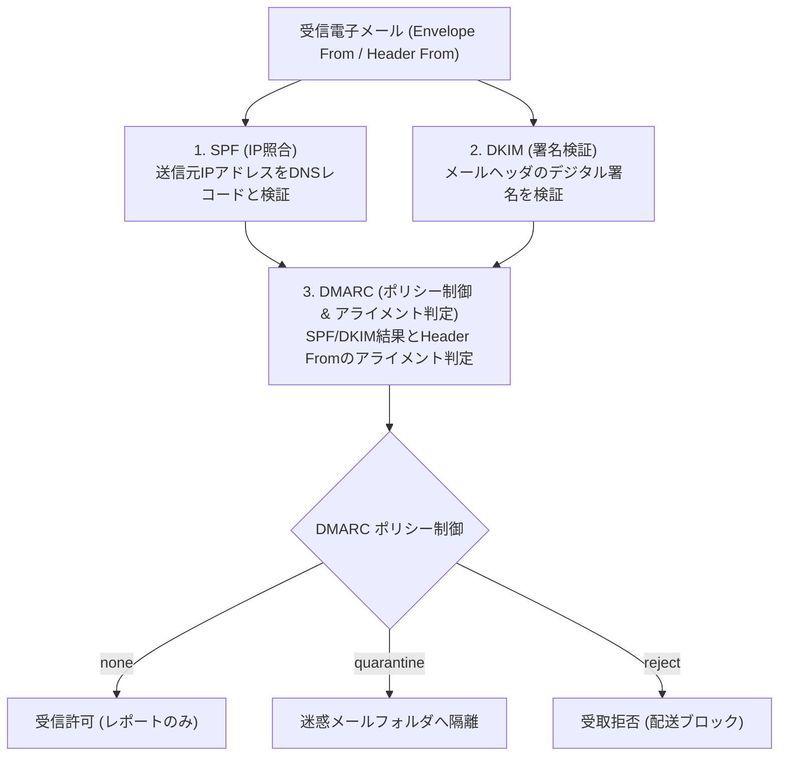

# ✉️ 送信ドメイン認証技術 (SPF / DKIM / DMARC)

## 1. 概要 (Overview)
電子メールのプロトコルである SMTP には、送信者のメールアドレス (From) を検証する仕組みが元々存在せず、成りすましメール（フィッシング、ビジネスメール詐欺 BEM）の温床となっていた。

これらを防止するため、DNSやデジタル署名を用いた **送信ドメイン認証技術群 (SPF, DKIM, DMARC)** が標準化され、主要メール事業者（Google, Yahoo!等）において送信者要件として義務付けられている。

---

## 2. 3大認証技術の比較と役割分担

| 技術名 | 検証対象 | 検証メカニズム | 弱点・課題 |
|---|---|---|---|
| **SPF** (Sender Policy Framework) | Mail From (Envelope From) | 送信元サーバーの IP アドレスを DNS TXT レコードと照合 | メール転送 (Forwarding) 時に IP アドレスが変わると認証失敗 |
| **DKIM** (DomainKeys Identified Mail) | 秘密鍵による署名 | 送信元が電子署名を付与し、DNS 公開鍵で検証 | Header From と署名ドメインの一致チェックを行わない |
| **DMARC** | **Header From** (表示送信者) | SPF/DKIM の結果と Header From のドメインアライメント検証 | **SPF と DKIM の導入が前提** |

---

## 3. DMARC アライメントと宣言ポリシー
- **ドメインアライメント (Domain Alignment)**:
  ユーザーのメール画面に表示される `Header From` のドメインと、`Envelope From (SPF)` または `DKIM 署名ドメイン` が一致しているかを検査。
- **DMARC ポリシーの種類**:
  - `p=none`: 認証失敗時もそのまま配信（監視・レポート収集モード）
  - `p=quarantine`: 認証失敗メールを迷惑メールフォルダーへ隔離
  - `p=reject`: 認証失敗メールをサーバーで即座に拒否

---

## 4. 試験対策ポイント (Exam Preparation Guidelines)

> [!IMPORTANT]
> **午後問題・午前問題で狙われる引っ掛け知識**:
> 1. **Envelope From と Header From の違い**: 攻撃者は Envelope From に自身の正規ドメインを指定して SPF をパスさせつつ、Header From に偽装対象企業を指定する攻撃（SPFのバイパス）を行う。**DMARC はこの Header From の偽装を見破るために不可欠**。
> 2. **ARC (Authenticated Received Chain)**: メーリングリストや自動転送により SPF/DKIM が破壊された場合でも、転送経路の認証履歴を保存・検証する拡張技術。

---

## 5. 関連キーワード・相互リンク
- [SPF (Sender Policy Framework)](../syllabus_ver2_1.md#spf)
- [DKIM (DomainKeys Identified Mail)](../syllabus_ver2_1.md#dkim)
- [DMARC](../syllabus_ver2_1.md#dmarc)
- [ARC (Authenticated Received Chain)](../syllabus_tsuiho_ver4_0.md#arc)
