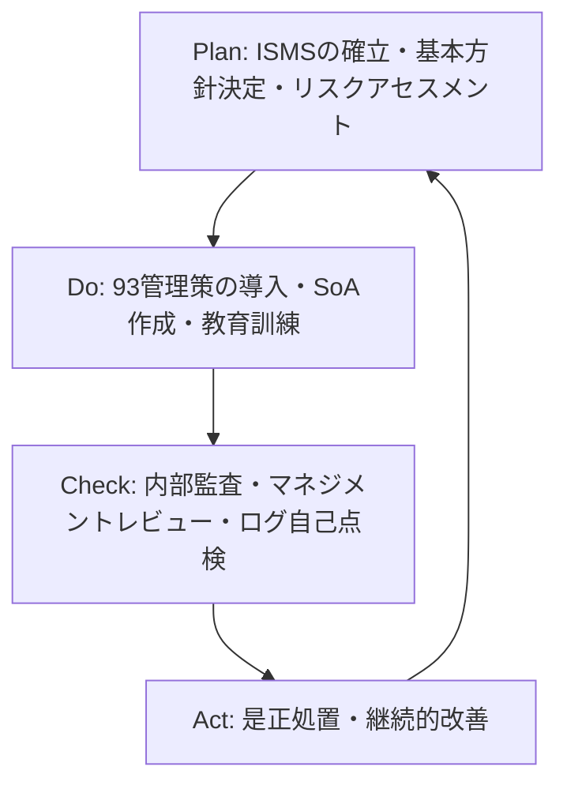

# 🏢 ISMS (情報セキュリティマネジメントシステム) & ISO/IEC 27001:2022

## 1. 概要 (Overview)
**ISMS (Information Security Management System)** とは、組織が保護すべき情報資産の「機密性 (C)」「完全性 (I)」「可用性 (A)」をバランスよく維持し、リスクを適切に管理するための体系的な仕組みである。

2022年に改訂された **ISO/IEC 27001:2022 (JIS Q 27001:2023)** では、従来の 114 管理策から **93 管理策** へと整理再編され、**11 の新規管理策**（クラウド利用、脅威インテリジェンス、DLP、Webフィルタリング等）が追加された。

---

## 🎯 2. データ駆動 ISMS 2022 管理策 & SoA (適用宣言書) セルフアセスメント

以下のコンポーネントでは、2022年改訂の 4 大カテゴリ管理策および新規 11 管理策の適用要件と SoA チェックポイントをインタラクティブに学習・確認できます。

    

        
        

        

            データをロード中...
        

    

---

## 3. ISO/IEC 27001 認証取得・運用の PDCA サイクル

---

## 4. 試験対策チェックポイント (Exam Keypoints)

- **SoA (Statement of Applicability / 適用宣言書)**: 採択した管理策と排除した理由、およびその適用状況を明記した文書。
- **リスクアセスメントと管理目的**: リスクの特定・分析・評価を行い、対応する管理策を適用する。
- **2022年改訂 4 大カテゴリ**: 組織的 (A.5)、人的 (A.6)、物理的 (A.7)、技術的 (A.8)。
