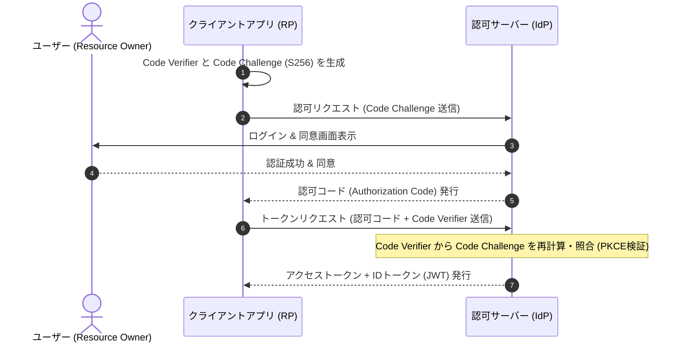

# 🌐 OAuth 2.0 & OpenID Connect (OIDC)

## 1. 概要 (Overview)
**OAuth 2.0 (RFC 6749)** は、サードパーティアプリケーションに対して、ユーザーの資格情報（パスワード）を渡すことなくリソースへのアクセス権限を付与するための **認可 (Authorization) プロトコル** である。

**OpenID Connect (OIDC)** は、OAuth 2.0 のフレームワークの上に構築された **認証 (Authentication) 拡張プロトコル** であり、IDトークン (JWT) を用いて「ユーザーが誰であるか」の身元証明を実現する。

---

## 2. 認可コードグラント + PKCE フロー (Sequence)

---

## 3. トークンの役割比較 (Access Token vs ID Token)

| 比較項目 | アクセストークン (Access Token) | ID トークン (ID Token) |
|---|---|---|
| **使用目的** | **認可 (Authorization)**: APIリソースへのアクセス許可 | **認証 (Authentication)**: ユーザーの身元確認証明 |
| **フォーマット** | オペーク (不透明文字列) または JWT | **必ず JWT (JSON Web Token)** |
| **主な検証者** | リソースサーバー (Resource Server) | クライアントアプリケーション (Relying Party) |
| **主な含まれる値** | scope, exp, client_id | **sub (ユーザーID)**, iss, aud, exp, iat |

---

## 4. 試験対策ポイント (Exam Preparation Guidelines)

> [!IMPORTANT]
> **支援士試験におけるセキュリティ脆弱性と対策**:
> 1. **認可コード横取り攻撃と PKCE (Proof Key for Code Exchange)**: ネイティブアプリ等で認可コードが第三者アプリに横取りされる脆弱性を防ぐため、`code_verifier` と `code_challenge` による動的検証を行う PKCE (RFC 7636) の導入が必須。
> 2. **オープンリダイレクト脆弱性**: 認可サーバーで事前登録された `redirect_uri` と完全一致検証を行わない場合、攻撃者の悪意あるサイトへ認可コードが漏洩する。
> 3. **CSRF (Cross-Site Request Forgery) 対策**: 認可リクエストにランダムな `state` パラメータを付与し、コールバック時に検証する。

---

## 5. 関連キーワード・相互リンク
- [OAuth 2.0](../syllabus_ver2_1.md#oauth)
- [PKCE (Proof Key for Code Exchange)](../syllabus_ver2_1.md#pkce)
- [SAML 2.0](../syllabus_ver2_1.md#saml)
- [JWT (JSON Web Token)](../syllabus_tsuiho_ver4_0.md#jwt)
