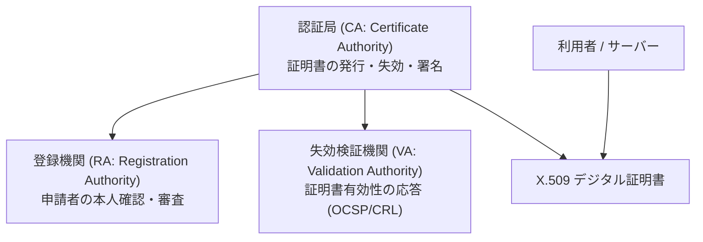

# 🔑 公開鍵インフラストラクチャ (PKI: Public Key Infrastructure)

## 1. 概要 (Overview)
**公開鍵インフラストラクチャ (PKI)** は、公開鍵暗号方式における「公開鍵と所有者（人・サーバー）の紐付け」を第三者機関（認証局: CA）のデジタル署名によって証明・保証する社会基盤・技術体系である。

X.509 規格に基づき、サーバー証明書、クライアント証明書、S/MIME、コード署名等、現代のセキュリティ通信の信頼のチェーン (Chain of Trust) を支えている。

関連資料: [CRYPTREC 推奨暗号リスト原本](../../../references/cryptrec_ciphers_list.pdf)

---

## 2. PKI の構成要素と役割分担

- **CA (Certificate Authority / 認証局)**: 証明書の発行、秘密鍵によるデジタル署名、および失効情報の更新を行う主体。
- **RA (Registration Authority / 登録機関)**: 証明書発行申請者の本人確認・属性審査を行う機関。
- **VA (Validation Authority / 検証機関)**: 証明書の有効性や失効状態（CRL/OCSP）を問い合わせに応じて応答する機関。
- **Repository (リポジトリ)**: 証明書や失効リスト (CRL) を公開・配布する公開ディレクトリ (LDAP/HTTP)。

---

## 3. 証明書失効検証方式の比較 (CRL vs OCSP)

| 比較項目 | CRL (Certificate Revocation List) | OCSP (Online Certificate Status Protocol) | OCSP Stapling |
|---|---|---|---|
| **検証方式** | 失効リストファイル全体のダウンロード | リアルタイムオンライン問い合わせ (RFC 6960) | Webサーバーがあらかじめ取得したOCSP応答をクライアントに同梱 |
| **リアルタイム性** | 低 (更新周期までタイムラグあり) | **高** (リアルタイム照合) | **高** |
| **プライバシー** | 高 (誰の証明書を検証しているか外部に漏れない) | 低 (OCSPサーバーに閲覧サイトが漏れる) | **高** |
| **通信負荷** | 高 (ファイルサイズ大) | 低 (軽量リクエスト) | **最低** |

---

## 4. 試験対策ポイント (Exam Preparation Guidelines)

> [!IMPORTANT]
> **午後問題 (科目B) で頻出のセキュリティ設計設計ポイント**:
> 1. **証明書検証の4ステップ**:
>    - ① 有効期限内であるか
>    - ② 信頼するルートCAまでの署名検証チェーンが成立するか
>    - ③ 用途 (Key Usage / Extended Key Usage) が一致しているか
>    - ④ 失効状態でないか (CRL または OCSP 照合)
> 2. **ルートCAと中間CAの分離**: ルートCAの秘密鍵漏洩を防ぐため、ルートCAはオフライン運用し、日常の発行業務は中間CA (Intermediate CA) に委任する。

---

## 5. 関連キーワード・相互リンク
- [X.509 証明書](../syllabus_ver2_1.md#x509)
- [CRL (証明書失効リスト)](../syllabus_tsuiho_ver4_0.md#crl)
- [OCSP (Online Certificate Status Protocol)](../syllabus_tsuiho_ver4_0.md#ocsp)
- [GPKI (政府認証基盤)](../syllabus_tsuiho_ver4_0.md#gpki)
