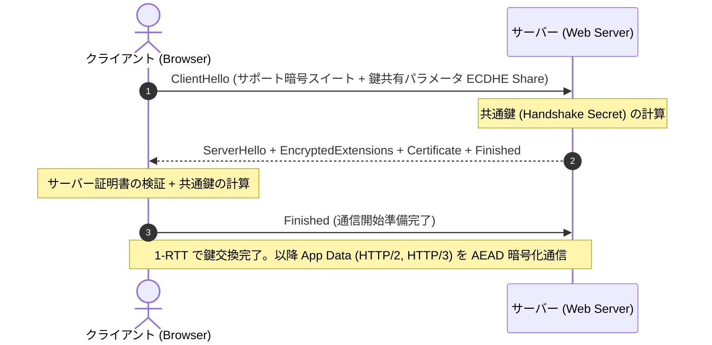

# 🔒 TLS 1.3 (Transport Layer Security 1.3)

## 1. 概要 (Overview)
**TLS 1.3 (RFC 8446)** は、トランスポート層で通信相手の認証、データの暗号化（秘匿性）、および改ざん検知（完全性）を提供する暗号プロトコルの最新仕様である。

従来の TLS 1.2 と比較して、ハンドシェイクのラウンドトリップタイム (RTT) を短縮（2-RTT ➔ 1-RTT / 0-RTT）し、古い脆弱な暗号方式を全廃することで、パフォーマンスと安全性の双方を飛躍的に向上させた。

---

## 2. TLS 1.2 と TLS 1.3 の主要変更点・比較

| 項目 | TLS 1.2 | TLS 1.3 |
|---|---|---|
| **ハンドシェイク遅延** | 2-RTT | **1-RTT** (再接続時は **0-RTT** / Early Data) |
| **暗号スイート仕様** | 鍵交換・認証・暗号・ハッシュが複合定義 | 鍵交換と対称暗号・ハッシュが独立分離 |
| **鍵交換アルゴリズム** | RSA, DH, ECDH, DHE, ECDHE | **ECDHE, DHE のみ** (完全前方秘匿性 PFS 強制) |
| **対称暗号方式** | CBCモード, RC4, 3DES, AEAD | **AEAD のみ** (AES-GCM, AES-CCM, ChaCha20-Poly1305) |
| **ハンドシェイク暗号化** | 証明書や各種応答が平文送信 | **ClientHello 以降の全メッセージを暗号化** |

---

## 3. ハンドシェイクシーケンス (1-RTT Handshake)

---

## 4. 試験対策ポイント (Exam Preparation Guidelines)

> [!IMPORTANT]
> **支援士試験における急所・キーワード**:
> 1. **前方秘匿性 (PFS: Perfect Forward Secrecy)**: RSA 鍵交換（サーバーの秘密鍵でプレマスターシークレットを暗号化する方式）が非推奨化され、毎セッションごとに使い捨ての鍵対を生成する ECDHE 方式のみが採用された。
> 2. **0-RTT (Early Data) 攻撃リスク**: 再接続時の高速化機能である 0-RTT データは、リプレイ攻撃 (Replay Attack) に弱いため、冪等性のないリクエスト (POST等) での利用制限が必須。
> 3. **AEAD (認証付き暗号) の必須化**: 過去の Padding Oracle 攻撃の温床であった CBC モードが排除され、暗号化と完全性検証を一体処理する GCM/CCM のみが許可される。

---

## 5. 関連キーワード・相互リンク
- [AEAD (認証付き暗号)](../syllabus_ver2_1.md#aead)
- [AES-GCM](../syllabus_ver2_1.md#gcm)
- [ECDSA / ECDHE](../syllabus_ver2_1.md#ecdsa)
- [PFS (Perfect Forward Secrecy)](../syllabus_tsuiho_ver4_0.md#pfs)
