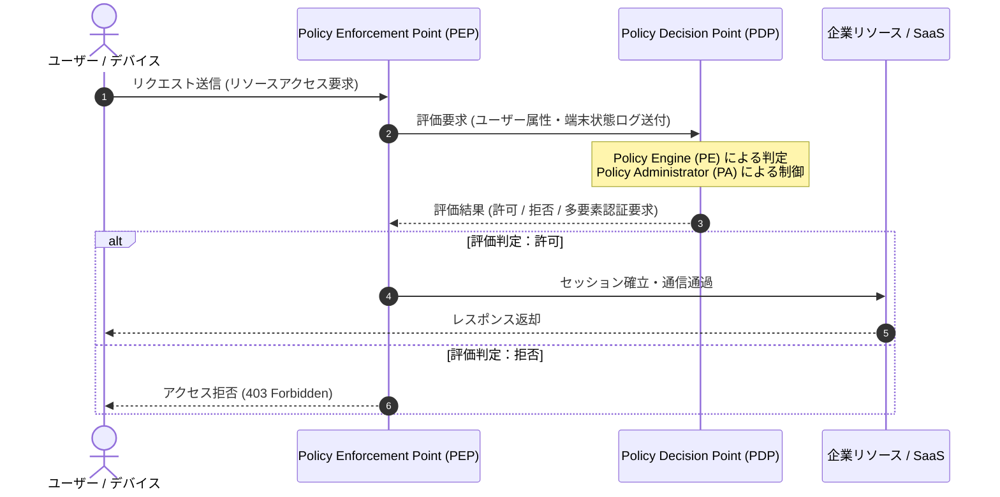

# 🛡️ ゼロトラスト・アーキテクチャ (Zero Trust Architecture)

## 1. 概要 (Overview)
**ゼロトラスト (Zero Trust)** とは、「社内ネットワーク境界の内側であっても無条件に信頼せず、すべてのアクセス要求を明示的に検証・認可する」という新しいセキュリティ設計コンセプトである。

従来の「境界型セキュリティ (Perimeter Security)」が「内側は安全、外側は危険」という前提に立っていたのに対し、ゼロトラストは「ネットワークは常に敵対的な環境であり、内部にも脅威が存在する」という前提（Assume Breach）に基づいている。

一次情報参照: [NIST SP 800-207 Zero Trust Architecture (原本PDF)](../../references/nist_sp800_207.pdf)

---

## 2. NIST SP 800-207 の7大基本原則 (7 Basic Tenets)
NIST (米国標準技術研究所) が規定するゼロトラストの核となる 7 つの原則：

1. **すべてのデータ源とコンピューティングサービスをリソースとみなす**
2. **ネットワークの場所に関わらず、すべての通信を保護・暗号化する**
3. **個々のリソースへのアクセスをセッションごとに動的に許可する (最小権限の原則)**
4. **アクセス決定は動的ポリシー (ユーザーID、デバイス状態、利用場所、脅威インテリジェンス) に基づく**
5. **保有するすべてのデバイスの健全性とセキュリティ状態を常時監視・測定する**
6. **リソースアクセスはすべて事前認証・認可を経る**
7. **資産、ネットワーク、通信に関する状態情報を収集し、継続的な改善に活用する**

---

## 3. コンポーネント構成図 (Architecture Diagram)

### 主要構成要素
- **Policy Engine (PE / ポリシーエンジン)**: アクセス可否の評価判定を行うロジックコア。
- **Policy Administrator (PA / ポリシー管理者)**: PEの判定に基づき、PEPへの制御コマンド送信およびセッション鍵生成を行う。
- **Policy Decision Point (PDP)**: PEとPAで構成される意思決定コンポーネント。
- **Policy Enforcement Point (PEP)**: 通信経路に配置され、PDPの決定に基づいて実際にアクセスを許可・切断するゲートウェイ。

---

## 4. 試験対策ポイント (Exam Preparation Guidelines)

> [!IMPORTANT]
> **試験での主な出題パターンと選択肢の見極め方**:
> - **誤った選択肢**: 「VPNを導入して社内LANへのアクセスを暗号化すればゼロトラストが達成される」「一度認証に成功した端末は以降評価をスキップする」
> - **正解の選択肢**: 「アクセス要求ごとにユーザー識別情報と端末の脆弱性・感染状態を含むコンテキストを動的に評価し、セッション単位で認可を行う」
> - **科目B (午後記述) 出題傾向**: クラウド移行に伴う境界型防御の限界と、PEP/PDP を用いた ID 階層アクセス制御の設計問題。

---

## 5. 関連キーワード・相互リンク
- [SDP (Software-Defined Perimeter)](../syllabus_tsuiho_ver4_0.md#sdp)
- [CASB (Cloud Access Security Broker)](../syllabus_tsuiho_ver4_0.md#casb)
- [SSE (Security Service Edge) / SASE](../syllabus_tsuiho_ver4_0.md#sse)
- [IAM / IDaaS](../syllabus_tsuiho_ver4_0.md#idaas)
