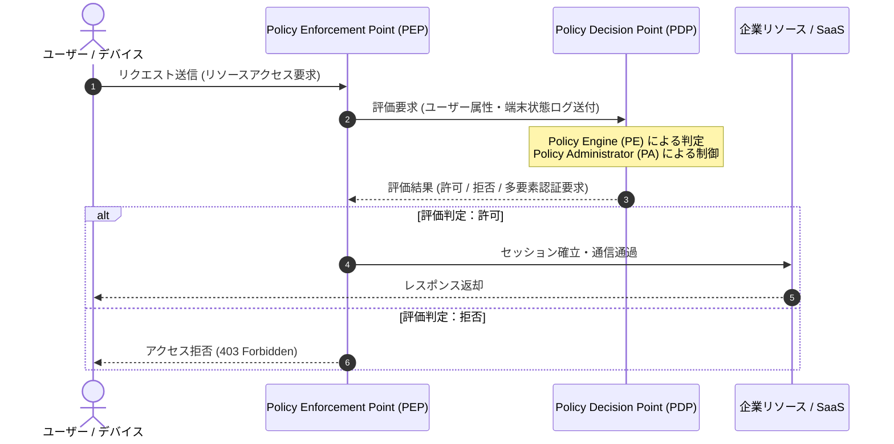

# 🛡️ ゼロトラスト・アーキテクチャ (Zero Trust Architecture)

## 1. 概要 (Overview)
**ゼロトラスト (Zero Trust)** とは、「社内ネットワーク境界の内側であっても無条件に信頼せず、すべてのアクセス要求を明示的に検証・認可する」という新しいセキュリティ設計コンセプトである。

従来の「境界型セキュリティ (Perimeter Security)」が「内側は安全、外側は危険」という前提に立っていたのに対し、ゼロトラストは「ネットワークは常に敵対的な環境であり、内部にも脅威が存在する」という前提（Assume Breach）に基づいている。

---

## 🎯 2. データ駆動 ゼロトラスト・アーキテクチャ 対話型学習コンポーネント

以下のコンポーネントでは、NIST SP 800-207 準拠の 7 大原則、主要コンポーネント (PEP/PDP)、および境界型セキュリティとの対比を動的に学習・診断できます。

    

        
        

            <button class="zt-tab-btn active" id="zt-tab-comparison" onclick="switchZTTab('comparison')">⚖️ 境界型 vs ゼロトラスト比較</button>
            <button class="zt-tab-btn" id="zt-tab-principles" onclick="switchZTTab('principles')">📜 NIST 7大原則</button>
            <button class="zt-tab-btn" id="zt-tab-components" onclick="switchZTTab('components')">🧩 PEP/PDP コンポーネント</button>
        

        

            データを読み込み中...
        

    

---

## 3. コンポーネント構成図 (Architecture Diagram)

---

## 4. 試験対策上の最重要チェックポイント (Exam Keypoints)

- **PEP / PDP の分離**: アクセス制御を決定する機能(PDP)と、実際に通信を遮断・許可する機能(PEP)が分離されていること。
- **暗号化と識別**: 通信路の完全暗号化（TLS 1.3）および、証明書（mTLS）等によるデバイスの確実な識別。
- **継続的評価**: 一度のログイン成功にとどまらず、アクセスごとに属性やセキュリティポスチャを継続評価（Continuous Evaluation）すること。
