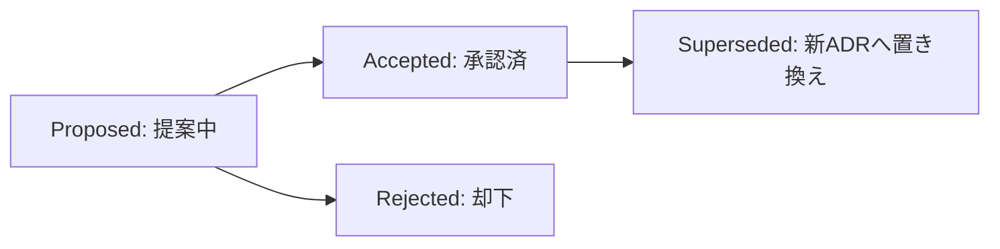

# [MNG-08] アーキテクチャ意思決定プロセス (ADR Process Definition)

## 1. 概要と目的

システム開発において、トレードオフの伴う重要な技術選定やアーキテクチャの変更、複雑なアルゴリズムの設計などに関する意思決定は、その背景、検討された代替案、および結果（メリット・デメリット・追加影響）とともに構造化して記録される必要があります。

本ドキュメントは、**ADR (Architecture Decision Record)** の導入基準、テンプレート、ライフサイクル、および運用手順を規定し、プロジェクトにおける技術的な意思決定のブラックボックス化を防ぎ、将来の保守性、可読性、および拡張性を担保することを目的とします。

---

## 2. ADR の起票基準 (Scope & Triggers)

すべての軽微な設計変更に対して ADR を作成する必要はありません。以下に示すような、**プロジェクトに長期的な影響を与える重要な意思決定**を行う場合に ADR を起票します。

* **技術スタックおよび主要エンジンの採用・変更**:
  - 新たな言語、フレームワーク、主要ライブラリ（または外部依存関係）の導入またはバージョンアップ。
  - フルスクラッチ検索エンジンコア、Web APIs、ブラウザ標準機能の根本的な技術選定（例: Web Worker によるバックグラウンド検索、PWA Service Worker プリキャッシュ戦略など）。
* **システムアーキテクチャおよびセキュリティモデルの変更**:
  - コンポーネント間の依存関係や境界の変更（例: `SecurityValidator` へのプロトタイプ汚染防御の一元化と高凝集化）。
  - クライアントサイドとデータ構築パイプラインの責務境界の変更。
* **データ構造および永続化・インデックス設計の変更**:
  - 検索インデックス (`search_index.json`) における転置インデックス (Inverted Index)・ベクトルデータの構造やバージョン管理方式の決定。
  - フロントコーディング圧縮 (Front Coding Compression) 等によるデータ保持・デコード方式の選定。
* **複雑なアルゴリズムや保守性閾値の選定**:
  - **サイクロマティック複雑度 (Cyclomatic Complexity) 閾値** の導入と自動アサーション検証の決定 (例: [ADR-02](../../docs/adr/ADR-02-cyclomatic-complexity-threshold.md))。
  - BM25 スコアリング、シノニム拡張、密概念セマンティック類似度（L2 ノルム正規化）のハイブリッド検索アルゴリズムの選定。

---

## 3. ADR テンプレート (Template)

ADR は、以下のフォーマットに従って `docs/adr/ADR-<2桁連番>-<lowercase-hyphenated-title>.md` というファイル名で作成します（例: `docs/adr/ADR-02-cyclomatic-complexity-threshold.md`）。

```markdown
# [ADR-XX] タイトル

## 日付
YYYY-MM-DD (意思決定または提案が行われた日付)

## ステータス
Proposed (提案中) / Accepted (承認済) / Rejected (却下) / Superseded (置き換え済)

## コンテキスト (Context)
解くべき問題背景、制約条件、ビジネス/技術上の課題、および決定を行うにあたって考慮すべき前提条件を記述します。

## 決定事項 (Decision)
選択された解決策、導入する設計パターン、ツール、またはルールを明確に記述します。
なぜその選択肢を採用したのか、根拠（利点・整合性）を含めて記録します。

## 評価・検討した選択肢 (Options Considered)
検討した他の選択肢と、それぞれのメリット・デメリット・非採用理由を明記します。

## 実装結果・影響 (Consequences)
この決定によって生じる結果（ positive / negative の両面）を記述します。
- メリット (可読性、保守性、速度の向上など)
- デメリット / トレードオフ (実装コスト、ファイル数増加など)
- 今後のリスクや追加の対応項目
```

---

## 4. ADR のステータスライフサイクル (Lifecycle)

ADR は作成から運用終了まで以下のステータスを遷移します。



1. **Proposed (提案中)**: Issue や設計フェーズで新たな技術選定案が出され、提案中の状態。
2. **Accepted (承認済)**: チーム/SA/PM により合意され、プロジェクトに正式適用・実装された状態。
3. **Rejected (却下)**: 検討の結果、採用が見送られた状態（却下理由を記録として保持）。
4. **Superseded (置き換え済)**: 後続の新しい ADR（例: ADR-05）によって設計が上書き・更新された状態。

---

## 5. リポジトリ管理と台帳整備

- **配置ディレクトリ**: すべての ADR 本体ファイルは `docs/adr/` 配下に配置します。
- **ADR 台帳**: `docs/adr/README.md` に全 ADR の連番、タイトル、決定日、ステータスを一覧化してメンテします。
- **相対パス強制ルール**: ドキュメント内のすべてのハイパーリンクは厳格に相対パス表記（例: `[ADR-02](ADR-02-cyclomatic-complexity-threshold.md)`）を用い、環境依存の絶対パス (`file:///...`) を使用してはなりません。
