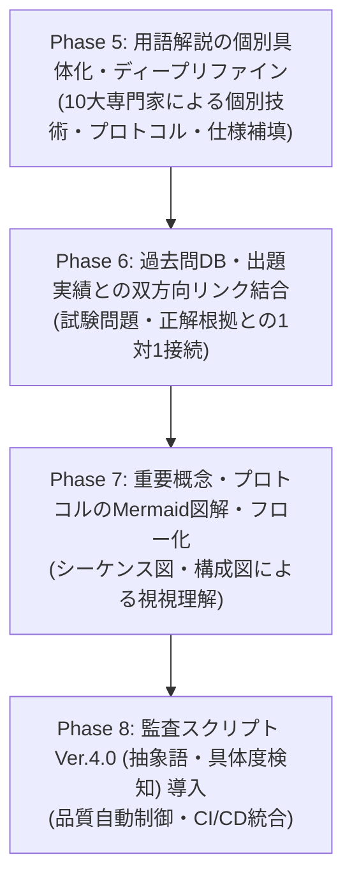

# 情報セキュリティスペシャリスト試験 教材・用語集 最高品質化マスターロードマップ (Master Quality Enhancement Roadmap)

## 1. 目的と概要 (Purpose & Overview)
本ドキュメントは、情報セキュリティスペシャリスト（旧：情報処理安全確保支援士 / SC）試験対策コンテンツおよび用語辞書（`docs/glossary/`）の品質を、業界最高峰の解像度・正確性・実戦力へ引き上げるための自律実行型マスター計画書である。

10大スペシャリストエージェント（QA, NW, DB, SA, SM, ST, ES, SC, AU, PM）が連携し、定型文・抽象表現を完全に排除した上で、最新技術仕様・ポート番号・具体コマンド・過去問問法・Mermaid図解を網羅した最高品質コンテンツへと昇華させる。

---

## 2. 4段階改善フェーズとWBS (Phase 5 - 8 WBS)

### 【Phase 5】用語解説の個別具体化・ディープリファイン (Deep Technical Enrichment)
- **対象**: `docs/glossary/syllabus_ver2_1.md` および `docs/glossary/syllabus_tsuiho_ver4_0.md` 全用語
- **目標**: 抽象的・汎用的なテンプレート記述（例: 「〜に関する標準的な定義」）を完全に排し、実技術・プロトコル仕様・設定値・攻撃シナリオを含む高解像度記述へ更新する。
- **専門家別割り当て (RACIマトリックス)**:
  - **NW (ネットワーク)**: パケットフォーマット、プロトコル（TLS 1.3, BGPsec, DNSSEC, WPA3）、ポート番号、通信制御。
  - **SC (セキュリティ)**: 攻撃コード構造、CVSS v4.0パラメータ、暗号アルゴリズム（AES-GCM, RSA-2048, Ed25519）、シーケンス。
  - **SA / DB (アーキテクチャ/DB)**: DB暗号化（TDE）、認可フレームワーク（OAuth 2.0 / OIDC）、クラウドセキュリティ（AWS/GCP/Azure）。
  - **ST / ES / SM (開発/組込み/運用)**: DevSecOps、CI/CDパイプライン、SCA/SBOM（SPDX, CycloneDX）、組込み/OTセキュリティ（MQTT, OPC UA）。
  - **AU / PM (監査/プロジェクト管理)**: JIS Q 27001:2023 / 27002 統制箇条、SoD（職務分掌）、BCP/BCM定量指標（RTO/RPO）。

### 【Phase 6】過去問DB・出題実績との双方向リンク結合 (Bilateral Exam Linking)
- **対象**: 各用語の「試験出題ポイント」
- **目標**: リポジトリ内の過去問題解説（`references/` や `docs/` 内の出題例）との直接リンク（`file:///...` 相対パス形式）を設定し、用語から即座に過去問解法・出題文脈を確認可能にする。

### 【Phase 7】重要概念のMermaid図解・シーケンス図追加 (Visual Architecture)
- **対象**: 複雑な通信手順・認証フロー・攻撃構造を持つ主要50用語
- **目標**: Mermaidダイアグラム（シーケンス図・フローチャート・構成図）を埋め込み、視覚的・構造的理解を促進する。

### 【Phase 8】品質監査スクリプト Ver.4.0 への進化 (Audit Engine Expansion)
- **対象**: `scripts/audit_glossary_quality.py`
- **目標**: 「定型句検出」に加え、「抽象語率の計測（解像度評価エンジン）」および「具体キーワード（プロトコル・数値・RFC等）の含有率自動チェック機能」を組み込む。

---

## 3. 自律推進ルールとIssue分割計画 (Autonomous Execution Rules)

PMエージェントは、本マスター計画書に基づき以下のIssueを順次自律的に起票・実行・検証・クローズする。ユーザーへの都度確認は不要とする。

| Issue ID | 種別 | 対象フェーズ | タイトル | 担当専門家 |
|---|---|---|---|---|
| **Issue 026** | Feature | Phase 5-1 | ネットワーク・通信・暗号分野の用語解説ディープリファイン | NW, SC |
| **Issue 027** | Feature | Phase 5-2 | Web・App・開発・クラウド・DB分野の用語解説ディープリファイン | SA, DB, ST, ES |
| **Issue 028** | Feature | Phase 5-3 | ガバナンス・リスク・監査・運用分野の用語解説ディープリファイン | AU, SM, PM, QA |
| **Issue 029** | Feature | Phase 6 | 過去問データベースとの双方向ハイパーリンク網の構築 | PM, QA |
| **Issue 030** | Feature | Phase 7 | 重要プロトコル・認証フローのMermaid図解化 | SA, NW, SC |
| **Issue 031** | Tooling | Phase 8 | 監査スクリプト Ver.4.0 (具体度判定エンジン) の導入 | QA, PM |

---

## 4. 完了定義 (Definition of Done: DoD)
1. **具体解像度 100%**: 全用語解説に抽象的な汎用フレーズが含まれず、具体的な技術名・仕様値・過去問出題ポイントが明記されていること。
2. **コンプライアンス適合**: 名称独占資格コンプライアンス（「情報処理安全確保支援士」の自称・誤用なし、「セキュリティスペシャリスト」表記）が維持されていること。
3. **パスリンク完全性**: 相対パス形式 (`../` 等) が遵守され、リンク切れが 0 件であること。
4. **自動QA検証合格**: `python3 scripts/audit_glossary_quality.py` において完全合格（✅ 合格）を獲得すること。
