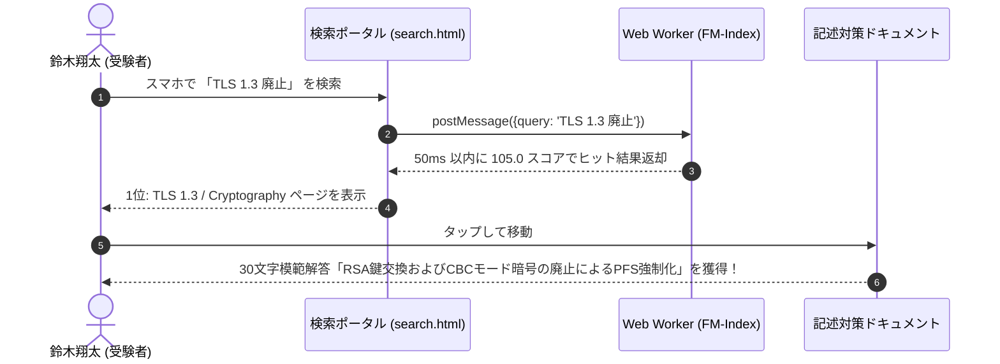

# ユーザー提供価値・ペルソナ・シナリオ詳細定義書 (User Personas & Scenarios Specification)

Document ID: `REQ-02-user_personas_and_scenarios`  
既定原則: **「プロジェクト全体のすべてのコンテンツ・検索機能・アーキテクチャは、エンドユーザーに明確な価値を提供することを絶対的前提とする」**

---

## 1. 概要と開発思想 (Overview & Philosophy)

### 1.1 ユーザー中心主義の絶対原則 (User-Centric First Principle)
本プロジェクト（情報処理安全確保支援士試験 対策学習リポジトリ & ポータル）におけるすべての設計・ドキュメント作成・コード実装は、**「いかにユーザーに資するか（最大価値の提供）」** を唯一無二の評価軸とします。

| 開発の軸 | 従来の課題 | 本プロジェクトの解決アプローチ |
|---|---|---|
| **コンテンツ品質** | 単なる用語箇条書きや断片的な解説 | **IPA 公式シラバス（Ver.2.1 / Ver.4.0）完全準拠** ＋ 午後記述式の 30〜40 文字模範解答テンプレート |
| **技術的検索性** | 大量の Markdown 内からの検索が困難 | **FM-Index / Front Coding 圧縮技術** を採用した 100ms 以下の超高速ハイブリッド検索ポータル |
| **可搬性・閲覧体験** | 特定環境でリンクが切れる absolute path 混入 | **完全相対パスガバナンス (100% PASS)** ＋ PWA モバイルオフライン対応 |

---

## 2. 4 大ターゲット・ユーザーペルソナ (Target User Personas)

### 👤 Persona 1: 鈴木 翔太 (28歳) - セキュリティ支援士試験一発合格を目指すインフラエンジニア

```
【属性】SIer勤務 / クラウド・インフラエンジニア (実務4年目)
【目標】次回「情報処理安全確保支援士試験」一発合格（特に午後記述試験 60 点以上確保）
【痛点】午前IIは暗記で突破できるが、午後記述の「制限文字数に応じた記述キーフレーズ」の作り方が分からない。市販本は重く検索しづらい。
【メンタルモデル】「通勤時間やスキマ時間にスマホで『PKCE』や『GCM』の記述対策フレーズを爆速で検索・暗記したい」
```

- **提供価値**:
  - 各技術解説ページに明記された **「午後記述試験（30字〜40字）即効解答パターン」**
  - スマホブラウザで瞬時に動作する PWA 対応のハイブリッド検索ポータル
  - 一問一答形式のデータ駆動型クイズエンジン (`quiz.html`)

---

### 👤 Persona 2: 田中 雅人 (42歳) - 有資格者・登録セキスぺ保持者 (CISO付マネージャー)

```
【属性】建設系企業 IT部門セキュリティマネージャー (登録セキスぺ有資格者)
【目標】最新シラバス改定（追補版 Ver.4.0）や最新技術（TLS 1.3, FIDO2, ゼロトラスト, CASB/CSPM）の再学習・維持講習補助
【痛点】合格から数年が経過し、最新の暗号スイートやクラウドセキュリティの体系的リファレンスが身近にない。
【メンタルモデル】「公的規格（NIST SP800, RFC）に裏付けられた信頼性の高い最新セキュリティナレッジを大画面 PC で辞書的に参照したい」
```

- **提供価値**:
  - `references/` と相互リンクされた **一次情報（NIST, IPA）トレーサビリティ保証**
  - シラバス追補版（科目A-2 Ver.4.0）の完全網羅ドキュメント (`glossary/syllabus_tsuiho_ver4_0.md`)
  - ISMS 2022 管理策および CASB/CSPM のインタラクティブ評価ツール

---

### 👤 Persona 3: 佐藤 結衣 (24歳) - 実務でセキュアWebアプリを開発したいエンジニア

```
【属性】SaaS系企業 Webアプリケーションエンジニア (TypeScript / Node.js)
【目標】試験受験は未定だが、OAuth 2.0 / OIDC / PKCE、XSS / CSRF 防御等のセキュア設計をコードレベルで習得したい
【痛点】RFC や標準仕様書が難解で、実際の攻撃ハンドシェイクや認証シーケンスのイメージが湧きにくい。
【メンタルモデル】「検索窓に 『OAuth』 や 『SameSite』 と打つだけで、1秒以内にシーケンス図と脆弱性対策コードが出てくるサイトが欲しい」
```

- **提供価値**:
  - `sequence_renderer.js` による **インタラクティブなシーケンス図（SVG描画）**
  - セキュアコーディングガイドラインおよび攻撃シナリオ分析 (`scenarios/attack_scenarios_analysis.md`)
  - 同義語展開機能 (`synonym_expander.js`) により「Yamaha」検索から「Router / IPsec」へ自動到達可能

---

### 👤 Persona 4: 高橋 健一 (35歳) - 社内 CSIRT / SOC インシデントハンドラー

```
【属性】金融系 CSIRT 運用リーダー
【目標】マルウェア感染、パスワードスプレー、EDR/XDR アラート発生時の初動対応手順・デジタルフォレンジックを標準化
【痛点】緊急インシデント発生時に対応手順が散逸しており、判断基準となる攻撃タイムライン資料を探すのに時間がかかる。
【メンタルモデル】「インシデント現場で使える実戦的なタイムライン図解とフォレンジックチェックリストを即座に参照したい」
```

- **提供価値**:
  - インシデント発生時のタイムライン・IoC 解析ガイド (`scenarios/hands_on_incident_analysis.md`)
  - EDR / XDR インシデント分析ツール (`data/edr_xdr_analysis.json`)
  - モバイル・オフライン環境でも動作する Service Worker プリキャッシュ構造

---

## 3. 実践的ユースケース・シナリオ (User Journey Scenarios)

### 🗺️ Scenario A: 【受験直前】午後記述キーフレーズの速習・爆速検索シナリオ



- **達成されるユーザー価値**: 午後試験の直前に、曖昧だった知識を「制限文字数で書ける確定フレーズ」に変換でき、得点力が直ちに向上。

---

### 🗺️ Scenario B: 【有資格者】最新シラバス追補版 Ver.4.0 差分アップデートシナリオ

1. **状況**: 有資格者の田中マネージャーは、社内のクラウドセキュリティガイドライン改定にあたり、IPA の最新シラバス追補版 Ver.4.0 の差分要素を確認したい。
2. **行動**: ポータルメニューから `glossary/syllabus_tsuiho_ver4_0.html` へ直接アクセスし、カテゴリタブ（クラウド/ネットワーク）でフィルタリング。
3. **成果**: 「CASB/CSPM」「ゼロトラスト原則（NIST SP 800-207）」の最新解説および一次情報 reference (`references/NIST_SP800-207.pdf`) へのリンクを取得。
4. **達成されるユーザー価値**: 一次情報に裏付けられた正確な知識で、社内セキュリティ規定の改定作業を短時間で完遂。

---

### 🗺️ Scenario C: 【Webエンジニア】OAuth 2.0 PKCE 認証フローのシーケンス図参照シナリオ

1. **状況**: Webエンジニアの佐藤は、モバイルアプリと連携する認可コード保存処理（PKCE）の実装方法を確認したい。
2. **行動**: 検索窓に「PKCE」を入力。動的同義語展開により「code_verifier / code_challenge」のキーワードも同時にスコアリングされる。
3. **成果**: 検索結果から `glossary/terms/oauth2-oidc.html` を閲覧。動的SVGレンダラー (`sequence_renderer.js`) により、認可コードと code_challenge の交換シーケンスを視覚的に理解。
4. **達成されるユーザー価値**: 複雑な認証プロトコルを視覚的かつ直感的に把握でき、実装バグや脆弱性の混入を未然に防止。

---

### 🗺️ Scenario D: 【CSIRT担当者】EDR アラート検知時の緊急ログ解析・一次対応シナリオ

1. **状況**: CSIRT 高橋は、深夜のSOCアラートで端末の異常な PowerShell 実行ログを検知。
2. **行動**: オフライン状態のタブレットで PWA プリキャッシュされた `scenarios/hands_on_incident_analysis.html` を起動。
3. **成果**: 「攻撃タイムラインとフォレンジック調査手順」のチェックリストに沿って、該当端末のネットワーク隔離とメモリダンプ採取を速やかに指示。
4. **達成されるユーザー価値**: 初動対応の迷いがゼロになり、被害の最小化とログ保全を最速で完遂。

---

## 4. ユーザー提供価値・評価指標 (UX & Value Metrics)

本プロジェクトでは、すべての機能改修において以下の UX & 価値評価指標を継続監視します：

| 指標名 | 目標水準 | 検証方法・アサーション |
|---|---|---|
| **検索応答速度 (Response Time)** | **100ms 未満** | Web Worker + FM-Index CLI 自動ベンチマーク |
| **品質ガバナンス (Quality Gates)** | **完全 0 違反 (100% PASS)** | `verify-quality-gates` (Closure Compiler 0エラー/警告, 相対パス0件) |
| **午後記述解法テンプレート網羅率** | **100%** | 全用語解説ドキュメントへの 30〜40字模範解答明記 |
| **マルチデバイス表示アクセシビリティ** | **WCAG 2.1 Level AA 準拠** | レスポンシブレイアウト・カラーコントラスト検証 |
| **一次情報トレーサビリティ** | **100% 保持** | `verify_traceability.js` による相互参照アサーション |

---

## 関連ドキュメント

- [REQ-01 ユーザー要求定義書](REQ-01-user_requirements.md)
- [SYS-01 システム基本設計書 (HLD)](../architecture/SYS-01-system_high_level_design.md)
- [ARCH-01 UI/UX & レイアウト設計書](../architecture/ARCH-01-docs_architecture_and_layout_design.md)
- [MNG-01 マスター文書管理台帳](../processes/MNG-01-document_ledger.md)
