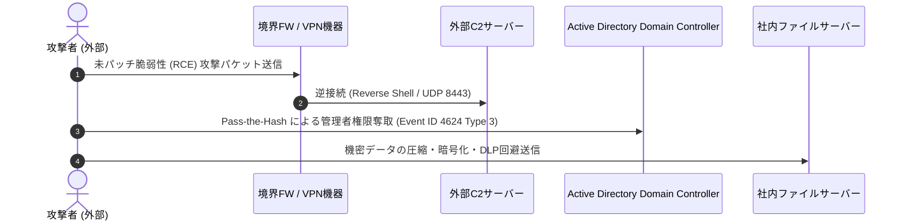

# サイバー攻撃シナリオ・ログ解読ハンズオン ケーススタディ (Cyber Attack Scenarios & Log Analysis)

## 1. 概要 (Overview)
科目B試験（記述式）で最も頻繁に出題される**「外部からの侵入 ➔ 内部ネットワーク横展開 ➔ 情報漏洩・ランサムウェア被害」**の代表的サイバーキルチェーンシナリオについて、各フェーズで記録されるログデータ・イベントID・通信挙動の解読ノウハウを体系化したケーススタディである。

---

## 🎯 2. データ駆動 攻撃タイムライン & 対策解析演習

以下の対話型タイムラインコンポーネントでは、代表的な攻撃シナリオの侵入〜目的達成までのステップと検知・対策ポイントを視覚的に体験・解析できます。

    

        

        

            

                <h3 id="scenario-title" style="color: #f8fafc; font-size: 1.2rem; margin: 0;">シナリオを読み込んでいます...</h3>
                Critical
            

            

        

    

---

## 3. 代表的攻撃キルチェーン (Scenario 01: VPN破られたケース)

---

## 4. 重要イベントログ解読リファレンス (Windows Event Log Reference)

| イベントID | ログ名称 | 解読時の重要ポイント・判定基準 |
|---|---|---|
| **4624** | アカウントログオン成功 | **ログオンタイプ 3 (ネットワーク)** または **10 (リモートデスクトップ)**。通常業務時間外かつ管理者アカウント（Administrator）でのログインを抽出。 |
| **4672** | 特権の割り当て | 特別な権限（SeDebugPrivilege 等）が割り当てられた瞬間の記録。一般ユーザーからの権限昇格検知。 |
| **4688** | 新しいプロセスの作成 | コマンドライン引数ログ（CommandLine）の記録。`powershell.exe -Enc` (Base64エンコード実行) や `cmd.exe /c whoami` のプロセス生成。 |
| **4768** | Kerberos TGT 要求 | 認証チケット要求。短時間での大量要求は Kerberoasting 攻撃の兆候。 |

---

## 5. インシデント初動対応 (CSIRT Triage Protocol)

1. **隔離措置**: 感染端末の物理LANケーブル抜去およびWi-Fi切断（C2通信の即時遮断）。
2. **メモリダンプ取得**: 電源を切る前に `RAM` データをダンプし、揮発性データ（プロセスメモリ上の暗号鍵・C2通信宛先）を物理保護（RFC 3227 揮発性順序の適用）。
3. **フォレンジック保全**: 書き込み防止装置（ライトブロッカ）を接続し、ストレージのビットストリームイメージを作成後、SHA-256 ハッシュ値を生成・記録する。
