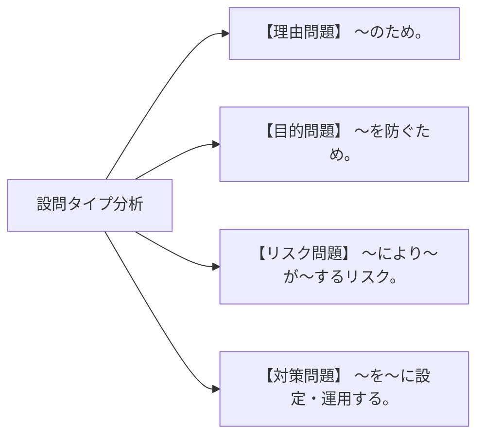

# 情報セキュリティスペシャリスト試験 科目B (長文記述式) 完全攻略・解法思考プロセスガイド

## 1. 科目B 記述問題の本質と評価軸 (Core Principles & Scoring Criteria)

科目B試験（旧 午後I・午後II試験）では、知識の丸暗記ではなく**「与えられたシステム構成図・アクセスログ・運用事例の文脈から、セキュリティ上の弱点や攻撃の影響範囲を正しく読み取り、IPA公式採点基準に適合する形式で言語化する力」**が問われる。

### IPA公式採点基準の3大要件
1. **問題文の事実に基づくこと**: 問題文に記載されていない独自の前提を勝手に補って解答することは厳禁。
2. **問いの形式と一致すること**: 「理由を述べよ」に対しては「〜のため。」、「目的を述べよ」に対しては「〜を防ぐため。」「〜を確保するため。」と答える。
3. **字数制限の厳守**: 30字〜50字指定の場合、30字未満や文字数超過は減点・ゼロ点の対象。

---

## 2. 設問タイプ別 解答構文テンプレート (Answering Templates)



### ① 理由を問う問題（「〜はなぜか」「その理由を答えよ」）
- **合格基本構文**: `[問題文中の条件・挙動] により、[具体的な悪影響・セキュリティ上の脆弱性] が発生するため。`
- **模範解答例**: 「送信元IPアドレスが偽装されたパケットを受信した場合でも、内部ネットワークからの不正送信と判定できなくなるため。」(46字)

### ② 目的・意図を問う問題（「〜を行う目的は何か」）
- **合格基本構文**: `[対象となる攻撃・事象] による [被害・悪用] を [防ぐ/防止する/最小化する] ため。`
- **模範解答例**: 「正規の利用者になりすました悪意ある第三者による、特権コマンドの不正実行を防ぐため。」(40字)

### ③ リスク・脅威を問う問題（「どのような問題が生じるか」）
- **合格基本構文**: `[攻撃手法/設定ミス] によって、[重要資産/データ] が [漏洩・改ざん・停止] するリスク。`
- **模範解答例**: 「VPN機器の既知の脆弱性を突かれ、内部ネットワークへ不正侵入されるリスク。」(37字)

---

## 3. 長文問題文・図表解析の「3大着眼点」 (Analytical Framework)

1. **ネットワーク図のプロトコル・ポート着眼点**:
   - DMZ と内部セグメント間で「不要なプロトコル（例: SSH Port 22, RDP Port 3389）」が直接許可されていないか。
   - プロキシサーバーやFWの送信元IPアドレス変換（SNAT）により、アクセスログ上で送信元個体識別が困難になっていないか。

2. **アクセスログ・イベントログ解析の着眼点**:
   - **時間軸の異常**: 勤務時間外・深夜帯における特権ID（Administrator, root）の連続ログイン成功（ID 4624 / 4672）。
   - **量・サイズの異常**: HTTPレスポンスサイズが通常の数百倍になっている（SQLiによるデータベース全件ダンプ漏洩の痕跡）。

3. **証明書・認証シーケンスの着眼点**:
   - クライアント証明書認証において、証明書失効リスト（CRL / OCSP）のリアルタイム検証がスキップされていないか。
   - OAuth 2.0 認可コードフローにおいて、PKCE (`code_verifier`) や `state` パラメータによるトークン横取り・CSRF検証が実施されているか。

---

## 4. 過去問演習におけるセルフ添削チェックリスト (Self-Correction Checklist)

- [ ] 問題文中のキーワード（システム名、サーバー名、プロトコル名）を正確に使用しているか？
- [ ] 抽象的な言葉（例: 「セキュリティを高めるため」）を具体化（例: 「セッションハイジャックを防止するため」）できているか？
- [ ] 文字数が指定範囲の 80%〜100% に収まっているか？

---

## 5. セキュアプログラミング比較視覚化 (Vulnerable vs Safe Code Snippets)

科目 B 記述試験で頻出する Web / Web API セキュアプログラミング設問の対比解析です。

### 5.1 SQL インジェクション (SQLi) 防御
- ❌ **脆弱な実装 (Vulnerable)**: 文字列結合による動的 SQL 生成
  ```javascript
  // 脆弱: ユーザー入力が直接 SQL 文字列に結合される
  const query = "SELECT * FROM users WHERE username = '" + req.body.username + "' AND password = '" + req.body.password + "'";
  ```
- ✅ **セキュアな実装 (Safe)**: プレースホルダによるバインド機構 (Parameterized Query)
  ```javascript
  // セキュア: プレースホルダによりリテラル値としてデータ分離処理
  const query = "SELECT * FROM users WHERE username = ? AND password = ?";
  db.execute(query, [req.body.username, req.body.password]);
  ```

### 5.2 XSS (クロスサイトスクリプティング) 防御
- ❌ **脆弱な実装 (Vulnerable)**: `innerHTML` への直接挿入
  ```javascript
  // 脆弱: ユーザー入力の HTML タグ/スクリプトがそのまま実行される
  document.getElementById("output").innerHTML = userInput;
  ```
- ✅ **セキュアな実装 (Safe)**: Safe DOM (`textContent`) またはエスケープ処理
  ```javascript
  // セキュア: エスケープ不要でプレーンテキストとしてレンダリング
  document.getElementById("output").textContent = userInput;
  ```
