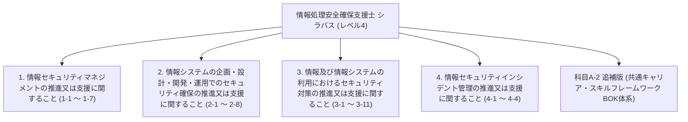

# 情報処理安全確保支援士試験 シラバス詳細（IPA公式シラバス Ver.2.1 ＆ 科目A-2追補版 Ver.4.0 完全準拠版）

出典: [IPA 情報処理安全確保支援士試験 シラバス Ver.2.1 および 科目A-2 追補版 Ver.4.0](https://www.ipa.go.jp/shiken/syllabus/index.html)

本ドキュメントは、IPA公式シラバスに定義されている情報処理安全確保支援士試験（レベル4）の**大項目（大分類）**、**小項目（小分類）の番号・名称**、**概要（目標）**、**要求される知識（詳細）**、**要求される技能（詳細）**、**シラバス記載の全用語例**、および**科目A-2追補版（共通キャリア・スキルフレームワーク BOK体系の大分類・中分類・小分類）**を、**IPA公式の番号・構成・用語と1対1で完全一致**させて網羅した公式完全準拠ドキュメントです。

---

## 📑 IPA公式シラバス 階層マップ

---

## 1. 情報セキュリティマネジメントの推進又は支援に関すること

### 1-1 情報セキュリティ方針の策定
- **大項目**: 1. 情報セキュリティマネジメントの推進又は支援に関すること
- **小項目**: 1-1 情報セキュリティ方針の策定
- **概要（目標）**:
  経営者による情報セキュリティ方針の策定及び改定について，必要な指導・助言を行い，支援する。
- **要求される知識**:
  - 情報セキュリティガバナンス及びITガバナンスに関する知識
  - マネジメントシステム（ISMS，BCMSなど）に関する知識
  - 組織マネジメントに関する知識
  - 法令，規制，契約，情報セキュリティに関する動向などによって生じる要求事項に関する知識
- **要求される技能**:
  - 組織内外の利害関係者のニーズと期待，組織内の経営戦略，事業戦略によって生じる要求事項を踏まえて情報セキュリティ方針を具体化する能力
  - 法令，規制，契約，情報セキュリティに関する動向などによって生じる要求事項を踏まえて情報セキュリティ方針を具体化する能力
  - 経営者とコミュニケーションする能力
- **用語例・キーワード (全網羅)**:
  [`情報セキュリティガバナンス`](glossary/syllabus_ver2_1.md#情報セキュリティガバナンス), [`ITガバナンス`](glossary/syllabus_ver2_1.md#itガバナンス), [`ISMS(JIS Q 27001 / ISO/IEC 27001)`](glossary/syllabus_ver2_1.md#isms(jis-q-27001-iso-iec-27001)), [`BCMS(JIS Q 22301 / ISO 22301)`](glossary/syllabus_ver2_1.md#bcms(jis-q-22301-iso-22301)), [`情報セキュリティ方針`](glossary/syllabus_ver2_1.md#情報セキュリティ方針), [`基本方針`](glossary/syllabus_ver2_1.md#基本方針), [`対策基準`](glossary/syllabus_ver2_1.md#対策基準), [`実施手順`](glossary/syllabus_ver2_1.md#実施手順), [`組織マネジメント`](glossary/syllabus_ver2_1.md#組織マネジメント), [`利害関係者(ステークホルダー)要求事項`](glossary/syllabus_ver2_1.md#利害関係者(ステークホルダー)要求事項), [`経営戦略`](glossary/syllabus_ver2_1.md#経営戦略), [`事業戦略`](glossary/syllabus_ver2_1.md#事業戦略), [`コンプライアンス`](glossary/syllabus_ver2_1.md#コンプライアンス)

### 1-2 情報セキュリティリスクアセスメント
- **大項目**: 1. 情報セキュリティマネジメントの推進又は支援に関すること
- **小項目**: 1-2 情報セキュリティリスクアセスメント
- **概要（目標）**:
  リスク基準の確立及び維持について，必要な指導・助言を行い，支援する。
  リスク特定，リスク分析，リスク評価のプロセスの実施について，必要な指導・助言を行い，支援する。
- **要求される知識**:
  - 情報の特性（機密性，完全性，可用性，真正性，責任追跡性，否認防止，信頼性など）に関する知識
  - リスク，リスク基準，リスク源，脆弱性及び脅威に関する知識
  - 情報セキュリティリスクアセスメントのプロセス（特定，分析，評価）に関する知識
  - 脅威分析（STRIDE分析，アタックツリー分析（ATA）など）に関する知識
- **要求される技能**:
  - 情報資産損失の大きさ（失われる資産の価値，原因究明及び復旧の費用，社会的説明の費用）を算定し，評価する能力
  - リスク源，脆弱性及び脅威を，新たなITに関するものも含めて列挙する能力
  - 情報資産とリスクを関連付けて整理する能力
  - リスクを優先順位付けする能力
- **用語例・キーワード (全網羅)**:
  [`機密性(Confidentiality)`](glossary/syllabus_ver2_1.md#機密性(confidentiality)), [`完全性(Integrity)`](glossary/syllabus_ver2_1.md#完全性(integrity)), [`可用性(Availability)`](glossary/syllabus_ver2_1.md#可用性(availability)), [`真正性(Authenticity)`](glossary/syllabus_ver2_1.md#真正性(authenticity)), [`責任追跡性(Accountability)`](glossary/syllabus_ver2_1.md#責任追跡性(accountability)), [`否認防止(Non-repudiation)`](glossary/syllabus_ver2_1.md#否認防止(non-repudiation)), [`信頼性(Reliability)`](glossary/syllabus_ver2_1.md#信頼性(reliability)), [`リスク基準`](glossary/syllabus_ver2_1.md#リスク基準), [`リスク源`](glossary/syllabus_ver2_1.md#リスク源), [`脆弱性(Vulnerability)`](glossary/syllabus_ver2_1.md#脆弱性(vulnerability)), [`脅威(Threat)`](glossary/syllabus_ver2_1.md#脅威(threat)), [`情報セキュリティリスクアセスメント`](glossary/syllabus_ver2_1.md#情報セキュリティリスクアセスメント), [`リスク特定`](glossary/syllabus_ver2_1.md#リスク特定), [`リスク分析`](glossary/syllabus_ver2_1.md#リスク分析), [`リスク評価`](glossary/syllabus_ver2_1.md#リスク評価), [`STRIDE分析`](glossary/syllabus_ver2_1.md#stride分析), [`アタックツリー分析(ATA)`](glossary/syllabus_ver2_1.md#アタックツリー分析(ata)), [`リスクマトリクス`](glossary/syllabus_ver2_1.md#リスクマトリクス), [`資産損失評価`](glossary/syllabus_ver2_1.md#資産損失評価)

### 1-3 情報セキュリティリスク対応
- **大項目**: 1. 情報セキュリティマネジメントの推進又は支援に関すること
- **小項目**: 1-3 情報セキュリティリスク対応
- **概要（目標）**:
  情報セキュリティリスクアセスメントの結果に基づく適切な管理策の選定，情報セキュリティリスク対応計画の策定について，必要な指導・助言を行い，支援する。
- **要求される知識**:
  - リスク対応の選択肢（リスク低減，リスク共有，リスク回避，リスク保有など）に関する知識
  - 管理策の実施に要する費用の算定に関する知識
  - サイバー保険に関する知識
- **要求される技能**:
  - リスクごとに，リスク対応の選択肢を選定する能力
  - リスク対応の実施に適切な管理策を選定する能力
  - 情報セキュリティリスク対応計画を作成し，残留リスクと併せて説明する能力
- **用語例・キーワード (全網羅)**:
  [`リスク対応(Risk Treatment)`](glossary/syllabus_ver2_1.md#リスク対応(risk-treatment)), [`リスク低減(Risk Reduction)`](glossary/syllabus_ver2_1.md#リスク低減(risk-reduction)), [`リスク回避(Risk Avoidance)`](glossary/syllabus_ver2_1.md#リスク回避(risk-avoidance)), [`リスク共有(Risk Sharing)`](glossary/syllabus_ver2_1.md#リスク共有(risk-sharing)), [`リスク保有(Risk Acceptance)`](glossary/syllabus_ver2_1.md#リスク保有(risk-acceptance)), [`管理策(Security Controls)`](glossary/syllabus_ver2_1.md#管理策(security-controls)), [`残留リスク(Residual Risk)`](glossary/syllabus_ver2_1.md#残留リスク(residual-risk)), [`リスク対応計画`](glossary/syllabus_ver2_1.md#リスク対応計画), [`サイバー保険`](glossary/syllabus_ver2_1.md#サイバー保険), [`費用対効果分析`](glossary/syllabus_ver2_1.md#費用対効果分析)

### 1-4 情報セキュリティ諸規程の策定
- **大項目**: 1. 情報セキュリティマネジメントの推進又は支援に関すること
- **小項目**: 1-4 情報セキュリティ諸規程の策定
- **概要（目標）**:
  情報セキュリティに関連する諸規程の策定及び改定について，必要な指導・助言を行い，支援する。
  事業継続に関する計画の策定及び改定について，必要な指導・助言を行い，支援する。
- **要求される知識**:
  - 法令，規制，規格に関する知識
  - ITの動向（クラウドコンピューティング，仮想化，モバイル，組込みシステム，Web技術，AI（生成AIを含む），ビッグデータ，IoTなど）及びその情報セキュリティへの影響に関する知識
  - 事業継続に関する知識
- **要求される技能**:
  - 業務プロセス，業務手順を踏まえた上で，情報セキュリティ諸規程で定めるべき事項を検討する能力
  - 検討した事項及びその必要性を説明する能力
  - 法令，規制，規格の変化やITの動向を踏まえて情報セキュリティ諸規程をレビューする能力
- **用語例・キーワード (全網羅)**:
  [`JIS Q 27001(ISO/IEC 27001)`](glossary/syllabus_ver2_1.md#jis-q-27001(iso-iec-27001)), [`JIS Q 27002(ISO/IEC 27002)`](glossary/syllabus_ver2_1.md#jis-q-27002(iso-iec-27002)), [`適用宣言書(SoA)`](glossary/syllabus_ver2_1.md#適用宣言書(soa)), [`情報セキュリティ諸規程`](glossary/syllabus_ver2_1.md#情報セキュリティ諸規程), [`事業継続計画(BCP)`](glossary/syllabus_ver2_1.md#事業継続計画(bcp)), [`事業継続マネジメント(BCM)`](glossary/syllabus_ver2_1.md#事業継続マネジメント(bcm)), [`要塞化(ハードニング)`](glossary/syllabus_ver2_1.md#要塞化(ハードニング)), [`クラウドセキュリティ`](glossary/syllabus_ver2_1.md#クラウドセキュリティ), [`AI/生成AIセキュリティ`](glossary/syllabus_ver2_1.md#ai-生成aiセキュリティ), [`IoTセキュリティ`](glossary/syllabus_ver2_1.md#iotセキュリティ), [`モバイルセキュリティ`](glossary/syllabus_ver2_1.md#モバイルセキュリティ)

### 1-5 情報セキュリティ監査
- **大項目**: 1. 情報セキュリティマネジメントの推進又は支援に関すること
- **小項目**: 1-5 情報セキュリティ監査
- **概要（目標）**:
  情報セキュリティ監査及びシステム監査において，監査人を技術的な側面から支援する。
  情報セキュリティ監査及びシステム監査の後の監査対象組織による改善計画策定及び改善活動について，必要な指導・助言を行い，支援する。
- **要求される知識**:
  - 情報セキュリティ監査，システム監査，内部監査，業務監査に関する知識
  - 監査のプロセス，関連文書（監査計画書，監査調書，監査報告書など）に関する知識
  - 監査証拠（システム，ネットワークのログなど）に関する知識
- **要求される技能**:
  - 組織が利用しているセキュリティ技術及び導入している情報セキュリティ対策が十分か，並びに適切に実施されているかを評価する能力
  - 事業，業務，情報システム上の制約を考慮した上で，実現可能な管理策を検討し，指導・助言する能力
- **用語例・キーワード (全網羅)**:
  [`情報セキュリティ監査基準`](glossary/syllabus_ver2_1.md#情報セキュリティ監査基準), [`情報セキュリティ管理基準`](glossary/syllabus_ver2_1.md#情報セキュリティ管理基準), [`システム監査基準`](glossary/syllabus_ver2_1.md#システム監査基準), [`保証型監査`](glossary/syllabus_ver2_1.md#保証型監査), [`助言型監査`](glossary/syllabus_ver2_1.md#助言型監査), [`内部監査`](glossary/syllabus_ver2_1.md#内部監査), [`外部監査`](glossary/syllabus_ver2_1.md#外部監査), [`監査計画書`](glossary/syllabus_ver2_1.md#監査計画書), [`監査調書`](glossary/syllabus_ver2_1.md#監査調書), [`監査報告書`](glossary/syllabus_ver2_1.md#監査報告書), [`監査証拠`](glossary/syllabus_ver2_1.md#監査証拠), [`ログ検証`](glossary/syllabus_ver2_1.md#ログ検証), [`改善計画・フォローアップ`](glossary/syllabus_ver2_1.md#改善計画フォローアップ)

### 1-6 情報セキュリティに関する動向・事例の収集と分析
- **大項目**: 1. 情報セキュリティマネジメントの推進又は支援に関すること
- **小項目**: 1-6 情報セキュリティに関する動向・事例の収集と分析
- **概要（目標）**:
  情報セキュリティに関する事件・事故，傾向と背景，攻撃の手口，脅威，脆弱性及び対策，セキュリティ技術などの情報を収集する。
  情報セキュリティに関する法令，規制，規格類の制定・改廃や社会通念の変化，コンプライアンス上の新たな課題などについて把握する。
  収集した各情報について，組織内への影響，対応の緊急性，対応の費用・効果・必要性を評価し，報告する。
- **要求される知識**:
  - JIS，ISO，IEC，IEEE，NISTなどのセキュリティ関連の規格の動向に関する知識
  - 業界標準，ガイドラインの動向に関する知識
  - サイバー・フィジカル・セキュリティ対策フレームワーク（CPSF）に関する知識
  - 攻撃の手口に関する知識
  - 攻撃の分析モデル（サイバーキルチェーン，ATT＆CKなど）に関する知識
  - 脅威インテリジェンス（OSINTなど）に関する知識
- **要求される技能**:
  - 国内外の様々な情報源（公的機関，セキュリティ機関，ベンダからの発表，カンファレンス，論文など）から，必要な情報を，迅速にかつ継続的に収集する能力
  - 収集した情報の信頼性，正確さを検証する能力
  - 収集した情報を整理し，関係者に伝達する能力
  - 収集した情報に関して，組織内への影響などを評価する能力
- **用語例・キーワード (全網羅)**:
  [`JIS`](glossary/syllabus_ver2_1.md#jis), [`ISO/IEC`](glossary/syllabus_ver2_1.md#iso-iec), [`IEEE`](glossary/syllabus_ver2_1.md#ieee), [`NIST(SP 800シリーズ)`](glossary/syllabus_ver2_1.md#nist(sp-800シリーズ)), [`CPSF(サイバー・フィジカル・セキュリティフレームワーク)`](glossary/syllabus_ver2_1.md#cpsf(サイバーフィジカルセキュリティフレームワーク)), [`攻撃手口分析`](glossary/syllabus_ver2_1.md#攻撃手口分析), [`サイバーキルチェーン(Cyber Kill Chain)`](glossary/syllabus_ver2_1.md#サイバーキルチェーン(cyber-kill-chain)), [`MITRE ATT&CK`](glossary/syllabus_ver2_1.md#mitre-attck), [`脅威インテリジェンス(Threat Intelligence)`](glossary/syllabus_ver2_1.md#脅威インテリジェンス(threat-intelligence)), [`OSINT(Open Source Intelligence)`](glossary/syllabus_ver2_1.md#osint(open-source-intelligence)), [`情報収集・信頼性評価`](glossary/syllabus_ver2_1.md#情報収集信頼性評価), [`コンプライアンス課題`](glossary/syllabus_ver2_1.md#コンプライアンス課題)

### 1-7 関係者とのコミュニケーション
- **大項目**: 1. 情報セキュリティマネジメントの推進又は支援に関すること
- **小項目**: 1-7 関係者とのコミュニケーション
- **概要（目標）**:
  組織内の課題及び必要な対策といった情報セキュリティに関する情報を，経営層ほか組織内の各層に伝達し，コミュニケーションを促進する。
  組織内の情報システムに影響を及ぼす情報を情報システム部門に伝達し，必要な検討，対応を支援する。
  外部のセキュリティ機関，情報共有コミュニティ，セキュリティベンダー，警察，監督官庁，顧客などと情報交換を行う。
- **要求される知識**:
  - セキュリティ機関（JPCERT/CC，警察，監督官庁，NISC，IPAなど）に関する知識
  - サイバー情報共有イニシアティブ（J-CSIP），サイバーレスキュー隊（J-CRAT）に関する知識
  - 情報セキュリティ早期警戒パートナーシップに関する知識
- **要求される技能**:
  - 情報セキュリティのコミュニティ，イベントに参加し，情報の入手及び提供を行う能力
  - 様々な立場の関係者とコミュニケーションする能力
  - 連絡窓口として，組織内外の情報連携を行う能力
  - ISAC，他のCSIRTなどと情報共有する，及び共有された情報を活用する能力
- **用語例・キーワード (全網羅)**:
  [`JPCERT/CC`](glossary/syllabus_ver2_1.md#jpcert-cc), [`NISC(内閣サイバーセキュリティセンター)`](glossary/syllabus_ver2_1.md#nisc(内閣サイバーセキュリティセンター)), [`IPA(情報処理推進機構)`](glossary/syllabus_ver2_1.md#ipa(情報処理推進機構)), [`J-CSIP(サイバー情報共有イニシアティブ)`](glossary/syllabus_ver2_1.md#j-csip(サイバー情報共有イニシアティブ)), [`J-CRAT(サイバーレスキュー隊)`](glossary/syllabus_ver2_1.md#j-crat(サイバーレスキュー隊)), [`情報セキュリティ早期警戒パートナーシップ`](glossary/syllabus_ver2_1.md#情報セキュリティ早期警戒パートナーシップ), [`ISAC(Information Sharing and Analysis Center)`](glossary/syllabus_ver2_1.md#isac(information-sharing-and-analysis-center)), [`CSIRT間情報共有`](glossary/syllabus_ver2_1.md#csirt間情報共有), [`ステークホルダーコミュニケーション`](glossary/syllabus_ver2_1.md#ステークホルダーコミュニケーション), [`エスカレーション`](glossary/syllabus_ver2_1.md#エスカレーション)

---

## 2. 情報システムの企画・設計・開発・運用でのセキュリティ確保の推進又は支援に関すること

### 2-1 企画・要件定義（セキュリティの観点）
- **大項目**: 2. 情報システムの企画・設計・開発・運用でのセキュリティ確保の推進又は支援に関すること
- **小項目**: 2-1 企画・要件定義（セキュリティの観点）
- **概要（目標）**:
  調達又は開発するシステムのニーズ及び制約並びに脅威分析の結果からのセキュリティ要件の定義について，必要な指導・助言を行い，支援する。
  調達又は開発の仕様書のレビューについて，セキュリティの観点から必要な指導・助言を行い，支援する。
- **要求される知識**:
  - セキュリティ要件に関する知識
  - セキュリティバイデザイン，プライバシーバイデザインに関する知識
  - システム及びソフトウェア製品の品質要求及び評価（SQuaRE）に関する知識
- **要求される技能**:
  - 調達又は開発するシステムのニーズ及び制約からセキュリティ要件を定義する能力
  - 脅威分析 Result からセキュリティ要件を定義する能力
  - 仕様書をレビューする能力
- **用語例・キーワード (全網羅)**:
  [`セキュリティバイデザイン(Security by Design)`](glossary/syllabus_ver2_1.md#セキュリティバイデザイン(security-by-design)), [`プライバシーバイデザイン(Privacy by Design)`](glossary/syllabus_ver2_1.md#プライバシーバイデザイン(privacy-by-design)), [`セキュリティ要件定義`](glossary/syllabus_ver2_1.md#セキュリティ要件定義), [`機能要件 / 非機能要件`](glossary/syllabus_ver2_1.md#機能要件-非機能要件), [`SQuaRE(ISO/IEC 25000シリーズ)`](glossary/syllabus_ver2_1.md#square(iso-iec-25000シリーズ)), [`脅威分析・モデリング`](glossary/syllabus_ver2_1.md#脅威分析モデリング), [`要件定義書レビュー`](glossary/syllabus_ver2_1.md#要件定義書レビュー)

### 2-2 製品・サービスのセキュアな導入
- **大項目**: 2. 情報システムの企画・設計・開発・運用でのセキュリティ確保の推進又は支援に関すること
- **小項目**: 2-2 製品・サービスのセキュアな導入
- **概要（目標）**:
  システム全体又はその一部を構成する製品・サービスの調達について，セキュリティの観点から必要な指導・助言を行い，支援する。
  調達した製品・サービスへのセキュアな設定の実施について，必要な指導・助言を行い，支援する。
- **要求される知識**:
  - 製品・サービスの種類と特徴に関する知識
  - ネットワーク機器，サーバの設定に関する知識
  - 要塞化（ハードニング）に関する知識
  - セキュリティの投資対効果の評価に関する知識
- **要求される技能**:
  - 製品・サービスの仕様書とセキュリティ要件とを照らして，製品・サービスを選定する能力
  - セキュリティの投資対効果を最適化する能力
  - 設定作業手順書をレビューする能力
  - 調達した製品・サービスにセキュアな設定を行う能力
  - 各製品・サービスを組み合わせたシステム全体のセキュリティバランス，運用の実現性を検証する能力
- **用語例・キーワード (全網羅)**:
  [`要塞化(ハードニング / Hardening)`](glossary/syllabus_ver2_1.md#要塞化(ハードニング-hardening)), [`セキュリティ投資対効果(ROSI)`](glossary/syllabus_ver2_1.md#セキュリティ投資対効果(rosi)), [`製品・サービス選定基準`](glossary/syllabus_ver2_1.md#製品サービス選定基準), [`ネットワーク機器セキュリティ設定`](glossary/syllabus_ver2_1.md#ネットワーク機器セキュリティ設定), [`サーバー要塞化`](glossary/syllabus_ver2_1.md#サーバー要塞化), [`設定手順書レビュー`](glossary/syllabus_ver2_1.md#設定手順書レビュー), [`セキュリティバランス検証`](glossary/syllabus_ver2_1.md#セキュリティバランス検証)

### 2-3 アーキテクチャの設計（セキュリティの観点）
- **大項目**: 2. 情報システムの企画・設計・開発・運用でのセキュリティ確保の推進又は支援に関すること
- **小項目**: 2-3 アーキテクチャの設計（セキュリティの観点）
- **概要（目標）**:
  システム及びネットワークのアーキテクチャの設計，インタフェース，利用する各技術の評価について，セキュリティの観点から必要な指導・助言を行い，支援する。
- **要求される知識**:
  - システム開発技術，アーキテクチャの設計に関する知識
  - データベース，ネットワークに関する知識
  - 信頼性設計（フェールセーフ，フェールソフトなど）に関する知識
  - 仮想化，コンテナ技術に関する知識
- **要求される技能**:
  - アーキテクチャの設計書をレビューする能力
  - システム及びネットワークのアーキテクチャ，インタフェース，利用する各技術がセキュアであるかどうかを評価する能力
- **用語例・キーワード (全網羅)**:
  [`フェールセーフ`](glossary/syllabus_ver2_1.md#フェールセーフ), [`フェールソフト`](glossary/syllabus_ver2_1.md#フェールソフト), [`最小権限の原則`](glossary/syllabus_ver2_1.md#最小権限の原則), [`境界防御`](glossary/syllabus_ver2_1.md#境界防御), [`多層防御(Defense in Depth)`](glossary/syllabus_ver2_1.md#多層防御(defense-in-depth)), [`仮想化・コンテナセキュリティ`](glossary/syllabus_ver2_1.md#仮想化コンテナセキュリティ), [`ネットワークセグメンテーション`](glossary/syllabus_ver2_1.md#ネットワークセグメンテーション), [`アーキテクチャ設計書レビュー`](glossary/syllabus_ver2_1.md#アーキテクチャ設計書レビュー)

### 2-4 セキュリティ機能の設計
- **大項目**: 2. 情報システムの企画・設計・開発・運用でのセキュリティ確保の推進又は支援に関すること
- **小項目**: 2-4 セキュリティ機能の設計
- **概要（目標）**:
  セキュリティ要件及びアーキテクチャに基づき，セキュリティ機能の設計について，必要な指導・助言を行い，支援する。
- **要求される知識**:
  - セキュリティ機能（認証，アクセス制御，暗号，ログ出力等）に関する知識
  - 開発環境，フレームワークのセキュリティ機能に関する知識
- **要求される技能**:
  - セキュリティ機能の設計書，テスト計画書をレビューする能力
  - 要件を満たすセキュリティ機能を設計する能力
- **用語例・キーワード (全網羅)**:
  [`認証(Authentication)`](glossary/syllabus_ver2_1.md#認証(authentication)), [`アクセス制御(Access Control)`](glossary/syllabus_ver2_1.md#アクセス制御(access-control)), [`暗号機能(Encryption)`](glossary/syllabus_ver2_1.md#暗号機能(encryption)), [`ログ出力機能(Logging)`](glossary/syllabus_ver2_1.md#ログ出力機能(logging)), [`セキュリティフレームワーク`](glossary/syllabus_ver2_1.md#セキュリティフレームワーク), [`セキュリティ機能設計書レビュー`](glossary/syllabus_ver2_1.md#セキュリティ機能設計書レビュー), [`テスト計画書レビュー`](glossary/syllabus_ver2_1.md#テスト計画書レビュー)

### 2-5 セキュアプログラミング
- **大項目**: 2. 情報システムの企画・設計・開発・運用でのセキュリティ確保の推進又は支援に関すること
- **小項目**: 2-5 セキュアプログラミング
- **概要（目標）**:
  ソフトウェア実装でのコーディング標準，セキュアプログラミングなどについて，必要な指導・助言を行い，支援する。
- **要求される知識**:
  - セキュアプログラミングの原則，実践規範に関する知識
  - OS 及びコンパイラでの攻撃防止技術に関する知識
  - 統合開発環境に関する知識
  - プログラム言語，データベース言語，マークアップ言語に関する知識
- **要求される技能**:
  - ソフトウェア実装について，セキュアプログラミングの原則，実践規範と照らしてレビューする能力
  - コーディング標準に沿ったセキュアプログラミングを実践する能力
- **用語例・キーワード (全網羅)**:
  [`XSS(Cross-Site Scripting)`](glossary/syllabus_ver2_1.md#xss(cross-site-scripting)), [`SQLインジェクション`](glossary/syllabus_ver2_1.md#sqlインジェクション), [`CSRF(Cross-Site Request Forgery)`](glossary/syllabus_ver2_1.md#csrf(cross-site-request-forgery)), [`OSコマンドインジェクション`](glossary/syllabus_ver2_1.md#osコマンドインジェクション), [`ディレクトリトラバーサル`](glossary/syllabus_ver2_1.md#ディレクトリトラバーサル), [`バッファオーバーフロー`](glossary/syllabus_ver2_1.md#バッファオーバーフロー), [`Cookie属性(Secure`](glossary/syllabus_ver2_1.md#cookie属性(secure), [`HttpOnly`](glossary/syllabus_ver2_1.md#httponly), [`SameSite)`](glossary/syllabus_ver2_1.md#samesite)), [`セッション固定攻撃対策`](glossary/syllabus_ver2_1.md#セッション固定攻撃対策), [`入力バリデーション`](glossary/syllabus_ver2_1.md#入力バリデーション), [`出力エスケープ`](glossary/syllabus_ver2_1.md#出力エスケープ)

### 2-6 セキュリティテスト
- **大項目**: 2. 情報システムの企画・設計・開発・運用でのセキュリティ確保の推進又は支援に関すること
- **小項目**: 2-6 セキュリティテスト
- **概要（目標）**:
  実装したセキュリティ機能のテスト，並びにソフトウェア及びシステムのテストについて，セキュリティの観点から必要な指導・助言を行い，支援する。
  運用フェーズのソフトウェア及びシステムを対象に行う脆弱性診断について，必要な指導・助言を行い，支援する。
- **要求される知識**:
  - ソフトウェア及びシステムの，セキュリティの観点でのテスト（ソースコード静的検査，プログラム動的検査，ファジングなど）の実施方法に関する知識
  - 脆弱性診断，ペネトレーションテストの実施方法に関する知識
  - 脆弱性検査ツール（Webアプリケーションソフトウェア検査用，ネットワーク検査用など）に関する知識
- **要求される技能**:
  - テスト対象に応じて，必要なテストの種類及びその実施方法を計画する能力
  - 実施するテストの種類に適したツールを選択する能力
  - 手動テストとツールによる自動テストを組み合わせ，効果的かつ効率的なテストを計画する能力
  - テストで検出したエラーを識別し，修正，解消する能力
- **用語例・キーワード (全網羅)**:
  [`ソースコード静的検査(SAST)`](glossary/syllabus_ver2_1.md#ソースコード静的検査(sast)), [`プログラム動的検査(DAST)`](glossary/syllabus_ver2_1.md#プログラム動的検査(dast)), [`ファジング(Fuzzing)`](glossary/syllabus_ver2_1.md#ファジング(fuzzing)), [`脆弱性診断`](glossary/syllabus_ver2_1.md#脆弱性診断), [`ペネトレーションテスト`](glossary/syllabus_ver2_1.md#ペネトレーションテスト), [`脆弱性検査ツール`](glossary/syllabus_ver2_1.md#脆弱性検査ツール), [`エラー識別・修正`](glossary/syllabus_ver2_1.md#エラー識別修正)

### 2-7 運用・保守（セキュリティの観点）
- **大項目**: 2. 情報システムの企画・設計・開発・運用でのセキュリティ確保の推進又は支援に関すること
- **小項目**: 2-7 運用・保守（セキュリティの観点）
- **概要（目標）**:
  システムの運用・保守について，セキュリティの観点から必要な指導・助言を行い，支援する。
  運用・保守の関連文書のレビュー，システム運用担当者に対する教育・訓練の実施について，必要な指導・助言を行い，支援する。
- **要求される知識**:
  - サービスマネジメント，ITSMS，SLAに関する知識
  - サービスデスクに関する知識
  - システム及びネットワークの監視手順，情報セキュリティインシデントが発生した場合の対応手順に関する知識
- **要求される技能**:
  - 運用・保守の関連文書（作業計画書，作業手順書，利用者向けのマニュアルなど）を，セキュリティの観点からレビューする能力
  - 運用担当者の能力水準の目標に合わせて教育・訓練を計画する能力
- **用語例・キーワード (全網羅)**:
  [`サービスマネジメント`](glossary/syllabus_ver2_1.md#サービスマネジメント), [`ITSMS(JIS Q 20000)`](glossary/syllabus_ver2_1.md#itsms(jis-q-20000)), [`SLA(Service Level Agreement)`](glossary/syllabus_ver2_1.md#sla(service-level-agreement)), [`変更管理`](glossary/syllabus_ver2_1.md#変更管理), [`障害管理`](glossary/syllabus_ver2_1.md#障害管理), [`リリース管理`](glossary/syllabus_ver2_1.md#リリース管理), [`特権ID管理`](glossary/syllabus_ver2_1.md#特権id管理), [`ログ監視・改ざん防止`](glossary/syllabus_ver2_1.md#ログ監視改ざん防止)

### 2-8 開発環境のセキュリティ
- **大項目**: 2. 情報システムの企画・設計・開発・運用でのセキュリティ確保の推進又は支援に関すること
- **小項目**: 2-8 開発環境のセキュリティ
- **概要（目標）**:
  開発環境のセキュリティを確保するために必要な指導・助言を行い，支援する。
- **要求される知識**:
  - ソフトウェア開発管理技術（開発プロセス，バージョン管理，構成管理，CI/CDなど）に関する知識
  - 開発環境（開発用端末，リポジトリ，テスト環境，クラウド開発基盤など）のセキュリティ対策に関する知識
- **要求される技能**:
  - 開発対象のソフトウェアの仕様書，ソースコード，開発環境の構成を把握し，リスクを分析する能力
  - 開発環境のセキュリティ対策（アクセス制御，漏洩防止，検証環境隔離）を設計・評価する能力
- **用語例・キーワード (全網羅)**:
  [`開発プロセスセキュリティ`](glossary/syllabus_ver2_1.md#開発プロセスセキュリティ), [`バージョン管理(Git等)`](glossary/syllabus_ver2_1.md#バージョン管理(git等)), [`構成管理`](glossary/syllabus_ver2_1.md#構成管理), [`CI/CDパイプラインセキュリティ`](glossary/syllabus_ver2_1.md#ci-cdパイプラインセキュリティ), [`リポジトリ保護`](glossary/syllabus_ver2_1.md#リポジトリ保護), [`テスト環境隔離`](glossary/syllabus_ver2_1.md#テスト環境隔離), [`ソースコード漏洩防止`](glossary/syllabus_ver2_1.md#ソースコード漏洩防止)

---

## 3. 情報及び情報システムの利用におけるセキュリティ対策の推進又は支援に関すること

### 3-1 暗号利用及び鍵管理
- **大項目**: 3. 情報及び情報システムの利用におけるセキュリティ対策の推進又は支援に関すること
- **小項目**: 3-1 暗号利用及び鍵管理
- **概要（目標）**:
  暗号の利用，鍵管理の設計及び暗号関連諸規程の策定及び改定について，必要な指導・助言を行い，支援する。
- **要求される知識**:
  - 暗号アルゴリズム，暗号利用モードに関する知識
  - 公開鍵基盤（PKI）に関する知識
  - デジタル署名に関する知識
  - セキュアプロトコル，認証プロトコルに関する知識
  - 暗号を利用する場合のリスクに関する知識
  - 暗号解読方法に関する知識
  - 暗号の安全性などの評価（CRYPTREC暗号リスト）に関する知識
  - ハードウェアセキュリティモジュール（HSM），TPMに関する知識
- **要求される技能**:
  - 暗号を利用すべき情報・機能を特定する能力
  - 適切な暗号技術を選択する能力
  - 鍵管理の仕組みを設計する能力
- **用語例・キーワード (全網羅)**:
  [`共通鍵暗号(AES)`](glossary/syllabus_ver2_1.md#共通鍵暗号(aes)), [`公開鍵暗号(RSA`](glossary/syllabus_ver2_1.md#公開鍵暗号(rsa), [`ECC)`](glossary/syllabus_ver2_1.md#ecc)), [`ハイブリッド暗号`](glossary/syllabus_ver2_1.md#ハイブリッド暗号), [`暗号利用モード(ECB`](glossary/syllabus_ver2_1.md#暗号利用モード(ecb), [`CBC`](glossary/syllabus_ver2_1.md#cbc), [`CTR`](glossary/syllabus_ver2_1.md#ctr), [`GCM)`](glossary/syllabus_ver2_1.md#gcm)), [`認証付き暗号(AEAD)`](glossary/syllabus_ver2_1.md#認証付き暗号(aead)), [`ハッシュ関数(SHA-2/3)`](glossary/syllabus_ver2_1.md#ハッシュ関数(sha-2-3)), [`HMAC`](glossary/syllabus_ver2_1.md#hmac), [`デジタル署名`](glossary/syllabus_ver2_1.md#デジタル署名), [`PKI(公開鍵基盤)`](glossary/syllabus_ver2_1.md#pki(公開鍵基盤)), [`鍵管理`](glossary/syllabus_ver2_1.md#鍵管理), [`CRYPTREC暗号リスト`](glossary/syllabus_ver2_1.md#cryptrec暗号リスト), [`HSM / TPM`](glossary/syllabus_ver2_1.md#hsm-tpm), [`PFS(Perfect Forward Secrecy)`](glossary/syllabus_ver2_1.md#pfs(perfect-forward-secrecy))

### 3-2 マルウェア対策
- **大項目**: 3. 情報及び情報システムの利用におけるセキュリティ対策の推進又は支援に関すること
- **小項目**: 3-2 マルウェア対策
- **概要（目標）**:
  情報及び情報システムをマルウェアから保護するためのマルウェア対策ソフト及びその他のセキュリティソリューションの導入，運用（マルウェア定義ファイルの更新を含む），並びにマルウェア感染を防止するための諸規程の策定及び改定について，必要な指導・助言を行い，支援する。
- **要求される知識**:
  - マルウェアの種類と特徴（ボット，ランサムウェア，ファイルレスマルウェアなど）に関する知識
  - マルウェア感染の経路・方法（標的型攻撃など）に関する知識
  - 既知及び未知のマルウェアを検知，隔離又は無害化する技術
- **要求される技能**:
  - マルウェア感染のリスクを分析する能力
  - 情報システム，ネットワーク構成及びその利用方法に応じたマルウェア対策を設計する能力
  - マルウェア対策ソフトを効果的に適用し，マルウェアからの保護の有効性を高める能力
- **用語例・キーワード (全網羅)**:
  [`EPP(Endpoint Protection Platform)`](glossary/syllabus_ver2_1.md#epp(endpoint-protection-platform)), [`EDR(Endpoint Detection and Response)`](glossary/syllabus_ver2_1.md#edr(endpoint-detection-and-response)), [`サンドボックス`](glossary/syllabus_ver2_1.md#サンドボックス), [`静的解析 / 動的解析`](glossary/syllabus_ver2_1.md#静的解析-動的解析), [`ランサムウェア`](glossary/syllabus_ver2_1.md#ランサムウェア), [`RAT(Remote Access Trojan)`](glossary/syllabus_ver2_1.md#rat(remote-access-trojan)), [`ボットネット`](glossary/syllabus_ver2_1.md#ボットネット), [`IOC(Indicator of Compromise)`](glossary/syllabus_ver2_1.md#ioc(indicator-of-compromise)), [`ファイルレスマルウェア`](glossary/syllabus_ver2_1.md#ファイルレスマルウェア), [`マルウェア無害化`](glossary/syllabus_ver2_1.md#マルウェア無害化)

### 3-3 バックアップ及び復旧
- **大項目**: 3. 情報及び情報システムの利用におけるセキュリティ対策の推進又は支援に関すること
- **小項目**: 3-3 バックアップ及び復旧
- **概要（目標）**:
  データのバックアップ及び復旧の計画の策定，検証について，必要な指導・助言を行い，支援する。
- **要求される知識**:
  - データのバックアップの方式及び頻度に関する知識
  - リモートバックアップ，世代管理，バックアップデータの保護・暗号化に関する知識
- **要求される技能**:
  - データのバックアップの範囲，頻度，保管場所，復旧手順を設計する能力
  - バックアップデータの復旧テスト，整合性検証を計画・評価する能力
- **用語例・キーワード (全網羅)**:
  [`フルバックアップ`](glossary/syllabus_ver2_1.md#フルバックアップ), [`差分バックアップ`](glossary/syllabus_ver2_1.md#差分バックアップ), [`増分バックアップ`](glossary/syllabus_ver2_1.md#増分バックアップ), [`世代管理`](glossary/syllabus_ver2_1.md#世代管理), [`リモートバックアップ`](glossary/syllabus_ver2_1.md#リモートバックアップ), [`バックアップデータ暗号化`](glossary/syllabus_ver2_1.md#バックアップデータ暗号化), [`3-2-1ルール`](glossary/syllabus_ver2_1.md#3-2-1ルール), [`イミュータブルバックアップ`](glossary/syllabus_ver2_1.md#イミュータブルバックアップ), [`RTO / RPO`](glossary/syllabus_ver2_1.md#rto-rpo)

### 3-4 セキュリティ監視並びにログの取得及び分析
- **大項目**: 3. 情報及び情報システムの利用におけるセキュリティ対策の推進又は支援に関すること
- **小項目**: 3-4 セキュリティ監視並びにログの取得及び分析
- **概要（目標）**:
  情報セキュリティインシデントの検知と調査を可能にするためのログの取得，保管，定期的なレビューについて，必要な指導・助言を行い，支援する。
  ログに時刻を正確に記録するための機器の時刻同期について，必要な指導・助言を行い，支援する。
  ネットワーク機器，IPS/IDS，Web サーバ，プロキシサーバ，DNS，DHCP のログなどの多種多様なログの効果的な保管，監視及び分析について，必要な指導・助言を行い，支援する。
- **要求される知識**:
  - セキュリティ監視（制御システム，IoT機器の監視を含む），SOCに関する知識
  - ログ（OSのログ，ネットワーク機器のログ，サービスのログなど）に関する知識
  - ログの取得，保管に関する知識
  - ログの分析方法（相関分析など）に関する知識
  - 脅威インテリジェンスの共有のための標準（STIX/TAXIIなど）に関する知識
  - SIEMに関する知識
  - 時刻同期プロトコル（NTP）に関する知識
- **要求される技能**:
  - セキュリティ監視方法を設計する能力
  - 取得すべきログを設計する能力
  - ログの分析方法を設計する能力
  - ログの保護について設計する能力
  - セキュリティ監視及びログ分析における脅威インテリジェンスの利用を設計する能力
  - ログのモニタリング及びレビューにおいて情報セキュリティインシデントの疑いがある事象を検知した場合の対応を設計する能力
- **用語例・キーワード (全網羅)**:
  [`SOC(Security Operations Center)`](glossary/syllabus_ver2_1.md#soc(security-operations-center)), [`SIEM(Security Information and Event Management)`](glossary/syllabus_ver2_1.md#siem(security-information-and-event-management)), [`SOAR`](glossary/syllabus_ver2_1.md#soar), [`相関分析`](glossary/syllabus_ver2_1.md#相関分析), [`NTP(時刻同期)`](glossary/syllabus_ver2_1.md#ntp(時刻同期)), [`STIX / TAXII`](glossary/syllabus_ver2_1.md#stix-taxii), [`ログ保管・保護`](glossary/syllabus_ver2_1.md#ログ保管保護)

### 3-5 ネットワーク及び機器のセキュリティ管理
- **大項目**: 3. 情報及び情報システムの利用におけるセキュリティ対策の推進又は支援に関すること
- **小項目**: 3-5 ネットワーク及び機器のセキュリティ管理
- **概要（目標）**:
  ネットワーク及び通信（電子メールの送受信など）におけるセキュリティの確保について，必要な指導・助言を行い，支援する。
  ネットワークの管理手順及び利用手順並びに通信データの保護方法のレビューについて，必要な指導・助言を行い，支援する。
  利用者エンドポイント機器利用及びリモートワークにおけるセキュリティ対策について，必要な指導・助言を行い，支援する。
- **要求される知識**:
  - ネットワーク通信プロトコル（DNS，ICMP，ARP，DHCP，HTTP，SMTPなど）に関する知識
  - Webアクセスのセキュリティに関する知識
  - 電子メールのセキュリティに関する知識
  - DNSのセキュリティに関する知識
  - 無線LANのセキュリティに関する知識
  - ネットワークセキュリティ技術（ファイアウォール，IPS/IDS，WAFなど）に関する知識
- **要求される技能**:
  - ネットワークの物理的又は論理的な分割を設計する能力
  - 利用するネットワークサービスのセキュリティ（認証，暗号化，ネットワーク接続管理など），サービスレベルなどの妥当性を確認する能力
- **用語例・キーワード (全網羅)**:
  [`TLS 1.3`](glossary/syllabus_ver2_1.md#tls-13), [`IPsec`](glossary/syllabus_ver2_1.md#ipsec), [`DNSSEC`](glossary/syllabus_ver2_1.md#dnssec), [`SPF / DKIM / DMARC`](glossary/syllabus_ver2_1.md#spf-dkim-dmarc), [`ファイアウォール`](glossary/syllabus_ver2_1.md#ファイアウォール), [`WAF`](glossary/syllabus_ver2_1.md#waf), [`IDS / IPS`](glossary/syllabus_ver2_1.md#ids-ips), [`プロキシ`](glossary/syllabus_ver2_1.md#プロキシ), [`無線LANセキュリティ(WPA3等)`](glossary/syllabus_ver2_1.md#無線lanセキュリティ(wpa3等))

### 3-6 脆弱性への対応
- **大項目**: 3. 情報及び情報システムの利用におけるセキュリティ対策の推進又は支援に関すること
- **小項目**: 3-6 脆弱性への対応
- **概要（目標）**:
  情報システム及びコンポーネントの構成管理を踏まえた，脆弱性への対応について，必要な指導・助言を行い，支援する。
- **要求される知識**:
  - 脆弱性情報の入手（脆弱性診断結果，外部機関からの情報発信，ベンダからの情報など）に関する知識
  - 脆弱性の評価手法（CVSSなど）に関する知識
- **要求される技能**:
  - 効果的な構成管理，脆弱性情報収集を設計する能力
  - 脆弱性の影響を評価し，セキュリティパッチの適用，回避策の実施などの対応策を検討・助言する能力
- **用語例・キーワード (全網羅)**:
  [`CVE`](glossary/syllabus_ver2_1.md#cve), [`JVN`](glossary/syllabus_ver2_1.md#jvn), [`CVSS(v2/v3/v4)`](glossary/syllabus_ver2_1.md#cvss(v2-v3-v4)), [`脆弱性スキャナ`](glossary/syllabus_ver2_1.md#脆弱性スキャナ), [`構成管理(CMDB)`](glossary/syllabus_ver2_1.md#構成管理(cmdb)), [`セキュリティパッチ管理`](glossary/syllabus_ver2_1.md#セキュリティパッチ管理), [`ワークアラウンド(回避策)`](glossary/syllabus_ver2_1.md#ワークアラウンド(回避策))

### 3-7 物理的セキュリティ管理
- **大項目**: 3. 情報及び情報システムの利用におけるセキュリティ対策の推進又は支援に関すること
- **小項目**: 3-7 物理的セキュリティ管理
- **概要（目標）**:
  物理的及び環境的脅威への対策について，必要な指導・助言を行い，支援する。
- **要求される知識**:
  - 物理的及び環境的脅威（故障，サポートユーティリティの不具合，破壊，盗難，物理的不正アクセス，電力供給の妨害，通信妨害，電磁波放射，自然災害，火災，水，塵埃，振動など）に関する知識
  - 入退管理に関する知識
  - 装置，情報又はソフトウェアの持込み・持出しの管理及び物理的保護に関する知識
  - 物理的な侵入に対する警報，監視装置（監視カメラなど）に関する知識
- **要求される技能**:
  - 物理的セキュリティ境界を定義し，オフィス，部屋及び施設に対する物理的セキュリティを設計する能力
  - 記憶媒体の廃棄・再利用，無人状態にある機器の保護，紙の書類の管理，複合機の利用などの情報セキュリティを設計する能力
- **用語例・キーワード (全網羅)**:
  [`物理的セキュリティ境界`](glossary/syllabus_ver2_1.md#物理的セキュリティ境界), [`入退管理システム`](glossary/syllabus_ver2_1.md#入退管理システム), [`監視カメラ(CCTV)`](glossary/syllabus_ver2_1.md#監視カメラ(cctv)), [`UPS(無停電電源装置)`](glossary/syllabus_ver2_1.md#ups(無停電電源装置)), [`記憶媒体破棄・消去`](glossary/syllabus_ver2_1.md#記憶媒体破棄消去), [`クリアデスク・クリアスクリーン`](glossary/syllabus_ver2_1.md#クリアデスククリアスクリーン)

### 3-8 アカウント管理及びアクセス管理
- **大項目**: 3. 情報及び情報システムの利用におけるセキュリティ対策の推進又は支援に関すること
- **小項目**: 3-8 アカウント管理及びアクセス管理
- **概要（目標）**:
  情報及び情報システム並びにネットワークサービスのアクセス制御方針のレビューについて，必要な指導・助言を行い，支援する。
  アカウント管理，認証情報の割当て及び管理並びにアクセス管理に関するプロセスの確立，特権的アクセス権の割当て及び利用の制限と管理について，必要な指導・助言を行い，支援する。
  アカウント及びアクセス権のレビューについて，必要な指導・助言を行い，支援する。
- **要求される知識**:
  - アクセス制御の種類と特徴（ロールベースアクセス制御など）に関する知識
  - need-to-know，need-to-use，最小権限の原則に関する知識
  - 認証情報の割当て及び管理に関する知識
  - アカウント及びアクセス権のレビューが必要になるタイミング（利用者の異動，業務担当者の変更，雇用又は契約の終了など）に関する知識
- **要求される技能**:
  - アクセス制御方針，アカウント及びアクセス権をレビューする能力
  - 責任追跡性を確保するための，特権的アクセスのログの記録，保護及びレビューの手順を設計する能力
  - 情報システムの重要性に応じた認証情報の割当て及び管理を設計する能力
- **用語例・キーワード (全網羅)**:
  [`RBAC(ロールベースアクセス制御)`](glossary/syllabus_ver2_1.md#rbac(ロールベースアクセス制御)), [`ABAC(属性ベースアクセス制御)`](glossary/syllabus_ver2_1.md#abac(属性ベースアクセス制御)), [`ID統合管理`](glossary/syllabus_ver2_1.md#id統合管理), [`特権アクセス管理(PAM)`](glossary/syllabus_ver2_1.md#特権アクセス管理(pam)), [`職務分掌(SoD)`](glossary/syllabus_ver2_1.md#職務分掌(sod)), [`最小権限の原則`](glossary/syllabus_ver2_1.md#最小権限の原則), [`アカウントライフサイクル管理`](glossary/syllabus_ver2_1.md#アカウントライフサイクル管理)

### 3-9 人的管理
- **大項目**: 3. 情報及び情報システムの利用におけるセキュリティ対策の推進又は支援に関すること
- **小項目**: 3-9 人的管理
- **概要（目標）**:
  従業員の雇用前，雇用期間中，雇用の終了・変更における人的セキュリティ対策について，必要な指導・助言を行い，支援する。
- **要求される知識**:
  - 内部不正及びそのメカニズムに関する知識
  - 誓約書，秘密保持契約（NDA），ソーシャルエンジニアリング対策，退職時のID削除プロセスに関する知識
- **要求される技能**:
  - 内部不正防止を設計する能力
  - 組織，職務の変更，退職における情報管理プロセスを設計・評価する能力
- **用語例・キーワード (全網羅)**:
  [`組織における内部不正防止ガイドライン`](glossary/syllabus_ver2_1.md#組織における内部不正防止ガイドライン), [`内部脅威(Insider Threat)`](glossary/syllabus_ver2_1.md#内部脅威(insider-threat)), [`秘密保持契約(NDA)`](glossary/syllabus_ver2_1.md#秘密保持契約(nda)), [`職務分掌(SoD)`](glossary/syllabus_ver2_1.md#職務分掌(sod)), [`不正のトライアングル(機会`](glossary/syllabus_ver2_1.md#不正のトライアングル(機会), [`動機`](glossary/syllabus_ver2_1.md#動機), [`正当化)`](glossary/syllabus_ver2_1.md#正当化)), [`退職時アカウント無効化`](glossary/syllabus_ver2_1.md#退職時アカウント無効化)

### 3-10 サプライチェーンの情報セキュリティの推進
- **大項目**: 3. 情報及び情報システムの利用におけるセキュリティ対策の推進又は支援に関すること
- **小項目**: 3-10 サプライチェーンの情報セキュリティの推進
- **概要（目標）**:
  セキュリティ関連の要求事項の追加，及びビジネスパートナー・委託先での要求事項への対応状況の評価について，必要な指導・助言を行い，支援する。
- **要求される知識**:
  - 委託での情報セキュリティリスクに関する知識
  - 製品・サービスのサプライチェーンのリスクに関する知識
  - 取引関連法規，企業間の契約に関する知識
- **要求される技能**:
  - 要求事項を設計する能力
  - ビジネスパートナー・委託先での要求事項への対応状況を評価する能力
- **用語例・キーワード (全網羅)**:
  [`サプライチェーンリスクマネジメント(SCRM)`](glossary/syllabus_ver2_1.md#サプライチェーンリスクマネジメント(scrm)), [`サードパーティリスクマネジメント(TPRM)`](glossary/syllabus_ver2_1.md#サードパーティリスクマネジメント(tprm)), [`委託先セキュリティ審査`](glossary/syllabus_ver2_1.md#委託先セキュリティ審査), [`再委託管理`](glossary/syllabus_ver2_1.md#再委託管理), [`SLA / NDA`](glossary/syllabus_ver2_1.md#sla-nda), [`委託先現地監査`](glossary/syllabus_ver2_1.md#委託先現地監査)

### 3-11 コンプライアンス管理
- **大項目**: 3. 情報及び情報システムの利用におけるセキュリティ対策の推進又は支援に関すること
- **小項目**: 3-11 コンプライアンス管理
- **概要（目標）**:
  情報セキュリティ及び個人情報保護に関連する法令，規制並びに契約上の義務を考慮した組織内の情報セキュリティ諸規程の策定及び改定について，必要な指導・助言を行い，支援する。
  また，法令，規制，契約に関する従業員向け意識向上プログラムの利用について，必要な指導・助言を行い，支援する。
- **要求される知識**:
  - 法令（刑法，不正アクセス禁止法，個人情報保護法，マイナンバー法，不正競争防止法など）及び公的なガイドラインに関する知識
  - 契約，倫理，公益通報者保護制度に関する知識
  - 意識向上プログラムに関する知識
- **要求される技能**:
  - 法令，規制などを考慮して，情報セキュリティ諸規程を策定し，改定する能力
  - 契約上の義務を確実に遂行する方法を設計する能力
  - コンプライアンス管理の重要性を関係者に伝達する手段を設計する能力
- **用語例・キーワード (全網羅)**:
  [`サイバーセキュリティ基本法`](glossary/syllabus_ver2_1.md#サイバーセキュリティ基本法), [`不正アクセス禁止法`](glossary/syllabus_ver2_1.md#不正アクセス禁止法), [`個人情報保護法(Pマーク/APPI)`](glossary/syllabus_ver2_1.md#個人情報保護法(pマーク-appi)), [`プロバイダ責任制限法`](glossary/syllabus_ver2_1.md#プロバイダ責任制限法), [`特定電子メール法`](glossary/syllabus_ver2_1.md#特定電子メール法), [`著作権法`](glossary/syllabus_ver2_1.md#著作権法), [`電子署名法`](glossary/syllabus_ver2_1.md#電子署名法), [`不正競争防止法`](glossary/syllabus_ver2_1.md#不正競争防止法), [`刑法`](glossary/syllabus_ver2_1.md#刑法)

---

## 4. 情報セキュリティインシデント管理の推進又は支援に関すること

### 4-1 情報セキュリティインシデントの管理体制の構築
- **大項目**: 4. 情報セキュリティインシデント管理の推進又は支援に関すること
- **小項目**: 4-1 情報セキュリティインシデントの管理体制の構築
- **概要（目標）**:
  組織内 CSIRT の構築について，必要な指導・助言を行い，支援する。
  情報セキュリティインシデントの管理に関する規程の策定及び改定について，必要な指導・助言を行い，支援する。
- **要求される知識**:
  - CSIRTの構築（体制の構築，規程の整備，メンバの訓練など）に関する知識
  - CSIRT活動の設備（執務スペース，通信設備，データの管理・廃棄のための設備，インシデントトラッキングシステムなど）に関する知識
  - PSIRTに関する知識
- **要求される技能**:
  - 情報セキュリティインシデントの管理に関する規程を検討する能力
  - 情報セキュリティ事象を情報セキュリティインシデントとするかの判断基準，及び対応の優先順位の判断基準を設計する能力
- **用語例・キーワード (全網羅)**:
  [`CSIRT(Computer Security Incident Response Team)`](glossary/syllabus_ver2_1.md#csirt(computer-security-incident-response-team)), [`SOC(Security Operations Center)`](glossary/syllabus_ver2_1.md#soc(security-operations-center)), [`PSIRT`](glossary/syllabus_ver2_1.md#psirt), [`インシデントハンドリング規程`](glossary/syllabus_ver2_1.md#インシデントハンドリング規程), [`エスカレーションフロー`](glossary/syllabus_ver2_1.md#エスカレーションフロー), [`JPCERT/CC`](glossary/syllabus_ver2_1.md#jpcert-cc), [`NISC`](glossary/syllabus_ver2_1.md#nisc), [`FIRST`](glossary/syllabus_ver2_1.md#first)

### 4-2 情報セキュリティインシデントの初動対応
- **大項目**: 4. 情報セキュリティインシデント管理の推進又は支援に関すること
- **小項目**: 4-2 情報セキュリティインシデントの初動対応
- **概要（目標）**:
  情報セキュリティ事象の検知時又は連絡受領時における初動対応について，必要な指導・助言を行い，支援する。
- **要求される知識**:
  - 情報セキュリティ事象及び情報セキュリティインシデントの分類と判定に関する知識
  - トリアージ，連絡体制，報告基準に関する知識
- **要求される技能**:
  - 初動対応を設計する能力
  - 情報セキュリティ事象の影響度，緊急度を迅速に判定し，指示・助言する能力
- **用語例・キーワード (全網羅)**:
  [`トリアージ(Triage)`](glossary/syllabus_ver2_1.md#トリアージ(triage)), [`初動対応(Initial Response)`](glossary/syllabus_ver2_1.md#初動対応(initial-response)), [`被害拡散防止・ネットワーク隔離`](glossary/syllabus_ver2_1.md#被害拡散防止ネットワーク隔離), [`緊急連絡網・エスカレーション`](glossary/syllabus_ver2_1.md#緊急連絡網エスカレーション), [`影響度・緊急度判定`](glossary/syllabus_ver2_1.md#影響度緊急度判定)

### 4-3 情報セキュリティインシデントへの対応
- **大項目**: 4. 情報セキュリティインシデント管理の推進又は支援に関すること
- **小項目**: 4-3 情報セキュリティインシデントへの対応
- **概要（目標）**:
  被害・損失の評価，情報セキュリティインシデントの根本原因の特定，復旧・回復策の実施，再発防止，対応改善などについて，必要な指導・助言を行い，支援する。
  顧客，監督官庁及び関係者への報告，報道機関への公表及び一般に向けた情報公開について，必要な指導・助言を行い，支援する。
  マルウェア検知時のマルウェア解析について，必要な指導・助言を行い，支援する。
- **要求される知識**:
  - システム，ネットワーク，ソフトウェアの調査方法に関する知識
  - 監督官庁などへの報告，報道機関などへの公表に関する知識
  - 再発防止に関する知識
  - マルウェア解析の手順，マルウェアが解析を回避する仕組み，マルウェア検体の安全な取扱いに関する知識
- **要求される技能**:
  - 外部の組織と連携して対応する能力
  - インシデント対応を評価し，対応手順を改善する能力
  - 再発防止及び対応改善のための教訓を教育・訓練に反映する能力
  - マルウェア解析を支援する能力
- **用語例・キーワード (全網羅)**:
  [`根本原因分析(RCA)`](glossary/syllabus_ver2_1.md#根本原因分析(rca)), [`再発防止策`](glossary/syllabus_ver2_1.md#再発防止策), [`被害・損失評価`](glossary/syllabus_ver2_1.md#被害損失評価), [`事後レビュー(Lessons Learned)`](glossary/syllabus_ver2_1.md#事後レビュー(lessons-learned)), [`インシデント報告書・対外公表`](glossary/syllabus_ver2_1.md#インシデント報告書対外公表), [`マルウェア解析(動的/静的)`](glossary/syllabus_ver2_1.md#マルウェア解析(動的-静的))

### 4-4 証拠の収集及び分析
- **大項目**: 4. 情報セキュリティインシデント管理の推進又は支援に関すること
- **小項目**: 4-4 証拠の収集及び分析
- **概要（目標）**:
  証拠保全の手順及びツールについて，必要な指導・助言を行い，支援する。
  専門性を必要とする状況における，デジタルフォレンジックスの専門家，法的措置の専門家などへの依頼について，必要な指導・助言を行い，支援する。
- **要求される知識**:
  - 証拠保全すべき対象に関する知識
  - 証拠保全の手順及びツールに関する知識
  - Chain of Custody（証拠保全の一貫性）に関する知識
  - 法的措置（弁護士又は警察への相談など）に関する知識
- **要求される技能**:
  - 証拠保全の対象（デスクトップPC，ノートPC，サーバ，記憶媒体），電源の状態などに応じた証拠保全方法を設計する能力
  - 証拠を分析する能力
- **用語例・キーワード (全網羅)**:
  [`デジタルフォレンジック`](glossary/syllabus_ver2_1.md#デジタルフォレンジック), [`証拠保全(Chain of Custody)`](glossary/syllabus_ver2_1.md#証拠保全(chain-of-custody)), [`揮発性順序(Order of Volatility)`](glossary/syllabus_ver2_1.md#揮発性順序(order-of-volatility)), [`ライトブロッカ`](glossary/syllabus_ver2_1.md#ライトブロッカ), [`ディスクイメージング`](glossary/syllabus_ver2_1.md#ディスクイメージング), [`メモリフォレンジック`](glossary/syllabus_ver2_1.md#メモリフォレンジック), [`タイムスタンプ分析`](glossary/syllabus_ver2_1.md#タイムスタンプ分析)

---

## 📘 科目A-2 追補版 (共通キャリア・スキルフレームワーク BOK体系)

科目A-2（旧午前II）における知識の細目を体系的に整理した公式追補版（Ver.4.0）に基づく大分類・中分類・小分類および技術要素です。

### テクノロジ系 > 大分類 3：技術要素 > 中分類 11：セキュリティ（重点分野 技術レベル 4）
- **1. 情報セキュリティ**: 情報セキュリティの目的と考え方，重要性，脅威，脆弱性，不正のメカニズム，攻撃者の種類・動機，攻撃手法，情報セキュリティに関する技術（暗号技術，認証技術，利用者認証，生体認証技術，公開鍵基盤）
- **2. 情報セキュリティ管理**: 情報セキュリティ管理，リスク分析と評価，情報セキュリティ継続，情報セキュリティ諸規程，ISMS，インシデント管理，情報セキュリティ組織・機関，情報セキュリティに関する基準
- **3. セキュリティ技術評価**: セキュリティ評価基準，ISO/IEC 15408 / 18045，制御システムのセキュリティ評価，脆弱性評価，セキュリティ情報共有技術
- **4. 情報セキュリティ対策**: 人的セキュリティ対策，技術的セキュリティ対策，物理的セキュリティ対策
- **5. セキュリティ実装技術**: セキュアプログラミング，Webアプリケーションのセキュリティ設計・実装，ネットワークセキュリティ実装

### テクノロジ系 > 大分類 3：技術要素 > 中分類 10：ネットワーク（重点分野 技術レベル 4）
- **1. ネットワーク方式**: LAN，WAN，パケット交換，回線交換，無線LAN，SDN/NFV
- **2. データ通信と制御**: 誤り制御，フロー制御，アクセス制御，通信速度・帯域
- **3. 通信プロトコル**: TCP/IP，IP(v4/v6)，UDP，HTTP/HTTPS，DNS，DHCP，NTP，TLS
- **4. ネットワーク管理**: SNMP，Ping，Traceroute，ネットワーク監視・障害切り分け
- **5. ネットワーク応用**: VoIP，CDN，クラウドネットワーク，VPN

### テクノロジ系 > 大分類 3：技術要素 > 中分類 9：データベース（技術レベル 3）
- **1. データベース方式**: リレーショナルDB，NoSQL，オブジェクト指向DB
- **2. データベース設計**: ER図，正規化，インデックス設計，主キー・外部キー
- **3. データ操作**: SQL文，DDL，DML，ストアドプロシージャ
- **4. トランザクション処理**: ACID特性，排他制御，デッドロック，2相コミット
- **5. データベース応用**: データウェアハウス，データマイニング，バックアップ・リカバリ

### テクノロジ系 > 大分類 4：開発技術 > 中分類 12：システム開発技術（技術レベル 3）
- **1. システム要件定義・ソフトウェア要件定義**: セキュリティ要件，機能・非機能要件
- **2. 設計**: 構造化設計，オブジェクト指向設計，UI/UX設計，セキュリティ設計
- **3. 実装・構築**: セキュアコーディング，リファクタリング，ビルド自動化
- **4. 統合・テスト**: 単体テスト，結合テスト，システムテスト，セキュリティテスト
- **5. 導入・受入れ支援**: 移行計画，受入テスト，教育・訓練
- **6. 保守・廃棄**: 変更管理，障害対応，データ消去・媒体破棄

### テクノロジ系 > 大分類 4：開発技術 > 中分類 13：ソフトウェア開発管理技術（技術レベル 3）
- **1. 開発プロセス・手法**: ウォーターフォール，アジャイル/スクラム，DevOps
- **2. 知的財産適用管理**: オープンソースライセンス (GPL/MIT/Apache)，著作権
- **3. 開発環境管理**: CI/CDパイプライン，リポジトリ管理，コンテナ環境
- **4. 構成管理・変更管理**: バージョン管理，SBOM管理，変更審査

### マネジメント系 > 大分類 6：サービスマネジメント > 中分類 15：サービスマネジメント（技術レベル 3）
- **1. サービスマネジメント**: ITIL，JIS Q 20000，サービスライフサイクル
- **2. サービスマネジメントシステムの計画及び運用**: SLA，インシデント管理，問題管理
- **3. パフォーマンス評価及び改善**: KPI，PDCA，継続的改善
- **4. サービスの運用**: サービスデスク，運用自動化
- **5. ファシリティマネジメント**: データセンター，電源設備，空調，耐震設備

### マネジメント系 > 大分類 6：サービスマネジメント > 中分類 16：システム監査（技術レベル 3）
- **1. システム監査**: システム監査基準，監査計画，監査手続，監査報告
- **2. 内部統制**: IT内部統制，職務分掌，ガバナンス
