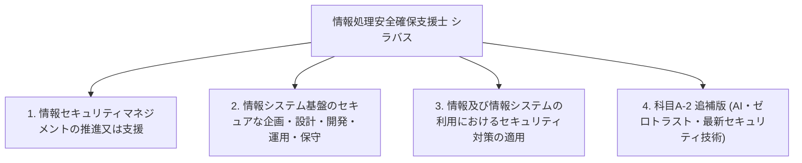

# 情報処理安全確保支援士試験 シラバス詳細（大分類・中分類・小分類・目標・内容）

出典: [IPA 情報処理安全確保支援士試験 シラバス Ver.2.1 および 追補版 Ver.4.0](https://www.ipa.go.jp/shiken/syllabus/index.html)

本ドキュメントは、IPA公式シラバスに定義されている情報処理安全確保支援士試験（レベル4）の**大分類**、**中分類**、**小分類**、**小分類の目標（概要）**、および**要求される知識・技能（内容）**をマークダウン形式で体系的にまとめたものです。

---

## 📑 シラバス構造の概要

---

## 1. 情報セキュリティマネジメントの推進又は支援に関すること

### 1-1. 情報セキュリティ方針の策定
- **小分類**: 1-1 情報セキュリティ方針の策定
- **目標（概要）**: 経営者による情報セキュリティ方針の策定及び改定について、必要な指導・助言を行い、支援する。
- **内容（要求される知識・技能）**:
  - **知識**:
    - 情報セキュリティガバナンス及び IT ガバナンスに関する知識
    - マネジメントシステム（ISMS, BCMS など）に関する知識
    - 組織マネジメントに関する知識
  - **技能**:
    - 組織内外の利害関係者のニーズと期待、経営戦略、事業戦略によって生じる要求事項を踏まえて情報セキュリティ方針を具体化する能力
    - 法令、規制、契約、情報セキュリティに関する動向などによって生じる要求事項を踏まえて情報セキュリティ方針を具体化する能力
    - 経営者とコミュニケーションする能力

### 1-2. 情報セキュリティリスクアセスメント
- **小分類**: 1-2 情報セキュリティリスクアセスメント
- **目標（概要）**: リスク基準の確立及び維持について、必要な指導・助言を行い、支援する。リスク特定、リスク分析、リスク評価のプロセスの実施について、必要な指導・助言を行い、支援する。
- **内容（要求される知識・技能）**:
  - **知識**:
    - 情報の特性（機密性、完全性、可用性、真正性、責任追跡性、否認防止、信頼性など）に関する知識
    - リスク、リスク基準、リスク源、脆弱性及び脅威に関する知識
    - 情報セキュリティリスクアセスメントのプロセス（特定、分析、評価）に関する知識
    - 脅威分析（STRIDE 分析、アタックツリー分析 (ATA) など）に関する知識
  - **技能**:
    - 情報資産損失の大きさ（失われる資産の価値、原因究明及び復旧の費用、社会的説明の費用）を算定し、評価する能力
    - リスク源、脆弱性及び脅威を、新たな IT に関するものも含めて列挙する能力
    - 情報資産とリスクを関連付けて整理する能力
    - リスクを優先順位付けする能力

### 1-3. 情報セキュリティリスク対応
- **小分類**: 1-3 情報セキュリティリスク対応
- **目標（概要）**: 情報セキュリティリスクアセスメントの結果に基づく適切な管理策の選定、情報セキュリティリスク対応計画の策定について、必要な指導・助言を行い、支援する。
- **内容（要求される知識・技能）**:
  - **知識**: リスク対応の選択肢（リスク低減、リスク共有、リスク回避、リスク保有など）に関する知識
  - **技能**: リスクごとに、リスク対応の選択肢を選定する能力

### 1-4. ISMSの確立，導入，運用，監視，見直し，維持及び継続的改善
- **小分類**: 1-4 ISMSの確立，導入，運用，監視，見直し，維持及び継続的改善
- **目標（概要）**: 組織内における情報セキュリティ管理体制の構築、運用管理規則の策定及び見直し、ISMSの継続的改善について支援する。
- **内容（要求される知識・技能）**:
  - **知識**: JIS Q 27001 (ISO/IEC 27001), JIS Q 27002 (ISO/IEC 27002), 適用宣言書 (SoA) に関する知識
  - **技能**: 組織に適合した情報セキュリティ管理規則を設計・維持する能力

### 1-5. 情報セキュリティ教育・訓練
- **小分類**: 1-5 情報セキュリティ教育・訓練
- **目標（概要）**: 従業員や関係者に対する情報セキュリティ意識向上のための教育プログラム、訓練（標的型攻撃メール訓練等）の企画・実施を支援する。
- **内容（要求される知識・技能）**:
  - **知識**: 人的セキュリティ、内部不正防止ガイドライン、ソーシャルエンジニアリング対策
  - **技能**: 役職・職種に応じたセキュリティ教育コンテンツの策定能力

### 1-6. 情報セキュリティインシデント管理
- **小分類**: 1-6 情報セキュリティインシデント管理
- **目標（概要）**: CSIRT / SOC の構築・運用、インシデントハンドリング体制の確立、事故発生時の対応および再発防止策を主導・支援する。
- **内容（要求される知識・技能）**:
  - **知識**: CSIRT/SOC 構築運用、インシデントレスポンスフロー、デジタルフォレンジック、証拠保全
  - **技能**: ログの相関分析、被害影響範囲の特定、関係機関（IPA, JPCERT/CC）への報告対応能力

### 1-7. 事業継続管理（BCM）
- **小分類**: 1-7 事業継続管理（BCM）
- **目標（概要）**: サイバー攻撃や大規模障害発生時における事業継続計画 (BCP) の策定、復旧プロセスの検証を支援する。
- **内容（要求される知識・技能）**:
  - **知識**: BIA (ビジネスインパクト分析), RTO (目標復旧時間), RPO (目標復旧地点)
  - **技能**: 重要業務の優先復旧シナリオ作成能力

### 1-8. 情報セキュリティ監査
- **小分類**: 1-8 情報セキュリティ監査
- **目標（概要）**: 情報セキュリティ監査の計画・実施・報告を専門家と連携して推進し、改善策の助言を行う。
- **内容（要求される知識・技能）**:
  - **知識**: 情報セキュリティ監査基準、管理基準、監査手続
  - **技能**: 監査証拠の収集・客観的評価能力

### 1-9. 法令，規約等の遵守
- **小分類**: 1-9 法令，規約等の遵守
- **目標（概要）**: サイバーセキュリティ基本法、不正アクセス禁止法、個人情報保護法、プロバイダ責任制限法などの法的要求事項の遵守を支援する。
- **内容（要求される知識・技能）**:
  - **知識**: サイバーセキュリティ関連法令、個人情報保護ガイドライン、著作権法、契約法

---

## 2. 情報システム基盤のセキュアな企画・設計・開発・運用・保守に関すること

### 2-1. セキュリティ要件定義
- **小分類**: 2-1 セキュリティ要件定義
- **目標（概要）**: システム構築における機能要件・非機能要件からセキュリティ要求を漏れなく抽出し、要件定義書に反映する。
- **内容（要求される知識・技能）**:
  - **知識**: セキュリティ要件定義ガイドライン、脅威モデリング
  - **技能**: システム構成図・通信フローからの脅威分析および要件化能力

### 2-2. セキュリティ機能設計
- **小分類**: 2-2 セキュリティ機能設計
- **目標（概要）**: 境界防御、内部セグメンテーション、セキュアアーキテクチャの設計を行う。
- **内容（要求される知識・技能）**:
  - **知識**: セキュア設計パターン、最小権限の原則、防御の層深化 (Defense in Depth)
  - **技能**: システム構成に応じたセキュリティゾーン設計能力

### 2-3. 暗号技術の利用
- **小分類**: 2-3 暗号技術の利用
- **目標（概要）**: 共通鍵暗号、公開鍵暗号、ハッシュ関数、PKI（公開鍵基盤）の適切な選定およびシステムへの適用を支援する。
- **内容（要求される知識・技能）**:
  - **知識**: AES, RSA, ECC, SHA-256/3, HMAC, GCM, X.509, CRL/OCSP
  - **技能**: 用途に応じた暗号アルゴリズムおよび暗号利用モードの選定能力

### 2-4. 認証・アクセス制御・個人識別技術の利用
- **小分類**: 2-4 認証・アクセス制御・個人識別技術の利用
- **目標（概要）**: MFA、シングルサインオン (SSO)、OAuth 2.0 / OpenID Connect、FIDO2 などの認証・認可基盤の設計・導入を支援する。
- **内容（要求される知識・技能）**:
  - **知識**: MFA, TOTP, WebAuthn/FIDO2, OAuth 2.0 (PKCE), OIDC, SAML, RBAC/ABAC
  - **技能**: セキュアな認証・認可フロー設計およびトークン管理能力

### 2-5. ネットワークセキュリティ対策
- **小分類**: 2-5 ネットワークセキュリティ対策
- **目標（概要）**: TCP/IP プロトコルレベルでの暗号化、ファイアウォール、WAF、IDS/IPS の導入および設定規則の最適化を行う。
- **内容（要求される知識・技能）**:
  - **知識**: TLS 1.3, IPsec (トンネル/トランスポート), DNSSEC, FW (ステートフル), WAF, IDS/IPS
  - **技能**: ネットワーク機器の設定ルール定義および通信分析能力

### 2-6. データベースセキュリティ対策
- **小分類**: 2-6 データベースセキュリティ対策
- **目標（概要）**: データベースのアクセス制御、暗号化、監査ログの収集・分析を行う。
- **内容（要求される知識・技能）**:
  - **知識**: DB 暗号化、透明的データ暗号化 (TDA)、SQL インジェクション対策、DB 監査
  - **技能**: 最小権限原則に基づくデータベースユーザー権限設計能力

### 2-7. セキュアプログラミング
- **小分類**: 2-7 セキュアプログラミング
- **目標（概要）**: Web アプリケーションにおける主要な脆弱性（XSS, SQLi, CSRF, OS コマンド注入, SSRF 等）の発生原因とセキュア実装方法を指導・支援する。
- **内容（要求される知識・技能）**:
  - **知識**: 入力検証、出力エスケープ、プレースホルダ利用、CSRF トークン、SameSite/HttpOnly/Secure 属性
  - **技能**: ソースコードレビューおよび脆弱性修正コードの作成能力

### 2-8. マルウェア対策
- **小分類**: 2-8 マルウェア対策
- **目標（概要）**: ランサムウェア、RAT、ボットネットなどのマルウェア感染防止、検知、EPP/EDR の導入を支援する。
- **内容（要求される知識・技能）**:
  - **知識**: EPP/EDR、サンドボックス、静的/動的解析、IOC (Indicator of Compromise)
  - **技能**: マルウェア感染発生時の検知ログ特定および隔離能力

### 2-9. 脆弱性への対応
- **小分類**: 2-9 脆弱性への対応
- **目標（概要）**: CVE/JVN 情報の収集、脆弱性診断（プラットフォーム診断/Web診断）、パッチ適用管理を行う。
- **内容（要求される知識・技能）**:
  - **知識**: CVSS (共通脆弱性評価システム), CVE, JVN, 脆弱性スキャナ
  - **技能**: リスク評価に基づくセキュリティパッチ適用優先順位の判断能力

### 2-10. システム運用・保守におけるセキュリティ管理
- **小分類**: 2-10 システム運用・保守におけるセキュリティ管理
- **目標（概要）**: 特権ID管理、変更管理、ログ集中管理 (SIEM) を推進する。
- **内容（要求される知識・技能）**:
  - **知識**: 特権アクセス管理 (PAM), SIEM, 変更管理フロー
  - **技能**: ログの集中相関分析および異変検知能力

---

## 3. 情報及び情報システムの利用におけるセキュリティ対策の適用に関すること

### 3-1. クラウドサービスのセキュアな利用
- **小分類**: 3-1 クラウドサービスのセキュアな利用
- **目標（概要）**: IaaS/PaaS/SaaS の責任共有モデルを踏まえたセキュリティ設定、CASB / CSPM の活用を支援する。
- **内容（要求される知識・技能）**:
  - **知識**: 責任共有モデル、CSPM (Cloud Security Posture Management), CASB, IAM ポリシー
  - **技能**: クラウド環境の誤設定 (Misconfiguration) 検知および改善能力

### 3-2. モバイル機器・テレワークのセキュアな利用
- **小分類**: 3-2 モバイル機器・テレワークのセキュアな利用
- **目標（概要）**: BYOD、MDM (Mobile Device Management)、リモートアクセス (VPN/ZTNA) の安全な利用環境を確立する。
- **内容（要求される知識・技能）**:
  - **知識**: MDM/MAM, ZTNA (Zero Trust Network Access), 端末暗号化
  - **技能**: テレワーク時のセキュリティガイドライン策定・適用能力

### 3-3. 制御システム・IoT機器のセキュアな利用
- **小分類**: 3-3 制御システム・IoT機器のセキュアな利用
- **目標（概要）**: OT (Operational Technology) ネットワーク、IoT 機器特有の脅威に対するセキュリティ設計・運用を支援する。
- **内容（要求される知識・技能）**:
  - **知識**: OT/ICS セキュリティ (IEC 62443), IoT ガイドライン, ファームウェア更新
  - **技能**: IT/OT 接続境界のセグメンテーション設計能力

---

## 4. 科目A-2 追補版 (AI・データ・最新セキュリティ技術)

### 4-1. AI関連技術とセキュリティ
- **小分類**: 4-1 AI関連技術とセキュリティ
- **目標（概要）**: 生成AIおよび機械学習モデルの活用に伴うセキュリティリスク（プロンプトインジェクション、データ汚染、モデル盗聴等）の評価と安全な導入を支援する。
- **内容（要求される知識・技能）**:
  - **知識**: 生成AI, LLM セキュリティ, プロンプトインジェクション, トレーニングデータのガバナンス
  - **技能**: LLM アプリケーションにおける入力フィルタリングおよびデータ漏洩防止設計能力

### 4-2. ゼロトラストアーキテクチャ
- **小分類**: 4-2 ゼロトラストアーキテクチャ
- **目標（概要）**: NIST SP 800-207 に準拠したゼロトラスト原則（アイデンティティ中心、継続的評価、マイクロセグメンテーション）の設計・適用を支援する。
- **内容（要求される知識・技能）**:
  - **知識**: NIST SP 800-207, SDP (Software-Defined Perimeter), PDP/PEP, Device Trust
  - **技能**: 認証・端末状態に基づく継続的アクセス制御ポリシー設計能力

### 4-3. サプライチェーンセキュリティ
- **小分類**: 4-3 サプライチェーンセキュリティ
- **目標（概要）**: ソフトウェアサプライチェーン（SBOM, 依存関係リスク）および委託先管理のセキュリティ要求・監査を推進する。
- **内容（要求される知識・技能）**:
  - **知識**: SBOM (Software Bill of Materials), 依存性脆弱性スキャン, 委託先セキュリティ評価
  - **技能**: 開発パイプラインにおける依存関係検証および委託先審査能力
