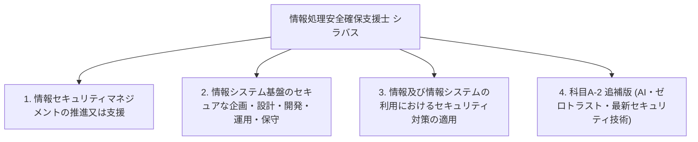

# 情報処理安全確保支援士試験 シラバス詳細（大分類・中分類・小分類・目標・内容・用語例）

出典: [IPA 情報処理安全確保支援士試験 シラバス Ver.2.1 および 追補版 Ver.4.0](https://www.ipa.go.jp/shiken/syllabus/index.html)

本ドキュメントは、IPA公式シラバスに定義されている情報処理安全確保支援士試験（レベル4）の**大分類**、**中分類**、**小分類**、**小分類の目標（概要）**、**要求される知識・技能（内容）**、および**主な用語例・キーワード**をマークダウン形式で体系的にまとめたものです。

---

## 📑 シラバス構造の概要

---

## 1. 情報セキュリティマネジメントの推進又は支援に関すること

### 1-1. 情報セキュリティ方針の策定
- **小分類**: 1-1 情報セキュリティ方針の策定
- **目標（概要）**: 経営者による情報セキュリティ方針の策定及び改定について、必要な指導・助言を行い、支援する。
- **内容（要求される知識・技能）**:
  - **知識**: 情報セキュリティガバナンス、ITガバナンス、マネジメントシステム（ISMS, BCMS等）、組織マネジメント
  - **技能**: 利害関係者のニーズ・経営戦略を踏まえた方針具体化、法令・動向を踏まえた方針具体化、経営層コミュニケーション
- **主な用語例・キーワード**:
  `情報セキュリティガバナンス`, `ITガバナンス`, `ISMS (JIS Q 27001)`, `BCMS (JIS Q 22301)`, `基本方針`, `対策基準`, `実施手順`, `経営戦略`, `ステークホルダー要求`

### 1-2. 情報セキュリティリスクアセスメント
- **小分類**: 1-2 情報セキュリティリスクアセスメント
- **目標（概要）**: リスク基準の確立及び維持について、必要な指導・助言を行い、支援する。リスク特定、リスク分析、リスク評価のプロセスの実施について指導・助言を行い、支援する。
- **内容（要求される知識・技能）**:
  - **知識**: 情報の特性（機密性・完全性・可用性・真正性・責任追跡性・否認防止・信頼性）、リスク基準・リスク源・脆弱性・脅威、リスクアセスメントプロセス、脅威分析（STRIDE分析、アタックツリー分析 ATA）
  - **技能**: 情報資産損失額評価、リスク源・脆弱性・脅威の列挙、資産とリスクの関連付け、優先順位付け
- **主な用語例・キーワード**:
  `機密性 (Confidentiality)`, `完全性 (Integrity)`, `可用性 (Availability)`, `真正性`, `責任追跡性`, `否認防止`, `信頼性`, `リスク基準`, `リスク源`, `脆弱性`, `脅威`, `リスク特定`, `リスク分析`, `リスク評価`, `STRIDE分析`, `アタックツリー分析 (ATA)`, `リスクマトリクス`

### 1-3. 情報セキュリティリスク対応
- **小分類**: 1-3 情報セキュリティリスク対応
- **目標（概要）**: 情報セキュリティリスクアセスメントの結果に基づく適切な管理策の選定、情報セキュリティリスク対応計画の策定について、必要な指導・助言を行い、支援する。
- **内容（要求される知識・技能）**:
  - **知識**: リスク対応の選択肢（リスク低減、リスク共有、リスク回避、リスク保有）、サイバー保険、管理策の選定
  - **技能**: リスク対応選択肢の選定、適切な管理策の選定、リスク対応計画策定、残留リスクの説明
- **主な用語例・キーワード**:
  `リスク低減 (リスク軽減)`, `リスク回避`, `リスク共有 (リスク転嫁)`, `リスク保有 (リスク受容)`, `管理策 (コントロール)`, `残留リスク`, `サイバー保険`, `リスク対応計画`

### 1-4. 情報セキュリティ諸規程の策定及び運用 (ISMS)
- **小分類**: 1-4 情報セキュリティ諸規程の策定及び運用 (ISMS)
- **目標（概要）**: 組織内における情報セキュリティ管理体制の構築、運用管理規則の策定及び見直し、ISMSの継続的改善について支援する。
- **内容（要求される知識・技能）**:
  - **知識**: JIS Q 27001 (ISO/IEC 27001), JIS Q 27002 (ISO/IEC 27002), 適用宣言書 (SoA), 法令・規制・規格の動向
  - **技能**: 組織業務プロセスに適合したセキュリティ諸規程の策定・レビュー・維持能力
- **主な用語例・キーワード**:
  `JIS Q 27001 (ISO/IEC 27001)`, `JIS Q 27002 (ISO/IEC 27002)`, `適用宣言書 (SoA)`, `情報セキュリティ諸規程`, `事業継続計画 (BCP)`, `要塞化 (ハードニング)`, `クラウドアライアンス基準`

### 1-5. 情報セキュリティ教育・訓練
- **小分類**: 1-5 情報セキュリティ教育・訓練
- **目標（概要）**: 従業員や関係者に対する情報セキュリティ意識向上のための教育プログラム、訓練（標的型攻撃メール訓練等）の企画・実施を支援する。
- **内容（要求される知識・技能）**:
  - **知識**: 人的セキュリティ、内部不正防止ガイドライン、ソーシャルエンジニアリング、教育・訓練計画
  - **技能**: 役職・職種に応じた教育コンテンツ策定、訓練効果測定、意識向上の継続的実施
- **主な用語例・キーワード**:
  `標的型攻撃メール訓練`, `ソーシャルエンジニアリング対策`, `人的セキュリティ`, `内部不正防止ガイドライン`, `情報セキュリティ意識向上 (Awareness)`, `フィッシング訓練`

### 1-6. 情報セキュリティインシデント管理
- **小分類**: 1-6 情報セキュリティインシデント管理
- **目標（概要）**: CSIRT / SOC の構築・運用、インシデントハンドリング体制の確立、事故発生時の対応および再発防止策を主導・支援する。
- **内容（要求される知識・技能）**:
  - **知識**: CSIRT/SOC構築運用、インシデントレスポンスフロー、デジタルフォレンジック、証拠保全、連携機関（IPA, JPCERT/CC）
  - **技能**: ログ相関分析、被害影響範囲の特定、証拠保全、外部関係機関・報道等への報告対応
- **主な用語例・キーワード**:
  `CSIRT (Computer Security Incident Response Team)`, `SOC (Security Operations Center)`, `インシデントレスポンス`, `デジタルフォレンジック`, `証拠保全 (Chain of Custody)`, `揮発性順序 (Order of Volatility)`, `ライトブロッカ`, `メモリフォレンジック`, `タイムスタンプ相関分析`, `JPCERT/CC`, `IPA`, `J-CRAT`, `J-CSIP`

### 1-7. 事業継続管理（BCM）
- **小分類**: 1-7 事業継続管理（BCM）
- **目標（概要）**: サイバー攻撃や大規模障害発生時における事業継続計画 (BCP) の策定、復旧プロセスの検証を支援する。
- **内容（要求される知識・技能）**:
  - **知識**: BIA (ビジネスインパクト分析), RTO (目標復旧時間), RPO (目標復旧地点), 代替サイト
  - **技能**: 重要業務の優先復旧シナリオ作成、BCP検証・演習の企画能力
- **主な用語例・キーワード**:
  `BCP (事業継続計画)`, `BIA (ビジネスインパクト分析)`, `RTO (目標復旧時間)`, `RPO (目標復旧地点)`, `ホットサイト`, `ウォームサイト`, `コールドサイト`, `サイバーレジリエンス`

### 1-8. 情報セキュリティ監査
- **小分類**: 1-8 情報セキュリティ監査
- **目標（概要）**: 情報セキュリティ監査の計画・実施・報告を専門家と連携して推進し、改善策の助言を行う。
- **内容（要求される知識・技能）**:
  - **知識**: 情報セキュリティ監査基準、管理基準、保証型監査、助言型監査、監査計画書、監査証拠
  - **技能**: 監査証拠収集・分析、コントロール妥当性評価、改善提案・指導能力
- **主な用語例・キーワード**:
  `情報セキュリティ監査基準`, `情報セキュリティ管理基準`, `保証型監査`, `助言型監査`, `監査計画書`, `監査手続`, `監査証拠`, `システム監査`

### 1-9. 法令，規約等の遵守・動向把握
- **小分類**: 1-9 法令，規約等の遵守・動向把握
- **目標（概要）**: サイバーセキュリティ関連法令・業界基準・ガイドラインの最新動向を把握し、コンプライアンス上の課題解決を支援する。
- **内容（要求される知識・技能）**:
  - **知識**: サイバーセキュリティ基本法、不正アクセス禁止法、個人情報保護法、プロバイダ責任制限法、CPSF、サイバーキルチェーン、ATT&CK、脅威インテリジェンス
  - **技能**: 最新脅威動向の収集・分析、組織への影響評価、コンプライアンス対応指導能力
- **主な用語例・キーワード**:
  `サイバーセキュリティ基本法`, `不正アクセス禁止法`, `個人情報保護法`, `プロバイダ責任制限法`, `特定電子メール法`, `CPSF (サイバー・フィジカル・セキュリティフレームワーク)`, `サイバーキルチェーン`, `MITRE ATT&CK`, `OSINT`, `脅威インテリジェンス`

---

## 2. 情報システム基盤のセキュアな企画・設計・開発・運用・保守に関すること

### 2-1. セキュリティ要件定義
- **小分類**: 2-1 セキュリティ要件定義
- **目標（概要）**: システム構築における機能要件・非機能要件からセキュリティ要求を漏れなく抽出し、要件定義書に反映する。
- **内容（要求される知識・技能）**:
  - **知識**: セキュリティ要件定義、セキュリティバイデザイン、プライバシーバイデザイン、品質要件 (ISO/IEC 25010)
  - **技能**: ニーズ・制約からの要件定義、脅威分析結果の要件反映、仕様書レビュー能力
- **主な用語例・キーワード**:
  `セキュリティバイデザイン (Security by Design)`, `プライバシーバイデザイン (Privacy by Design)`, `脅威モデリング`, `セキュリティ要件`, `非機能要件`, `品質要件 (ISO/IEC 25010)`

### 2-2. 製品・サービスのセキュアな導入・設計
- **小分類**: 2-2 製品・サービスのセキュアな導入・設計
- **目標（概要）**: 製品・サービスの調達選定、セキュア設定（要塞化）の実施、セキュリティ投資対効果の評価を支援する。
- **内容（要求される知識・技能）**:
  - **知識**: 製品・サービス特徴、サーバー/ネットワーク機器設定、要塞化 (ハードニング)、投資対効果 (ROSI)
  - **技能**: 要求仕様適合評価、要塞化設定、最小権限原則に基づくセキュリティゾーン設計能力
- **主な用語例・キーワード**:
  `要塞化 (ハードニング)`, `セキュリティ投資対効果 (ROSI)`, `最小権限の原則 (Principle of Least Privilege)`, `防御の層深化 (Defense in Depth)`, `セキュリティゾーン`, `事前設定ガイドライン`

### 2-3. 暗号技術の利用
- **小分類**: 2-3 暗号技術の利用
- **目標（概要）**: 共通鍵暗号、公開鍵暗号、ハッシュ関数、PKI（公開鍵基盤）の適切な選定およびシステムへの適用を支援する。
- **内容（要求される知識・技能）**:
  - **知識**: 共通鍵暗号 (AES), 公開鍵暗号 (RSA, ECC), ハイブリッド暗号, 暗号利用モード (GCM, CBC), ハッシュ関数 (SHA-2/3), HMAC, デジタル署名, PKI, X.509, CRL/OCSP, PFS
  - **技能**: 用途に応じた暗号アルゴリズム・鍵長・暗号モードの選定、鍵管理・証明書運用能力
- **主な用語例・キーワード**:
  `共通鍵暗号 (AES)`, `公開鍵暗号 (RSA, ECC)`, `ハイブリッド暗号`, `暗号利用モード (ECB, CBC, CTR, GCM)`, `認証付き暗号 (AEAD)`, `ハッシュ関数 (SHA-2, SHA-3)`, `HMAC`, `デジタル署名`, `PKI (公開鍵基盤)`, `X.509証明書`, `CA (認証局)`, `CRL / OCSP`, `PFS (Perfect Forward Secrecy)`

### 2-4. 認証・アクセス制御・個人識別技術の利用
- **小分類**: 2-4 認証・アクセス制御・個人識別技術の利用
- **目標（概要）**: MFA、シングルサインオン (SSO)、OAuth 2.0 / OpenID Connect、FIDO2 などの認証・認可基盤の設計・導入を支援する。
- **内容（要求される知識・技能）**:
  - **知識**: MFA, TOTP, FIDO2/WebAuthn, SSO, SAML, OAuth 2.0 (PKCE), OpenID Connect (OIDC), RBAC/ABAC
  - **技能**: セキュアな認証・認可フロー設計、トークン横取り防止 (PKCE)、アクセストークン/IDトークン管理能力
- **主な用語例・キーワード**:
  `多要素認証 (MFA)`, `TOTP`, `FIDO2 / WebAuthn`, `シングルサインオン (SSO)`, `SAML 2.0`, `OAuth 2.0 (PKCE)`, `OpenID Connect (OIDC)`, `ID連携`, `RBAC (役割ベースアクセス制御)`, `ABAC (属性ベースアクセス制御)`

### 2-5. ネットワークセキュリティ対策
- **小分類**: 2-5 ネットワークセキュリティ対策
- **目標（概要）**: TCP/IP プロトコルレベルでの暗号化、ファイアウォール、WAF、IDS/IPS の導入および設定規則の最適化を行う。
- **内容（要求される知識・技能）**:
  - **知識**: TLS 1.3, IPsec (AH/ESP/IKE, トンネル/トランスポート), DNSSEC, FW (ステートフル), WAF, IDS/IPS, UTM
  - **技能**: パケットフィルタリングルールの定義、WAFシグネチャ調整、通信トラフィック相関分析能力
- **主な用語例・キーワード**:
  `TLS 1.3`, `IPsec (AH, ESP, IKE, トンネル/トランスポート)`, `DNSSEC`, `ファイアウォール (ステートフルインスペクション)`, `WAF`, `IDS / IPS (シグネチャ/アノマリ検知)`, `UTM`, `プロキシ`, `DNSソースポートランダム化`

### 2-6. データベースセキュリティ対策
- **小分類**: 2-6 データベースセキュリティ対策
- **目標（概要）**: データベースのアクセス制御、暗号化、監査ログの収集・分析を行う。
- **内容（要求される知識・技能）**:
  - **知識**: DB暗号化, 透明的データ暗号化 (TDE), SQLi対策 (バインドメカニズム), DBアクセス監査
  - **技能**: バインドプレースホルダ利用設計、データベース権限最小化、アクセスログ監査設計能力
- **主な用語例・キーワード**:
  `DB暗号化`, `透明的データ暗号化 (TDE)`, `SQLインジェクション対策 (バインド機構/プレースホルダ)`, `DBアクセス監査`, `最小権限DBユーザー`

### 2-7. セキュアプログラミング
- **小分類**: 2-7 セキュアプログラミング
- **目標（概要）**: Web アプリケーションにおける主要な脆弱性（XSS, SQLi, CSRF, OS コマンド注入, SSRF 等）の発生原因とセキュア実装方法を指導・支援する。
- **内容（要求される知識・技能）**:
  - **知識**: XSS, SQLi, CSRF, OSコマンド注入, SSRF, Cookie属性 (Secure/HttpOnly/SameSite), セッション固定攻撃
  - **技能**: 入力検証・出力エスケープ設計、CSRFトークン検証、セッションID再発行処理の実装・レビュー能力
- **主な用語例・キーワード**:
  `XSS (HTMLエスケープ, CSPヘッダ)`, `SQLi (プレペアドステートメント)`, `CSRF (CSRFトークン, SameSite属性)`, `OSコマンド注入 (言語組み込み関数利用)`, `SSRF (ホワイトリスト検証)`, `Cookie属性 (Secure, HttpOnly, SameSite)`, `セッション固定攻撃対策 (ログイン時セッションID再発行)`

### 2-8. マルウェア対策
- **小分類**: 2-8 マルウェア対策
- **目標（概要）**: ランサムウェア、RAT、ボットネットなどのマルウェア感染防止、検知、EPP/EDR の導入を支援する。
- **内容（要求される知識・技能）**:
  - **知識**: EPP, EDR, サンドボックス, ランサムウェア, RAT, IOC (Indicator of Compromise), YARAルール
  - **技能**: 感染検知時の端末即座隔離、EDRログによる侵入ルート特定能力
- **主な用語例・キーワード**:
  `EPP (Endpoint Protection Platform)`, `EDR (Endpoint Detection and Response)`, `サンドボックス`, `ランサムウェア`, `RAT`, `ボットネット`, `IOC (Indicator of Compromise)`, `YARAルール`

### 2-9. 脆弱性への対応
- **小分類**: 2-9 脆弱性への対応
- **目標（概要）**: CVE/JVN 情報の収集、脆弱性診断（プラットフォーム診断/Web診断）、パッチ適用管理を行う。
- **内容（要求される知識・技能）**:
  - **知識**: CVSS (基本値/現状値/環境値), CVE, JVN, 脆弱性スキャナ, ペネトレーションテスト
  - **技能**: CVSSリスク評価に基づくパッチ適用優先度判定、診断レポートに基づく対策立案能力
- **主な用語例・キーワード**:
  `CVE`, `JVN`, `CVSS (v2/v3/v4)`, `CVSS基本値・現状値・環境値`, `脆弱性スキャナ`, `ペネトレーションテスト`, `バグバウンティ`

### 2-10. システム運用・保守におけるセキュリティ管理
- **小分類**: 2-10 システム運用・保守におけるセキュリティ管理
- **目標（概要）**: 特権ID管理、変更管理、ログ集中管理 (SIEM) を推進する。
- **内容（要求される知識・技能）**:
  - **知識**: 特権ID管理 (PAM), SIEM, SOAR, 変更管理フロー, ログ改ざん防止
  - **技能**: ログ相関分析による異常検知、特権申請・承認ワークフロー設計能力
- **主な用語例・キーワード**:
  `特権アクセス管理 (PAM)`, `SIEM`, `SOAR (Security Orchestration, Automation and Response)`, `変更管理フロー`, `ログアーカイビング・改ざん防止`

---

## 3. 情報及び情報システムの利用におけるセキュリティ対策の適用に関すること

### 3-1. クラウドサービスのセキュアな利用
- **小分類**: 3-1 クラウドサービスのセキュアな利用
- **目標（概要）**: IaaS/PaaS/SaaS の責任共有モデルを踏まえたセキュリティ設定、CASB / CSPM の活用を支援する。
- **内容（要求される知識・技能）**:
  - **知識**: 責任共有モデル, CSPM, CASB, CWPP, クラウド安全評価制度 (ISMAP), IAMポリシー誤設定
  - **技能**: クラウドセキュリティ設定診断、S3バケット等のパブリック公開誤設定検知・修正能力
- **主な用語例・キーワード**:
  `責任共有モデル (Shared Responsibility Model)`, `CSPM (Cloud Security Posture Management)`, `CASB`, `CWPP`, `ISMAP`, `IAMポリシー`, `S3パブリックバケット誤設定`

### 3-2. モバイル機器・テレワークのセキュアな利用
- **小分類**: 3-2 モバイル機器・テレワークのセキュアな利用
- **目標（概要）**: BYOD、MDM (Mobile Device Management)、リモートアクセス (VPN/ZTNA) の安全な利用環境を確立する。
- **内容（要求される知識・技能）**:
  - **知識**: BYOD, MDM, MAM, EMM, VPN, ZTNA, 端末ストレージ暗号化
  - **技能**: テレワーク時のセキュリティガイドライン策定、紛失時のリモートワイプ運用設計能力
- **主な用語例・キーワード**:
  `BYOD`, `MDM (Mobile Device Management)`, `MAM`, `EMM`, `リモートデスクトップ`, `VPN`, `ZTNA`, `端末ストレージ暗号化`, `リモートワイプ`

### 3-3. 制御システム・IoT機器のセキュアな利用
- **小分類**: 3-3 制御システム・IoT機器のセキュアな利用
- **目標（概要）**: OT (Operational Technology) ネットワーク、IoT 機器特有の脅威に対するセキュリティ設計・運用を支援する。
- **内容（要求される知識・技能）**:
  - **知識**: OT/ICSセキュリティ (IEC 62443), IoTセキュリティガイドライン, セキュアブート, OTA更新
  - **技能**: IT/OT接続境界のセグメンテーション設計、IoT機器ファームウェア暗号化検証能力
- **主な用語例・キーワード**:
  `OT / ICSセキュリティ (IEC 62443)`, `IoTセキュリティガイドライン`, `セキュアブート`, `OTA (Over-The-Air) ファームウェア更新`, `IT/OT接続境界分離`

---

## 4. 科目A-2 追補版 (AI・ゼロトラスト・最新セキュリティ技術)

### 4-1. AI関連技術とセキュリティ
- **小分類**: 4-1 AI関連技術とセキュリティ
- **目標（概要）**: 生成AIおよび機械学習モデルの活用に伴うセキュリティリスク（プロンプトインジェクション、データ汚染、モデル盗聴等）の評価と安全な導入を支援する。
- **内容（要求される知識・技能）**:
  - **知識**: 生成AI, LLM, プロンプトインジェクション (直接/間接), データ汚染 (Data Poisoning), モデル抽出攻撃, AI事業者ガイドライン
  - **技能**: LLMアプリケーションにおける入力フィルタリング、プロンプトインジェクション対策、機密データ漏洩防止設計能力
- **主な用語例・キーワード**:
  `生成AI`, `LLM (Large Language Model)`, `プロンプトインジェクション (直接的/間接的)`, `データ汚染 (Data Poisoning)`, `モデル抽出攻撃`, `AI事業者ガイドライン`, `OWASP Top 10 for LLM`

### 4-2. ゼロトラストアーキテクチャ
- **小分類**: 4-2 ゼロトラストアーキテクチャ
- **目標（概要）**: NIST SP 800-207 に準拠したゼロトラスト原則（アイデンティティ中心、継続的評価、マイクロセグメンテーション）の設計・適用を支援する。
- **内容（要求される知識・技能）**:
  - **知識**: NIST SP 800-207, ゼロトラスト7原則, PDP (Policy Decision Point), PEP (Policy Enforcement Point), SDP, Device Trust
  - **技能**: アイデンティティおよび端末コンテキストに基づく継続的アクセス制御ポリシー設計能力
- **主な用語例・キーワード**:
  `NIST SP 800-207`, `ゼロトラスト7原則`, `PDP (Policy Decision Point)`, `PEP (Policy Enforcement Point)`, `SDP (Software-Defined Perimeter)`, `Device Trust (端末健全性)`, `マイクロセグメンテーション`

### 4-3. サプライチェーンセキュリティ
- **小分類**: 4-3 サプライチェーンセキュリティ
- **目標（概要）**: ソフトウェアサプライチェーン（SBOM, 依存関係リスク）および委託先管理のセキュリティ要求・監査を推進する。
- **内容（要求される知識・技能）**:
  - **知識**: SBOM (Software Bill of Materials / SPDX, CycloneDX), ソフトウェアサプライチェーン攻撃, 依存性脆弱性, TPRM
  - **技能**: CI/CDパイプラインにおける依存関係脆弱性自動スキャン、SBOM検証および委託先監査設計能力
- **主な用語例・キーワード**:
  `SBOM (Software Bill of Materials / SPDX, CycloneDX)`, `ソフトウェアサプライチェーン攻撃`, `依存性脆弱性 (Dependency Vulnerability)`, `サードパーティリスクマネジメント (TPRM)`, `コード署名`
