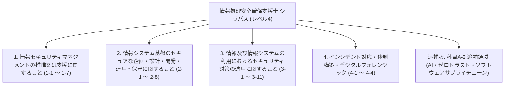

# 情報処理安全確保支援士試験 シラバス詳細（公式大項目・中項目・小項目番号 完全準拠・全用語例 網羅版）

出典: [IPA 情報処理安全確保支援士試験 シラバス Ver.2.1 および 追補版 Ver.4.0](https://www.ipa.go.jp/shiken/syllabus/index.html)

本ドキュメントは、IPA公式シラバス（Ver.2.1 および 科目A-2 追補版 Ver.4.0）に定義されている情報処理安全確保支援士試験（レベル4）の**大項目（大分類）**、**小項目（小分類）の番号・名称**、**概要（目標）**、**要求される知識（詳細）**、**要求される技能（詳細）**、および**シラバス記載の全用語例・キーワード**を、**IPA公式の番号・構成と1対1で完全一致**させて網羅した公式準拠ドキュメントです。

---

## 📑 IPA公式シラバス 階層マップ

---

## 1. 情報セキュリティマネジメントの推進又は支援に関すること

### 1-1 情報セキュリティ方針の策定
- **大項目**: 1. 情報セキュリティマネジメントの推進又は支援に関すること
- **小項目**: 1-1 情報セキュリティ方針の策定
- **概要（目標）**: 経営者による情報セキュリティ方針の策定及び改定について，必要な指導・助言を行い，支援する。
- **要求される知識**:
  - 情報セキュリティガバナンス及び IT ガバナンスに関する知識
  - マネジメントシステム（ISMS，BCMS など）に関する知識
  - 組織マネジメントに関する知識
  - 法令，規制，契約，情報セキュリティに関する動向などによって生じる要求事項に関する知識
- **要求される技能**:
  - 組織内外の利害関係者のニーズと期待，組織内の経営戦略，事業戦略によって生じる要求事項を踏まえて情報セキュリティ方針を具体化する能力
  - 法令，規制，契約，情報セキュリティに関する動向などによって生じる要求事項を踏まえて情報セキュリティ方針を具体化する能力
  - 経営者とコミュニケーションする能力
- **用語例・キーワード (全網羅)**:
  `情報セキュリティガバナンス`, `ITガバナンス`, `ISMS (JIS Q 27001 / ISO/IEC 27001)`, `BCMS (JIS Q 22301 / ISO 22301)`, `情報セキュリティ方針`, `基本方針`, `対策基準`, `実施手順`, `組織マネジメント`, `利害関係者 (ステークホルダー) 要求事項`, `経営戦略`, `事業戦略`, `コンプライアンス`

### 1-2 情報セキュリティリスクアセスメント
- **大項目**: 1. 情報セキュリティマネジメントの推進又は支援に関すること
- **小項目**: 1-2 情報セキュリティリスクアセスメント
- **概要（目標）**: リスク基準の確立及び維持について，必要な指導・助言を行い，支援する。リスク特定，リスク分析，リスク評価のプロセスの実施について，必要な指導・助言を行い，支援する。
- **要求される知識**:
  - 情報の特性（機密性，完全性，可用性，真正性，責任追跡性，否認防止，信頼性など）に関する知識
  - リスク，リスク基準，リスク源，脆弱性及び脅威に関する知識
  - 情報セキュリティリスクアセスメントのプロセス（特定，分析，評価）に関する知識
  - 脅威分析（STRIDE 分析，アタックツリー分析（ATA）など）に関する知識
- **要求される技能**:
  - 情報資産損失の大きさ（失われる資産の価値，原因究明及び復旧の費用，社会的説明の費用）を算定し，評価する能力
  - リスク源，脆弱性及び脅威を，新たな IT に関するものも含めて列挙する能力
  - 情報資産とリスクを関連付けて整理する能力
  - リスクを優先順位付けする能力
- **用語例・キーワード (全網羅)**:
  `機密性 (Confidentiality)`, `完全性 (Integrity)`, `可用性 (Availability)`, `真正性 (Authenticity)`, `責任追跡性 (Accountability)`, `否認防止 (Non-repudiation)`, `信頼性 (Reliability)`, `リスク基準`, `リスク源`, `脆弱性 (Vulnerability)`, `脅威 (Threat)`, `情報セキュリティリスクアセスメント`, `リスク特定`, `リスク分析`, `リスク評価`, `STRIDE分析 (Spoofing, Tampering, Repudiation, Information Disclosure, Denial of Service, Elevation of Privilege)`, `アタックツリー分析 (ATA: Attack Tree Analysis)`, `リスクマトリクス`, `資産損失評価`

### 1-3 情報セキュリティリスク対応
- **大項目**: 1. 情報セキュリティマネジメントの推進又は支援に関すること
- **小項目**: 1-3 情報セキュリティリスク対応
- **概要（目標）**: 情報セキュリティリスクアセスメントの結果に基づく適切な管理策の選定，情報セキュリティリスク対応計画の策定について，必要な指導・助言を行い，支援する。
- **要求される知識**:
  - リスク対応の選択肢（リスク低減，リスク共有，リスク回避，リスク保有など）に関する知識
  - 管理策の実施に要する費用の算定に関する知識
  - サイバー保険に関する知識
- **要求される技能**:
  - リスクごとに，リスク対応の選択肢を選定する能力
  - リスク対応の実施に適切な管理策を選定する能力
  - 情報セキュリティリスク対応計画を作成し，残留リスクと併せて説明する能力
- **用語例・キーワード (全網羅)**:
  `リスク対応 (Risk Treatment)`, `リスク低減 (リスク軽減 / Risk Reduction)`, `リスク回避 (Risk Avoidance)`, `リスク共有 (リスク転嫁 / Risk Sharing)`, `リスク保有 (リスク受容 / Risk Acceptance)`, `管理策 (コントロール / Security Controls)`, `残留リスク (Residual Risk)`, `リスク対応計画`, `サイバー保険`, `費用対効果分析`

### 1-4 情報セキュリティ諸規程の策定
- **大項目**: 1. 情報セキュリティマネジメントの推進又は支援に関すること
- **小項目**: 1-4 情報セキュリティ諸規程の策定
- **概要（目標）**: 情報セキュリティに関連する諸規程の策定及び改定について，必要な指導・助言を行い，支援する。事業継続に関する計画の策定及び改定について，必要な指導・助言を行い，支援する。
- **要求される知識**:
  - 法令，規制，規格に関する知識
  - ITの動向（クラウドコンピューティング，仮想化，モバイル，組込みシステム，Web技術，AI（生成AIを含む），ビッグデータ，IoTなど）及びその情報セキュリティへの影響に関する知識
  - 事業継続に関する知識
- **要求される技能**:
  - 業務プロセス，業務手順を踏まえた上で，情報セキュリティ諸規程で定めるべき事項を検討する能力
  - 検討した事項及びその必要性を説明する能力
  - 法令，規制，規格の変化やITの動向を踏まえて情報セキュリティ諸規程をレビューする能力
- **用語例・キーワード (全網羅)**:
  `JIS Q 27001 (ISO/IEC 27001)`, `JIS Q 27002 (ISO/IEC 27002)`, `適用宣言書 (SoA)`, `情報セキュリティ諸規程`, `事業継続計画 (BCP)`, `事業継続マネジメント (BCM)`, `要塞化 (ハードニング / Hardening)`, `クラウドセキュリティ`, `AI/生成AIセキュリティ`, `IoTセキュリティ`, `モバイルセキュリティ`

### 1-5 情報セキュリティ監査
- **大項目**: 1. 情報セキュリティマネジメントの推進又は支援に関すること
- **小項目**: 1-5 情報セキュリティ監査
- **概要（目標）**: 情報セキュリティ監査及びシステム監査に協力・支援する。監査結果を受けた対象組織による改善計画策定及び改善活動について，必要な指導・助言を行い，支援する。
- **要求される知識**:
  - 情報セキュリティ監査，システム監査，内部監査，業務監査に関する知識
  - 監査のプロセス，関連文書（監査計画書，監査調書，監査報告書など）に関する知識
  - 監査証拠（システム，ネットワークのログなど）に関する知識
- **要求される技能**:
  - 組織が利用しているセキュリティ技術及び導入している情報セキュリティ対策が十分か，並びに適切に実施されているかを評価する能力
  - 事業，業務，情報システム上の制約を考慮した上で，実現可能な管理策を検討し，指導・助言する能力
- **用語例・キーワード (全網羅)**:
  `情報セキュリティ監査基準`, `情報セキュリティ管理基準`, `システム監査基準`, `保証型監査`, `助言型監査`, `内部監査`, `外部監査`, `監査計画書`, `監査調書`, `監査報告書`, `監査証拠`, `ログ検証`, `改善計画・フォローアップ`

### 1-6 情報セキュリティに関する動向・事例の収集と分析
- **大項目**: 1. 情報セキュリティマネジメントの推進又は支援に関すること
- **小項目**: 1-6 情報セキュリティに関する動向・事例の収集と分析
- **概要（目標）**: 情報セキュリティに関する事件・事故，傾向と背景，攻撃の手口，脅威，脆弱性及び対策，セキュリティ技術などの情報を収集する。情報セキュリティに関する法令，規制，規格類の制定・改廃や社会通念の変化，コンプライアンス上の新たな課題などについて把握する。収集した各情報について，組織内への影響，対応の緊急性，対応の費用・効果・必要性を分析する。
- **要求される知識**:
  - JIS，ISO，IEC，IEEE，NISTなどのセキュリティ関連の規格の動向に関する知識
  - 業界標準，ガイドラインの動向に関する知識
  - サイバー・フィジカル・セキュリティフレームワーク（CPSF）に関する知識
  - 攻撃の手口に関する知識
  - 攻撃の分析モデル（サイバーキルチェーン，ATT＆CKなど）に関する知識
  - 脅威インテリジェンス（OSINTなど）に関する知識
- **要求される技能**:
  - 国内外の様々な情報源（公的機関，セキュリティ機関，ベンダー，カンファレンス，論文など）から，必要な情報を，適切かつ継続的に収集する能力
  - 収集した情報の信頼性，正確さを検証する能力
  - 収集した情報を整理し，関係者に伝達する能力
  - 収集した情報に関して，組織内への影響などを評価する能力
- **用語例・キーワード (全網羅)**:
  `JIS`, `ISO/IEC`, `IEEE`, `NIST (SP 800シリーズ)`, `CPSF (サイバー・フィジカル・セキュリティフレームワーク)`, `攻撃手口分析`, `サイバーキルチェーン (Cyber Kill Chain)`, `MITRE ATT&CK`, `脅威インテリジェンス (Threat Intelligence)`, `OSINT (Open Source Intelligence)`, `情報収集・信頼性評価`, `コンプライアンス課題`

### 1-7 関係者とのコミュニケーション
- **大項目**: 1. 情報セキュリティマネジメントの推進又は支援に関すること
- **小項目**: 1-7 関係者とのコミュニケーション
- **概要（目標）**: 組織内の課題及び必要な対策といった情報セキュリティに関する情報を，経営層ほか組織内の各層に伝達し，コミュニケーションを促進する。組織内の情報システムに影響を及ぼす情報を情報システム部門に伝達し，必要な検討，対応を支援する。外部のセキュリティ機関，情報共有コミュニティ，セキュリティベンダー，警察，監督官庁，顧客などと情報交換を行う。
- **要求される知識**:
  - セキュリティ機関（JPCERT/CC，警察，監督官庁，NISC，IPAなど）に関する知識
  - サイバー情報共有イニシアティブ（J-CSIP），サイバーレスキュー隊（J-CRAT）に関する知識
  - 情報セキュリティ早期警戒パートナーシップに関する知識
- **要求される技能**:
  - 情報セキュリティのコミュニティ，イベントなどに参加し，情報収集，情報交換を行う能力
  - 様々な立場の関係者とコミュニケーションする能力
  - 連絡窓口として，組織内外の情報連携を行う能力
  - ISAC，他のCSIRTなどと情報共有する，及び共有された情報を活用する能力
- **用語例・キーワード (全網羅)**:
  `JPCERT/CC`, `NISC (内閣サイバーセキュリティセンター)`, `IPA (情報処理推進機構)`, `J-CSIP (サイバー情報共有イニシアティブ)`, `J-CRAT (サイバーレスキュー隊)`, `情報セキュリティ早期警戒パートナーシップ`, `ISAC (Information Sharing and Analysis Center)`, `CSIRT間情報共有`, `ステークホルダーコミュニケーション`, `エスカレーション`

---

## 2. 情報システム基盤のセキュアな企画・設計・開発・運用・保守に関すること

### 2-1 企画・要件定義（セキュリティの観点）
- **大項目**: 2. 情報システム基盤のセキュアな企画・設計・開発・運用・保守に関すること
- **小項目**: 2-1 企画・要件定義（セキュリティの観点）
- **概要（目標）**: 調達又は開発するシステムのニーズ及び制約並びに脅威分析の結果からのセキュリティ要件の定義について，必要な指導・助言を行い，支援する。
- **要求される知識**:
  - セキュリティ要件に関する知識
  - セキュリティバイデザイン，プライバシーバイデザインに関する知識
  - システム及びソフトウェア製品の品質要件（ISO/IEC 25010 等）に関する知識
- **要求される技能**:
  - 調達又は開発するシステムのニーズ及び制約からセキュリティ要件を定義する能力
  - 脅威分析の結果からセキュリティ要件を定義する能力
  - 仕様書をレビューする能力
- **用語例・キーワード (全網羅)**:
  `セキュリティバイデザイン (Security by Design)`, `プライバシーバイデザイン (Privacy by Design)`, `セキュリティ要件定義`, `機能要件 / 非機能要件`, `ISO/IEC 25010 (品質モデル)`, `脅威分析・モデリング`, `要件定義書レビュー`

### 2-2 製品・サービスのセキュアな導入
- **大項目**: 2. 情報システム基盤のセキュアな企画・設計・開発・運用・保守に関すること
- **小項目**: 2-2 製品・サービスのセキュアな導入
- **概要（目標）**: システム全体又はその一部を構成する製品・サービスの調達について，セキュリティの観点から必要な指導・助言を行い，支援する。調達した製品・サービスへのセキュアな設定の実施について，必要な指導・助言を行い，支援する。
- **要求される知識**:
  - 製品・サービスの種類と特徴に関する知識
  - ネットワーク機器，サーバの設定に関する知識
  - 要塞化（ハードニング）に関する知識
  - セキュリティの投資対効果の評価に関する知識
- **要求される技能**:
  - 製品・サービスの仕様書とセキュリティ要件とを照らして，製品・サービスを選定する能力
  - セキュリティの投資対効果を最適化する能力
  - 設定作業手順書をレビューする能力
  - 調達した製品・サービスにセキュアな設定を行う能力
  - 各製品・サービスを組み合わせたシステム全体のセキュリティバランス，運用の実現性を検証する能力
- **用語例・キーワード (全網羅)**:
  `要塞化 (ハードニング / Hardening)`, `セキュリティ投資対効果 (ROSI)`, `製品・サービス選定基準`, `ネットワーク機器セキュリティ設定`, `サーバー要塞化`, `設定手順書レビュー`, `セキュリティバランス検証`

### 2-3 アーキテクチャのセキュアな設計
- **大項目**: 2. 情報システム基盤のセキュアな企画・設計・開発・運用・保守に関すること
- **小項目**: 2-3 アーキテクチャのセキュアな設計
- **概要（目標）**: システム及びネットワークのアーキテクチャの設計について，セキュリティの観点から必要な指導・助言を行い，支援する。
- **要求される知識**:
  - システム開発技術，アーキテクチャの設計に関する知識
  - 最小権限の原則，境界防御，内部対策，層深防御（Defense in Depth）などのセキュリティ設計原則に関する知識
- **要求される技能**:
  - アーキテクチャの設計書をレビューする能力
  - システム要件に基づき，最適なアーキテクチャを選択・設計する能力
  - セキュリティゾーン・ネットワーク境界・アクセス制限設計能力
- **用語例・キーワード (全網羅)**:
  `最小権限の原則 (Principle of Least Privilege)`, `境界防御 (Perimeter Defense)`, `内部対策 (Internal Security)`, `層深防御 (Defense in Depth)`, `セキュリティゾーン設計`, `ネットワークセグメンテーション`, `アーキテクチャ設計書レビュー`

### 2-4 セキュリティ機能の設計
- **大項目**: 2. 情報システム基盤のセキュアな企画・設計・開発・運用・保守に関すること
- **小項目**: 2-4 セキュリティ機能の設計
- **概要（目標）**: セキュリティ要件及びアーキテクチャに基づき，セキュリティ機能の設計について，必要な指導・助言を行い，支援する。
- **要求される知識**:
  - セキュリティ機能（認証，アクセス制御，暗号，ログ出力等）に関する知識
  - 開発環境，フレームワークのセキュリティ機能に関する知識
- **要求される技能**:
  - セキュリティ機能の設計書，テスト計画書をレビューする能力
  - 要件を満たすセキュリティ機能を設計する能力
- **用語例・キーワード (全網羅)**:
  `認証 (Authentication)`, `アクセス制御 (Access Control)`, `暗号機能 (Encryption)`, `ログ出力機能 (Logging)`, `セキュリティフレームワーク`, `セキュリティ機能設計書レビュー`, `テスト計画書レビュー`

### 2-5 セキュアプログラミング
- **大項目**: 2. 情報システム基盤のセキュアな企画・設計・開発・運用・保守に関すること
- **小項目**: 2-5 セキュアプログラミング
- **概要（目標）**: ソフトウェア実装でのコーディング標準，ガイドラインの策定及びセキュアプログラミングの指導・助言について支援する。
- **要求される知識**:
  - セキュアプログラミングの原則，実践規範，ガイドラインに関する知識
  - 脆弱性の発生原因（XSS，SQLi，CSRF，OSコマンド注入，SSRF等）とその対策に関する知識
- **要求される技能**:
  - ソフトウェア実装について，セキュアプログラミングの観点からレビューし，問題点を指摘する能力
  - 脆弱性を排除したプログラム構造・コードを作成する能力
- **用語例・キーワード (全網羅)**:
  `XSS (Cross-Site Scripting)`, `SQLインジェクション`, `CSRF (Cross-Site Request Forgery)`, `OSコマンド・インジェクション`, `SSRF (Server-Side Request Forgery)`, `ディレクトリトラバーサル`, `Cookie属性 (Secure, HttpOnly, SameSite)`, `セッション固定攻撃対策`, `入力バリデーション`, `出力エスケープ`

### 2-6 セキュリティ機能のテスト
- **大項目**: 2. 情報システム基盤のセキュアな企画・設計・開発・運用・保守に関すること
- **小項目**: 2-6 セキュリティ機能のテスト
- **概要（目標）**: 実装したセキュリティ機能のテスト，並びにセキュリティテスト（脆弱性検査，ペネトレーションテスト等）の計画，実施及び結果の評価について，必要な指導・助言を行い，支援する。
- **要求される知識**:
  - ソフトウェア及びシステムの，セキュリティテストの手法に関する知識
  - 脆弱性検査ツール，ペネトレーションテストに関する知識
- **要求される技能**:
  - テスト対象に応じて，必要なテストの種類及び手法を選定する能力
  - セキュリティテストの計画書，仕様書及び結果報告書をレビューする能力
  - 発見された脆弱性の影響を評価し，必要な対策を助言する能力
- **用語例・キーワード (全網羅)**:
  `セキュリティテスト`, `脆弱性検査ツール (スキャナ)`, `プラットフォーム脆弱性診断`, `Webアプリケーション脆弱性診断`, `ペネトレーションテスト`, `動的解析 (DAST)`, `静的解析 (SAST)`, `脆弱性影響評価`

### 2-7 運用・保守におけるセキュリティ管理
- **大項目**: 2. 情報システム基盤のセキュアな企画・設計・開発・運用・保守に関すること
- **小項目**: 2-7 運用・保守におけるセキュリティ管理
- **概要（目標）**: システムの運用・保守について，セキュリティの観点から必要な指導・助言を行い，支援する。
- **要求される知識**:
  - サービスマネジメント，ITSMS，SLAに関する知識
  - 運用における変更管理，障害管理，リリース管理等に関する知識
  - 特権ID管理，ログ監視に関する知識
- **要求される技能**:
  - 運用・保守の関連文書（作業計画書，作業手順書，SLAなど）をレビューする能力
  - セキュリティの観点から，運用・保守のプロセス及び実施状況を評価し，指導・助言する能力
- **用語例・キーワード (全網羅)**:
  `サービスマネジメント`, `ITSMS (JIS Q 20000)`, `SLA (Service Level Agreement)`, `変更管理`, `障害管理`, `リリース管理`, `特権ID管理 (PAM)`, `ログ監視・改ざん防止`

### 2-8 開発環境のセキュリティ
- **大項目**: 2. 情報システム基盤のセキュアな企画・設計・開発・運用・保守に関すること
- **小項目**: 2-8 開発環境のセキュリティ
- **概要（目標）**: 開発環境のセキュリティを確保するために必要な指導・助言を行い，支援する。
- **要求される知識**:
  - ソフトウェア開発管理技術（開発プロセス，バージョン管理，構成管理，CI/CDなど）に関する知識
  - 開発環境（開発用端末，リポジトリ，テスト環境，クラウド開発基盤など）のセキュリティ対策に関する知識
- **要求される技能**:
  - 開発対象のソフトウェアの仕様書，ソースコード，開発環境の構成を把握し，リスクを分析する能力
  - 開発環境のセキュリティ対策（アクセス制御，漏洩防止，検証環境隔離）を設計・評価する能力
- **用語例・キーワード (全網羅)**:
  `開発プロセスセキュリティ`, `バージョン管理 (Git等)`, `構成管理`, `CI/CDパイプラインセキュリティ`, `リポジトリ保護`, `テスト環境隔離`, `ソースコード漏洩防止`

---

## 3. 情報及び情報システムの利用におけるセキュリティ対策の適用に関すること

### 3-1 暗号利用及び鍵管理の設計
- **大項目**: 3. 情報及び情報システムの利用におけるセキュリティ対策の適用に関すること
- **小項目**: 3-1 暗号利用及び鍵管理の設計
- **概要（目標）**: 暗号の利用，鍵管理の設計及び暗号関連諸規程の策定について，必要な指導・助言を行い，支援する。
- **要求される知識**:
  - 暗号アルゴリズム，暗号利用モードに関する知識
  - 鍵管理（生成，配布，保管，更新，破棄など），PKIに関する知識
- **要求される技能**:
  - 暗号を利用すべき情報・機能を特定する能力
  - 暗号利用及び鍵管理を設計する能力
  - 暗号モジュール，証明書等の適切な選定・運用能力
- **用語例・キーワード (全網羅)**:
  `共通鍵暗号 (AES)`, `公開鍵暗号 (RSA, ECC)`, `ハイブリッド暗号`, `暗号利用モード (ECB, CBC, CTR, GCM)`, `認証付き暗号 (AEAD)`, `ハッシュ関数 (SHA-2/3)`, `HMAC`, `デジタル署名`, `PKI (公開鍵基盤)`, `鍵管理 (生成, 配布, 保管, 更新, 破棄)`, `X.509証明書`, `CA`, `CRL / OCSP`, `PFS (Perfect Forward Secrecy)`

### 3-2 マルウェア対策
- **大項目**: 3. 情報及び情報システムの利用におけるセキュリティ対策の適用に関すること
- **小項目**: 3-2 マルウェア対策
- **概要（目標）**: 情報及び情報システムをマルウェアから保護するための対策について，必要な指導・助言を行い，支援する。
- **要求される知識**:
  - マルウェアの種類と特徴（ボット，ランサムウェア，RAT，スパイウェア，ワームなど）に関する知識
  - マルウェア対策技術（EPP，EDR，サンドボックス，パッチ適用など）に関する知識
- **要求される技能**:
  - マルウェア感染のリスクを分析する能力
  - マルウェア対策を設計する能力
  - 感染発生時の端末即時隔離・検知ログ特定・対応能力
- **用語例・キーワード (全網羅)**:
  `EPP (Endpoint Protection Platform)`, `EDR (Endpoint Detection and Response)`, `サンドボックス`, `静的解析 / 動的解析`, `ランサムウェア`, `RAT (Remote Access Trojan)`, `ボットネット`, `IOC (Indicator of Compromise)`, `YARAルール`, `端末ネットワーク隔離`

### 3-3 バックアップ及び復旧
- **大項目**: 3. 情報及び情報システムの利用におけるセキュリティ対策の適用に関すること
- **小項目**: 3-3 バックアップ及び復旧
- **概要（目標）**: データのバックアップ及び復旧の計画の策定，検証について，必要な指導・助言を行い，支援する。
- **要求される知識**:
  - データのバックアップの方式及び頻度に関する知識
  - リモートバックアップ，世代管理，バックアップデータの保護・暗号化に関する知識
- **要求される技能**:
  - データのバックアップの範囲，頻度，保管場所，復旧手順を設計する能力
  - バックアップデータの復旧テスト，整合性検証を計画・評価する能力
- **用語例・キーワード (全網羅)**:
  `フルバックアップ`, `差分バックアップ`, `増分バックアップ`, `世代管理`, `リモートバックアップ`, `バックアップデータ暗号化`, `RTO (目標復旧時間)`, `RPO (目標復旧地点)`, `復旧テスト`

### 3-4 セキュリティ監視
- **大項目**: 3. 情報及び情報システムの利用におけるセキュリティ対策の適用に関すること
- **小項目**: 3-4 セキュリティ監視
- **概要（目標）**: 情報セキュリティインシデントの検知と調査のためのセキュリティ監視について，必要な指導・助言を行い，支援する。
- **要求される知識**:
  - セキュリティ監視（制御システム，IoT機器，クラウド環境を含む）の手法に関する知識
  - ログの収集，分析（SIEM，SOC，SOAR，AI等の活用を含む）に関する知識
- **要求される技能**:
  - セキュリティ監視方法を設計する能力
  - 監視ログ，アラート情報を分析し，インシデントの可能性を判断する能力
- **用語例・キーワード (全網羅)**:
  `SOC (Security Operations Center)`, `SIEM (Security Information and Event Management)`, `SOAR`, `ログ集中管理`, `ログ相関分析`, `アラートルール最適化`, `制御システム/IoT/クラウド監視`

### 3-5 ネットワーク及び通信のセキュリティ対策
- **大項目**: 3. 情報及び情報システムの利用におけるセキュリティ対策の適用に関すること
- **小項目**: 3-5 ネットワーク及び通信のセキュリティ対策
- **概要（目標）**: ネットワーク及び通信（電子メールの送受信，Webアクセスなど）に関するセキュリティ対策について，必要な指導・助言を行い，支援する。
- **要求される知識**:
  - ネットワーク通信プロトコル（DNS，ICMP，HTTP/HTTPS，SMTP等）及びそのセキュリティ（TLS，IPsec，DNSSEC，DKIM/DMARC/SPF等）に関する知識
  - ネットワークセキュリティ機器・ソフトウェア（FW，WAF，プロキシ等）に関する知識
- **要求される技能**:
  - ネットワークの物理的又は論理的な分割，フィルタリングを設計する能力
  - 電子メール，Web通信のセキュリティ対策（メール署名・暗号化，送信ドメイン認証）を設計する能力
- **用語例・キーワード (全網羅)**:
  `TLS 1.3`, `IPsec (AH, ESP, IKE, トンネル/トランスポート)`, `DNSSEC`, `SPF / DKIM / DMARC (送信ドメイン認証)`, `ファイアウォール (ステートフルインスペクション)`, `WAF`, `IDS / IPS`, `プロキシ`, `DNSソースポートランダム化`

### 3-6 脆弱性への対応
- **大項目**: 3. 情報及び情報システムの利用におけるセキュリティ対策の適用に関すること
- **小項目**: 3-6 脆弱性への対応
- **概要（目標）**: 情報システム及びコンポーネントの構成管理を踏まえた，脆弱性への対応について，必要な指導・助言を行い，支援する。
- **要求される知識**:
  - 脆弱性情報の入手（脆弱性診断結果，外部機関からの情報発信，ベンダからの情報など）に関する知識
  - 脆弱性の評価手法（CVSSなど）に関する知識
- **要求される技能**:
  - 効果的な構成管理，脆弱性情報収集を設計する能力
  - 脆弱性の影響を評価し，セキュリティパッチの適用，回避策の実施などの対応策を検討・助言する能力
- **用語例・キーワード (全網羅)**:
  `CVE`, `JVN`, `CVSS (v2/v3/v4 / 基本値, 現状値, 環境値)`, `脆弱性スキャナ`, `構成管理 (CMDB)`, `セキュリティパッチ管理`, `ワークアラウンド (回避策)`

### 3-7 物理的セキュリティ対策
- **大項目**: 3. 情報及び情報システムの利用におけるセキュリティ対策の適用に関すること
- **小項目**: 3-7 物理的セキュリティ対策
- **概要（目標）**: 物理的及び環境的脅威への対策について，必要な指導・助言を行い，支援する。
- **要求される知識**:
  - 物理的及び環境的脅威（故障，サポート終了，盗難，破壊，災害，不正侵入など）に関する知識
  - 物理的アクセス制御，環境セキュリティ（UPS，防災設備，耐震構造など）に関する知識
- **要求される技能**:
  - 物理的セキュリティ境界を定義し，オフィス，データセンターなどの物理的セキュリティ対策を設計する能力
  - 物理的・環境的リスクに対する防護設備を評価する能力
- **用語例・キーワード (全網羅)**:
  - `物理的セキュリティ境界`, `入退室管理システム (ICカード/生体認証)`, `防犯カメラ (CCTV)`, `UPS (無停電電源装置)`, `自家発電設備`, `FM200ガス消火設備`, `ラック施錠`, `クリアデスク・クリアスクリーン`

### 3-8 アカウント管理及びアクセス制御
- **大項目**: 3. 情報及び情報システムの利用におけるセキュリティ対策の適用に関すること
- **小項目**: 3-8 アカウント管理及びアクセス制御
- **概要（目標）**: 情報及び情報システム並びにネットワークへのアクセスを，適切に制限・許可するための対策について，必要な指導・助言を行い，支援する。
- **要求される知識**:
  - アクセス制御の種類と特徴（ロールベース，属性ベースなど）に関する知識
  - 認証要素，ID管理，特権アカウント管理に関する知識
- **要求される技能**:
  - アクセス制御方針，アカウント及びアクセス権限のライフサイクル管理（登録，変更，削除など）を設計する能力
  - 最小権限原則に基づくアクセス権限監査設計能力
- **用語例・キーワード (全網羅)**:
  `RBAC (役割ベースアクセス制御)`, `ABAC (属性ベースアクセス制御)`, `ID統合管理 (IDM)`, `特権アカウント管理 (PAM)`, `職務分掌 (SoD: Segregation of Duties)`, `最小権限原則`, `ライフサイクル管理`

### 3-9 人的管理
- **大項目**: 3. 情報及び情報システムの利用におけるセキュリティ対策の適用に関すること
- **小項目**: 3-9 人的管理
- **概要（目標）**: 従業員の雇用前，雇用期間中，雇用の終了・変更における人的セキュリティ対策について，必要な指導・助言を行い，支援する。
- **要求される知識**:
  - 内部不正及びそのメカニズムに関する知識
  - 誓約書，秘密保持契約（NDA），ソーシャルエンジニアリング対策，退職時のID削除プロセスに関する知識
- **要求される技能**:
  - 内部不正防止を設計する能力
  - 組織，職務の変更，退職における情報管理プロセスを設計・評価する能力
- **用語例・キーワード (全網羅)**:
  `内部不正防止ガイドライン`, `内部脅威 (Insider Threat)`, `秘密保持契約 (NDA)`, `職務分掌 (SoD)`, `不正のトライアングル (動機・機会・正当化)`, `退職時アカウント無効化`

### 3-10 サプライチェーン管理
- **大項目**: 3. 情報及び情報システムの利用におけるセキュリティ対策の適用に関すること
- **小項目**: 3-10 サプライチェーン管理
- **概要（目標）**: ビジネスパートナー・委託先との契約への情報セキュリティ要件の反映，及び契約履行状況の確認について，必要な指導・助言を行い，支援する。
- **要求される知識**:
  - サプライチェーンに関する知識
  - 委託先選定基準，セキュリティ要求仕様，SLA，セキュリティ監査・確認に関する知識
- **要求される技能**:
  - 契約に盛り込むべきリスク低減のための措置を検討する能力
  - 委託先の情報セキュリティ管理状況を確認，評価する能力
- **用語例・キーワード (全網羅)**:
  `サプライチェーンリスクマネジメント (SCRM)`, `サードパーティリスクマネジメント (TPRM)`, `委託先セキュリティ審査`, `再委託管理`, `SLA / NDA`, `委託先現地監査`

### 3-11 コンプライアンス
- **大項目**: 3. 情報及び情報システムの利用におけるセキュリティ対策の適用に関すること
- **小項目**: 3-11 コンプライアンス
- **概要（目標）**: 情報セキュリティ及び個人情報保護に関連する法令，規制などを考慮した対策について，必要な指導・助言を行い，支援する。
- **要求される知識**:
  - 法令（刑法，不正アクセス禁止法，個人情報保護法，サイバーセキュリティ基本法，著作権法，電子署名法など）に関する知識
  - 業界規制，標準に関する知識
- **要求される技能**:
  - 法令，規制などを考慮して，情報セキュリティ対策を検討する能力
  - 法的要求事項の遵守状況をチェック・評価する能力
- **用語例・キーワード (全網羅)**:
  `サイバーセキュリティ基本法`, `不正アクセス禁止法`, `個人情報保護法 (Pマーク/APPI)`, `プロバイダ責任制限法`, `特定電子メール法`, `著作権法`, `電子署名法`, `刑法 (電子計算機損壊等業務妨害罪/不正指令電磁的記録供用罪)`

---

## 4. 情報セキュリティインシデント対応に関する体制・組織運営

### 4-1 情報セキュリティインシデント対応体制（CSIRT）の構築
- **大項目**: 4. 情報セキュリティインシデント対応に関する体制・組織運営
- **小項目**: 4-1 情報セキュリティインシデント対応体制（CSIRT）の構築
- **概要（目標）**: 組織内 CSIRT の構築について，必要な指導・助言を行い，支援する。
- **要求される知識**:
  - CSIRTの構築（体制の構築，規程の整備，連携機関との関係構築など）に関する知識
  - インシデントハンドリング手順，エスカレーションパスに関する知識
- **要求される技能**:
  - 情報セキュリティインシデントの管理体制を設計する能力
  - CSIRT構築計画書・運用ガイドラインを策定・評価する能力
- **用語例・キーワード (全網羅)**:
  `CSIRT (Computer Security Incident Response Team)`, `SOC (Security Operations Center)`, `インシデントハンドリング規程`, `エスカレーションフロー`, `JPCERT/CC`, `NISC`, `FIRST`

### 4-2 情報セキュリティインシデントの初動対応
- **大項目**: 4. 情報セキュリティインシデント対応に関する体制・組織運営
- **小項目**: 4-2 情報セキュリティインシデントの初動対応
- **概要（目標）**: 情報セキュリティ事象の検知時又は連絡受領時における初動対応について，必要な指導・助言を行い，支援する。
- **要求される知識**:
  - 情報セキュリティ事象及び情報セキュリティインシデントの分類と判定に関する知識
  - トリアージ，連絡体制，報告基準に関する知識
- **要求される技能**:
  - 初動対応を設計する能力
  - 情報セキュリティ事象の影響度，緊急度を迅速に判定し，指示・助言する能力
- **用語例・キーワード (全網羅)**:
  `トリアージ (Triage)`, `初動対応 (Initial Response)`, `被害拡散防止・ネットワーク隔離`, `緊急連絡網・エスカレーション`, `影響度・緊急度判定`

### 4-3 情報セキュリティインシデントによる被害・損失の評価及び再発防止
- **大項目**: 4. 情報セキュリティインシデント対応に関する体制・組織運営
- **小項目**: 4-3 情報セキュリティインシデントによる被害・損失の評価及び再発防止
- **概要（目標）**: 情報セキュリティインシデントによる被害・損失の評価，根本原因の特定及び再発防止策の策定について，必要な指導・助言を行い，支援する。
- **要求される知識**:
  - 被害・損失の評価に関する知識
  - 根本原因分析（RCA: Root Cause Analysis）の手法に関する知識
  - 再発防止策，恒久策の検討に関する知識
- **要求される技能**:
  - 根本原因を特定し，再発防止を設計する能力
  - 被害範囲，損失額を客観的に評価し，報告書を策定・助言する能力
- **用語例・キーワード (全網羅)**:
  `根本原因分析 (RCA: Root Cause Analysis)`, `再発防止策`, `被害・損失評価`, `事後レビュー (Lessons Learned)`, `インシデント報告書`

### 4-4 証拠の収集及び保全（デジタルフォレンジック）
- **大項目**: 4. 情報セキュリティインシデント対応に関する体制・組織運営
- **小項目**: 4-4 証拠の収集及び保全（デジタルフォレンジック）
- **概要（目標）**: 証拠保全の手順及びツールについて，必要な指導・助言を行い，支援する。
- **要求される知識**:
  - 証拠保全すべき対象に関する知識
  - デジタルフォレンジックの手順，ツールに関する知識
  - 証拠保全の連鎖（Chain of Custody），揮発性順序（Order of Volatility）に関する知識
- **要求される技能**:
  - 証拠保全の対象（デスクトップPC，ノートPC，サーバ，ネットワーク機器，ストレージ，ログなど）及び手順を特定する能力
  - 証拠保全ツール（ライトブロッカ，ディスクイメージング等）を適切に選択・指導する能力
- **用語例・キーワード (全網羅)**:
  `デジタルフォレンジック`, `証拠保全 (Chain of Custody)`, `揮発性順序 (Order of Volatility)`, `ライトブロッカ (Write Blocker)`, `ディスクイメージング (ビットツゥビットコピー)`, `メモリフォレンジック`, `タイムスタンプ分析`

---

## 追補版. 科目A-2 追補領域 (AI・ゼロトラスト・最新セキュリティ技術)

### (追補) 2-1 AI関連技術とセキュリティ
- **大項目**: 追補版 (科目A-2 追補領域)
- **小項目**: (追補) AI関連技術とセキュリティ
- **概要（目標）**: 生成AI，大規模言語モデル（LLM）の導入に伴う新たなセキュリティ脅威の分析，ガバナンス策定，および入力・出力安全設計を支援する。
- **要求される知識**:
  - 生成AI，LLM（Large Language Model）に関する知識
  - プロンプトインジェクション（直接的プロンプト注入，間接的プロンプト注入）に関する知識
  - データ汚染（Data Poisoning），モデル抽出攻撃（Model Extraction Attack）に関する知識
  - AI事業者ガイドライン，OWASP Top 10 for LLM Applications に関する知識
- **要求される技能**:
  - LLM利用時のプロンプト入力フィルタリングおよび出力コンテンツのセキュリティ検証設計能力
  - 機械学習学習データへの機密情報混入防止・ガバナンス設計能力
- **用語例・キーワード (全網羅)**:
  `生成AI (Generative AI)`, `LLM (Large Language Model)`, `プロンプトインジェクション (直接的/間接的)`, `データ汚染 (Data Poisoning)`, `モデル抽出攻撃`, `AI事業者ガイドライン`, `OWASP Top 10 for LLM Applications`

### (追補) 2-2 ゼロトラストアーキテクチャ
- **大項目**: 追補版 (科目A-2 追補領域)
- **小項目**: (追補) ゼロトラストアーキテクチャ
- **概要（目標）**: NIST SP 800-207 に基づくゼロトラスト原則（アイデンティティ中心アクセス制御，継続的認証・評価，マイクロセグメンテーション）の設計・評価を支援する。
- **要求される知識**:
  - NIST SP 800-207（ゼロトラスト・アーキテクチャ）に関する知識
  - ゼロトラストの基本7原則に関する知識
  - PDP（Policy Decision Point），PEP（Policy Enforcement Point），SDP（Software-Defined Perimeter）に関する知識
  - Device Trust（端末健全性判定）に関する知識
- **要求される技能**:
  - アイデンティティ，アクセスコンテキスト，端末健全性に基づく動的アクセス制御ポリシー設計能力
  - ネットワーク内でのマイクロセグメンテーション適用設計能力
- **用語例・キーワード (全網羅)**:
  `NIST SP 800-207`, `ゼロトラスト基本7原則`, `PDP (Policy Decision Point)`, `PEP (Policy Enforcement Point)`, `SDP (Software-Defined Perimeter)`, `Device Trust (端末健全性評価)`, `マイクロセグメンテーション`

### (追補) 2-3 ソフトウェアサプライチェーンセキュリティ
- **大項目**: 追補版 (科目A-2 追補領域)
- **小項目**: (追補) ソフトウェアサプライチェーンセキュリティ
- **概要（目標）**: ソフトウェアサプライチェーンにおける依存関係リスク，SBOMの管理，およびサードパーティ（委託先）リスク監査を支援する。
- **要求される知識**:
  - SBOM（Software Bill of Materials / SPDX，CycloneDX フォーマット）に関する知識
  - ソフトウェアサプライチェーン攻撃，依存関係脆弱性（Dependency Vulnerability）に関する知識
  - サードパーティリスクマネジメント（TPRM: Third-Party Risk Management）に関する知識
  - コード署名（Code Signing）に関する知識
- **要求される技能**:
  - CI/CD パイプラインにおける依存関係脆弱性の自動検出および SBOM 生成・検証能力
  - 委託先・サプライヤーのセキュリティ体制審査および監査基準設計能力
- **用語例・キーワード (全網羅)**:
  `SBOM (Software Bill of Materials / SPDX, CycloneDX)`, `ソフトウェアサプライチェーン攻撃`, `依存関係脆弱性 (Dependency Vulnerability)`, `サードパーティリスクマネジメント (TPRM)`, `コード署名 (Code Signing)`, `CI/CDパイプライン自動セキュリティ検証`
