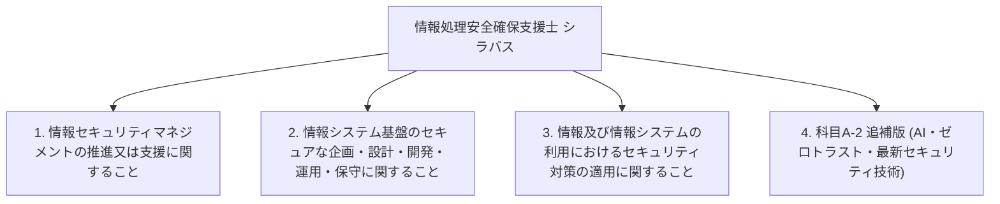

# 情報処理安全確保支援士試験 シラバス詳細（全項目・全用語例 完全網羅版）

出典: [IPA 情報処理安全確保支援士試験 シラバス Ver.2.1 および 追補版 Ver.4.0](https://www.ipa.go.jp/shiken/syllabus/index.html)

本ドキュメントは、IPA公式シラバスに定義されている情報処理安全確保支援士試験（レベル4）の**大分類**、**中分類**、**小分類**、**小分類の目標（概要）**、**要求される知識（詳細）**、**要求される技能（詳細）**、および**シラバスに記載された全用語例・キーワード（漏れなく完全網羅）**を体系的にまとめたものです。

---

## 📑 シラバス構造の全体マップ

---

## 1. 情報セキュリティマネジメントの推進又は支援に関すること

### 1-1. 情報セキュリティ方針の策定
- **大分類**: 1. 情報セキュリティマネジメントの推進又は支援に関すること
- **中分類**: 情報セキュリティマネジメントの推進又は支援
- **小分類**: 1-1 情報セキュリティ方針の策定
- **小分類の目標（概要）**: 経営者による情報セキュリティ方針の策定及び改定について，必要な指導・助言を行い，支援する。
- **要求される知識**:
  - 情報セキュリティガバナンス及び IT ガバナンスに関する知識
  - マネジメントシステム（ISMS，BCMS など）に関する知識
  - 組織マネジメントに関する知識
  - 法令，規制，契約，情報セキュリティに関する動向などによって生じる要求事項に関する知識
- **要求される技能**:
  - 組織内外の利害関係者のニーズと期待，組織内の経営戦略，事業戦略によって生じる要求事項を踏まえて情報セキュリティ方針を具体化する能力
  - 法令，規制，契約，情報セキュリティに関する動向などによって生じる要求事項を踏まえて情報セキュリティ方針を具体化する能力
  - 経営者とコミュニケーションする能力
- **用語例・関連キーワード (全網羅)**:
  - `情報セキュリティガバナンス`, `ITガバナンス`, `ISMS (JIS Q 27001 / ISO/IEC 27001)`, `BCMS (JIS Q 22301 / ISO 22301)`, `情報セキュリティ方針`, `基本方針`, `対策基準`, `実施手順`, `組織マネジメント`, `利害関係者 (ステークホルダー) 要求事項`, `経営戦略`, `事業戦略`, `コンプライアンス`

### 1-2. 情報セキュリティリスクアセスメント
- **大分類**: 1. 情報セキュリティマネジメントの推進又は支援に関すること
- **中分類**: 情報セキュリティマネジメントの推進又は支援
- **小分類**: 1-2 情報セキュリティリスクアセスメント
- **小分類の目標（概要）**: リスク基準の確立及び維持について，必要な指導・助言を行い，支援する。リスク特定，リスク分析，リスク評価のプロセスの実施について，必要な指導・助言を行い，支援する。
- **要求される知識**:
  - 情報の特性（機密性，完全性，可用性，真正性，責任追跡性，否認防止，信頼性など）に関する知識
  - リスク，リスク基準，リスク源，脆弱性及び脅威に関する知識
  - 情報セキュリティリスクアセスメントのプロセス（特定，分析，評価）に関する知識
  - 脅威分析（STRIDE 分析，アタックツリー分析（ATA）など）に関する知識
- **要求される技能**:
  - 情報資産損失の大きさ（失われる資産の価値，原因究明及び復旧の費用，社会的説明の費用）を算定し，評価する能力
  - リスク源，脆弱性及び脅威を，新たな IT に関するものも含めて列挙する能力
  - 情報資産とリスクを関連付けて整理する能力
  - リスクを優先順位付けする能力
- **用語例・キーワード (全網羅)**:
  - `機密性 (Confidentiality)`, `完全性 (Integrity)`, `可用性 (Availability)`, `真正性 (Authenticity)`, `責任追跡性 (Accountability)`, `否認防止 (Non-repudiation)`, `信頼性 (Reliability)`, `リスク基準`, `リスク源`, `脆弱性 (Vulnerability)`, `脅威 (Threat)`, `情報セキュリティリスクアセスメント`, `リスク特定`, `リスク分析`, `リスク評価`, `STRIDE分析 (Spoofing, Tampering, Repudiation, Information Disclosure, Denial of Service, Elevation of Privilege)`, `アタックツリー分析 (ATA: Attack Tree Analysis)`, `リスクマトリクス`, `資産損失評価`

### 1-3. 情報セキュリティリスク対応
- **大分類**: 1. 情報セキュリティマネジメントの推進又は支援に関すること
- **中分類**: 情報セキュリティマネジメントの推進又は支援
- **小分類**: 1-3 情報セキュリティリスク対応
- **小分類の目標（概要）**: 情報セキュリティリスクアセスメントの結果に基づく適切な管理策の選定，情報セキュリティリスク対応計画の策定について，必要な指導・助言を行い，支援する。
- **要求される知識**:
  - リスク対応の選択肢（リスク低減，リスク共有，リスク回避，リスク保有など）に関する知識
  - 管理策の実施に要する費用の算定に関する知識
  - サイバー保険に関する知識
- **要求される技能**:
  - リスクごとに，リスク対応の選択肢を選定する能力
  - リスク対応の実施に適切な管理策を選定する能力
  - 情報セキュリティリスク対応計画を作成し，残留リスクと併せて説明する能力
- **用語例・キーワード (全網羅)**:
  - `リスク対応 (Risk Treatment)`, `リスク低減 (リスク軽減 / Risk Reduction)`, `リスク回避 (Risk Avoidance)`, `リスク共有 (リスク転嫁 / Risk Sharing)`, `リスク保有 (リスク受容 / Risk Acceptance)`, `管理策 (コントロール / Security Controls)`, `残留リスク (Residual Risk)`, `リスク対応計画`, `サイバー保険`, `費用対効果分析`

### 1-4. 情報セキュリティ諸規程の策定及び運用 (ISMS)
- **大分類**: 1. 情報セキュリティマネジメントの推進又は支援に関すること
- **中分類**: 情報セキュリティマネジメントの推進又は支援
- **小分類**: 1-4 情報セキュリティ諸規程の策定
- **小分類の目標（概要）**: 情報セキュリティに関連する諸規程の策定及び改定について，必要な指導・助言を行い，支援する。事業継続に関する計画の策定及び改定について，必要な指導・助言を行い，支援する。
- **要求される知識**:
  - 法令，規制，規格（JIS Q 27001，JIS Q 27002 等）に関する知識
  - ITの動向（クラウドコンピューティング，仮想化，モバイル，組込みシステム，Web技術，AI（生成AIを含む），ビッグデータ，IoTなど）及びその情報セキュリティへの影響に関する知識
  - 事業継続に関する知識（BCP，BCM）
- **要求される技能**:
  - 業務プロセス，業務手順を踏まえた上で，情報セキュリティ諸規程で定めるべき事項を検討する能力
  - 検討した事項及びその必要性を説明する能力
  - 法令，規制，規格の変化やITの動向を踏まえて情報セキュリティ諸規程をレビューする能力
- **用語例・キーワード (全網羅)**:
  - `JIS Q 27001 (ISO/IEC 27001)`, `JIS Q 27002 (ISO/IEC 27002)`, `適用宣言書 (SoA: Statement of Applicability)`, `情報セキュリティ諸規程`, `事業継続計画 (BCP: Business Continuity Plan)`, `事業継続マネジメント (BCM)`, `要塞化 (ハードニング / Hardening)`, `クラウドセキュリティ`, `AI/生成AIセキュリティ`, `IoTセキュリティ`, `モバイルセキュリティ`

### 1-5. 情報セキュリティ監査
- **大分類**: 1. 情報セキュリティマネジメントの推進又は支援に関すること
- **中分類**: 情報セキュリティマネジメントの推進又は支援
- **小分類**: 1-5 情報セキュリティ監査
- **小分類の目標（概要）**: 情報セキュリティ監査及びシステム監査に協力・支援する。監査結果を受けた対象組織による改善計画策定及び改善活動について，必要な指導・助言を行い，支援する。
- **要求される知識**:
  - 情報セキュリティ監査，システム監査，内部監査，業務監査に関する知識
  - 監査のプロセス，関連文書（監査計画書，監査調書，監査報告書など）に関する知識
  - 監査証拠（システム，ネットワークのログなど）に関する知識
- **要求される技能**:
  - 組織が利用しているセキュリティ技術及び導入している情報セキュリティ対策が十分か，並びに適切に実施されているかを評価する能力
  - 事業，業務，情報システム上の制約を考慮した上で，実現可能な管理策を検討し，指導・助言する能力
- **用語例・キーワード (全網羅)**:
  - `情報セキュリティ監査基準`, `情報セキュリティ管理基準`, `システム監査基準`, `保証型監査`, `助言型監査`, `内部監査`, `外部監査`, `監査計画書`, `監査調書`, `監査報告書`, `監査証拠`, `ログ検証`, `改善勧告・フォローアップ`

### 1-6. 情報セキュリティに関する動向・事例の収集と分析
- **大分類**: 1. 情報セキュリティマネジメントの推進又は支援に関すること
- **中分類**: 情報セキュリティマネジメントの推進又は支援
- **小分類**: 1-6 情報セキュリティに関する動向・事例の収集と分析
- **小分類の目標（概要）**: 情報セキュリティに関する事件・事故，傾向と背景，攻撃の手口，脅威，脆弱性及び対策，セキュリティ技術などの情報を収集する。情報セキュリティに関する法令，規制，規格類の制定・改廃や社会通念の変化，コンプライアンス上の新たな課題などについて把握する。収集した各情報について，組織内への影響，対応の緊急性，対応の費用・効果・必要性を分析する。
- **要求される知識**:
  - JIS，ISO，IEC，IEEE，NISTなどのセキュリティ関連の規格の動向に関する知識
  - 業界標準，ガイドラインの動向に関する知識
  - サイバー・フィジカル・セキュリティフレームワーク（CPSF）に関する知識
  - 攻撃の手口に関する知識
  - 攻撃の分析モデル（サイバーキルチェーン，ATT＆CKなど）に関する知識
  - 脅威インテリジェンス（OSINTなど）に関する知識
- **要求される技能**:
  - 国内外の様々な情報源（公的機関，セキュリティ機関，ベンダー，カンファレンス，論文など）から，必要な情報を，適切かつ継続的に収集する能力
  - 収集した情報の信頼性，正確さを検証する能力
  - 収集した情報を整理し，関係者に伝達する能力
  - 収集した情報に関して，組織内への影響などを評価する能力
- **用語例・キーワード (全網羅)**:
  - `JIS`, `ISO/IEC`, `IEEE`, `NIST (SP 800シリーズ)`, `CPSF (サイバー・フィジカル・セキュリティフレームワーク)`, `攻撃手口分析`, `サイバーキルチェーン (Cyber Kill Chain)`, `MITRE ATT&CK (Adversarial Tactics, Techniques, and Common Knowledge)`, `脅威インテリジェンス (Threat Intelligence)`, `OSINT (Open Source Intelligence)`, `情報収集・信頼性評価`, `コンプライアンス課題`

### 1-7. 関係者とのコミュニケーション
- **大分類**: 1. 情報セキュリティマネジメントの推進又は支援に関すること
- **中分類**: 情報セキュリティマネジメントの推進又は支援
- **小分類**: 1-7 関係者とのコミュニケーション
- **小分類の目標（概要）**: 組織内の課題及び必要な対策といった情報セキュリティに関する情報を，経営層ほか組織内の各層に伝達し，コミュニケーションを促進する。組織内の情報システムに影響を及ぼす情報を情報システム部門に伝達し，必要な検討，対応を支援する。外部のセキュリティ機関，情報共有コミュニティ，セキュリティベンダー，警察，監督官庁，顧客などと情報交換を行う。
- **要求される知識**:
  - セキュリティ機関（JPCERT/CC，警察，監督官庁，NISC，IPAなど）に関する知識
  - サイバー情報共有イニシアティブ（J-CSIP），サイバーレスキュー隊（J-CRAT）に関する知識
  - 情報セキュリティ早期警戒パートナーシップに関する知識
- **要求される技能**:
  - 情報セキュリティのコミュニティ，イベントなどに参加し，情報収集，情報交換を行う能力
  - 様々な立場の関係者とコミュニケーションする能力
  - 連絡窓口として，組織内外の情報連携を行う能力
  - ISAC，他のCSIRTなどと情報共有する，及び共有された情報を活用する能力
- **用語例・キーワード (全網羅)**:
  - `JPCERT/CC (Japan Computer Emergency Response Team Coordination Center)`, `NISC (内閣サイバーセキュリティセンター)`, `IPA (情報処理推進機構)`, `J-CSIP (サイバー情報共有イニシアティブ)`, `J-CRAT (サイバーレスキュー隊)`, `情報セキュリティ早期警戒パートナーシップ`, `ISAC (Information Sharing and Analysis Center)`, `CSIRT間情報共有`, `ステークホルダーコミュニケーション`, `エスカレーション`

---

## 2. 情報システム基盤のセキュアな企画・設計・開発・運用・保守に関すること

### 2-1. 企画・要件定義（セキュリティの観点）
- **大分類**: 2. 情報システム基盤のセキュアな企画・設計・開発・運用・保守に関すること
- **中分類**: セキュア基盤の企画・設計・開発・運用・保守
- **小分類**: 2-1 企画・要件定義（セキュリティの観点）
- **小分類の目標（概要）**: 調達又は開発するシステムのニーズ及び制約並びに脅威分析の結果からのセキュリティ要件の定義について，必要な指導・助言を行い，支援する。
- **要求される知識**:
  - セキュリティ要件に関する知識
  - セキュリティバイデザイン，プライバシーバイデザインに関する知識
  - システム及びソフトウェア製品の品質要件（ISO/IEC 25010 等）に関する知識
- **要求される技能**:
  - 調達又は開発するシステムのニーズ及び制約からセキュリティ要件を定義する能力
  - 脅威分析の結果からセキュリティ要件を定義する能力
  - 仕様書をレビューする能力
- **用語例・キーワード (全網羅)**:
  - `セキュリティバイデザイン (Security by Design)`, `プライバシーバイデザイン (Privacy by Design)`, `セキュリティ要件定義`, `機能的要件 / 非機能的要件`, `ISO/IEC 25010 (品質モデル/SQuaRE)`, `脅威分析・モデリング`, `要件定義書レビュー`

### 2-2. 製品・サービスのセキュアな導入
- **大分類**: 2. 情報システム基盤のセキュアな企画・設計・開発・運用・保守に関すること
- **中分類**: セキュア基盤の企画・設計・開発・運用・保守
- **小分類**: 2-2 製品・サービスのセキュアな導入
- **小分類の目標（概要）**: システム全体又はその一部を構成する製品・サービスの調達について，セキュリティの観点から必要な指導・助言を行い，支援する。調達した製品・サービスへのセキュアな設定の実施について，必要な指導・助言を行い，支援する。
- **要求される知識**:
  - 製品・サービスの種類と特徴に関する知識
  - ネットワーク機器，サーバの設定に関する知識
  - 要塞化（ハードニング）に関する知識
  - セキュリティの投資対効果の評価に関する知識
- **要求される技能**:
  - 製品・サービスの仕様書とセキュリティ要件とを照らして，製品・サービスを選定する能力
  - セキュリティの投資対効果を最適化する能力
  - 設定作業手順書をレビューする能力
  - 調達した製品・サービスにセキュアな設定を行う能力
  - 各製品・サービスを組み合わせたシステム全体のセキュリティバランス，運用の実現性を検証する能力
- **用語例・キーワード (全網羅)**:
  - `要塞化 (ハードニング / Hardening)`, `セキュリティ投資対効果 (ROSI: Return on Security Investment)`, `製品・サービス選定基準`, `ネットワーク機器セキュリティ設定`, `サーバー要塞化`, `設定手順書レビュー`, `セキュリティバランス検証`

### 2-3. セキュリティ機能の設計
- **大分類**: 2. 情報システム基盤のセキュアな企画・設計・開発・運用・保守に関すること
- **中分類**: セキュア基盤の企画・設計・開発・運用・保守
- **小分類**: 2-3 セキュリティ機能の設計
- **小分類の目標（概要）**: セキュリティ機能の設計について，必要な指導・助言を行い，支援する。
- **要求される知識**:
  - 最小権限の原則，境界防御，内部対策，層深防御（Defense in Depth）などのセキュリティ設計原則に関する知識
  - 暗号技術（共通鍵暗号，公開鍵暗号，ハッシュ関数，デジタル署名，PKI，暗号プロトコル，暗号利用モード等）に関する知識
  - 認証・アクセスコントロール技術（MFA，SSO，OAuth 2.0，OpenID Connect，FIDO2，RBAC，ABAC等）に関する知識
  - ネットワークセキュリティ技術（TLS 1.3，IPsec，DNSSEC，FW，WAF，IDS/IPS，UTM等）に関する知識
  - データベースセキュリティ技術（DB暗号化，SQLi対策，バインド機構，アクセス監査等）に関する知識
  - ログ出力・監査ログ設計に関する知識
- **要求される技能**:
  - システム要件に基づき，最適なセキュリティ機能およびコンポーネントを設計する能力
  - 最小権限原則および層深防御原則に基づくセキュリティゾーン・アクセス制御設計能力
- **用語例・キーワード (全網羅)**:
  - `最小権限の原則 (Principle of Least Privilege)`, `境界防御`, `内部対策`, `層深防御 (Defense in Depth)`, `暗号技術 (共通鍵AES, 公開鍵RSA/ECC, ハッシュSHA-2/3, HMAC, GCM, PKI, X.509, PFS)`, `認証・アクセス制御 (MFA, TOTP, FIDO2/WebAuthn, SSO, SAML, OAuth 2.0/PKCE, OIDC, RBAC, ABAC)`, `ネットワークセキュリティ (TLS 1.3, IPsec, DNSSEC, FW, WAF, IDS/IPS, UTM, プロキシ)`, `データベースセキュリティ (DB暗号化/TDE, バインドメカニズム/プレースホルダ, DB監査ログ)`

### 2-4. セキュアプログラミング
- **大分類**: 2. 情報システム基盤のセキュアな企画・設計・開発・運用・保守に関すること
- **中分類**: セキュア基盤の企画・設計・開発・運用・保守
- **小分類**: 2-4 セキュアプログラミング
- **小分類の目標（概要）**: ソフトウェア脆弱性の発生を防ぐためのセキュアなコーディング規約の策定，および実装コードのレビュー・修正について指導・支援する。
- **要求される知識**:
  - 主要なWebアプリケーション脆弱性（XSS，SQLインジェクション，CSRF，OSコマンドインジェクション，SSRF，ディレクトリトラバーサル，インセキュアデシリアライゼーション等）のメカニズムと対策知識
  - 入力検証（入力バリデーション・サニタイズ），出力エスケープ（HTMLエスケープ等）に関する知識
  - セッション管理（セッションIDのランダム性，再発行，Cookie属性: Secure, HttpOnly, SameSite）に関する知識
- **要求される技能**:
  - ソースコードレビューを行い，脆弱性箇所を特定・指摘する能力
  - プレペアドステートメント，エスケープ処理，CSRFトークン，安全なCookie設定を用いた脆弱性修正コードを作成する能力
- **用語例・キーワード (全網羅)**:
  - `XSS (Cross-Site Scripting / エスケープ処理, CSPヘッダ)`, `SQLインジェクション (プレペアドステートメント / バインド機構)`, `CSRF (Cross-Site Request Forgery / CSRFトークン, SameSite属性)`, `OSコマンド・インジェクション (言語組み込み関数利用)`, `SSRF (Server-Side Request Forgery / ホワイトリスト検証)`, `ディレクトリトラバーサル`, `Cookie属性 (Secure, HttpOnly, SameSite)`, `セッション固定攻撃対策 (ログイン時セッションID再発行)`, `入力バリデーション`, `出力エスケープ`

### 2-5. マルウェア対策・エンドポイントセキュリティ
- **大分類**: 2. 情報システム基盤のセキュアな企画・設計・開発・運用・保守に関すること
- **中分類**: セキュア基盤の企画・設計・開発・運用・保守
- **小分類**: 2-5 マルウェア対策・エンドポイントセキュリティ
- **小分類の目標（概要）**: マルウェア感染リスクの低減，検知，および発生時のエンドポイント隔離・対応技術の導入を支援する。
- **要求される知識**:
  - EPP（Endpoint Protection Platform），EDR（Endpoint Detection and Response）に関する知識
  - サンドボックス，マルウェア解析（静的解析・動的解析）に関する知識
  - マルウェアの種類（ランサムウェア，RAT，ボット，トロイの木馬，ワーム等）と侵入手法に関する知識
  - IOC（Indicator of Compromise），YARAルールに関する知識
- **要求される技能**:
  - EPP/EDRの検知アラートを収集し，マルウェアの感染経路・拡散範囲を分析する能力
  - 感染端末のネットワーク即座隔離および対応指示を行う能力
- **用語例・キーワード (全網羅)**:
  - `EPP (Endpoint Protection Platform)`, `EDR (Endpoint Detection and Response)`, `サンドボックス`, `静的解析 / 動的解析`, `ランサムウェア`, `RAT (Remote Access Trojan)`, `ボットネット`, `IOC (Indicator of Compromise)`, `YARAルール`, `端末ネットワーク隔離`

### 2-6. 脆弱性管理・検査
- **大分類**: 2. 情報システム基盤のセキュアな企画・設計・開発・運用・保守に関すること
- **中分類**: セキュア基盤の企画・設計・開発・運用・保守
- **小分類**: 2-6 脆弱性管理・検査
- **小分類の目標（概要）**: 脆弱性情報の継続的収集，脆弱性診断（プラットフォーム診断／Web診断），パッチ適用評価およびリスク管理を推進・支援する。
- **要求される知識**:
  - 共通脆弱性識別子（CVE），日本脆弱性情報データベース（JVN），共通脆弱性評価システム（CVSS v2/v3/v4）に関する知識
  - 脆弱性スキャナ，ペネトレーションテストに関する知識
  - バグバウンティプログラムに関する知識
- **要求される技能**:
  - CVSSスコア（基本値・現状値・環境値）に基づきパッチ適用の優先度を判断・設計する能力
  - 脆弱性診断結果レポートを評価し，具体的な改修計画を立案する能力
- **用語例・キーワード (全網羅)**:
  - `CVE (Common Vulnerabilities and Exposures)`, `JVN (Japan Vulnerability Notes)`, `CVSS (Common Vulnerability Scoring System / 基本値, 現状値, 環境値)`, `脆弱性スキャナ`, `プラットフォーム脆弱性診断`, `Webアプリケーション脆弱性診断`, `ペネトレーションテスト`, `バグバウンティ (Bug Bounty)`

### 2-7. システム運用・保守におけるセキュリティ管理
- **大分類**: 2. 情報システム基盤のセキュアな企画・設計・開発・運用・保守に関すること
- **中分類**: セキュア基盤の企画・設計・開発・運用・保守
- **小分類**: 2-7 システム運用・保守におけるセキュリティ管理
- **小分類の目標（概要）**: 特権アクセス管理，変更管理，ログ集中管理およびSIEM/SOARを活用した運用セキュリティを支援する。
- **要求される知識**:
  - 特権アクセス管理（PAM: Privileged Access Management）に関する知識
  - SIEM（Security Information and Event Management），SOAR（Security Orchestration, Automation and Response）に関する知識
  - ログアーカイビング・改ざん防止技術に関する知識
  - 変更管理・構成管理プロセスに関する知識
- **要求される技能**:
  - ログの集中相関分析による異変検知ルールを設計する能力
  - 特権IDの発行・承認・監視ワークフローを確立する能力
- **用語例・キーワード (全網羅)**:
  - `特権アクセス管理 (PAM)`, `SIEM (Security Information and Event Management)`, `SOAR (Security Orchestration, Automation and Response)`, `ログ相関分析`, `ログ改ざん防止`, `変更管理プロセス`, `構成管理`

---

## 3. 情報及び情報システムの利用におけるセキュリティ対策の適用に関すること

### 3-1. クラウドサービスのセキュアな利用
- **大分類**: 3. 情報及び情報システムの利用におけるセキュリティ対策の適用に関すること
- **中分類**: 利用におけるセキュリティ対策の適用
- **小分類**: 3-1 クラウドサービスのセキュアな利用
- **小分類の目標（概要）**: クラウドサービス（IaaS，PaaS，SaaS）の導入・運用における責任共有モデル，セキュリティ設定管理（CSPM），アクセス監視（CASB）の適用を支援する。
- **要求される知識**:
  - 責任共有モデル（Shared Responsibility Model）に関する知識
  - CSPM（Cloud Security Posture Management），CASB（Cloud Access Security Broker），CWPP（Cloud Workload Protection Platform）に関する知識
  - 政府情報システムためのセキュリティ評価制度（ISMAP）に関する知識
  - クラウドストレージ（S3バケット等）のアクセスコントロール・設定不備に関する知識
- **要求される技能**:
  - クラウド管理コンソールのセキュリティ設定診断およびパブリック公開誤設定の検知・修正能力
  - 責任共有モデルに基づく顧客側のセキュリティ管理範囲の定義能力
- **用語例・キーワード (全網羅)**:
  - `責任共有モデル (Shared Responsibility Model)`, `CSPM (Cloud Security Posture Management)`, `CASB (Cloud Access Security Broker)`, `CWPP (Cloud Workload Protection Platform)`, `ISMAP (政府情報システムのためのセキュリティ評価制度)`, `クラウドIAMポリシー`, `クラウドストレージ設定誤設定 (S3パブリックバケット漏洩)`

### 3-2. モバイル機器・テレワークのセキュアな利用
- **大分類**: 3. 情報及び情報システムの利用におけるセキュリティ対策の適用に関すること
- **中分類**: 利用におけるセキュリティ対策の適用
- **小分類**: 3-2 モバイル機器・テレワークのセキュアな利用
- **小分類の目標（概要）**: テレワーク環境，BYOD，モバイル端末利用における情報漏洩防止・端末統合管理を支援する。
- **要求される知識**:
  - BYOD（Bring Your Own Device）に関する知識
  - MDM（Mobile Device Management），MAM（Mobile Application Management），EMM（Enterprise Mobility Management）に関する知識
  - ZTNA（Zero Trust Network Access），VPN，リモートデスクトップに関する知識
  - モバイル端末暗号化・リモートワイプに関する知識
- **要求される技能**:
  - テレワーク環境のセキュリティガイドライン策定・評価能力
  - 端末紛失・盗難発生時のリモートワイプ・ロック運用能力
- **用語例・キーワード (全網羅)**:
  - `BYOD (Bring Your Own Device)`, `MDM (Mobile Device Management)`, `MAM (Mobile Application Management)`, `EMM (Enterprise Mobility Management)`, `ZTNA (Zero Trust Network Access)`, `VPN`, `リモートデスクトップ`, `端末ストレージ全データ暗号化`, `リモートワイプ / リモートロック`

### 3-3. 制御システム・IoT機器のセキュアな利用
- **大分類**: 3. 情報及び情報システムの利用におけるセキュリティ対策の適用に関すること
- **中分類**: 利用におけるセキュリティ対策の適用
- **小分類**: 3-3 制御システム・IoT機器のセキュアな利用
- **小分類の目標（概要）**: 制御システム（OT/ICS）および IoT 機器特有のセキュリティ設計・ネットワーク分離・ファームウェアアップデート運用を支援する。
- **要求される知識**:
  - 制御システムセキュリティ規格（IEC 62443 等）に関する知識
  - IoTセキュリティガイドラインに関する知識
  - セキュアブート，OTA（Over-The-Air）ファームウェアアップデートに関する知識
  - IT/OT ネットワーク結合境界のセキュリティ設計に関する知識
- **要求される技能**:
  - 制御システム・IoTネットワークの境界セグメンテーション設計能力
  - IoTファームウェア改ざん検知および安全な更新メカニズム設計能力
- **用語例・キーワード (全網羅)**:
  - `OT / ICSセキュリティ (IEC 62443)`, `IoTセキュリティガイドライン`, `セキュアブート`, `OTA (Over-The-Air) ファームウェアアップデート`, `IT/OT接続境界セグメンテーション`, `IoTファームウェア改ざん防止`

---

## 4. 科目A-2 追補版 (AI・ゼロトラスト・最新セキュリティ技術)

### 4-1. AI関連技術とセキュリティ
- **大分類**: 4. 科目A-2 追補版 (AI・ゼロトラスト・最新セキュリティ技術)
- **中分類**: 科目A-2 追補領域
- **小分類**: 4-1 AI関連技術とセキュリティ
- **小分類の目標（概要）**: 生成AI，大規模言語モデル（LLM）の導入に伴う新たなセキュリティ脅威の分析，ガバナンス策定，および入力・出力安全設計を支援する。
- **要求される知識**:
  - 生成AI，LLM（Large Language Model）に関する知識
  - プロンプトインジェクション（直接的プロンプト注入，間接的プロンプト注入）に関する知識
  - データ汚染（Data Poisoning），モデル抽出攻撃（Model Extraction）に関する知識
  - AI事業者ガイドライン，OWASP Top 10 for LLM Applications に関する知識
- **要求される技能**:
  - LLM利用時のプロンプト入力フィルタリングおよび出力コンテンツのセキュリティ検証設計能力
  - 機械学習学習データへの機密情報混入防止・ガバナンス設計能力
- **用語例・キーワード (全網羅)**:
  - `生成AI (Generative AI)`, `LLM (Large Language Model)`, `プロンプトインジェクション (直接的プロンプト注入 / 間接的プロンプト注入)`, `データ汚染 (Data Poisoning)`, `モデル抽出攻撃 (Model Extraction Attack)`, `AI事業者ガイドライン`, `OWASP Top 10 for LLM Applications`

### 4-2. ゼロトラストアーキテクチャ
- **大分類**: 4. 科目A-2 追補版 (AI・ゼロトラスト・最新セキュリティ技術)
- **中分類**: 科目A-2 追補領域
- **小分類**: 4-2 ゼロトラストアーキテクチャ
- **小分類の目標（概要）**: NIST SP 800-207 に基づくゼロトラスト原則（アイデンティティ中心アクセス制御，継続的認証・評価，マイクロセグメンテーション）の設計・評価を支援する。
- **要求される知識**:
  - NIST SP 800-207（ゼロトラスト・アーキテクチャ）に関する知識
  - ゼロトラストの基本7原則に関する知識
  - PDP（Policy Decision Point），PEP（Policy Enforcement Point），SDP（Software-Defined Perimeter）に関する知識
  - Device Trust（端末健全性判定）に関する知識
- **要求される技能**:
  - アイデンティティ，アクセスコンテキスト，端末健全性に基づく動的アクセス制御ポリシー設計能力
  - ネットワーク内でのマイクロセグメンテーション適用設計能力
- **用語例・キーワード (全網羅)**:
  - `NIST SP 800-207`, `ゼロトラスト基本7原則`, `PDP (Policy Decision Point)`, `PEP (Policy Enforcement Point)`, `SDP (Software-Defined Perimeter)`, `Device Trust (端末健全性評価)`, `マイクロセグメンテーション (Micro-segmentation)`, `アイデンティティ中心アクセス制御`

### 4-3. サプライチェーンセキュリティ
- **大分類**: 4. 科目A-2 追補版 (AI・ゼロトラスト・最新セキュリティ技術)
- **中分類**: 科目A-2 追補領域
- **小分類**: 4-3 サプライチェーンセキュリティ
- **小分類の目標（概要）**: ソフトウェアサプライチェーンにおける依存関係リスク，SBOMの管理，およびサードパーティ（委託先）リスク監査を支援する。
- **要求される知識**:
  - SBOM（Software Bill of Materials / SPDX，CycloneDX フォーマット）に関する知識
  - ソフトウェアサプライチェーン攻撃，依存関係脆弱性（Dependency Vulnerability）に関する知識
  - サードパーティリスクマネジメント（TPRM: Third-Party Risk Management）に関する知識
  - コード署名（Code Signing）に関する知識
- **要求される技能**:
  - CI/CD パイプラインにおける依存関係脆弱性の自動検出および SBOM 生成・検証能力
  - 委託先・サプライヤーのセキュリティ体制審査および監査基準設計能力
- **用語例・キーワード (全網羅)**:
  - `SBOM (Software Bill of Materials / SPDX, CycloneDX)`, `ソフトウェアサプライチェーン攻撃`, `依存関係脆弱性 (Dependency Vulnerability)`, `サードパーティリスクマネジメント (TPRM)`, `コード署名 (Code Signing)`, `CI/CDパイプライン自動セキュリティ検証`
