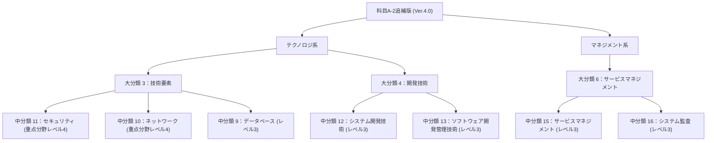

# 情報処理安全確保支援士試験シラバス追補版 (科目A-2) 詳細（公式大分類・中分類・小分類・細目番号完全準拠版）

出典: [IPA情報処理安全確保支援士試験シラバス追補版（科目A-2）Ver.4.0](https://www.ipa.go.jp/shiken/syllabus/index.html)

本ドキュメントは、IPA公式の「シラバス追補版（科目A-2）Ver.4.0」に定義されている**共通キャリア・スキルフレームワーク（BOK体系）**に基づき、テクノロジ系・マネジメント系の**大分類**、**中分類**、**小分類**、**小分類内の細目番号（ (1), (2)... ①, ②... ）**、**学習目標**、**具体的内容**、および**全用語例・キーワード**を**IPA公式の番号・構成と1対1で完全一致**させて網羅した公式準拠ドキュメントです。

---

## 📑 科目A-2追補版階層マップ

---

# 🌐 テクノロジ系

## 📌 大分類 3：技術要素

### 🗂 中分類 11：セキュリティ（重点分野 技術レベル 4）

#### 🔹 1. 情報セキュリティ

**【学習目標】**
情報セキュリティの目的，考え方，重要性を修得し，高度に応用する。
情報資産に対する脅威，脆弱性と主な攻撃手法の種類を修得し，高度に応用する。
情報セキュリティに関する技術の種類，仕組み，特徴，その技術を使用すること
で，どのような脅威を防止できるかを修得し，高度に応用する。

##### （1）情報セキュリティの目的と考え方

情報の機密性（Confidentiality）
，完全性（Integrity），可用性（Availability）を確保，
維持することによって，様々な脅威から情報システム及び情報を保護し，情報システムの信
頼性を高めることを理解する。
  - **用語例・キーワード (全網羅)**:
    [`機密性（Confidentiality）`](glossary/syllabus_tsuiho_ver4_0.md#機密性（confidentiality）), [`完全性（Integrity）`](glossary/syllabus_tsuiho_ver4_0.md#完全性（integrity）), [`可用性（Availability）`](glossary/syllabus_tsuiho_ver4_0.md#可用性（availability）), [`真正性（Authenticity）`](glossary/syllabus_tsuiho_ver4_0.md#真正性（authenticity）), [`責任追跡性（Accountability）`](glossary/syllabus_tsuiho_ver4_0.md#責任追跡性（accountability）), [`否認防止（NonRepudiation）`](glossary/syllabus_tsuiho_ver4_0.md#否認防止（nonrepudiation）), [`信頼性（Reliability）`](glossary/syllabus_tsuiho_ver4_0.md#信頼性（reliability）), [`多層防御`](glossary/syllabus_tsuiho_ver4_0.md#多層防御), [`セキュリティバイデザイン（セキュアバイデザイン）`](glossary/syllabus_tsuiho_ver4_0.md#セキュリティバイデザイン（セキュアバイデザイン）), [`プライバシーバイデザイン`](glossary/syllabus_tsuiho_ver4_0.md#プライバシーバイデザイン)

##### （2）情報セキュリティの重要性

社会のネットワーク化に伴い，企業にとって情報セキュリティの水準の高さが企業評価の
向上につながること，情報システム関連の事故が事業の存続を脅かす可能性があることから，
情報セキュリティの重要性を理解する。
  - **用語例・キーワード (全網羅)**:
    [`情報資産`](glossary/syllabus_tsuiho_ver4_0.md#情報資産), [`脅威`](glossary/syllabus_tsuiho_ver4_0.md#脅威), [`脆弱性`](glossary/syllabus_tsuiho_ver4_0.md#脆弱性), [`サイバー攻撃`](glossary/syllabus_tsuiho_ver4_0.md#サイバー攻撃)

##### （3）脅威

###### ① 脅威の種類

情報資産に対する様々な脅威を理解する。
  - **用語例・キーワード (全網羅)**:
    [`事故`](glossary/syllabus_tsuiho_ver4_0.md#事故), [`災害`](glossary/syllabus_tsuiho_ver4_0.md#災害), [`故障`](glossary/syllabus_tsuiho_ver4_0.md#故障), [`破壊`](glossary/syllabus_tsuiho_ver4_0.md#破壊), [`盗難`](glossary/syllabus_tsuiho_ver4_0.md#盗難), [`侵入`](glossary/syllabus_tsuiho_ver4_0.md#侵入), [`不正アクセス`](glossary/syllabus_tsuiho_ver4_0.md#不正アクセス), [`盗聴`](glossary/syllabus_tsuiho_ver4_0.md#盗聴), [`なりすまし`](glossary/syllabus_tsuiho_ver4_0.md#なりすまし), [`改ざん`](glossary/syllabus_tsuiho_ver4_0.md#改ざん), [`エラー`](glossary/syllabus_tsuiho_ver4_0.md#エラー), [`クラッキング`](glossary/syllabus_tsuiho_ver4_0.md#クラッキング), [`ビジネスメール詐欺（BEC）`](glossary/syllabus_tsuiho_ver4_0.md#ビジネスメール詐欺（bec）), [`権限昇格`](glossary/syllabus_tsuiho_ver4_0.md#権限昇格), [`誤操作`](glossary/syllabus_tsuiho_ver4_0.md#誤操作), [`アクセス権の誤設定`](glossary/syllabus_tsuiho_ver4_0.md#アクセス権の誤設定), [`紛失`](glossary/syllabus_tsuiho_ver4_0.md#紛失), [`破損`](glossary/syllabus_tsuiho_ver4_0.md#破損), [`盗み見`](glossary/syllabus_tsuiho_ver4_0.md#盗み見), [`不正利用`](glossary/syllabus_tsuiho_ver4_0.md#不正利用), [`ソーシャルエンジニアリング`](glossary/syllabus_tsuiho_ver4_0.md#ソーシャルエンジニアリング), [`情報漏えい`](glossary/syllabus_tsuiho_ver4_0.md#情報漏えい), [`故意`](glossary/syllabus_tsuiho_ver4_0.md#故意), [`過失`](glossary/syllabus_tsuiho_ver4_0.md#過失), [`誤謬`](glossary/syllabus_tsuiho_ver4_0.md#誤謬), [`内部不正`](glossary/syllabus_tsuiho_ver4_0.md#内部不正), [`妨害行為`](glossary/syllabus_tsuiho_ver4_0.md#妨害行為), [`SNSの悪用`](glossary/syllabus_tsuiho_ver4_0.md#snsの悪用), [`踏み台`](glossary/syllabus_tsuiho_ver4_0.md#踏み台), [`迷惑メール（スパム）`](glossary/syllabus_tsuiho_ver4_0.md#迷惑メール（スパム）), [`AIに対する脅威`](glossary/syllabus_tsuiho_ver4_0.md#aiに対する脅威), [`攻撃ベクトル（Attack Vector）`](glossary/syllabus_tsuiho_ver4_0.md#攻撃ベクトル（attack-vector）), [`攻撃対象領域（アタックサーフェス：Attack Surface）`](glossary/syllabus_tsuiho_ver4_0.md#攻撃対象領域（アタックサーフェスattack-surface）)

###### ② マルウェア・不正プログラム

マルウェア・不正プログラムの種類とその振る舞いを理解する。
  - **用語例・キーワード (全網羅)**:
    [`コンピュータウイルス`](glossary/syllabus_tsuiho_ver4_0.md#コンピュータウイルス), [`マクロウイルス`](glossary/syllabus_tsuiho_ver4_0.md#マクロウイルス), [`ワーム`](glossary/syllabus_tsuiho_ver4_0.md#ワーム), [`ボット（ボットネット）`](glossary/syllabus_tsuiho_ver4_0.md#ボット（ボットネット）), [`コネクトバック`](glossary/syllabus_tsuiho_ver4_0.md#コネクトバック), [`リバースシェル`](glossary/syllabus_tsuiho_ver4_0.md#リバースシェル), [`トロイの木馬`](glossary/syllabus_tsuiho_ver4_0.md#トロイの木馬), [`スパイウェア`](glossary/syllabus_tsuiho_ver4_0.md#スパイウェア), [`ランサムウェア`](glossary/syllabus_tsuiho_ver4_0.md#ランサムウェア), [`キーロガー`](glossary/syllabus_tsuiho_ver4_0.md#キーロガー), [`ルートキット`](glossary/syllabus_tsuiho_ver4_0.md#ルートキット), [`バックドア`](glossary/syllabus_tsuiho_ver4_0.md#バックドア), [`ステルス技術（ポリモーフィック型）`](glossary/syllabus_tsuiho_ver4_0.md#ステルス技術（ポリモーフィック型）)

##### （4）脆弱性

情報システムの情報セキュリティに関する欠陥，行動規範・職務分掌の組織での未整備，
従業員への不徹底などの脆弱性を理解する。
  - **用語例・キーワード (全網羅)**:
    [`バグ`](glossary/syllabus_tsuiho_ver4_0.md#バグ), [`セキュリティホール`](glossary/syllabus_tsuiho_ver4_0.md#セキュリティホール), [`人的脆弱性`](glossary/syllabus_tsuiho_ver4_0.md#人的脆弱性), [`内部統制の不備`](glossary/syllabus_tsuiho_ver4_0.md#内部統制の不備), [`シャドーIT`](glossary/syllabus_tsuiho_ver4_0.md#シャドーit), [`バッファエラー`](glossary/syllabus_tsuiho_ver4_0.md#バッファエラー), [`認可・権限・アクセス制御の不備`](glossary/syllabus_tsuiho_ver4_0.md#認可権限アクセス制御の不備), [`不適切な入力確認`](glossary/syllabus_tsuiho_ver4_0.md#不適切な入力確認), [`パスワードのハードコード`](glossary/syllabus_tsuiho_ver4_0.md#パスワードのハードコード), [`認証の欠如`](glossary/syllabus_tsuiho_ver4_0.md#認証の欠如), [`重要情報の平文での保存・送信`](glossary/syllabus_tsuiho_ver4_0.md#重要情報の平文での保存送信), [`レースコンディション`](glossary/syllabus_tsuiho_ver4_0.md#レースコンディション), [`OWASP Top 10`](glossary/syllabus_tsuiho_ver4_0.md#owasp-top-10)

##### （5）不正のメカニズム

不正行為が発生する要因，内部不正による情報セキュリティ事故・事件の発生を防止する
ための環境整備の考え方を理解する。
  - **用語例・キーワード (全網羅)**:
    [`不正のトライアングル（機会）`](glossary/syllabus_tsuiho_ver4_0.md#不正のトライアングル（機会）), [`状況的犯罪予防`](glossary/syllabus_tsuiho_ver4_0.md#状況的犯罪予防), [`割れ窓理論`](glossary/syllabus_tsuiho_ver4_0.md#割れ窓理論), [`防犯環境設計`](glossary/syllabus_tsuiho_ver4_0.md#防犯環境設計)

##### （6）攻撃者の種類，攻撃の動機

悪意をもった攻撃者の種類，及び攻撃者が不正・犯罪・攻撃を行う主な動機，流れ，パタ
ーンを理解する。
  - **用語例・キーワード (全網羅)**:
    [`スクリプトキディ`](glossary/syllabus_tsuiho_ver4_0.md#スクリプトキディ), [`ボットハーダー`](glossary/syllabus_tsuiho_ver4_0.md#ボットハーダー), [`内部犯`](glossary/syllabus_tsuiho_ver4_0.md#内部犯), [`愉快犯`](glossary/syllabus_tsuiho_ver4_0.md#愉快犯), [`詐欺犯`](glossary/syllabus_tsuiho_ver4_0.md#詐欺犯), [`故意犯`](glossary/syllabus_tsuiho_ver4_0.md#故意犯), [`ダークウェブ`](glossary/syllabus_tsuiho_ver4_0.md#ダークウェブ), [`金銭奪取`](glossary/syllabus_tsuiho_ver4_0.md#金銭奪取), [`二重脅迫（ダブルエクストーション）`](glossary/syllabus_tsuiho_ver4_0.md#二重脅迫（ダブルエクストーション）), [`ハクティビズム`](glossary/syllabus_tsuiho_ver4_0.md#ハクティビズム), [`サイバーテロリズム`](glossary/syllabus_tsuiho_ver4_0.md#サイバーテロリズム), [`リークサイト`](glossary/syllabus_tsuiho_ver4_0.md#リークサイト), [`脅威モデリング`](glossary/syllabus_tsuiho_ver4_0.md#脅威モデリング), [`サイバーキルチェーン`](glossary/syllabus_tsuiho_ver4_0.md#サイバーキルチェーン), [`MITRE ATT&CK`](glossary/syllabus_tsuiho_ver4_0.md#mitre-attck), [`MITRE CAPEC（Common Attack Pattern Enumeration and Classification）`](glossary/syllabus_tsuiho_ver4_0.md#mitre-capec（common-attack-pattern-enumeration-and-classification）)

##### （7）攻撃手法

情報システム，組織及び個人への不正な行為と手法を理解する。
  - **用語例・キーワード (全網羅)**:
    [`辞書攻撃`](glossary/syllabus_tsuiho_ver4_0.md#辞書攻撃), [`総当たり（ブルートフォース）攻撃`](glossary/syllabus_tsuiho_ver4_0.md#総当たり（ブルートフォース）攻撃), [`リバースブルートフォース攻撃`](glossary/syllabus_tsuiho_ver4_0.md#リバースブルートフォース攻撃), [`レインボーテーブル攻撃`](glossary/syllabus_tsuiho_ver4_0.md#レインボーテーブル攻撃), [`パスワードリスト攻撃（クレデンシャルスタッフィング）・クロスサイトスクリプティング（反射型）`](glossary/syllabus_tsuiho_ver4_0.md#パスワードリスト攻撃（クレデンシャルスタッフィング）クロスサイトスクリプティング（反射型）), [`クロスサイトリクエストフォージェリ`](glossary/syllabus_tsuiho_ver4_0.md#クロスサイトリクエストフォージェリ), [`クリックジャッキング`](glossary/syllabus_tsuiho_ver4_0.md#クリックジャッキング), [`ドライブバイダウンロード`](glossary/syllabus_tsuiho_ver4_0.md#ドライブバイダウンロード), [`SQLインジェクション`](glossary/syllabus_tsuiho_ver4_0.md#sqlインジェクション), [`HTTPヘッダインジェクション`](glossary/syllabus_tsuiho_ver4_0.md#httpヘッダインジェクション), [`OSコマンドインジェクション`](glossary/syllabus_tsuiho_ver4_0.md#osコマンドインジェクション), [`ディレクトリトラバーサル`](glossary/syllabus_tsuiho_ver4_0.md#ディレクトリトラバーサル), [`バッファオーバーフロー`](glossary/syllabus_tsuiho_ver4_0.md#バッファオーバーフロー), [`オープンリダイレクトの悪用・中間者（Man-in-the-middle）攻撃`](glossary/syllabus_tsuiho_ver4_0.md#オープンリダイレクトの悪用中間者（man-in-the-middle）攻撃), [`MITB（Man-in-the-browser）攻撃`](glossary/syllabus_tsuiho_ver4_0.md#mitb（man-in-the-browser）攻撃), [`第三者中継（オープンリレー）`](glossary/syllabus_tsuiho_ver4_0.md#第三者中継（オープンリレー）), [`IPスプーフィング`](glossary/syllabus_tsuiho_ver4_0.md#ipスプーフィング), [`DNSキャッシュポイズニング`](glossary/syllabus_tsuiho_ver4_0.md#dnsキャッシュポイズニング), [`フィッシング（スミッシング）`](glossary/syllabus_tsuiho_ver4_0.md#フィッシング（スミッシング）)

##### （8）情報セキュリティに関する技術

###### ① 暗号技術

脅威を防止するために用いられる暗号技術の活用を理解する。また，暗号化の種類，代
表的な暗号方式の仕組み，特徴を理解する。
  - **用語例・キーワード (全網羅)**:
    [`CRYPTREC暗号リスト`](glossary/syllabus_tsuiho_ver4_0.md#cryptrec暗号リスト), [`暗号方式（暗号化（暗号鍵））`](glossary/syllabus_tsuiho_ver4_0.md#暗号方式（暗号化（暗号鍵））), [`RSA暗号`](glossary/syllabus_tsuiho_ver4_0.md#rsa暗号), [`楕円曲線暗号（ECDSA）`](glossary/syllabus_tsuiho_ver4_0.md#楕円曲線暗号（ecdsa）), [`鍵共有`](glossary/syllabus_tsuiho_ver4_0.md#鍵共有), [`Diffie-Hellman（DH）鍵共有方式`](glossary/syllabus_tsuiho_ver4_0.md#diffie-hellman（dh）鍵共有方式), [`前方秘匿性（PFS ： Perfect Forward Secrecy）`](glossary/syllabus_tsuiho_ver4_0.md#前方秘匿性（pfs--perfect-forward-secrecy）), [`ハイブリッド暗号`](glossary/syllabus_tsuiho_ver4_0.md#ハイブリッド暗号), [`認証暗号（認証付き暗号）`](glossary/syllabus_tsuiho_ver4_0.md#認証暗号（認証付き暗号）), [`秘密分散（電子割符）`](glossary/syllabus_tsuiho_ver4_0.md#秘密分散（電子割符）), [`秘密計算（秘密分散方式）`](glossary/syllabus_tsuiho_ver4_0.md#秘密計算（秘密分散方式）), [`量子暗号`](glossary/syllabus_tsuiho_ver4_0.md#量子暗号), [`耐量子暗号（PQC（Post Quantum Cryptography：耐量子計算機暗号））`](glossary/syllabus_tsuiho_ver4_0.md#耐量子暗号（pqc（post-quantum-cryptography耐量子計算機暗号））)

###### ② 認証技術

認証の種類，仕組み，特徴，脅威を防止するためにどのような認証技術が用いられるか，
認証技術が何を証明するかを理解する。
  - **用語例・キーワード (全網羅)**:
    [`デジタル署名（署名鍵）`](glossary/syllabus_tsuiho_ver4_0.md#デジタル署名（署名鍵）), [`XMLデジタル署名`](glossary/syllabus_tsuiho_ver4_0.md#xmlデジタル署名), [`ブラインド署名`](glossary/syllabus_tsuiho_ver4_0.md#ブラインド署名), [`グループ署名`](glossary/syllabus_tsuiho_ver4_0.md#グループ署名), [`トランザクション署名`](glossary/syllabus_tsuiho_ver4_0.md#トランザクション署名), [`タイムスタンプ（時刻認証）`](glossary/syllabus_tsuiho_ver4_0.md#タイムスタンプ（時刻認証）), [`メッセージダイジェスト`](glossary/syllabus_tsuiho_ver4_0.md#メッセージダイジェスト), [`メッセージ認証`](glossary/syllabus_tsuiho_ver4_0.md#メッセージ認証), [`MAC（Message Authentication Code：メッセージ認証符号）`](glossary/syllabus_tsuiho_ver4_0.md#mac（message-authentication-codeメッセージ認証符号）), [`HMAC`](glossary/syllabus_tsuiho_ver4_0.md#hmac), [`CMAC`](glossary/syllabus_tsuiho_ver4_0.md#cmac), [`フィンガプリント`](glossary/syllabus_tsuiho_ver4_0.md#フィンガプリント), [`チャレンジレスポンス認証`](glossary/syllabus_tsuiho_ver4_0.md#チャレンジレスポンス認証), [`リスクベース認証`](glossary/syllabus_tsuiho_ver4_0.md#リスクベース認証), [`コードサイニング`](glossary/syllabus_tsuiho_ver4_0.md#コードサイニング), [`エンティティ認証`](glossary/syllabus_tsuiho_ver4_0.md#エンティティ認証)

###### ③ 利用者認証

利用者認証のために利用される技術の種類，仕組み，特徴を理解する。
  - **用語例・キーワード (全網羅)**:
    [`ログイン（利用者 IDとパスワード）`](glossary/syllabus_tsuiho_ver4_0.md#ログイン（利用者-idとパスワード）), [`アクセス管理`](glossary/syllabus_tsuiho_ver4_0.md#アクセス管理), [`ICカード`](glossary/syllabus_tsuiho_ver4_0.md#icカード), [`PINコード`](glossary/syllabus_tsuiho_ver4_0.md#pinコード), [`Kerberos方式`](glossary/syllabus_tsuiho_ver4_0.md#kerberos方式), [`LDAPサーバでの認証`](glossary/syllabus_tsuiho_ver4_0.md#ldapサーバでの認証), [`ワンタイムパスワード`](glossary/syllabus_tsuiho_ver4_0.md#ワンタイムパスワード), [`多要素認証（記憶）`](glossary/syllabus_tsuiho_ver4_0.md#多要素認証（記憶）), [`多段階認証`](glossary/syllabus_tsuiho_ver4_0.md#多段階認証), [`パスワードレス認証（FIDO UAF）`](glossary/syllabus_tsuiho_ver4_0.md#パスワードレス認証（fido-uaf）), [`EMV 3-Dセキュア（3Dセキュア 2.0）`](glossary/syllabus_tsuiho_ver4_0.md#emv-3-dセキュア（3dセキュア-20）), [`アイデンティティ連携（OpenID Connect）`](glossary/syllabus_tsuiho_ver4_0.md#アイデンティティ連携（openid-connect）), [`IdP（Identity Provider）`](glossary/syllabus_tsuiho_ver4_0.md#idp（identity-provider）), [`IDaaS（Identity as a Service）`](glossary/syllabus_tsuiho_ver4_0.md#idaas（identity-as-a-service）), [`シングルサインオン`](glossary/syllabus_tsuiho_ver4_0.md#シングルサインオン), [`CAPTCHA`](glossary/syllabus_tsuiho_ver4_0.md#captcha), [`AAA（認証）`](glossary/syllabus_tsuiho_ver4_0.md#aaa（認証）), [`eKYC（electronic Know Your Customer）`](glossary/syllabus_tsuiho_ver4_0.md#ekyc（electronic-know-your-customer）)

###### ④ 生体認証技術

利用者確認に利用される技術の一つである生体認証技術の種類，仕組み，特徴を理解す
る。
  - **用語例・キーワード (全網羅)**:
    [`身体的特徴（静脈パターン認証）`](glossary/syllabus_tsuiho_ver4_0.md#身体的特徴（静脈パターン認証）)

###### ⑤ 公開鍵基盤

PKI（Public Key Infrastructure：公開鍵基盤）の仕組み，特徴，活用場面を理解する。
  - **用語例・キーワード (全網羅)**:
    [`PKI（Public Key Infrastructure：公開鍵基盤）`](glossary/syllabus_tsuiho_ver4_0.md#pki（public-key-infrastructure公開鍵基盤）), [`デジタル証明書（公開鍵証明書）`](glossary/syllabus_tsuiho_ver4_0.md#デジタル証明書（公開鍵証明書）), [`ルート証明書`](glossary/syllabus_tsuiho_ver4_0.md#ルート証明書), [`トラストアンカー（信頼の基点）`](glossary/syllabus_tsuiho_ver4_0.md#トラストアンカー（信頼の基点）), [`中間 CA証明書`](glossary/syllabus_tsuiho_ver4_0.md#中間-ca証明書), [`サーバ証明書`](glossary/syllabus_tsuiho_ver4_0.md#サーバ証明書), [`クライアント証明書`](glossary/syllabus_tsuiho_ver4_0.md#クライアント証明書), [`コードサイニング証明書`](glossary/syllabus_tsuiho_ver4_0.md#コードサイニング証明書), [`CRL（Certificate Revocation List：証明書失効リスト）`](glossary/syllabus_tsuiho_ver4_0.md#crl（certificate-revocation-list証明書失効リスト）), [`OCSP`](glossary/syllabus_tsuiho_ver4_0.md#ocsp), [`CA（Certification Authority：認証局）`](glossary/syllabus_tsuiho_ver4_0.md#ca（certification-authority認証局）), [`VA（Validation Authority）`](glossary/syllabus_tsuiho_ver4_0.md#va（validation-authority）), [`GPKI（Government Public Key Infrastructure：政府認証基盤）`](glossary/syllabus_tsuiho_ver4_0.md#gpki（government-public-key-infrastructure政府認証基盤）), [`BCA（Bridge Certification Authority：ブリッジ認証局）`](glossary/syllabus_tsuiho_ver4_0.md#bca（bridge-certification-authorityブリッジ認証局）), [`ITU-T X.509`](glossary/syllabus_tsuiho_ver4_0.md#itu-t-x509), [`証明書パス検証`](glossary/syllabus_tsuiho_ver4_0.md#証明書パス検証), [`サブジェクト`](glossary/syllabus_tsuiho_ver4_0.md#サブジェクト), [`CP/CPS（Certificate Policy/Certification Practice Statement）`](glossary/syllabus_tsuiho_ver4_0.md#cp-cps（certificate-policy-certification-practice-statement）), [`CAA（Certificate Authority Authorization）`](glossary/syllabus_tsuiho_ver4_0.md#caa（certificate-authority-authorization）), [`証明書自動発行（SCEP ： Simple Certificate Enrollment Protocol）`](glossary/syllabus_tsuiho_ver4_0.md#証明書自動発行（scep--simple-certificate-enrollment-protocol）), [`CA/Browser Forum`](glossary/syllabus_tsuiho_ver4_0.md#ca-browser-forum)

#### 🔹 2. 情報セキュリティ管理

**【学習目標】**
情報セキュリティ管理の考え方を修得し，高度に応用する。
リスク分析と評価などの方法，手順を修得し，高度に応用する。
情報セキュリティ継続の考え方を修得し，高度に応用する。
情報セキュリティ諸規程（情報セキュリティポリシーを含む組織内規程）の目的，
考え方を修得し，高度に応用する。
情報セキュリティマネジメントシステム（ISMS）や情報セキュリティに関係するそ
の他の基準の考え方，情報セキュリティ組織・機関の役割を修得し，高度に応用す
る。

##### （1）情報セキュリティ管理

組織の情報セキュリティ対策を包括的かつ継続的に実施するために，情報セキュリティ管
理の考え方，情報資産などの保護対象を理解する。
  - **用語例・キーワード (全網羅)**:
    [`情報セキュリティポリシーに基づく情報の管理`](glossary/syllabus_tsuiho_ver4_0.md#情報セキュリティポリシーに基づく情報の管理), [`情報資産`](glossary/syllabus_tsuiho_ver4_0.md#情報資産), [`リスクマネジメント（JIS Q 31000）`](glossary/syllabus_tsuiho_ver4_0.md#リスクマネジメント（jis-q-31000）), [`監視`](glossary/syllabus_tsuiho_ver4_0.md#監視), [`情報セキュリティ事象`](glossary/syllabus_tsuiho_ver4_0.md#情報セキュリティ事象), [`情報セキュリティインシデント`](glossary/syllabus_tsuiho_ver4_0.md#情報セキュリティインシデント), [`アカウント管理`](glossary/syllabus_tsuiho_ver4_0.md#アカウント管理), [`利用者アクセス権の管理（need-to-know（最小権限）の原則）`](glossary/syllabus_tsuiho_ver4_0.md#利用者アクセス権の管理（need-to-know（最小権限）の原則）)

##### （2）リスク分析と評価

###### ① 情報資産の調査

情報セキュリティリスクアセスメント及び情報セキュリティリスク対応に当たり，情報
資産（情報システム，データ，文書ほか）を調査して特定することを理解する。

###### ② 情報資産の重要性による分類

機密性，完全性，可用性の側面から情報資産の重要性を検討し，情報資産を保護するた
めに，定められた基準に基づいて情報資産を分類することを理解する。
  - **用語例・キーワード (全網羅)**:
    [`機密性`](glossary/syllabus_tsuiho_ver4_0.md#機密性), [`完全性`](glossary/syllabus_tsuiho_ver4_0.md#完全性), [`可用性`](glossary/syllabus_tsuiho_ver4_0.md#可用性), [`情報資産台帳`](glossary/syllabus_tsuiho_ver4_0.md#情報資産台帳)

###### ③ リスクの種類

調査した情報資産を取り巻く脅威に対するリスクの種類を理解する。
  - **用語例・キーワード (全網羅)**:
    [`財産損失`](glossary/syllabus_tsuiho_ver4_0.md#財産損失), [`責任損失`](glossary/syllabus_tsuiho_ver4_0.md#責任損失), [`純収益の喪失`](glossary/syllabus_tsuiho_ver4_0.md#純収益の喪失), [`人的損失`](glossary/syllabus_tsuiho_ver4_0.md#人的損失), [`リスクの種類（オペレーショナルリスク）`](glossary/syllabus_tsuiho_ver4_0.md#リスクの種類（オペレーショナルリスク）)

###### ④ 情報セキュリティリスクアセスメント

リスクを特定し，そのリスクの生じやすさ及び実際に生じた場合に起こり得る結果を定
量的又は定性的に把握してリスクレベルを決定し，組織が定めたリスク受容基準に基づく
評価を行うことを理解する。
  - **用語例・キーワード (全網羅)**:
    [`リスク基準（リスク受容基準）`](glossary/syllabus_tsuiho_ver4_0.md#リスク基準（リスク受容基準）), [`リスクレベル`](glossary/syllabus_tsuiho_ver4_0.md#リスクレベル), [`リスクマトリックス`](glossary/syllabus_tsuiho_ver4_0.md#リスクマトリックス), [`リスク所有者`](glossary/syllabus_tsuiho_ver4_0.md#リスク所有者), [`リスク源`](glossary/syllabus_tsuiho_ver4_0.md#リスク源), [`リスクアセスメントのプロセス（リスク特定）`](glossary/syllabus_tsuiho_ver4_0.md#リスクアセスメントのプロセス（リスク特定）), [`リスク忌避`](glossary/syllabus_tsuiho_ver4_0.md#リスク忌避), [`リスク選好`](glossary/syllabus_tsuiho_ver4_0.md#リスク選好), [`リスクの定性的分析`](glossary/syllabus_tsuiho_ver4_0.md#リスクの定性的分析), [`リスクの定量的分析`](glossary/syllabus_tsuiho_ver4_0.md#リスクの定量的分析)

###### ⑤ 情報セキュリティリスク対応

情報セキュリティリスクアセスメントの結果を考慮して，適切な情報セキュリティリス
ク対応の選択肢を選定し，その選択肢の実施に必要な管理策を決定することを理解する。
  - **用語例・キーワード (全網羅)**:
    [`リスクコントロール`](glossary/syllabus_tsuiho_ver4_0.md#リスクコントロール), [`リスクヘッジ`](glossary/syllabus_tsuiho_ver4_0.md#リスクヘッジ), [`リスクファイナンシング`](glossary/syllabus_tsuiho_ver4_0.md#リスクファイナンシング), [`サイバー保険`](glossary/syllabus_tsuiho_ver4_0.md#サイバー保険), [`リスク回避`](glossary/syllabus_tsuiho_ver4_0.md#リスク回避), [`リスク共有（リスク移転）`](glossary/syllabus_tsuiho_ver4_0.md#リスク共有（リスク移転）), [`リスク保有`](glossary/syllabus_tsuiho_ver4_0.md#リスク保有), [`リスク集約`](glossary/syllabus_tsuiho_ver4_0.md#リスク集約), [`残留リスク`](glossary/syllabus_tsuiho_ver4_0.md#残留リスク), [`リスク対応計画`](glossary/syllabus_tsuiho_ver4_0.md#リスク対応計画), [`リスク登録簿`](glossary/syllabus_tsuiho_ver4_0.md#リスク登録簿), [`リスクコミュニケーション`](glossary/syllabus_tsuiho_ver4_0.md#リスクコミュニケーション)

##### （3）情報セキュリティ継続

組織が困難な状況（例えば，危機又は災害）に陥る事態に備えて，情報セキュリティ継続
（継続した情報セキュリティの運用を確実にするためのプロセス）を組織の事業継続マネジ
メントシステムに組み込む必要性を理解する。
  - **用語例・キーワード (全網羅)**:
    [`緊急事態の区分`](glossary/syllabus_tsuiho_ver4_0.md#緊急事態の区分), [`緊急時対応計画（コンティンジェンシー計画）`](glossary/syllabus_tsuiho_ver4_0.md#緊急時対応計画（コンティンジェンシー計画）), [`復旧計画`](glossary/syllabus_tsuiho_ver4_0.md#復旧計画), [`災害復旧`](glossary/syllabus_tsuiho_ver4_0.md#災害復旧), [`バックアップによる対策`](glossary/syllabus_tsuiho_ver4_0.md#バックアップによる対策), [`被害状況の調査手法`](glossary/syllabus_tsuiho_ver4_0.md#被害状況の調査手法)

##### （4）情報セキュリティ諸規程（情報セキュリティポリシーを含む組織内規程）

情報セキュリティ管理における情報セキュリティポリシーの目的，考え方，情報セキュリ
ティポリシーに従った組織運営を理解する。また，組織の情報セキュリティ目的，資産の分
類・管理手順，情報セキュリティ対策基準などを体系的に定めることを理解する。
  - **用語例・キーワード (全網羅)**:
    [`情報セキュリティ方針`](glossary/syllabus_tsuiho_ver4_0.md#情報セキュリティ方針), [`情報セキュリティ目的`](glossary/syllabus_tsuiho_ver4_0.md#情報セキュリティ目的), [`情報セキュリティ対策基準`](glossary/syllabus_tsuiho_ver4_0.md#情報セキュリティ対策基準), [`情報管理規程`](glossary/syllabus_tsuiho_ver4_0.md#情報管理規程), [`秘密情報管理規程`](glossary/syllabus_tsuiho_ver4_0.md#秘密情報管理規程), [`文書管理規程`](glossary/syllabus_tsuiho_ver4_0.md#文書管理規程), [`情報セキュリティインシデント対応規程（マルウェア感染時の対応）`](glossary/syllabus_tsuiho_ver4_0.md#情報セキュリティインシデント対応規程（マルウェア感染時の対応）)

##### （5）情報セキュリティマネジメントシステム（ISMS）

組織 体に おけ る情 報セ キュ リテ ィ管 理の 水準 を高 め ， 維持 し ， 改善 して いく ISMS
（Information Security Management System：情報セキュリティマネジメントシステム）の
仕組みを理解する。
  - **用語例・キーワード (全網羅)**:
    [`ISMS適用範囲`](glossary/syllabus_tsuiho_ver4_0.md#isms適用範囲), [`リーダーシップ`](glossary/syllabus_tsuiho_ver4_0.md#リーダーシップ), [`計画`](glossary/syllabus_tsuiho_ver4_0.md#計画), [`運用`](glossary/syllabus_tsuiho_ver4_0.md#運用), [`パフォーマンス評価（内部監査）`](glossary/syllabus_tsuiho_ver4_0.md#パフォーマンス評価（内部監査）)

##### （6）情報セキュリティ管理におけるインシデント管理

インシデント発生時から解決までの一連のフローであるインシデント管理を理解する。
  - **用語例・キーワード (全網羅)**:
    [`インシデントハンドリング（検知／連絡受付）`](glossary/syllabus_tsuiho_ver4_0.md#インシデントハンドリング（検知-連絡受付）), [`テイクダウン`](glossary/syllabus_tsuiho_ver4_0.md#テイクダウン)

##### （7）情報セキュリティ組織・機関

不正アクセスによる被害受付の対応，再発防止のための提言，情報セキュリティに関する
啓発活動などを行う情報セキュリティ組織・機関の役割，及び関連する制度を理解する。
  - **用語例・キーワード (全網羅)**:
    [`情報セキュリティ委員会`](glossary/syllabus_tsuiho_ver4_0.md#情報セキュリティ委員会), [`情報セキュリティ関連組織（CSIRT）`](glossary/syllabus_tsuiho_ver4_0.md#情報セキュリティ関連組織（csirt）), [`組織への設置が推奨されている窓口（abuse@ ドメイン名）`](glossary/syllabus_tsuiho_ver4_0.md#組織への設置が推奨されている窓口（abuse-ドメイン名）), [`エシカルハッカー・サイバーセキュリティ戦略本部`](glossary/syllabus_tsuiho_ver4_0.md#エシカルハッカーサイバーセキュリティ戦略本部), [`内閣サイバーセキュリティセンター（NISC）`](glossary/syllabus_tsuiho_ver4_0.md#内閣サイバーセキュリティセンター（nisc）), [`IPAセキュリティセンター`](glossary/syllabus_tsuiho_ver4_0.md#ipaセキュリティセンター), [`CRYPTREC`](glossary/syllabus_tsuiho_ver4_0.md#cryptrec), [`米国国立標準技術研究所（NIST）`](glossary/syllabus_tsuiho_ver4_0.md#米国国立標準技術研究所（nist）), [`MITRE`](glossary/syllabus_tsuiho_ver4_0.md#mitre), [`FIRST（Forum of Incident Response and Security Teams）`](glossary/syllabus_tsuiho_ver4_0.md#first（forum-of-incident-response-and-security-teams）), [`JPCERTコーディネーションセンター`](glossary/syllabus_tsuiho_ver4_0.md#jpcertコーディネーションセンター), [`J-CSIP（サイバー情報共有イニシアティブ）`](glossary/syllabus_tsuiho_ver4_0.md#j-csip（サイバー情報共有イニシアティブ）), [`サイバーレスキュー隊（J-CRAT）`](glossary/syllabus_tsuiho_ver4_0.md#サイバーレスキュー隊（j-crat）), [`Trusted Web推進協議会・コンピュータ不正アクセス届出制度`](glossary/syllabus_tsuiho_ver4_0.md#trusted-web推進協議会コンピュータ不正アクセス届出制度), [`コンピュータウイルス届出制度`](glossary/syllabus_tsuiho_ver4_0.md#コンピュータウイルス届出制度), [`ソフトウェア等の脆弱性関連情報に関する届出制度`](glossary/syllabus_tsuiho_ver4_0.md#ソフトウェア等の脆弱性関連情報に関する届出制度), [`情報セキュリティサービス基準`](glossary/syllabus_tsuiho_ver4_0.md#情報セキュリティサービス基準), [`情報セキュリティサービス審査登録制度`](glossary/syllabus_tsuiho_ver4_0.md#情報セキュリティサービス審査登録制度), [`情報セキュリティサービス基準適合サービスリスト`](glossary/syllabus_tsuiho_ver4_0.md#情報セキュリティサービス基準適合サービスリスト), [`ISMAP（政府情報システムのためのセキュリティ評価制度）`](glossary/syllabus_tsuiho_ver4_0.md#ismap（政府情報システムのためのセキュリティ評価制度）), [`ソフトウェア製品開発者の脆弱性開示（ISO/IEC 29147）`](glossary/syllabus_tsuiho_ver4_0.md#ソフトウェア製品開発者の脆弱性開示（iso-iec-29147）), [`脆弱性情報取扱手順（ISO/IEC 30111）`](glossary/syllabus_tsuiho_ver4_0.md#脆弱性情報取扱手順（iso-iec-30111）), [`NOTICE`](glossary/syllabus_tsuiho_ver4_0.md#notice), [`SECURITY ACTION`](glossary/syllabus_tsuiho_ver4_0.md#security-action), [`情報セキュリティ早期警戒パートナーシップ`](glossary/syllabus_tsuiho_ver4_0.md#情報セキュリティ早期警戒パートナーシップ), [`ISAC（Information Sharing and Analysis Center：セキュリティ情報共有組織）`](glossary/syllabus_tsuiho_ver4_0.md#isac（information-sharing-and-analysis-centerセキュリティ情報共有組織）)

##### （8）情報セキュリティに関する基準

情報セキュリティに関する基準，指針を理解する。
  - **用語例・キーワード (全網羅)**:
    [`コンピュータウイルス対策基準`](glossary/syllabus_tsuiho_ver4_0.md#コンピュータウイルス対策基準), [`コンピュータ不正アクセス対策基準`](glossary/syllabus_tsuiho_ver4_0.md#コンピュータ不正アクセス対策基準), [`ソフトウエア製品等の脆弱性関連情報に関する取扱規程`](glossary/syllabus_tsuiho_ver4_0.md#ソフトウエア製品等の脆弱性関連情報に関する取扱規程), [`政府機関等の情報セキュリティ対策のための統一基準群`](glossary/syllabus_tsuiho_ver4_0.md#政府機関等の情報セキュリティ対策のための統一基準群), [`サイバーセキュリティ経営ガイドライン`](glossary/syllabus_tsuiho_ver4_0.md#サイバーセキュリティ経営ガイドライン), [`中小企業の情報セキュリティ対策ガイドライン`](glossary/syllabus_tsuiho_ver4_0.md#中小企業の情報セキュリティ対策ガイドライン), [`IoTセキュリティガイドライン`](glossary/syllabus_tsuiho_ver4_0.md#iotセキュリティガイドライン), [`サイバー・フィジカル・セキュリティ対策フレームワーク`](glossary/syllabus_tsuiho_ver4_0.md#サイバーフィジカルセキュリティ対策フレームワーク), [`金融機関等コンピュータシステムの安全対策基準・解説書`](glossary/syllabus_tsuiho_ver4_0.md#金融機関等コンピュータシステムの安全対策基準解説書), [`PCI DSS`](glossary/syllabus_tsuiho_ver4_0.md#pci-dss), [`サイバーセキュリティフレームワーク（CSF）`](glossary/syllabus_tsuiho_ver4_0.md#サイバーセキュリティフレームワーク（csf）), [`NIST SP 800シリーズ`](glossary/syllabus_tsuiho_ver4_0.md#nist-sp-800シリーズ)

#### 🔹 3. セキュリティ技術評価

**【学習目標】**
セキュリティ技術評価の目的，考え方，適用方法を修得し，高度に応用する。

##### （1）セキュリティ評価基準

情報資産の不正コピーや改ざんなどを防ぐセキュリティ製品の，セキュリティ水準を知る
ためのセキュリティ技術評価の目的，考え方，適用方法を理解する。
  - **用語例・キーワード (全網羅)**:
    [`評価方法`](glossary/syllabus_tsuiho_ver4_0.md#評価方法), [`セキュリティ機能要件`](glossary/syllabus_tsuiho_ver4_0.md#セキュリティ機能要件), [`セキュリティ保証要件`](glossary/syllabus_tsuiho_ver4_0.md#セキュリティ保証要件), [`保証レベル`](glossary/syllabus_tsuiho_ver4_0.md#保証レベル), [`JCMVP（暗号モジュール試験及び認証制度）`](glossary/syllabus_tsuiho_ver4_0.md#jcmvp（暗号モジュール試験及び認証制度）), [`暗号モジュールのセキュリティ要求事項（FIPS 140）`](glossary/syllabus_tsuiho_ver4_0.md#暗号モジュールのセキュリティ要求事項（fips-140）), [`耐タンパ性`](glossary/syllabus_tsuiho_ver4_0.md#耐タンパ性), [`IT製品の調達におけるセキュリティ要件リスト`](glossary/syllabus_tsuiho_ver4_0.md#it製品の調達におけるセキュリティ要件リスト)

##### （2）ISO/IEC 15408，ISO/IEC 18045

情報技術セキュリティの観点から，情報技術に関連した製品及びシステムが適切に設計さ
れ，正しく実装されていることを評価する ISO/IEC 15408（コモンクライテリア）の適用方
法を理解する。
  - **用語例・キーワード (全網羅)**:
    [`CC（Common Criteria：コモンクライテリア）`](glossary/syllabus_tsuiho_ver4_0.md#cc（common-criteriaコモンクライテリア）), [`PP（Protection Profile ： プロテクションプロファイル）`](glossary/syllabus_tsuiho_ver4_0.md#pp（protection-profile--プロテクションプロファイル）), [`CEM（Common Methodology for Information Technology Security Evaluation：共通評価方法）`](glossary/syllabus_tsuiho_ver4_0.md#cem（common-methodology-for-information-technology-security-evaluation共通評価方法）), [`EAL（Evaluation Assurance Level：評価保証レベル）`](glossary/syllabus_tsuiho_ver4_0.md#eal（evaluation-assurance-level評価保証レベル）), [`JISEC（ITセキュリティ評価及び認証制度）`](glossary/syllabus_tsuiho_ver4_0.md#jisec（itセキュリティ評価及び認証制度）)

##### （3）制御システムのセキュリティ評価

組織の産業用オートメーション及び制御システム（IACS：Industrial Automation and
Control System）を対象とした CSMS（Cyber Security Management System：サイバーセキュ
リティマネジメントシステム）など，制御システム及び重要インフラのセキュリティの仕組
みを理解する。
  - **用語例・キーワード (全網羅)**:
    [`CSMS適合性評価制度`](glossary/syllabus_tsuiho_ver4_0.md#csms適合性評価制度), [`CSMS認証基準（IEC 62443-2-1）`](glossary/syllabus_tsuiho_ver4_0.md#csms認証基準（iec-62443-2-1）), [`EDSA認証`](glossary/syllabus_tsuiho_ver4_0.md#edsa認証), [`重要インフラのサイバーセキュリティを向上させるためのフレームワーク`](glossary/syllabus_tsuiho_ver4_0.md#重要インフラのサイバーセキュリティを向上させるためのフレームワーク)

##### （4）脆弱性評価

情報システムの脆弱性に対する評価手法を理解する。
  - **用語例・キーワード (全網羅)**:
    [`JVN（Japan Vulnerability Notes）`](glossary/syllabus_tsuiho_ver4_0.md#jvn（japan-vulnerability-notes）), [`CVSS（Common Vulnerability Scoring System ： 共通脆弱性評価システム）`](glossary/syllabus_tsuiho_ver4_0.md#cvss（common-vulnerability-scoring-system--共通脆弱性評価システム）), [`CVE（Common Vulnerabilities and Exposures：共通脆弱性識別子）`](glossary/syllabus_tsuiho_ver4_0.md#cve（common-vulnerabilities-and-exposures共通脆弱性識別子）), [`CWE（Common Weakness Enumeration：共通脆弱性タイプ一覧）`](glossary/syllabus_tsuiho_ver4_0.md#cwe（common-weakness-enumeration共通脆弱性タイプ一覧）), [`SCAP（Security Content Automation Protocol：セキュリティ設定共通化手順）`](glossary/syllabus_tsuiho_ver4_0.md#scap（security-content-automation-protocolセキュリティ設定共通化手順）), [`CPE（Common Platform Enumeration）`](glossary/syllabus_tsuiho_ver4_0.md#cpe（common-platform-enumeration）), [`KEV（Known Exploited Vulnerability）`](glossary/syllabus_tsuiho_ver4_0.md#kev（known-exploited-vulnerability）), [`脆弱性診断`](glossary/syllabus_tsuiho_ver4_0.md#脆弱性診断), [`ペネトレーションテスト`](glossary/syllabus_tsuiho_ver4_0.md#ペネトレーションテスト), [`脆弱性報奨金制度（バグバウンティプログラム）`](glossary/syllabus_tsuiho_ver4_0.md#脆弱性報奨金制度（バグバウンティプログラム）)

##### （5）セキュリティ情報共有技術

サイバー攻撃活動に関する情報を記述，交換するための技術仕様を理解する。
  - **用語例・キーワード (全網羅)**:
    [`TAXII（Trusted Automated eXchange of Indicator Information：検知指標情報自動交換手順）`](glossary/syllabus_tsuiho_ver4_0.md#taxii（trusted-automated-exchange-of-indicator-information検知指標情報自動交換手順）), [`STIX（Structured Threat Information eXpression：脅威情報構造化記述形式）`](glossary/syllabus_tsuiho_ver4_0.md#stix（structured-threat-information-expression脅威情報構造化記述形式）), [`TLP（Traffic Light Protocol）`](glossary/syllabus_tsuiho_ver4_0.md#tlp（traffic-light-protocol）), [`IoC（Indicator of Compromise）`](glossary/syllabus_tsuiho_ver4_0.md#ioc（indicator-of-compromise）), [`脅威インテリジェンス（OSINTなど）の利用`](glossary/syllabus_tsuiho_ver4_0.md#脅威インテリジェンス（osintなど）の利用)

#### 🔹 4. 情報セキュリティ対策

**【学習目標】**
人的，技術的，物理的セキュリティの側面から情報セキュリティ対策を修得し，高
度に応用する。

##### （1）情報セキュリティ対策の種類

###### ① 人的セキュリティ対策

人的セキュリティ対策として，人的ミス，不正行為，盗難，ソーシャルエンジニアリン
グなどのリスクを軽減するための教育と訓練，事件や事故に対して被害を最小限にするた
めの対策を理解する。
  - **用語例・キーワード (全網羅)**:
    [`組織における内部不正防止ガイドライン`](glossary/syllabus_tsuiho_ver4_0.md#組織における内部不正防止ガイドライン), [`情報セキュリティ啓発（教育）`](glossary/syllabus_tsuiho_ver4_0.md#情報セキュリティ啓発（教育）), [`情報セキュリティ訓練（標的型メールに関する訓練）`](glossary/syllabus_tsuiho_ver4_0.md#情報セキュリティ訓練（標的型メールに関する訓練）)

###### ② 技術的セキュリティ対策

技術的セキュリティ対策として，ソフトウェア，データ，PC，サーバ，ネットワークな
どに技術的対策を実施することによって，システム開発，運用業務などに被害が発生する
ことを防ぐことを理解する。
  - **用語例・キーワード (全網羅)**:
    [`〔技術的セキュリティ対策の種類〕 クラッキング対策`](glossary/syllabus_tsuiho_ver4_0.md#技術的セキュリティ対策の種類-クラッキング対策), [`不正アクセス対策`](glossary/syllabus_tsuiho_ver4_0.md#不正アクセス対策), [`情報漏えい対策`](glossary/syllabus_tsuiho_ver4_0.md#情報漏えい対策), [`マルウェア・不正プログラム対策（マルウェア対策ソフトの導入）`](glossary/syllabus_tsuiho_ver4_0.md#マルウェア不正プログラム対策（マルウェア対策ソフトの導入）)

###### ③ 物理的セキュリティ対策

物理的セキュリティ対策として，外部からの侵入，盗難，水害，落雷，地震，大気汚染，
爆発，火災などから情報システムを保護し，情報システムの信頼性，可用性を確保するた
めの対策を理解する。
  - **用語例・キーワード (全網羅)**:
    [`RASIS（Reliability）`](glossary/syllabus_tsuiho_ver4_0.md#rasis（reliability）), [`RAS技術`](glossary/syllabus_tsuiho_ver4_0.md#ras技術), [`耐震耐火設備`](glossary/syllabus_tsuiho_ver4_0.md#耐震耐火設備), [`UPS`](glossary/syllabus_tsuiho_ver4_0.md#ups), [`多重化技術`](glossary/syllabus_tsuiho_ver4_0.md#多重化技術), [`ストレージのミラーリング`](glossary/syllabus_tsuiho_ver4_0.md#ストレージのミラーリング), [`ハウジングセキュリティ`](glossary/syllabus_tsuiho_ver4_0.md#ハウジングセキュリティ), [`セキュリティゾーニング`](glossary/syllabus_tsuiho_ver4_0.md#セキュリティゾーニング), [`監視カメラ`](glossary/syllabus_tsuiho_ver4_0.md#監視カメラ), [`セキュリティゲート`](glossary/syllabus_tsuiho_ver4_0.md#セキュリティゲート), [`アンチパスバック`](glossary/syllabus_tsuiho_ver4_0.md#アンチパスバック), [`インターロック`](glossary/syllabus_tsuiho_ver4_0.md#インターロック), [`施錠管理`](glossary/syllabus_tsuiho_ver4_0.md#施錠管理), [`入退室管理`](glossary/syllabus_tsuiho_ver4_0.md#入退室管理), [`機械警備`](glossary/syllabus_tsuiho_ver4_0.md#機械警備), [`クリアデスク・クリアスクリーン`](glossary/syllabus_tsuiho_ver4_0.md#クリアデスククリアスクリーン), [`遠隔バックアップ`](glossary/syllabus_tsuiho_ver4_0.md#遠隔バックアップ), [`USBキー`](glossary/syllabus_tsuiho_ver4_0.md#usbキー), [`セキュリティケーブル`](glossary/syllabus_tsuiho_ver4_0.md#セキュリティケーブル), [`記憶媒体の管理`](glossary/syllabus_tsuiho_ver4_0.md#記憶媒体の管理), [`装置のセキュリティを保った処分又は再利用`](glossary/syllabus_tsuiho_ver4_0.md#装置のセキュリティを保った処分又は再利用)

#### 🔹 5. セキュリティ実装技術

**【学習目標】**
システムの開発，運用におけるセキュリティ対策やセキュア OSの仕組み，実装技
術，効果を修得し，高度に応用する。
ネットワーク，データベースに実装するセキュリティ対策の仕組み，実装技術，効
果を修得し，高度に応用する。
アプリケーションセキュリティの対策の仕組み，実装技術，効果を修得し，高度に
応用する。

##### （1）セキュアプロトコル

通信データの盗聴，不正接続を防ぐセキュアプロトコルの種類と効果を理解する。
  - **用語例・キーワード (全網羅)**:
    [`IPsec（ESP）`](glossary/syllabus_tsuiho_ver4_0.md#ipsec（esp）), [`SSL/TLS`](glossary/syllabus_tsuiho_ver4_0.md#ssl-tls), [`STARTTLS`](glossary/syllabus_tsuiho_ver4_0.md#starttls), [`SSH`](glossary/syllabus_tsuiho_ver4_0.md#ssh), [`HTTP over TLS（HTTPS）`](glossary/syllabus_tsuiho_ver4_0.md#http-over-tls（https）), [`QUIC`](glossary/syllabus_tsuiho_ver4_0.md#quic), [`WPA2`](glossary/syllabus_tsuiho_ver4_0.md#wpa2), [`WPA3`](glossary/syllabus_tsuiho_ver4_0.md#wpa3), [`PSK（Pre-Shared Key）`](glossary/syllabus_tsuiho_ver4_0.md#psk（pre-shared-key）), [`Enhanced Open`](glossary/syllabus_tsuiho_ver4_0.md#enhanced-open), [`SMTP over TLS`](glossary/syllabus_tsuiho_ver4_0.md#smtp-over-tls)

##### （2）認証・認可技術

なりすましによる不正接続，サービスの不正利用を防ぐ認証・認可技術の種類と効果を理
解する。
  - **用語例・キーワード (全網羅)**:
    [`スパム対策（ベイジアンフィルタリング）`](glossary/syllabus_tsuiho_ver4_0.md#スパム対策（ベイジアンフィルタリング）)

##### （3）OSのセキュリティ

OSのセキュリティや，セキュリティを強化した OSであるセキュア OSの仕組み，実装技術，
効果を理解する。
  - **用語例・キーワード (全網羅)**:
    [`MAC（Mandatory Access Control：強制アクセス制御）`](glossary/syllabus_tsuiho_ver4_0.md#mac（mandatory-access-control強制アクセス制御）), [`RBAC（Role-Based Access Control：ロールベースアクセス制御）`](glossary/syllabus_tsuiho_ver4_0.md#rbac（role-based-access-controlロールベースアクセス制御）), [`最小特権`](glossary/syllabus_tsuiho_ver4_0.md#最小特権), [`トラステッド OS`](glossary/syllabus_tsuiho_ver4_0.md#トラステッド-os)

##### （4）ネットワークセキュリティ

ネットワークに対する不正アクセス，不正利用，サービスの妨害行為などの脅威に対する
対策の仕組み，実装方法，効果を理解する。
  - **用語例・キーワード (全網羅)**:
    [`パケットフィルタリング`](glossary/syllabus_tsuiho_ver4_0.md#パケットフィルタリング), [`ステートフルパケットフィルタリング`](glossary/syllabus_tsuiho_ver4_0.md#ステートフルパケットフィルタリング), [`MACアドレス（Media Access Control address）フィルタリング`](glossary/syllabus_tsuiho_ver4_0.md#macアドレス（media-access-control-address）フィルタリング), [`アプリケーションゲートウェイ方式`](glossary/syllabus_tsuiho_ver4_0.md#アプリケーションゲートウェイ方式), [`ネットワークトラフィック分析`](glossary/syllabus_tsuiho_ver4_0.md#ネットワークトラフィック分析), [`認証サーバ`](glossary/syllabus_tsuiho_ver4_0.md#認証サーバ), [`NAT`](glossary/syllabus_tsuiho_ver4_0.md#nat), [`IPマスカレード（NAPT）`](glossary/syllabus_tsuiho_ver4_0.md#ipマスカレード（napt）), [`認証 VLAN`](glossary/syllabus_tsuiho_ver4_0.md#認証-vlan), [`VPN（リバースプロキシ方式）`](glossary/syllabus_tsuiho_ver4_0.md#vpn（リバースプロキシ方式）), [`リバースプロキシ`](glossary/syllabus_tsuiho_ver4_0.md#リバースプロキシ), [`DNSBL`](glossary/syllabus_tsuiho_ver4_0.md#dnsbl), [`DHCPスヌーピング`](glossary/syllabus_tsuiho_ver4_0.md#dhcpスヌーピング), [`ネットワーク脆弱性検査`](glossary/syllabus_tsuiho_ver4_0.md#ネットワーク脆弱性検査), [`ポートスキャンによる検査`](glossary/syllabus_tsuiho_ver4_0.md#ポートスキャンによる検査)

##### （5）データベースセキュリティ

データベースに対する不正アクセス，不正利用，破壊などの脅威への対策の仕組み，実装
方法，効果を理解する。
  - **用語例・キーワード (全網羅)**:
    [`データベース暗号化`](glossary/syllabus_tsuiho_ver4_0.md#データベース暗号化), [`データベースアクセス制御`](glossary/syllabus_tsuiho_ver4_0.md#データベースアクセス制御), [`データベースバックアップ`](glossary/syllabus_tsuiho_ver4_0.md#データベースバックアップ), [`ログの取得`](glossary/syllabus_tsuiho_ver4_0.md#ログの取得)

##### （6）アプリケーションセキュリティ

アプリケーションソフトウェアに対する攻撃を抑制するアプリケーションセキュリティの
対策の仕組み，実装方法，効果を理解する。
  - **用語例・キーワード (全網羅)**:
    [`Webシステムのセキュリティ対策`](glossary/syllabus_tsuiho_ver4_0.md#webシステムのセキュリティ対策), [`セキュアプログラミング`](glossary/syllabus_tsuiho_ver4_0.md#セキュアプログラミング), [`脆弱性検査技術（ソースコード静的検査（SAST：Static Application Security Testing））`](glossary/syllabus_tsuiho_ver4_0.md#脆弱性検査技術（ソースコード静的検査（saststatic-application-security-testing））)

##### （7）マルウェア解析

マルウェア解析環境の仕組み，マルウェア検体の解析手法を理解する。また，解析をマル
ウェアが回避，妨害する仕組みを理解する。
  - **用語例・キーワード (全網羅)**:
    [`サンドボックス`](glossary/syllabus_tsuiho_ver4_0.md#サンドボックス), [`ハニーポット`](glossary/syllabus_tsuiho_ver4_0.md#ハニーポット), [`ハニーネット`](glossary/syllabus_tsuiho_ver4_0.md#ハニーネット), [`パケットキャプチャ`](glossary/syllabus_tsuiho_ver4_0.md#パケットキャプチャ), [`バイナリ解析ツール`](glossary/syllabus_tsuiho_ver4_0.md#バイナリ解析ツール), [`逆アセンブル`](glossary/syllabus_tsuiho_ver4_0.md#逆アセンブル), [`アンパック`](glossary/syllabus_tsuiho_ver4_0.md#アンパック), [`解析の回避（パッカー）`](glossary/syllabus_tsuiho_ver4_0.md#解析の回避（パッカー）)

##### （8）IoTシステムの設計・開発におけるセキュリティ

IoTシステム，IoT機器の設計・開発について策定された各種の指針・ガイドラインを理解
する。
  - **用語例・キーワード (全網羅)**:
    [`つながる世界の開発指針`](glossary/syllabus_tsuiho_ver4_0.md#つながる世界の開発指針), [`IoT開発におけるセキュリティ設計の手引き`](glossary/syllabus_tsuiho_ver4_0.md#iot開発におけるセキュリティ設計の手引き), [`IoTセキュリティガイドライン`](glossary/syllabus_tsuiho_ver4_0.md#iotセキュリティガイドライン)

## 📌 大分類 3：技術要素

### 🗂 中分類 10：ネットワーク（重点分野 技術レベル 4）

#### 🔹 1. ネットワーク方式

**【学習目標】**
LANと WANの仕組み，特徴，電気通信事業者が提供するサービスの種類，特徴を修得
し，高度に応用する。
有線 LANと無線 LAN，交換方式の仕組み，特徴を修得し，高度に応用する。
回線速度，データ量，転送時間の関係を修得し，高度に応用する。
インターネット技術の必要性，特徴を修得し，高度に応用する。

##### （1）通信ネットワークの役割

通信ネットワークが果たす役割と効果，ネットワーク障害が発生した場合の社会的影響の
大きさを理解する。
  - **用語例・キーワード (全網羅)**:
    [`ネットワーク社会`](glossary/syllabus_tsuiho_ver4_0.md#ネットワーク社会), [`ICT（Information and Communication Technology：情報通信技術）`](glossary/syllabus_tsuiho_ver4_0.md#ict（information-and-communication-technology情報通信技術）)

##### （2）ネットワークの種類と特徴

LANと WANの仕組み，特徴，構成要素，運用費用を理解する。また，WANを構成する場合に
利用する電気通信事業者から提供されているサービスの種類と特徴を理解する。
  - **用語例・キーワード (全網羅)**:
    [`インターネットサービスプロバイダ（ISP）`](glossary/syllabus_tsuiho_ver4_0.md#インターネットサービスプロバイダ（isp）), [`従量制`](glossary/syllabus_tsuiho_ver4_0.md#従量制), [`月額固定料金`](glossary/syllabus_tsuiho_ver4_0.md#月額固定料金), [`IDF（Intermediate Distribution Frame）`](glossary/syllabus_tsuiho_ver4_0.md#idf（intermediate-distribution-frame）), [`MDF（Main Distribution Frame）`](glossary/syllabus_tsuiho_ver4_0.md#mdf（main-distribution-frame）), [`パケット交換網`](glossary/syllabus_tsuiho_ver4_0.md#パケット交換網), [`回線交換網`](glossary/syllabus_tsuiho_ver4_0.md#回線交換網), [`センサーネットワーク`](glossary/syllabus_tsuiho_ver4_0.md#センサーネットワーク)

##### （3）有線 LAN

有線 LANの仕組み，構成要素，特徴を理解する。
  - **用語例・キーワード (全網羅)**:
    [`同軸ケーブル`](glossary/syllabus_tsuiho_ver4_0.md#同軸ケーブル), [`より対線`](glossary/syllabus_tsuiho_ver4_0.md#より対線), [`光ファイバケーブル`](glossary/syllabus_tsuiho_ver4_0.md#光ファイバケーブル)

##### （4）無線 LAN

無線 LANの仕組み，構成要素，特徴を理解する。
  - **用語例・キーワード (全網羅)**:
    [`電波`](glossary/syllabus_tsuiho_ver4_0.md#電波), [`赤外線`](glossary/syllabus_tsuiho_ver4_0.md#赤外線), [`無線 LANアクセスポイント`](glossary/syllabus_tsuiho_ver4_0.md#無線-lanアクセスポイント), [`インフラストラクチャモード`](glossary/syllabus_tsuiho_ver4_0.md#インフラストラクチャモード), [`アドホックモード`](glossary/syllabus_tsuiho_ver4_0.md#アドホックモード), [`SSID`](glossary/syllabus_tsuiho_ver4_0.md#ssid), [`BSSID`](glossary/syllabus_tsuiho_ver4_0.md#bssid), [`隠れ端末問題`](glossary/syllabus_tsuiho_ver4_0.md#隠れ端末問題), [`さらし端末問題`](glossary/syllabus_tsuiho_ver4_0.md#さらし端末問題)

##### （5）交換方式

回線交換とパケット交換の仕組み，特徴を理解する。
  - **用語例・キーワード (全網羅)**:
    [`パケット`](glossary/syllabus_tsuiho_ver4_0.md#パケット), [`VoIP（Voice over Internet Protocol）`](glossary/syllabus_tsuiho_ver4_0.md#voip（voice-over-internet-protocol）), [`SIP`](glossary/syllabus_tsuiho_ver4_0.md#sip)

##### （6）回線に関する計算

回線速度，データ量，転送時間の関係を理解し，与えられた回線速度，データ量，回線利
用率からの転送時間の算出方法を理解する。また，発生するトラフィック量から必要な回線
速度を算出する方法を理解する。
  - **用語例・キーワード (全網羅)**:
    [`転送速度（伝送速度）`](glossary/syllabus_tsuiho_ver4_0.md#転送速度（伝送速度）), [`bps（bit per second：ビット／秒）`](glossary/syllabus_tsuiho_ver4_0.md#bps（bit-per-secondビット-秒）), [`回線容量`](glossary/syllabus_tsuiho_ver4_0.md#回線容量), [`ビット誤り率`](glossary/syllabus_tsuiho_ver4_0.md#ビット誤り率), [`トラフィック理論`](glossary/syllabus_tsuiho_ver4_0.md#トラフィック理論), [`呼量`](glossary/syllabus_tsuiho_ver4_0.md#呼量), [`呼損率`](glossary/syllabus_tsuiho_ver4_0.md#呼損率), [`アーラン B式（アーランの損失式）`](glossary/syllabus_tsuiho_ver4_0.md#アーラン-b式（アーランの損失式）), [`アーラン`](glossary/syllabus_tsuiho_ver4_0.md#アーラン), [`トラフィック設計`](glossary/syllabus_tsuiho_ver4_0.md#トラフィック設計), [`性能評価`](glossary/syllabus_tsuiho_ver4_0.md#性能評価)

##### （7）インターネット技術

ノードには，世界で一意となる IPアドレスが割り当てられることによって，相互通信が可
能となっていること，アドレスを構成するネットワークアドレスとホストアドレスの役割，
IPパケットのルーティングの動作，IPv6の必要性と特徴を理解する。
  - **用語例・キーワード (全網羅)**:
    [`IPv4`](glossary/syllabus_tsuiho_ver4_0.md#ipv4), [`IPv6`](glossary/syllabus_tsuiho_ver4_0.md#ipv6), [`アドレスクラス`](glossary/syllabus_tsuiho_ver4_0.md#アドレスクラス), [`グローバル IPアドレス`](glossary/syllabus_tsuiho_ver4_0.md#グローバル-ipアドレス), [`プライベート IPアドレス`](glossary/syllabus_tsuiho_ver4_0.md#プライベート-ipアドレス), [`IPマスカレード`](glossary/syllabus_tsuiho_ver4_0.md#ipマスカレード), [`NAT`](glossary/syllabus_tsuiho_ver4_0.md#nat), [`オーバーレイネットワーク`](glossary/syllabus_tsuiho_ver4_0.md#オーバーレイネットワーク), [`DNS`](glossary/syllabus_tsuiho_ver4_0.md#dns), [`ドメイン`](glossary/syllabus_tsuiho_ver4_0.md#ドメイン), [`FQDN`](glossary/syllabus_tsuiho_ver4_0.md#fqdn), [`TLD`](glossary/syllabus_tsuiho_ver4_0.md#tld), [`QoS（Quality of Service：サービス品質）`](glossary/syllabus_tsuiho_ver4_0.md#qos（quality-of-serviceサービス品質）), [`ユビキタス`](glossary/syllabus_tsuiho_ver4_0.md#ユビキタス), [`パーベイシブ`](glossary/syllabus_tsuiho_ver4_0.md#パーベイシブ), [`セキュリティプロトコル`](glossary/syllabus_tsuiho_ver4_0.md#セキュリティプロトコル), [`ファイアウォール`](glossary/syllabus_tsuiho_ver4_0.md#ファイアウォール), [`RADIUS`](glossary/syllabus_tsuiho_ver4_0.md#radius)

#### 🔹 2. データ通信と制御

**【学習目標】**
ネットワークアーキテクチャの考え方，重要性，効果を修得し，高度に応用する。
伝送方式と回線の種類，特徴を修得し，高度に応用する。
ネットワーク接続装置の種類，特徴を修得し，高度に応用する。
ネットワークにおける代表的な制御機能の仕組み，特徴を修得し，高度に応用す
る。

##### （1）ネットワークアーキテクチャ

###### ① ネットワークトポロジ

代表的なネットワーク構成の種類，特徴，端末，制御機器がどのような形態で接続され
るかや，ネットワーク構成図の作成方法を理解する。また，各構成における信頼性と障害
時の動作の違いを理解する。
  - **用語例・キーワード (全網羅)**:
    [`ポイントツーポイント（2地点間接続）`](glossary/syllabus_tsuiho_ver4_0.md#ポイントツーポイント（2地点間接続）), [`ツリー型`](glossary/syllabus_tsuiho_ver4_0.md#ツリー型), [`バス型`](glossary/syllabus_tsuiho_ver4_0.md#バス型), [`スター型`](glossary/syllabus_tsuiho_ver4_0.md#スター型), [`リング型`](glossary/syllabus_tsuiho_ver4_0.md#リング型)

###### ② OSI基本参照モデル

ISOが策定した 7層からなるネットワークアーキテクチャである OSI基本参照モデルの
各層の機能，各層の間の関係を理解する。
  - **用語例・キーワード (全網羅)**:
    [`物理層`](glossary/syllabus_tsuiho_ver4_0.md#物理層), [`データリンク層`](glossary/syllabus_tsuiho_ver4_0.md#データリンク層), [`ネットワーク層`](glossary/syllabus_tsuiho_ver4_0.md#ネットワーク層), [`トランスポート層`](glossary/syllabus_tsuiho_ver4_0.md#トランスポート層), [`セション層`](glossary/syllabus_tsuiho_ver4_0.md#セション層), [`プレゼンテーション層`](glossary/syllabus_tsuiho_ver4_0.md#プレゼンテーション層), [`アプリケーション層`](glossary/syllabus_tsuiho_ver4_0.md#アプリケーション層)

###### ③ 標準化の実例

WANにおける通信プロトコルの標準化が ITU-Tにおいて策定されていることを理解する。
  - **用語例・キーワード (全網羅)**:
    [`Xシリーズ`](glossary/syllabus_tsuiho_ver4_0.md#xシリーズ), [`Vシリーズ`](glossary/syllabus_tsuiho_ver4_0.md#vシリーズ), [`Iシリーズ`](glossary/syllabus_tsuiho_ver4_0.md#iシリーズ)

##### （2）伝送方式と回線

ネットワークで使用される回線の種類，通信方式，交換方式の種類と特徴を理解する。
  - **用語例・キーワード (全網羅)**:
    [`単方向`](glossary/syllabus_tsuiho_ver4_0.md#単方向), [`半二重`](glossary/syllabus_tsuiho_ver4_0.md#半二重), [`全二重`](glossary/syllabus_tsuiho_ver4_0.md#全二重), [`WDM（Wavelength Division Multiplexing：波長分割多重）`](glossary/syllabus_tsuiho_ver4_0.md#wdm（wavelength-division-multiplexing波長分割多重）), [`TDMA`](glossary/syllabus_tsuiho_ver4_0.md#tdma), [`CDMA`](glossary/syllabus_tsuiho_ver4_0.md#cdma), [`OFDMA`](glossary/syllabus_tsuiho_ver4_0.md#ofdma), [`リンクアグリゲーション`](glossary/syllabus_tsuiho_ver4_0.md#リンクアグリゲーション), [`回線交換`](glossary/syllabus_tsuiho_ver4_0.md#回線交換), [`パケット交換`](glossary/syllabus_tsuiho_ver4_0.md#パケット交換), [`公衆回線`](glossary/syllabus_tsuiho_ver4_0.md#公衆回線), [`専用線`](glossary/syllabus_tsuiho_ver4_0.md#専用線), [`電力線通信（PLC）`](glossary/syllabus_tsuiho_ver4_0.md#電力線通信（plc）)

##### （3）ネットワーク接続

LAN内接続，LAN間接続，LAN-WAN接続の装置の種類，特徴，各装置の機能が，OSI基本参
照モデルのどの層に対応するかを理解する。
  - **用語例・キーワード (全網羅)**:
    [`リピータ`](glossary/syllabus_tsuiho_ver4_0.md#リピータ), [`ハブ`](glossary/syllabus_tsuiho_ver4_0.md#ハブ), [`カスケード接続`](glossary/syllabus_tsuiho_ver4_0.md#カスケード接続), [`Automatic MDI/MDI-X`](glossary/syllabus_tsuiho_ver4_0.md#automatic-mdi-mdi-x), [`スイッチングハブ`](glossary/syllabus_tsuiho_ver4_0.md#スイッチングハブ), [`ルータ`](glossary/syllabus_tsuiho_ver4_0.md#ルータ), [`回線接続装置`](glossary/syllabus_tsuiho_ver4_0.md#回線接続装置), [`レイヤー2（L2）スイッチ`](glossary/syllabus_tsuiho_ver4_0.md#レイヤー2（l2）スイッチ), [`レイヤー3（L3）スイッチ`](glossary/syllabus_tsuiho_ver4_0.md#レイヤー3（l3）スイッチ), [`ブリッジ`](glossary/syllabus_tsuiho_ver4_0.md#ブリッジ), [`ゲートウェイ`](glossary/syllabus_tsuiho_ver4_0.md#ゲートウェイ), [`プロキシサーバ`](glossary/syllabus_tsuiho_ver4_0.md#プロキシサーバ), [`リバースプロキシサーバ`](glossary/syllabus_tsuiho_ver4_0.md#リバースプロキシサーバ), [`ロードバランサー`](glossary/syllabus_tsuiho_ver4_0.md#ロードバランサー), [`スパニングツリー`](glossary/syllabus_tsuiho_ver4_0.md#スパニングツリー), [`VRRP`](glossary/syllabus_tsuiho_ver4_0.md#vrrp)

##### （4）伝送制御

送受信者の間でデータを確実に伝送するための制御機能である伝送制御の仕組み，特徴を
理解する。
  - **用語例・キーワード (全網羅)**:
    [`輻輳データリンク制御`](glossary/syllabus_tsuiho_ver4_0.md#輻輳データリンク制御), [`ルーティング制御`](glossary/syllabus_tsuiho_ver4_0.md#ルーティング制御), [`フロー制御`](glossary/syllabus_tsuiho_ver4_0.md#フロー制御), [`輻輳制御`](glossary/syllabus_tsuiho_ver4_0.md#輻輳制御), [`ベーシック手順`](glossary/syllabus_tsuiho_ver4_0.md#ベーシック手順), [`コンテンション方式`](glossary/syllabus_tsuiho_ver4_0.md#コンテンション方式), [`ポーリング／セレクティング方式`](glossary/syllabus_tsuiho_ver4_0.md#ポーリング-セレクティング方式), [`HDLC`](glossary/syllabus_tsuiho_ver4_0.md#hdlc), [`マルチリンク手順`](glossary/syllabus_tsuiho_ver4_0.md#マルチリンク手順), [`相手固定`](glossary/syllabus_tsuiho_ver4_0.md#相手固定), [`交換方式`](glossary/syllabus_tsuiho_ver4_0.md#交換方式), [`コネクション方式`](glossary/syllabus_tsuiho_ver4_0.md#コネクション方式), [`コネクションレス方式`](glossary/syllabus_tsuiho_ver4_0.md#コネクションレス方式), [`パリティチェック`](glossary/syllabus_tsuiho_ver4_0.md#パリティチェック), [`CRC`](glossary/syllabus_tsuiho_ver4_0.md#crc), [`ハミング符号`](glossary/syllabus_tsuiho_ver4_0.md#ハミング符号), [`ビット誤り率`](glossary/syllabus_tsuiho_ver4_0.md#ビット誤り率), [`SYN同期`](glossary/syllabus_tsuiho_ver4_0.md#syn同期), [`フラグ同期`](glossary/syllabus_tsuiho_ver4_0.md#フラグ同期), [`フレーム同期`](glossary/syllabus_tsuiho_ver4_0.md#フレーム同期)

##### （5）メディアアクセス制御

データの送受信方法や誤り検出方法などを規定する MAC（Media Access Control：メディ
アアクセス制御）の仕組みと特徴を理解する。また，アクセス制御の目的，アクセス制御手
法の代表的な種類と仕組みを理解する。
  - **用語例・キーワード (全網羅)**:
    [`CSMA/CD`](glossary/syllabus_tsuiho_ver4_0.md#csma-cd), [`CSMA/CA`](glossary/syllabus_tsuiho_ver4_0.md#csma-ca), [`トークンパッシング`](glossary/syllabus_tsuiho_ver4_0.md#トークンパッシング), [`衝突`](glossary/syllabus_tsuiho_ver4_0.md#衝突)

#### 🔹 3. 通信プロトコル

**【学習目標】**
代表的なプロトコルである TCP/IPが OSI基本参照モデルのどの階層の機能を実現し
ているか，その役割は何かを修得し，高度に応用する。

##### （1）プロトコルとインタフェース

###### ① TCP/IP

TCP/IPを OSI基本参照モデルの 7階層と対比させながら，各層が果たす役割，提供して
いるインタフェースを理解する。また，代表的なサービスのポート番号（ウェルノウンポ
ート）などを理解する。
  - **用語例・キーワード (全網羅)**:
    [`パケット`](glossary/syllabus_tsuiho_ver4_0.md#パケット), [`ヘッダー`](glossary/syllabus_tsuiho_ver4_0.md#ヘッダー)

###### ② データリンク層のプロトコル

ARPなど，TCP/IPネットワークにおいて使用されるデータリンク層レベルのプロトコル
の役割，機能を理解する。
  - **用語例・キーワード (全網羅)**:
    [`RARP（Reverse Address Resolution Protocol：逆アドレス解決プロトコル）`](glossary/syllabus_tsuiho_ver4_0.md#rarp（reverse-address-resolution-protocol逆アドレス解決プロトコル）), [`L2TP`](glossary/syllabus_tsuiho_ver4_0.md#l2tp), [`PPP`](glossary/syllabus_tsuiho_ver4_0.md#ppp), [`PPPoE（Point to Point Protocol over Ethernet）`](glossary/syllabus_tsuiho_ver4_0.md#pppoe（point-to-point-protocol-over-ethernet）), [`IPoE（IP over Ethernet）`](glossary/syllabus_tsuiho_ver4_0.md#ipoe（ip-over-ethernet）), [`VLAN`](glossary/syllabus_tsuiho_ver4_0.md#vlan), [`IEEE 802.1Q`](glossary/syllabus_tsuiho_ver4_0.md#ieee-8021q), [`プロキシ ARP`](glossary/syllabus_tsuiho_ver4_0.md#プロキシ-arp)

###### ③ ネットワーク層のプロトコル

IPの役割，機能を理解する。
  - **用語例・キーワード (全網羅)**:
    [`IPアドレス`](glossary/syllabus_tsuiho_ver4_0.md#ipアドレス), [`サブネットアドレス`](glossary/syllabus_tsuiho_ver4_0.md#サブネットアドレス), [`サブネットマスク`](glossary/syllabus_tsuiho_ver4_0.md#サブネットマスク), [`物理アドレス`](glossary/syllabus_tsuiho_ver4_0.md#物理アドレス), [`ルーティング`](glossary/syllabus_tsuiho_ver4_0.md#ルーティング), [`ユニキャスト`](glossary/syllabus_tsuiho_ver4_0.md#ユニキャスト), [`ブロードキャスト`](glossary/syllabus_tsuiho_ver4_0.md#ブロードキャスト), [`マルチキャスト`](glossary/syllabus_tsuiho_ver4_0.md#マルチキャスト), [`ICMP（Internet Control Message Protocol）`](glossary/syllabus_tsuiho_ver4_0.md#icmp（internet-control-message-protocol）), [`ICMPv6`](glossary/syllabus_tsuiho_ver4_0.md#icmpv6), [`IGMP`](glossary/syllabus_tsuiho_ver4_0.md#igmp), [`CIDR（Classless Inter Domain Routing）`](glossary/syllabus_tsuiho_ver4_0.md#cidr（classless-inter-domain-routing）), [`IPv6`](glossary/syllabus_tsuiho_ver4_0.md#ipv6), [`IPv4/IPv6共存技術（IPv4/IPv6トランスレーション）`](glossary/syllabus_tsuiho_ver4_0.md#ipv4-ipv6共存技術（ipv4-ipv6トランスレーション）)

###### ④ トランスポート層のプロトコル

TCPと UDPの役割，機能を理解する。
  - **用語例・キーワード (全網羅)**:
    [`ポート番号`](glossary/syllabus_tsuiho_ver4_0.md#ポート番号), [`ウィンドウ制御`](glossary/syllabus_tsuiho_ver4_0.md#ウィンドウ制御), [`確認応答`](glossary/syllabus_tsuiho_ver4_0.md#確認応答), [`サブミッションポート`](glossary/syllabus_tsuiho_ver4_0.md#サブミッションポート)

###### ⑤ アプリケーション層のプロトコル

HTTP，SMTP，POP，FTP，DNSなどの役割，機能を理解する。
  - **用語例・キーワード (全網羅)**:
    [`TELNET`](glossary/syllabus_tsuiho_ver4_0.md#telnet), [`DHCP`](glossary/syllabus_tsuiho_ver4_0.md#dhcp), [`IMAP`](glossary/syllabus_tsuiho_ver4_0.md#imap), [`NTP`](glossary/syllabus_tsuiho_ver4_0.md#ntp), [`SOAP`](glossary/syllabus_tsuiho_ver4_0.md#soap), [`RTP`](glossary/syllabus_tsuiho_ver4_0.md#rtp), [`HTTP/2`](glossary/syllabus_tsuiho_ver4_0.md#http-2), [`HTTP/3`](glossary/syllabus_tsuiho_ver4_0.md#http-3)

###### ⑥ ルーティングプロトコル

ルーティングプロトコルの役割，機能を理解する。
  - **用語例・キーワード (全網羅)**:
    [`OSPF`](glossary/syllabus_tsuiho_ver4_0.md#ospf), [`RIP`](glossary/syllabus_tsuiho_ver4_0.md#rip), [`RIPng`](glossary/syllabus_tsuiho_ver4_0.md#ripng), [`BGP`](glossary/syllabus_tsuiho_ver4_0.md#bgp), [`MPLS`](glossary/syllabus_tsuiho_ver4_0.md#mpls)

###### ⑦ LANと WANのインタフェース

イーサネット，無線 LAN，ISDN，PRI（Primary Rate Interface：1次群インタフェース）
など，LANと WANで使用される代表的なインタフェースの役割，機能を理解する。
  - **用語例・キーワード (全網羅)**:
    [`10BASE-T`](glossary/syllabus_tsuiho_ver4_0.md#10base-t), [`100BASE-TX`](glossary/syllabus_tsuiho_ver4_0.md#100base-tx), [`1000BASE-T`](glossary/syllabus_tsuiho_ver4_0.md#1000base-t), [`10GBASE-T`](glossary/syllabus_tsuiho_ver4_0.md#10gbase-t), [`IEEE 802.11a/b/g/n/ac/ad/ax`](glossary/syllabus_tsuiho_ver4_0.md#ieee-80211a-b-g-n-ac-ad-ax), [`Wi-Fi 4/5/6/6E`](glossary/syllabus_tsuiho_ver4_0.md#wi-fi-4-5-6-6e), [`メッシュ Wi-Fi`](glossary/syllabus_tsuiho_ver4_0.md#メッシュ-wi-fi)

###### ⑧ CORBA

CORBAはプログラム言語やネットワークプロトコルに依存せず，異機種分散環境におけ
るシステム統合の基盤の考え方として利用できることを理解する。
  - **用語例・キーワード (全網羅)**:
    [`分散オブジェクト技術`](glossary/syllabus_tsuiho_ver4_0.md#分散オブジェクト技術), [`クライアント`](glossary/syllabus_tsuiho_ver4_0.md#クライアント), [`オブジェクトサービス`](glossary/syllabus_tsuiho_ver4_0.md#オブジェクトサービス), [`リクエストアプリケーションオブジェクト`](glossary/syllabus_tsuiho_ver4_0.md#リクエストアプリケーションオブジェクト)

#### 🔹 4. ネットワーク管理

**【学習目標】**
ネットワーク運用管理の管理項目，管理方法を修得し，高度に応用する。
ネットワーク管理のためのツール，プロトコルの機能，仕組み，利用法を修得し，
高度に応用する。

##### （1）ネットワーク運用管理

###### ① 構成管理

構成情報を維持し，変更を記録する構成管理の管理方法を理解する。
  - **用語例・キーワード (全網羅)**:
    [`ネットワーク構成`](glossary/syllabus_tsuiho_ver4_0.md#ネットワーク構成), [`バージョン`](glossary/syllabus_tsuiho_ver4_0.md#バージョン)

###### ② 障害管理

障害の検出，分析，対応を行う障害管理の管理方法を理解する。
  - **用語例・キーワード (全網羅)**:
    [`情報収集`](glossary/syllabus_tsuiho_ver4_0.md#情報収集), [`障害の切分け`](glossary/syllabus_tsuiho_ver4_0.md#障害の切分け), [`障害原因の特定`](glossary/syllabus_tsuiho_ver4_0.md#障害原因の特定), [`復旧措置`](glossary/syllabus_tsuiho_ver4_0.md#復旧措置), [`記録`](glossary/syllabus_tsuiho_ver4_0.md#記録), [`死活監視`](glossary/syllabus_tsuiho_ver4_0.md#死活監視)

###### ③ 性能管理

トラフィック量と転送時間の関係の分析などによるネットワークの性能の管理方法，並
びにネットワーク及びサーバの負荷分散手法を理解する。
  - **用語例・キーワード (全網羅)**:
    [`トラフィック監視`](glossary/syllabus_tsuiho_ver4_0.md#トラフィック監視), [`負荷分散（DNSラウンドロビン）`](glossary/syllabus_tsuiho_ver4_0.md#負荷分散（dnsラウンドロビン）)

##### （2）ネットワーク運用管理ツール

ネットワークの運用管理に利用されているツールやユーティリティの機能，仕組みを理解
する。
  - **用語例・キーワード (全網羅)**:
    [`ping`](glossary/syllabus_tsuiho_ver4_0.md#ping), [`ifconfig`](glossary/syllabus_tsuiho_ver4_0.md#ifconfig), [`arp`](glossary/syllabus_tsuiho_ver4_0.md#arp), [`netstat`](glossary/syllabus_tsuiho_ver4_0.md#netstat), [`nslookup`](glossary/syllabus_tsuiho_ver4_0.md#nslookup), [`ip`](glossary/syllabus_tsuiho_ver4_0.md#ip), [`ss`](glossary/syllabus_tsuiho_ver4_0.md#ss), [`dig`](glossary/syllabus_tsuiho_ver4_0.md#dig), [`traceroute`](glossary/syllabus_tsuiho_ver4_0.md#traceroute), [`syslog`](glossary/syllabus_tsuiho_ver4_0.md#syslog), [`IPFIX（Internet Protocol Flow Information Export）`](glossary/syllabus_tsuiho_ver4_0.md#ipfix（internet-protocol-flow-information-export）), [`パケットアナライザー（tcpdump）`](glossary/syllabus_tsuiho_ver4_0.md#パケットアナライザー（tcpdump）)

##### （3）SNMP

ネッ トワ ークを構成 する機 器を集中管理す るため のプロトコルで ある SNMPと MIB
（Management Information Base：管理情報ベース）を使用したトラフィック解析方法を理解
する。
  - **用語例・キーワード (全網羅)**:
    [`SNMPエージェント`](glossary/syllabus_tsuiho_ver4_0.md#snmpエージェント), [`SNMP管理ステーション`](glossary/syllabus_tsuiho_ver4_0.md#snmp管理ステーション), [`MIB（Management Information Base：管理情報ベース）`](glossary/syllabus_tsuiho_ver4_0.md#mib（management-information-base管理情報ベース）), [`get要求`](glossary/syllabus_tsuiho_ver4_0.md#get要求), [`put要求`](glossary/syllabus_tsuiho_ver4_0.md#put要求), [`trap要求`](glossary/syllabus_tsuiho_ver4_0.md#trap要求)

##### （4）仮想ネットワーク

ネットワークの仮想化の仕組み，特徴，構成要素を理解する。
  - **用語例・キーワード (全網羅)**:
    [`トンネリング`](glossary/syllabus_tsuiho_ver4_0.md#トンネリング), [`SDN（Software-Defined Networking）`](glossary/syllabus_tsuiho_ver4_0.md#sdn（software-defined-networking）), [`SD-WAN（Software Defined WAN）`](glossary/syllabus_tsuiho_ver4_0.md#sd-wan（software-defined-wan）), [`OpenFlow`](glossary/syllabus_tsuiho_ver4_0.md#openflow), [`NFV（Network Functions Virtualization）`](glossary/syllabus_tsuiho_ver4_0.md#nfv（network-functions-virtualization）), [`VXLAN`](glossary/syllabus_tsuiho_ver4_0.md#vxlan)

#### 🔹 5. ネットワーク応用

**【学習目標】**
インターネットで利用されている電子メールや Webなどの仕組み，特徴，機能を修得
し，高度に応用する。
イントラネットとエクストラネットの仕組み，特徴を修得し，高度に応用する。
ネットワーク OSの仕組み，特徴，機能を修得し，高度に応用する。
代表的な通信サービスの種類，特徴，機能，留意事項を修得し，高度に応用する。
モバイルシステムの仕組み，特徴を修得し，高度に応用する。

##### （1）インターネット

###### ① 電子メール

電子メールシステムはメールサーバとメールクライアントで構成されており，送信した
メールはメールサーバからメールサーバへリレー方式で配送される仕組みであること，電
子メールシステムの特徴，機能を理解する。
  - **用語例・キーワード (全網羅)**:
    [`SMTP`](glossary/syllabus_tsuiho_ver4_0.md#smtp), [`POP3`](glossary/syllabus_tsuiho_ver4_0.md#pop3), [`IMAP4`](glossary/syllabus_tsuiho_ver4_0.md#imap4), [`MIME`](glossary/syllabus_tsuiho_ver4_0.md#mime), [`base64`](glossary/syllabus_tsuiho_ver4_0.md#base64), [`HTMLメール（MHTML）`](glossary/syllabus_tsuiho_ver4_0.md#htmlメール（mhtml）), [`Webメール`](glossary/syllabus_tsuiho_ver4_0.md#webメール)

###### ② Web

WWWはインターネット上で提供されるハイパーテキストのシステムであり，Webサーバと
クライアント（Webブラウザ）を利用してアクセスすること，Webページは HTML，XMLなど
のマークアップ言語で記述され，ハイパーリンクで簡単に別のページを参照できることや，
Webアプリケーションシステムの仕組み，特徴，機能を理解する。
  - **用語例・キーワード (全網羅)**:
    [`HTTP`](glossary/syllabus_tsuiho_ver4_0.md#http), [`HTTP over TLS（HTTPS）`](glossary/syllabus_tsuiho_ver4_0.md#http-over-tls（https）), [`CGI`](glossary/syllabus_tsuiho_ver4_0.md#cgi), [`cookie`](glossary/syllabus_tsuiho_ver4_0.md#cookie), [`URL`](glossary/syllabus_tsuiho_ver4_0.md#url), [`セッション ID`](glossary/syllabus_tsuiho_ver4_0.md#セッション-id), [`REST`](glossary/syllabus_tsuiho_ver4_0.md#rest), [`WebDAV`](glossary/syllabus_tsuiho_ver4_0.md#webdav), [`QUIC（Quick UDP Internet Connection）`](glossary/syllabus_tsuiho_ver4_0.md#quic（quick-udp-internet-connection）)

###### ③ ファイル転送

FTPサーバとクライアントの仕組みや Webへの組込み方式の仕組み，特徴，機能を理解
する。
  - **用語例・キーワード (全網羅)**:
    [`アップロード`](glossary/syllabus_tsuiho_ver4_0.md#アップロード), [`ダウンロード`](glossary/syllabus_tsuiho_ver4_0.md#ダウンロード), [`アクティブモード`](glossary/syllabus_tsuiho_ver4_0.md#アクティブモード), [`パッシブモード`](glossary/syllabus_tsuiho_ver4_0.md#パッシブモード), [`TFTP（Trivial File Transfer Protocol）`](glossary/syllabus_tsuiho_ver4_0.md#tftp（trivial-file-transfer-protocol）)

###### ④ 検索エンジン

Webの環境で利用される代表的な検索エンジンの仕組み，特徴を理解する。
  - **用語例・キーワード (全網羅)**:
    [`全文検索型`](glossary/syllabus_tsuiho_ver4_0.md#全文検索型), [`ロボット型`](glossary/syllabus_tsuiho_ver4_0.md#ロボット型)

##### （2）イントラネット

インターネットの技術を企業内ネットワークの構築に応用したイントラネットの仕組み，
特徴，機能を理解する。
  - **用語例・キーワード (全網羅)**:
    [`VPN`](glossary/syllabus_tsuiho_ver4_0.md#vpn), [`相手固定接続`](glossary/syllabus_tsuiho_ver4_0.md#相手固定接続), [`プライベート IPアドレス`](glossary/syllabus_tsuiho_ver4_0.md#プライベート-ipアドレス), [`NAT`](glossary/syllabus_tsuiho_ver4_0.md#nat)

##### （3）エクストラネット

企業のイントラネットを相互接続したエクストラネットの仕組み，特徴，機能を理解する。
  - **用語例・キーワード (全網羅)**:
    [`EC（Electronic Commerce：電子商取引）`](glossary/syllabus_tsuiho_ver4_0.md#ec（electronic-commerce電子商取引）), [`EDI`](glossary/syllabus_tsuiho_ver4_0.md#edi)

##### （4）ネットワーク OS

ネットワーク管理や通信サービスの提供を専門に行うソフトウェアであるネットワーク OS
の仕組み，特徴，機能を理解する。
  - **用語例・キーワード (全網羅)**:
    [`ピアツーピア形式`](glossary/syllabus_tsuiho_ver4_0.md#ピアツーピア形式), [`クライアントサーバ形式`](glossary/syllabus_tsuiho_ver4_0.md#クライアントサーバ形式)

##### （5）通信サービス

代表的な通信サービスの種類，特徴，機能，利用条件，サービス選択上の留意事項を理解
する。
  - **用語例・キーワード (全網羅)**:
    [`専用線サービス`](glossary/syllabus_tsuiho_ver4_0.md#専用線サービス), [`回線交換サービス`](glossary/syllabus_tsuiho_ver4_0.md#回線交換サービス), [`パケット交換サービス`](glossary/syllabus_tsuiho_ver4_0.md#パケット交換サービス), [`IP電話`](glossary/syllabus_tsuiho_ver4_0.md#ip電話), [`IPセントレックス`](glossary/syllabus_tsuiho_ver4_0.md#ipセントレックス), [`IP-PBX`](glossary/syllabus_tsuiho_ver4_0.md#ip-pbx), [`xDSL`](glossary/syllabus_tsuiho_ver4_0.md#xdsl), [`FTTH`](glossary/syllabus_tsuiho_ver4_0.md#ftth), [`衛星通信サービス`](glossary/syllabus_tsuiho_ver4_0.md#衛星通信サービス), [`国際通信サービス`](glossary/syllabus_tsuiho_ver4_0.md#国際通信サービス), [`広域 Ethernet`](glossary/syllabus_tsuiho_ver4_0.md#広域-ethernet), [`IP-VPN`](glossary/syllabus_tsuiho_ver4_0.md#ip-vpn), [`ベストエフォート`](glossary/syllabus_tsuiho_ver4_0.md#ベストエフォート), [`マルチホーミング`](glossary/syllabus_tsuiho_ver4_0.md#マルチホーミング)

##### （6）モバイルシステム

###### ① モバイル通信サービス

モバイル通信サービスの種類，特徴，サービス選択上の留意事項を理解する。
  - **用語例・キーワード (全網羅)**:
    [`移動体通信事業者`](glossary/syllabus_tsuiho_ver4_0.md#移動体通信事業者), [`仮想移動体通信事業者（MVNO：Mobile Virtual Network Operator）`](glossary/syllabus_tsuiho_ver4_0.md#仮想移動体通信事業者（mvnomobile-virtual-network-operator）), [`LTE`](glossary/syllabus_tsuiho_ver4_0.md#lte), [`VoLTE`](glossary/syllabus_tsuiho_ver4_0.md#volte), [`5G（第 5世代移動通信システム）`](glossary/syllabus_tsuiho_ver4_0.md#5g（第-5世代移動通信システム）), [`ローカル 5G`](glossary/syllabus_tsuiho_ver4_0.md#ローカル-5g), [`SA（Stand Alone）方式`](glossary/syllabus_tsuiho_ver4_0.md#sa（stand-alone）方式), [`NSA（Non-Stand Alone）方式`](glossary/syllabus_tsuiho_ver4_0.md#nsa（non-stand-alone）方式), [`ネットワークスライシング`](glossary/syllabus_tsuiho_ver4_0.md#ネットワークスライシング), [`キャリアアグリゲーション`](glossary/syllabus_tsuiho_ver4_0.md#キャリアアグリゲーション), [`SIMカード`](glossary/syllabus_tsuiho_ver4_0.md#simカード), [`eSIM（embedded SIM）`](glossary/syllabus_tsuiho_ver4_0.md#esim（embedded-sim）), [`IMEI`](glossary/syllabus_tsuiho_ver4_0.md#imei), [`ISMバンド`](glossary/syllabus_tsuiho_ver4_0.md#ismバンド), [`サブ GHz帯`](glossary/syllabus_tsuiho_ver4_0.md#サブ-ghz帯)

###### ② モバイルシステム構成要素

モバイルシステムの構成要素，特徴，機能を理解する。
  - **用語例・キーワード (全網羅)**:
    [`基地局`](glossary/syllabus_tsuiho_ver4_0.md#基地局), [`フェムトセル`](glossary/syllabus_tsuiho_ver4_0.md#フェムトセル), [`携帯端末（携帯電話）`](glossary/syllabus_tsuiho_ver4_0.md#携帯端末（携帯電話）)

###### ③ モバイル通信技術

無線 LANも含め，無線通信で用いられる基盤技術の特徴を理解する。
  - **用語例・キーワード (全網羅)**:
    [`ハンドオーバー`](glossary/syllabus_tsuiho_ver4_0.md#ハンドオーバー), [`ローミング`](glossary/syllabus_tsuiho_ver4_0.md#ローミング), [`MIMO`](glossary/syllabus_tsuiho_ver4_0.md#mimo), [`モバイル通信の省電力化技術（間欠受信）`](glossary/syllabus_tsuiho_ver4_0.md#モバイル通信の省電力化技術（間欠受信）)

###### ④ IoTシステムのネットワーク

IoTシステムに適したネットワークの特徴，適合する技術を理解する。
  - **用語例・キーワード (全網羅)**:
    [`LPWA（LTE-M）`](glossary/syllabus_tsuiho_ver4_0.md#lpwa（lte-m）), [`IEEE 802.11ah（Wi-Fi HaLow）`](glossary/syllabus_tsuiho_ver4_0.md#ieee-80211ah（wi-fi-halow）), [`軽量プロトコル（CoAP）`](glossary/syllabus_tsuiho_ver4_0.md#軽量プロトコル（coap）), [`NB-IoT（Narrow Band-IoT）`](glossary/syllabus_tsuiho_ver4_0.md#nb-iot（narrow-band-iot）), [`カテゴリ 0`](glossary/syllabus_tsuiho_ver4_0.md#カテゴリ-0), [`カテゴリ M`](glossary/syllabus_tsuiho_ver4_0.md#カテゴリ-m), [`IoTエリアネットワーク`](glossary/syllabus_tsuiho_ver4_0.md#iotエリアネットワーク)

## 📌 大分類 3：技術要素

### 🗂 中分類 9：データベース（技術レベル 3）

#### 🔹 1. データベース方式

**【学習目標】**
データベースの種類，特徴，データベースのモデル，3層スキーマの考え方を修得
し，応用する。
データベース管理システムの目的，機能を修得し，応用する。

##### （1）データベース

###### ① データベースの種類と特徴

代表的なデータベースの種類，データ構造の表現，レコード間の関連付けの方法など種
類ごとの特徴，与えられた要件に応じて最適なデータベースを選択し，設計に活用するこ
とを理解する。
  - **用語例・キーワード (全網羅)**:
    [`RDB（Relational Database：関係データベース）`](glossary/syllabus_tsuiho_ver4_0.md#rdb（relational-database関係データベース）), [`構造型データベース`](glossary/syllabus_tsuiho_ver4_0.md#構造型データベース), [`HDB（Hierarchical Database：階層型データベース）`](glossary/syllabus_tsuiho_ver4_0.md#hdb（hierarchical-database階層型データベース）), [`NDB（Network Database：網型データベース）`](glossary/syllabus_tsuiho_ver4_0.md#ndb（network-database網型データベース）), [`OODB（Object Oriented Database：オブジェクト指向データベース）`](glossary/syllabus_tsuiho_ver4_0.md#oodb（object-oriented-databaseオブジェクト指向データベース）), [`XMLデータベース`](glossary/syllabus_tsuiho_ver4_0.md#xmlデータベース), [`分散データベース`](glossary/syllabus_tsuiho_ver4_0.md#分散データベース), [`ドキュメント指向データベース`](glossary/syllabus_tsuiho_ver4_0.md#ドキュメント指向データベース), [`列指向データベース`](glossary/syllabus_tsuiho_ver4_0.md#列指向データベース), [`グラフデータベース`](glossary/syllabus_tsuiho_ver4_0.md#グラフデータベース), [`キーバリュー型データベース`](glossary/syllabus_tsuiho_ver4_0.md#キーバリュー型データベース), [`インメモリデータベース`](glossary/syllabus_tsuiho_ver4_0.md#インメモリデータベース)

###### ② データベースの 3層スキーマアーキテクチャ（3層スキーマ構造）

データベースでは，システムの利用者やプログラムから見たデータの定義（外部スキー
マ），論理的なデータ構造（概念スキーマ），物理的なデータ構造（内部スキーマ）の 3層
を区別することでデータの独立性を高めていること，各スキーマの表現方法を理解する。
  - **用語例・キーワード (全網羅)**:
    [`概念スキーマ`](glossary/syllabus_tsuiho_ver4_0.md#概念スキーマ), [`外部スキーマ（副スキーマ）`](glossary/syllabus_tsuiho_ver4_0.md#外部スキーマ（副スキーマ）), [`内部スキーマ（記憶スキーマ）`](glossary/syllabus_tsuiho_ver4_0.md#内部スキーマ（記憶スキーマ）)

###### ③ データベースのデータモデル

データベースの論理的なデータ構造を表現するためのデータモデルの種類，特徴，利点，
表現できる内容，特徴を理解する。
  - **用語例・キーワード (全網羅)**:
    [`論理データモデル`](glossary/syllabus_tsuiho_ver4_0.md#論理データモデル), [`物理データモデル`](glossary/syllabus_tsuiho_ver4_0.md#物理データモデル), [`関係モデル`](glossary/syllabus_tsuiho_ver4_0.md#関係モデル), [`階層モデル`](glossary/syllabus_tsuiho_ver4_0.md#階層モデル), [`ネットワークモデル（網モデル）`](glossary/syllabus_tsuiho_ver4_0.md#ネットワークモデル（網モデル）), [`グラフ型のデータモデル（プロパティグラフ）`](glossary/syllabus_tsuiho_ver4_0.md#グラフ型のデータモデル（プロパティグラフ）)

###### ④ 関係モデル

関係モデルにおいて，データがどのように表されるのか，表の構成，考え方，複数の表
の関係付けを理解する。また，与えられた要件に応じて，規定の表記法を使用してデータ
構造を表現することを理解する。
  - **用語例・キーワード (全網羅)**:
    [`関係（リレーション）`](glossary/syllabus_tsuiho_ver4_0.md#関係（リレーション）), [`タプル（行）`](glossary/syllabus_tsuiho_ver4_0.md#タプル（行）), [`属性（列）`](glossary/syllabus_tsuiho_ver4_0.md#属性（列）), [`実現値`](glossary/syllabus_tsuiho_ver4_0.md#実現値), [`定義域（ドメイン）`](glossary/syllabus_tsuiho_ver4_0.md#定義域（ドメイン）), [`関係スキーマ`](glossary/syllabus_tsuiho_ver4_0.md#関係スキーマ)

##### （2）データベース管理システム

###### ① データベース管理システムの目的

DBMSの目的，代表的な機能とともに，DBMSにも階層型，網型，関係型があること，DBMS
のマネジメント機能をデータベース開発や保守に利用することを理解する。
  - **用語例・キーワード (全網羅)**:
    [`データベース定義機能`](glossary/syllabus_tsuiho_ver4_0.md#データベース定義機能), [`データベース操作機能`](glossary/syllabus_tsuiho_ver4_0.md#データベース操作機能), [`データベース制御機能`](glossary/syllabus_tsuiho_ver4_0.md#データベース制御機能), [`保全機能`](glossary/syllabus_tsuiho_ver4_0.md#保全機能), [`データ機密保護機能`](glossary/syllabus_tsuiho_ver4_0.md#データ機密保護機能)

###### ② 同時実行制御（排他制御）

複数のトランザクションが一つのデータベースに同時にアクセスするときに必要な制御
方法を理解する。
  - **用語例・キーワード (全網羅)**:
    [`トランザクション`](glossary/syllabus_tsuiho_ver4_0.md#トランザクション), [`ロック`](glossary/syllabus_tsuiho_ver4_0.md#ロック), [`デッドロック`](glossary/syllabus_tsuiho_ver4_0.md#デッドロック), [`ACID特性`](glossary/syllabus_tsuiho_ver4_0.md#acid特性), [`データ辞書`](glossary/syllabus_tsuiho_ver4_0.md#データ辞書)

###### ③ 障害回復

データベースに障害が発生した場合の障害回復機能と回復手順を理解する。

###### ④ データセキュリティ

データを共有する際に重要となるセキュリティ確保のための方法を理解する。

###### ⑤ データベース管理システムの種類と特徴

代表的なデータベース管理システムの種類と特徴，関係データベース管理システムと
NoSQLのデータベース管理システムとの違い，取り扱う上での留意事項，関連する機能を
理解する。
  - **用語例・キーワード (全網羅)**:
    [`関係データベース（MySQL）`](glossary/syllabus_tsuiho_ver4_0.md#関係データベース（mysql）)

#### 🔹 2. データベース設計

**【学習目標】**
データの分析の考え方を修得し，応用する。
データベースの設計の考え方，手順，手法を修得し，応用する。
データの正規化の目的，手順を修得し，応用する。
データベース作成の手順，評価方法を修得し，応用する。

##### （1）データ分析

対象業務にとって必要なデータは何か，各データがどのような意味と関連をもっているか
などの分析と整理，異音同義語，同音異義語の発生を抑えるデータ項目の標準化など，デー
タ分析を行う際の考え方を理解する。また，データモデルの作成手法であるトップダウンア
プローチとボトムアップアプローチを理解する。
  - **用語例・キーワード (全網羅)**:
    [`データ重複の排除`](glossary/syllabus_tsuiho_ver4_0.md#データ重複の排除), [`メタデータ`](glossary/syllabus_tsuiho_ver4_0.md#メタデータ), [`データディクショナリ`](glossary/syllabus_tsuiho_ver4_0.md#データディクショナリ)

##### （2）データベースの設計

###### ① データベース開発工程

開発計画立案，外部設計，内部設計，プログラム作成，テスト，移行に至るまでのデー
タベース開発の工程と手順，手法を理解する。
  - **用語例・キーワード (全網羅)**:
    [`システム分析`](glossary/syllabus_tsuiho_ver4_0.md#システム分析), [`要求定義`](glossary/syllabus_tsuiho_ver4_0.md#要求定義), [`企業データモデル`](glossary/syllabus_tsuiho_ver4_0.md#企業データモデル), [`データモデル`](glossary/syllabus_tsuiho_ver4_0.md#データモデル), [`概念データモデル`](glossary/syllabus_tsuiho_ver4_0.md#概念データモデル), [`論理データモデル`](glossary/syllabus_tsuiho_ver4_0.md#論理データモデル), [`物理データモデル`](glossary/syllabus_tsuiho_ver4_0.md#物理データモデル), [`副次索引`](glossary/syllabus_tsuiho_ver4_0.md#副次索引), [`分割法`](glossary/syllabus_tsuiho_ver4_0.md#分割法), [`DOA（Data Oriented Approach：データ中心アプローチ）`](glossary/syllabus_tsuiho_ver4_0.md#doa（data-oriented-approachデータ中心アプローチ）)

###### ② データベースの概念設計

概念設計では，要求定義で定義されたデータ項目と，システム機能設計の際に発生した
データ項目をまとめ，データ項目全体を設計することを理解する。また，DBMSに依存しな
いデータの関連を表現する手法として，E-R図や UMLを使用した構成要素，属性，関連の
表し方，特徴，カーディナリティ（1対 1，1対多，多対多）などを理解する。
  - **用語例・キーワード (全網羅)**:
    [`概念データモデル`](glossary/syllabus_tsuiho_ver4_0.md#概念データモデル), [`バックマン線図`](glossary/syllabus_tsuiho_ver4_0.md#バックマン線図), [`エンティティ`](glossary/syllabus_tsuiho_ver4_0.md#エンティティ), [`属性`](glossary/syllabus_tsuiho_ver4_0.md#属性), [`リレーションシップ`](glossary/syllabus_tsuiho_ver4_0.md#リレーションシップ)

###### ③ データベースの論理設計

データの重複や矛盾が発生しないテーブル（表）設計の考え方，主キー，外部キーなど
の概念，一貫性制約（一意性制約，参照制約，検査制約など）の制約を理解する。また，
ビューの機能と定義を理解する。
  - **用語例・キーワード (全網羅)**:
    [`論理データモデル`](glossary/syllabus_tsuiho_ver4_0.md#論理データモデル), [`配置モード`](glossary/syllabus_tsuiho_ver4_0.md#配置モード), [`親子集合順序`](glossary/syllabus_tsuiho_ver4_0.md#親子集合順序), [`親子集合`](glossary/syllabus_tsuiho_ver4_0.md#親子集合), [`索引`](glossary/syllabus_tsuiho_ver4_0.md#索引), [`フィールド（項目）`](glossary/syllabus_tsuiho_ver4_0.md#フィールド（項目）), [`レコード`](glossary/syllabus_tsuiho_ver4_0.md#レコード), [`ファイル`](glossary/syllabus_tsuiho_ver4_0.md#ファイル), [`NULL`](glossary/syllabus_tsuiho_ver4_0.md#null), [`一意性制約`](glossary/syllabus_tsuiho_ver4_0.md#一意性制約), [`サロゲートキー`](glossary/syllabus_tsuiho_ver4_0.md#サロゲートキー)

##### （3）データの正規化

正規化の目的と手順，第 1正規形，第 2正規形，第 3正規形などを理解する。また，正規
化の考え方に従った，具体的な設計案に対して更新容易性や性能面などから評価し，最適な
設計を行うことを理解する。
  - **用語例・キーワード (全網羅)**:
    [`完全関数従属`](glossary/syllabus_tsuiho_ver4_0.md#完全関数従属), [`部分関数従属`](glossary/syllabus_tsuiho_ver4_0.md#部分関数従属), [`推移関数従属`](glossary/syllabus_tsuiho_ver4_0.md#推移関数従属)

##### （4）データベースのパフォーマンス設計

処理の高速化のためにあえて正規化を行わず，表の結合にかかる時間を短縮するなど，パ
フォーマンスを考慮したデータベース設計の考え方を理解する。
  - **用語例・キーワード (全網羅)**:
    [`非正規化`](glossary/syllabus_tsuiho_ver4_0.md#非正規化)

##### （5）データベースの物理設計

データベースの物理設計では，アクセス効率，記憶効率の側面からデータベースの最適化
を図ることを理解する。また，磁気ディスク上に記憶される形式や論理データ構造の物理デ
ータ構造へのマッピングなど，データベースの物理的構造を設計する際の留意事項を理解す
る。
  - **用語例・キーワード (全網羅)**:
    [`ディスク容量見積り`](glossary/syllabus_tsuiho_ver4_0.md#ディスク容量見積り), [`論理データ構造のマッピング`](glossary/syllabus_tsuiho_ver4_0.md#論理データ構造のマッピング), [`ファイル編成`](glossary/syllabus_tsuiho_ver4_0.md#ファイル編成), [`最適ブロック設計`](glossary/syllabus_tsuiho_ver4_0.md#最適ブロック設計), [`物理入出力`](glossary/syllabus_tsuiho_ver4_0.md#物理入出力), [`性能評価`](glossary/syllabus_tsuiho_ver4_0.md#性能評価), [`コンプレッション`](glossary/syllabus_tsuiho_ver4_0.md#コンプレッション), [`デコンプレッション`](glossary/syllabus_tsuiho_ver4_0.md#デコンプレッション), [`性能改善ポイント`](glossary/syllabus_tsuiho_ver4_0.md#性能改善ポイント), [`インメモリデータベース`](glossary/syllabus_tsuiho_ver4_0.md#インメモリデータベース)

##### （6）データベースの作成手順

データベース環境の準備，入力データの準備，データベースの定義，データの登録，デー
タベースの検証などの一連のデータベースの作成手順を理解する。
  - **用語例・キーワード (全網羅)**:
    [`データベース定義情報`](glossary/syllabus_tsuiho_ver4_0.md#データベース定義情報), [`レコード形式`](glossary/syllabus_tsuiho_ver4_0.md#レコード形式), [`親子関係`](glossary/syllabus_tsuiho_ver4_0.md#親子関係), [`キー順`](glossary/syllabus_tsuiho_ver4_0.md#キー順), [`存在制約`](glossary/syllabus_tsuiho_ver4_0.md#存在制約), [`インバーテッドファイル`](glossary/syllabus_tsuiho_ver4_0.md#インバーテッドファイル)

##### （7）データベースの評価・運用

データベースの性能評価方法を理解し，評価結果によってはチューニングや再編成などの
対応策が必要であることを理解する。
  - **用語例・キーワード (全網羅)**:
    [`データベースの運用・保守`](glossary/syllabus_tsuiho_ver4_0.md#データベースの運用保守)

#### 🔹 3. データ操作

**【学習目標】**
関係データベースのデータの操作を修得し，応用する。
データベース言語の種類，SQL文を修得し，応用する。

##### （1）データベースの操作

関係データベースのデータの操作として，集合演算（和，差，積（共通）
）
，関係演算（選
択，射影，結合，商，直積）などを理解する。
  - **用語例・キーワード (全網羅)**:
    [`関係代数`](glossary/syllabus_tsuiho_ver4_0.md#関係代数)

##### （2）データベース言語

###### ① データベース言語の種類

データベース言語は，DDL（Data Definition Language：データ定義言語）と DML（Data
Manipulation Language：データ操作言語）などに大別されること，また，これらには SQL
を単独で使用する独立言語方式と，他のプログラム言語から使用する親言語方式があるこ
とを理解する。
  - **用語例・キーワード (全網羅)**:
    [`会話型 SQL`](glossary/syllabus_tsuiho_ver4_0.md#会話型-sql), [`埋込み SQL`](glossary/syllabus_tsuiho_ver4_0.md#埋込み-sql), [`モジュール言語`](glossary/syllabus_tsuiho_ver4_0.md#モジュール言語), [`コマンド方式`](glossary/syllabus_tsuiho_ver4_0.md#コマンド方式), [`フォーム`](glossary/syllabus_tsuiho_ver4_0.md#フォーム), [`問合せ（クエリ）`](glossary/syllabus_tsuiho_ver4_0.md#問合せ（クエリ）)

###### ② データベース言語（SQL）

（a）データ定義言語
スキーマ，テーブル，ビュー，処理権限を定義する SQL文を理解する。また，デー
タ型，列制約，表制約の定義方法，ビューの更新（更新可能なビューと更新不可能な
ビュー）を理解する。
  - **用語例・キーワード (全網羅)**:
    [`実表`](glossary/syllabus_tsuiho_ver4_0.md#実表), [`ビュー表`](glossary/syllabus_tsuiho_ver4_0.md#ビュー表), [`文字型`](glossary/syllabus_tsuiho_ver4_0.md#文字型), [`数値型`](glossary/syllabus_tsuiho_ver4_0.md#数値型), [`日付型`](glossary/syllabus_tsuiho_ver4_0.md#日付型), [`一意性制約`](glossary/syllabus_tsuiho_ver4_0.md#一意性制約), [`参照制約`](glossary/syllabus_tsuiho_ver4_0.md#参照制約), [`検査制約`](glossary/syllabus_tsuiho_ver4_0.md#検査制約), [`非 NULL制約`](glossary/syllabus_tsuiho_ver4_0.md#非-null制約), [`アクセス権`](glossary/syllabus_tsuiho_ver4_0.md#アクセス権), [`CASCADE`](glossary/syllabus_tsuiho_ver4_0.md#cascade), [`TRIGGER（b）データ操作言語（SELECT文）`](glossary/syllabus_tsuiho_ver4_0.md#trigger（b）データ操作言語（select文）), [`SELECT文による問合せの方法`](glossary/syllabus_tsuiho_ver4_0.md#select文による問合せの方法), [`条件を指定した特定行や列の選択`](glossary/syllabus_tsuiho_ver4_0.md#条件を指定した特定行や列の選択), [`表の結合`](glossary/syllabus_tsuiho_ver4_0.md#表の結合), [`BETWEENや INなどの述語指定`](glossary/syllabus_tsuiho_ver4_0.md#betweenや-inなどの述語指定), [`集合関数`](glossary/syllabus_tsuiho_ver4_0.md#集合関数), [`グループ化`](glossary/syllabus_tsuiho_ver4_0.md#グループ化), [`ウィンドウ`](glossary/syllabus_tsuiho_ver4_0.md#ウィンドウ), [`並べ替えなどを理解する。`](glossary/syllabus_tsuiho_ver4_0.md#並べ替えなどを理解する)

  - **用語例・キーワード (全網羅)**:
    [`集約関数`](glossary/syllabus_tsuiho_ver4_0.md#集約関数), [`パターン文字列`](glossary/syllabus_tsuiho_ver4_0.md#パターン文字列), [`相関名`](glossary/syllabus_tsuiho_ver4_0.md#相関名), [`副問合せ`](glossary/syllabus_tsuiho_ver4_0.md#副問合せ), [`相関副問合せ`](glossary/syllabus_tsuiho_ver4_0.md#相関副問合せ), [`ウィンドウ関数（c）その他のデータ操作言語 INSERT文`](glossary/syllabus_tsuiho_ver4_0.md#ウィンドウ関数（c）その他のデータ操作言語-insert文), [`UPDATE文`](glossary/syllabus_tsuiho_ver4_0.md#update文), [`DELETE文`](glossary/syllabus_tsuiho_ver4_0.md#delete文), [`GRANT文などの SQL文を理解する。（d）埋込み SQLカーソル操作`](glossary/syllabus_tsuiho_ver4_0.md#grant文などの-sql文を理解する（d）埋込み-sqlカーソル操作), [`非カーソル操作`](glossary/syllabus_tsuiho_ver4_0.md#非カーソル操作), [`親言語との接続など`](glossary/syllabus_tsuiho_ver4_0.md#親言語との接続など), [`埋込み SQLによるデータ操作の仕組み`](glossary/syllabus_tsuiho_ver4_0.md#埋込み-sqlによるデータ操作の仕組み), [`利点`](glossary/syllabus_tsuiho_ver4_0.md#利点), [`利用法を理解する。また`](glossary/syllabus_tsuiho_ver4_0.md#利用法を理解するまた), [`カーソル操作において`](glossary/syllabus_tsuiho_ver4_0.md#カーソル操作において), [`カーソルの宣言`](glossary/syllabus_tsuiho_ver4_0.md#カーソルの宣言), [`操作の開始`](glossary/syllabus_tsuiho_ver4_0.md#操作の開始), [`終了`](glossary/syllabus_tsuiho_ver4_0.md#終了), [`読込みを行うなどの SQL文を理解する。`](glossary/syllabus_tsuiho_ver4_0.md#読込みを行うなどの-sql文を理解する)

  - **用語例・キーワード (全網羅)**:
    [`カーソル`](glossary/syllabus_tsuiho_ver4_0.md#カーソル)

#### 🔹 4. トランザクション処理

**【学習目標】**
データベースの同時実行制御（排他制御）
，障害回復の考え方，仕組みを修得し，応
用する。
トランザクション管理，アクセス効率向上のための考え方を修得し，応用する。
データに対するアクセス制御の必要性，代表的なアクセス権限を修得し，応用す
る。

##### （1）同時実行制御（排他制御）

データの整合性を保つために，複数のトランザクションが同時にデータベースのデータを
更新することが起こらないようにする同時実行制御（排他制御）の考え方を理解する。また，
ロック方式，セマフォ方式，コミットメント制御，多版同時実行制御（MVCC）の仕組みを理
解する。
  - **用語例・キーワード (全網羅)**:
    [`専有ロック`](glossary/syllabus_tsuiho_ver4_0.md#専有ロック), [`共有ロック`](glossary/syllabus_tsuiho_ver4_0.md#共有ロック), [`ロック粒度`](glossary/syllabus_tsuiho_ver4_0.md#ロック粒度), [`2相ロッキングプロトコル`](glossary/syllabus_tsuiho_ver4_0.md#2相ロッキングプロトコル), [`デッドロック`](glossary/syllabus_tsuiho_ver4_0.md#デッドロック), [`Wait-Die方式`](glossary/syllabus_tsuiho_ver4_0.md#wait-die方式), [`Wound-Wait方式`](glossary/syllabus_tsuiho_ver4_0.md#wound-wait方式), [`2相コミットメント`](glossary/syllabus_tsuiho_ver4_0.md#2相コミットメント), [`ダーティリード`](glossary/syllabus_tsuiho_ver4_0.md#ダーティリード), [`ノンリピータブルリード`](glossary/syllabus_tsuiho_ver4_0.md#ノンリピータブルリード), [`ファントムリード`](glossary/syllabus_tsuiho_ver4_0.md#ファントムリード), [`隔離性水準`](glossary/syllabus_tsuiho_ver4_0.md#隔離性水準), [`補償トランザクション`](glossary/syllabus_tsuiho_ver4_0.md#補償トランザクション), [`TCCパターン`](glossary/syllabus_tsuiho_ver4_0.md#tccパターン), [`Sagaパターン`](glossary/syllabus_tsuiho_ver4_0.md#sagaパターン), [`スキュー（skew）`](glossary/syllabus_tsuiho_ver4_0.md#スキュー（skew）)

##### （2）障害回復

障害に備えたバックアップの方式，世代管理の考え方，障害発生直前の状態まで回復を図
るリカバリ処理の仕組み，データベースの利用環境の準備，アクセス効率の向上のための再
編成などの考え方，仕組みを理解する。
  - **用語例・キーワード (全網羅)**:
    [`フルバックアップ`](glossary/syllabus_tsuiho_ver4_0.md#フルバックアップ), [`差分バックアップ`](glossary/syllabus_tsuiho_ver4_0.md#差分バックアップ), [`増分バックアップ`](glossary/syllabus_tsuiho_ver4_0.md#増分バックアップ), [`ダンプファイル`](glossary/syllabus_tsuiho_ver4_0.md#ダンプファイル), [`リストア`](glossary/syllabus_tsuiho_ver4_0.md#リストア), [`データディレクトリ`](glossary/syllabus_tsuiho_ver4_0.md#データディレクトリ), [`ジャーナルファイル（ログファイル）`](glossary/syllabus_tsuiho_ver4_0.md#ジャーナルファイル（ログファイル）), [`チェックポイント`](glossary/syllabus_tsuiho_ver4_0.md#チェックポイント), [`フォワードリカバリ（ロールフォワード）`](glossary/syllabus_tsuiho_ver4_0.md#フォワードリカバリ（ロールフォワード）), [`バックワードリカバリ（ロールバック）`](glossary/syllabus_tsuiho_ver4_0.md#バックワードリカバリ（ロールバック）), [`シャドウページ法`](glossary/syllabus_tsuiho_ver4_0.md#シャドウページ法), [`ウォームスタート`](glossary/syllabus_tsuiho_ver4_0.md#ウォームスタート), [`コールドスタート`](glossary/syllabus_tsuiho_ver4_0.md#コールドスタート)

##### （3）トランザクション管理

データベースは複数の利用者が同時にアクセスするので，トランザクション処理には ACID
特性が求められること，四つの特性の意味を理解する。

##### （4）データベースの性能向上

データベースへのアクセス効率向上のために，インデックスを有効に活用する考え方を理
解する。
  - **用語例・キーワード (全網羅)**:
    [`インデックス数`](glossary/syllabus_tsuiho_ver4_0.md#インデックス数), [`負荷`](glossary/syllabus_tsuiho_ver4_0.md#負荷), [`ユニークインデックス`](glossary/syllabus_tsuiho_ver4_0.md#ユニークインデックス), [`クラスタ化インデックス`](glossary/syllabus_tsuiho_ver4_0.md#クラスタ化インデックス), [`Btreeインデックス`](glossary/syllabus_tsuiho_ver4_0.md#btreeインデックス), [`ビットマップインデックス`](glossary/syllabus_tsuiho_ver4_0.md#ビットマップインデックス), [`ハッシュインデックス`](glossary/syllabus_tsuiho_ver4_0.md#ハッシュインデックス), [`カバリングインデックス`](glossary/syllabus_tsuiho_ver4_0.md#カバリングインデックス), [`転置インデックス`](glossary/syllabus_tsuiho_ver4_0.md#転置インデックス)

##### （5）データへのアクセス制御

利用者ごとに，データに対するアクセス制御を行う必要性があること，アクセス権限とし
てはデータベースに接続する権限，データを検索する権限，データを新規登録する権限，デ
ータを更新する権限などがあること，SQLによる権限の定義と変更の方法を理解する。
  - **用語例・キーワード (全網羅)**:
    [`参照権限`](glossary/syllabus_tsuiho_ver4_0.md#参照権限), [`挿入権限`](glossary/syllabus_tsuiho_ver4_0.md#挿入権限), [`削除権限`](glossary/syllabus_tsuiho_ver4_0.md#削除権限)

#### 🔹 5. データベース応用

**【学習目標】**
データベースの応用対象，応用方法を修得し，応用する。
分散データベースの特徴，機能を修得し，応用する。
データ資源管理の仕組みとして，リポジトリ，データディクショナリを修得し，応
用する。

##### （1）データベースの応用

データウェアハウス，データマート，OLAP（Online Analytical Processing）
，データマイ
ニングなど，データを分析して有効活用する技術の特徴，これらの技術が企業会計システム，
在庫管理システムなどで使われていること，その応用方法を理解する。
  - **用語例・キーワード (全網羅)**:
    [`OLTP（Online Transaction Processing）`](glossary/syllabus_tsuiho_ver4_0.md#oltp（online-transaction-processing）), [`ETL（Extract/Transform/Load）`](glossary/syllabus_tsuiho_ver4_0.md#etl（extract-transform-load）), [`ELT（Extract/Load/Transform）`](glossary/syllabus_tsuiho_ver4_0.md#elt（extract-load-transform）), [`データクレンジング`](glossary/syllabus_tsuiho_ver4_0.md#データクレンジング), [`ビッグデータ`](glossary/syllabus_tsuiho_ver4_0.md#ビッグデータ), [`文書管理システム`](glossary/syllabus_tsuiho_ver4_0.md#文書管理システム), [`営業支援システム`](glossary/syllabus_tsuiho_ver4_0.md#営業支援システム)

##### （2）分散データベース

複数のサイトに配置された分散データベースの特徴，利点，取り扱う上での留意事項，サ
イト間でのデータ同期の仕組み，関連する機能，集中型データベースとの違いを理解する。
  - **用語例・キーワード (全網羅)**:
    [`透過性`](glossary/syllabus_tsuiho_ver4_0.md#透過性), [`クライアントキャッシュ`](glossary/syllabus_tsuiho_ver4_0.md#クライアントキャッシュ), [`コミットメント制御`](glossary/syllabus_tsuiho_ver4_0.md#コミットメント制御), [`2相コミットメント`](glossary/syllabus_tsuiho_ver4_0.md#2相コミットメント), [`コミットシーケンス`](glossary/syllabus_tsuiho_ver4_0.md#コミットシーケンス), [`同時実行制御`](glossary/syllabus_tsuiho_ver4_0.md#同時実行制御), [`レプリケーション`](glossary/syllabus_tsuiho_ver4_0.md#レプリケーション), [`水平分散`](glossary/syllabus_tsuiho_ver4_0.md#水平分散), [`垂直分散`](glossary/syllabus_tsuiho_ver4_0.md#垂直分散), [`表の分散（水平）`](glossary/syllabus_tsuiho_ver4_0.md#表の分散（水平）), [`分散問合せ`](glossary/syllabus_tsuiho_ver4_0.md#分散問合せ), [`結合演算`](glossary/syllabus_tsuiho_ver4_0.md#結合演算), [`分散トランザクション`](glossary/syllabus_tsuiho_ver4_0.md#分散トランザクション), [`スプリットブレイン`](glossary/syllabus_tsuiho_ver4_0.md#スプリットブレイン), [`OSI-RDA（Open Systems Interconnection-Remote Database Access：開放型システム間相互接続-遠隔データベースアクセス）プロトコル`](glossary/syllabus_tsuiho_ver4_0.md#osi-rda（open-systems-interconnection-remote-database-access開放型システム間相互接続-遠隔データベースアクセス）プロトコル), [`ブロックチェーンにおけるデータベース関連技術（コンセンサスアルゴリズム）`](glossary/syllabus_tsuiho_ver4_0.md#ブロックチェーンにおけるデータベース関連技術（コンセンサスアルゴリズム）)

##### （3）データ資源管理

データの属性，意味内容，格納場所など，データを管理するための情報（メタデータ）を
収集，管理したデータディクショナリや，ソフトウェア開発と保守における様々な情報を一
元的に管理するリポジトリを理解する。
  - **用語例・キーワード (全網羅)**:
    [`IRDS（Information Resource Dictionary System：情報資源辞書システム）`](glossary/syllabus_tsuiho_ver4_0.md#irds（information-resource-dictionary-system情報資源辞書システム）), [`分散ファイルシステム（HDFS（Hadoop Distributed File System））`](glossary/syllabus_tsuiho_ver4_0.md#分散ファイルシステム（hdfs（hadoop-distributed-file-system））)

## 📌 大分類 4：開発技術

### 🗂 中分類 12：システム開発技術（技術レベル 3）

#### 🔹 1. システム要件定義・ソフトウェア要件定義

**【学習目標】**
システム及び／又はソフトウェア要件定義の考え方，手順，手法，留意事項を修
得し，適用する。

##### （1）システム要件定義のタスク

システム要件定義では，システムの境界の定義，システム要件の定義，システム要件の評
価，システム要件の共同レビューを実施することを理解する。

##### （2）システムの境界の定義

###### ① システムの境界の定義の目的

利害関係者要件として定義された，利用の状況及び運用シナリオに基づいて機能的な境
界を定義することを理解する。
  - **用語例・キーワード (全網羅)**:
    [`利用の状況`](glossary/syllabus_tsuiho_ver4_0.md#利用の状況), [`運用シナリオ`](glossary/syllabus_tsuiho_ver4_0.md#運用シナリオ), [`API`](glossary/syllabus_tsuiho_ver4_0.md#api), [`GUI`](glossary/syllabus_tsuiho_ver4_0.md#gui), [`インタフェースファイル`](glossary/syllabus_tsuiho_ver4_0.md#インタフェースファイル), [`サービス`](glossary/syllabus_tsuiho_ver4_0.md#サービス)

###### ② システム化の目標と対象範囲

システム化の目標，対象範囲（対象業務，対象部署）をまとめることを理解する。

##### （3）システム要件の定義

###### ① システムの機能及び能力の定義

システムの機能要件，性能要件をまとめることを理解する。
  - **用語例・キーワード (全網羅)**:
    [`システム機能仕様`](glossary/syllabus_tsuiho_ver4_0.md#システム機能仕様), [`レスポンスタイム`](glossary/syllabus_tsuiho_ver4_0.md#レスポンスタイム), [`スループット`](glossary/syllabus_tsuiho_ver4_0.md#スループット)

###### ② 業務・組織及び利用者の要件

利用者の業務処理手順，入出力情報要件，操作要件（システム操作イメージ）の定義な
ど，業務，組織，利用者からの要求事項をシステム開発の項目に対応させ，明確に定義す
ることを理解する。また，開発対象システムの具体的な利用法を調査，分析して要件を抽
出し，5W2H（Why，When，Where，Who，What，How，How much）の観点から明確に文書化す
ることを理解する。
  - **用語例・キーワード (全網羅)**:
    [`性能要件`](glossary/syllabus_tsuiho_ver4_0.md#性能要件), [`データベース要件`](glossary/syllabus_tsuiho_ver4_0.md#データベース要件), [`テスト要件`](glossary/syllabus_tsuiho_ver4_0.md#テスト要件), [`セキュリティ要件`](glossary/syllabus_tsuiho_ver4_0.md#セキュリティ要件), [`移行要件`](glossary/syllabus_tsuiho_ver4_0.md#移行要件), [`運用要件`](glossary/syllabus_tsuiho_ver4_0.md#運用要件), [`運用手順`](glossary/syllabus_tsuiho_ver4_0.md#運用手順), [`運用形態`](glossary/syllabus_tsuiho_ver4_0.md#運用形態), [`保守要件`](glossary/syllabus_tsuiho_ver4_0.md#保守要件), [`可用性`](glossary/syllabus_tsuiho_ver4_0.md#可用性), [`障害対応`](glossary/syllabus_tsuiho_ver4_0.md#障害対応), [`教育`](glossary/syllabus_tsuiho_ver4_0.md#教育), [`訓練`](glossary/syllabus_tsuiho_ver4_0.md#訓練), [`費用`](glossary/syllabus_tsuiho_ver4_0.md#費用), [`保守の形態`](glossary/syllabus_tsuiho_ver4_0.md#保守の形態), [`保守のタイミング`](glossary/syllabus_tsuiho_ver4_0.md#保守のタイミング), [`CRUDマトリクス`](glossary/syllabus_tsuiho_ver4_0.md#crudマトリクス)

###### ③ その他の要件

システム構成要件，設計及び実装の制約条件，UX（User Experience）を考慮した要件
の定義，適格性確認要件（開発するシステムが利用可能な品質であることを確認する基準）
の定義，開発環境の検討などを行うことを理解する。
  - **用語例・キーワード (全網羅)**:
    [`実行環境要件`](glossary/syllabus_tsuiho_ver4_0.md#実行環境要件), [`周辺インタフェース要件`](glossary/syllabus_tsuiho_ver4_0.md#周辺インタフェース要件), [`品質要件`](glossary/syllabus_tsuiho_ver4_0.md#品質要件), [`機能要件`](glossary/syllabus_tsuiho_ver4_0.md#機能要件), [`非機能要件`](glossary/syllabus_tsuiho_ver4_0.md#非機能要件), [`達成する遂行能力・性能・運用時の実績に対する要件（パフォーマンス要件）`](glossary/syllabus_tsuiho_ver4_0.md#達成する遂行能力性能運用時の実績に対する要件（パフォーマンス要件）), [`UXデザイン`](glossary/syllabus_tsuiho_ver4_0.md#uxデザイン), [`イネーブリングシステム`](glossary/syllabus_tsuiho_ver4_0.md#イネーブリングシステム)

##### （4）システム要件の評価及びレビュー

システム要件を評価する際の基準を理解する。また，システム要件定義書の作成後，シス
テムの取得者及び供給者が共同でレビューを行うことを理解する。
  - **用語例・キーワード (全網羅)**:
    [`双方向の追跡可能性（双方向のトレーサビリティ）`](glossary/syllabus_tsuiho_ver4_0.md#双方向の追跡可能性（双方向のトレーサビリティ）), [`一貫性`](glossary/syllabus_tsuiho_ver4_0.md#一貫性), [`テスト可能性`](glossary/syllabus_tsuiho_ver4_0.md#テスト可能性), [`システム設計の実現可能性`](glossary/syllabus_tsuiho_ver4_0.md#システム設計の実現可能性), [`運用及び保守の実現可能性`](glossary/syllabus_tsuiho_ver4_0.md#運用及び保守の実現可能性), [`レビュー参加者`](glossary/syllabus_tsuiho_ver4_0.md#レビュー参加者), [`レビュー方式`](glossary/syllabus_tsuiho_ver4_0.md#レビュー方式), [`アシュアランスケース`](glossary/syllabus_tsuiho_ver4_0.md#アシュアランスケース)

##### （5）ソフトウェア要件定義のタスク

ソフトウェア要件定義では，ソフトウェアの境界の定義，ソフトウェア要件の定義，ソフ
トウェア要件の評価，ソフトウェア要件の共同レビューを実施することを理解する。

##### （6）ソフトウェアの境界及び要件の定義

###### ① ソフトウェアの境界及び要件の定義の目的

ソフトウェア要件定義では，業務モデル，論理データモデルを作成して，システムを構
成するソフトウェアの境界，ソフトウェアに求められる機能，能力，インタフェースなど
を決定し，ソフトウェア要件を定めることを理解する。また，要件定義のための業務分析
には，DFD，E-R図，UMLなどの分析，表現方法を使用することを理解する。
  - **用語例・キーワード (全網羅)**:
    [`要件の属性（根拠）`](glossary/syllabus_tsuiho_ver4_0.md#要件の属性（根拠）), [`トレーサビリティマトリクス`](glossary/syllabus_tsuiho_ver4_0.md#トレーサビリティマトリクス), [`UXデザイン`](glossary/syllabus_tsuiho_ver4_0.md#uxデザイン), [`使用性（usability）`](glossary/syllabus_tsuiho_ver4_0.md#使用性（usability）)

###### ② ソフトウェアの機能仕様とそのインタフェースの仕様の識別

ソフトウェアの機能仕様とそのインタフェースの仕様を識別する一連の活動と留意事項
を理解する。
  - **用語例・キーワード (全網羅)**:
    [`ユースケース`](glossary/syllabus_tsuiho_ver4_0.md#ユースケース), [`ユーザーストーリー`](glossary/syllabus_tsuiho_ver4_0.md#ユーザーストーリー), [`シナリオ`](glossary/syllabus_tsuiho_ver4_0.md#シナリオ), [`DFD`](glossary/syllabus_tsuiho_ver4_0.md#dfd), [`E-R図`](glossary/syllabus_tsuiho_ver4_0.md#e-r図), [`UML`](glossary/syllabus_tsuiho_ver4_0.md#uml), [`運用の状態又はモード`](glossary/syllabus_tsuiho_ver4_0.md#運用の状態又はモード), [`サブシステム分割`](glossary/syllabus_tsuiho_ver4_0.md#サブシステム分割), [`サブシステム機能仕様定義`](glossary/syllabus_tsuiho_ver4_0.md#サブシステム機能仕様定義), [`サブシステムインタフェース定義`](glossary/syllabus_tsuiho_ver4_0.md#サブシステムインタフェース定義), [`サブシステム関連図`](glossary/syllabus_tsuiho_ver4_0.md#サブシステム関連図), [`サービスの定義`](glossary/syllabus_tsuiho_ver4_0.md#サービスの定義), [`実装制約条件`](glossary/syllabus_tsuiho_ver4_0.md#実装制約条件), [`品質特性`](glossary/syllabus_tsuiho_ver4_0.md#品質特性), [`IoT`](glossary/syllabus_tsuiho_ver4_0.md#iot)

###### ③ 業務モデルとデータモデルの識別

業務フローやサブシステム間の関係から業務モデルとデータモデルを作成する一連の活
動と留意事項，データモデルの種類と各々の特徴を理解する。
  - **用語例・キーワード (全網羅)**:
    [`論理モデル`](glossary/syllabus_tsuiho_ver4_0.md#論理モデル), [`物理モデル`](glossary/syllabus_tsuiho_ver4_0.md#物理モデル), [`業務モデリング`](glossary/syllabus_tsuiho_ver4_0.md#業務モデリング), [`IoT`](glossary/syllabus_tsuiho_ver4_0.md#iot), [`画面設計`](glossary/syllabus_tsuiho_ver4_0.md#画面設計), [`帳票設計`](glossary/syllabus_tsuiho_ver4_0.md#帳票設計), [`伝票設計`](glossary/syllabus_tsuiho_ver4_0.md#伝票設計), [`データモデリング`](glossary/syllabus_tsuiho_ver4_0.md#データモデリング), [`システム業務フロー`](glossary/syllabus_tsuiho_ver4_0.md#システム業務フロー), [`データ要素`](glossary/syllabus_tsuiho_ver4_0.md#データ要素), [`データ構造`](glossary/syllabus_tsuiho_ver4_0.md#データ構造), [`データ形式`](glossary/syllabus_tsuiho_ver4_0.md#データ形式), [`データベース又はデータ維持の要件`](glossary/syllabus_tsuiho_ver4_0.md#データベース又はデータ維持の要件), [`ユーザーインタフェース`](glossary/syllabus_tsuiho_ver4_0.md#ユーザーインタフェース), [`利用者用文書類`](glossary/syllabus_tsuiho_ver4_0.md#利用者用文書類), [`利用者の教育訓練`](glossary/syllabus_tsuiho_ver4_0.md#利用者の教育訓練)

###### ④ セキュリティ要件の識別

企業の情報セキュリティポリシーに即したセキュリティ機能に関する設計原則及び設計
特性を選定して優先順位をつける活動と留意事項を理解する。
  - **用語例・キーワード (全網羅)**:
    [`情報セキュリティ方針`](glossary/syllabus_tsuiho_ver4_0.md#情報セキュリティ方針), [`セキュリティ要件`](glossary/syllabus_tsuiho_ver4_0.md#セキュリティ要件), [`セキュリティ実現方式`](glossary/syllabus_tsuiho_ver4_0.md#セキュリティ実現方式), [`安全性対策`](glossary/syllabus_tsuiho_ver4_0.md#安全性対策), [`信頼性対策`](glossary/syllabus_tsuiho_ver4_0.md#信頼性対策), [`設計原則（最小限の原則）`](glossary/syllabus_tsuiho_ver4_0.md#設計原則（最小限の原則）), [`設計特性（アベイラビリティ）`](glossary/syllabus_tsuiho_ver4_0.md#設計特性（アベイラビリティ）)

###### ⑤ 保守性の考慮

運用開始後の新機能の追加及び既存機能の変更に必要な工数を抑え，機敏性を獲得する
ための設計上の配慮の必要性を理解する。
  - **用語例・キーワード (全網羅)**:
    [`無矛盾性`](glossary/syllabus_tsuiho_ver4_0.md#無矛盾性), [`自己記述性`](glossary/syllabus_tsuiho_ver4_0.md#自己記述性), [`構造性`](glossary/syllabus_tsuiho_ver4_0.md#構造性), [`簡潔性`](glossary/syllabus_tsuiho_ver4_0.md#簡潔性), [`拡張性`](glossary/syllabus_tsuiho_ver4_0.md#拡張性), [`移植性`](glossary/syllabus_tsuiho_ver4_0.md#移植性)

##### （7）ソフトウェア要件の評価及びレビュー

決定したソフトウェア要件がシステム要件に合致しているか，実現可能かなど，ソフトウ
ェア要件を評価する際の基準，ソフトウェア要件定義書の作成後，システムの取得者及び供
給者が共同でレビューを行うことを理解する。
  - **用語例・キーワード (全網羅)**:
    [`双方向の追跡可能性（双方向のトレーサビリティ）`](glossary/syllabus_tsuiho_ver4_0.md#双方向の追跡可能性（双方向のトレーサビリティ）), [`外部一貫性`](glossary/syllabus_tsuiho_ver4_0.md#外部一貫性), [`内部一貫性`](glossary/syllabus_tsuiho_ver4_0.md#内部一貫性), [`テスト可能性`](glossary/syllabus_tsuiho_ver4_0.md#テスト可能性), [`ソフトウェアシステムの実現可能性`](glossary/syllabus_tsuiho_ver4_0.md#ソフトウェアシステムの実現可能性), [`トレーサビリティマトリクス`](glossary/syllabus_tsuiho_ver4_0.md#トレーサビリティマトリクス), [`運用及び保守の実現可能性`](glossary/syllabus_tsuiho_ver4_0.md#運用及び保守の実現可能性), [`レビュー参加者`](glossary/syllabus_tsuiho_ver4_0.md#レビュー参加者), [`レビュー方式`](glossary/syllabus_tsuiho_ver4_0.md#レビュー方式), [`アシュアランスケース`](glossary/syllabus_tsuiho_ver4_0.md#アシュアランスケース)

##### （8）業務分析や要件定義に用いられる手法

###### ① ヒアリング

ソフトウェアに何が要求されているかを明らかにし，理解するためには，利用者からの
ヒアリングが有効であること，ヒアリング実施の手順，考え方を理解する。
  - **用語例・キーワード (全網羅)**:
    [`ヒアリング計画`](glossary/syllabus_tsuiho_ver4_0.md#ヒアリング計画), [`ヒアリング議事録`](glossary/syllabus_tsuiho_ver4_0.md#ヒアリング議事録)

###### ② ユースケース

ユースケースは，一つの目標を達成するための利用者とシステムのやり取りを定義する
ために用いること，その特徴，目的，ユースケースを描く方法を理解する。
  - **用語例・キーワード (全網羅)**:
    [`アクター`](glossary/syllabus_tsuiho_ver4_0.md#アクター), [`振舞い`](glossary/syllabus_tsuiho_ver4_0.md#振舞い), [`ユースケース図`](glossary/syllabus_tsuiho_ver4_0.md#ユースケース図)

###### ③ モックアップ及びプロトタイプ

ソフトウェア要求分析において，外部仕様の有効性，仕様の漏れ，実現可能性などの評
価を行い，手戻りを防ぐためにモックアップ及びプロトタイプを作成することがあること，
モックアップ及びプロトタイピングの特徴を理解する。
  - **用語例・キーワード (全網羅)**:
    [`プロトタイプ版評価`](glossary/syllabus_tsuiho_ver4_0.md#プロトタイプ版評価), [`垂直型プロトタイプ`](glossary/syllabus_tsuiho_ver4_0.md#垂直型プロトタイプ), [`水平型プロトタイプ`](glossary/syllabus_tsuiho_ver4_0.md#水平型プロトタイプ)

###### ④ DFD

業務プロセスをデータの流れに着目して表現する場合に，DFDを使用することを理解す
る。
  - **用語例・キーワード (全網羅)**:
    [`データストア`](glossary/syllabus_tsuiho_ver4_0.md#データストア), [`データフロー`](glossary/syllabus_tsuiho_ver4_0.md#データフロー), [`プロセス`](glossary/syllabus_tsuiho_ver4_0.md#プロセス), [`源泉と吸収`](glossary/syllabus_tsuiho_ver4_0.md#源泉と吸収), [`外部実体`](glossary/syllabus_tsuiho_ver4_0.md#外部実体), [`コンテキストダイアグラム`](glossary/syllabus_tsuiho_ver4_0.md#コンテキストダイアグラム), [`ミニスペック`](glossary/syllabus_tsuiho_ver4_0.md#ミニスペック), [`段階的詳細化`](glossary/syllabus_tsuiho_ver4_0.md#段階的詳細化), [`構造化分析法`](glossary/syllabus_tsuiho_ver4_0.md#構造化分析法), [`アクティビティ`](glossary/syllabus_tsuiho_ver4_0.md#アクティビティ)

###### ⑤ E-R図

業務で扱う情報を抽象化し，実体（エンティティ）と実体間の関連（リレーションシッ
プ）を表現する場合に，E-R図を使用することを理解する。
  - **用語例・キーワード (全網羅)**:
    [`実体`](glossary/syllabus_tsuiho_ver4_0.md#実体), [`関連`](glossary/syllabus_tsuiho_ver4_0.md#関連), [`データ中心設計`](glossary/syllabus_tsuiho_ver4_0.md#データ中心設計)

###### ⑥ UML

オブジェクト指向設計の標準化された表記法として UMLがあること，UMLで用いる図式
の種類，特徴，UMLを用いてシステムの仕組みを表現する方法を理解する。
  - **用語例・キーワード (全網羅)**:
    [`クラス図`](glossary/syllabus_tsuiho_ver4_0.md#クラス図), [`操作`](glossary/syllabus_tsuiho_ver4_0.md#操作), [`属性`](glossary/syllabus_tsuiho_ver4_0.md#属性), [`ロール名`](glossary/syllabus_tsuiho_ver4_0.md#ロール名), [`パッケージ図`](glossary/syllabus_tsuiho_ver4_0.md#パッケージ図), [`アクティビティ図`](glossary/syllabus_tsuiho_ver4_0.md#アクティビティ図), [`ユースケース図`](glossary/syllabus_tsuiho_ver4_0.md#ユースケース図), [`ステートマシン図`](glossary/syllabus_tsuiho_ver4_0.md#ステートマシン図), [`シーケンス図`](glossary/syllabus_tsuiho_ver4_0.md#シーケンス図), [`コミュニケーション図`](glossary/syllabus_tsuiho_ver4_0.md#コミュニケーション図), [`イベントフロー分析`](glossary/syllabus_tsuiho_ver4_0.md#イベントフロー分析), [`バックトラック`](glossary/syllabus_tsuiho_ver4_0.md#バックトラック), [`コントロールフロー`](glossary/syllabus_tsuiho_ver4_0.md#コントロールフロー), [`分析と設計の役割分担`](glossary/syllabus_tsuiho_ver4_0.md#分析と設計の役割分担), [`エージェント指向`](glossary/syllabus_tsuiho_ver4_0.md#エージェント指向), [`モデル`](glossary/syllabus_tsuiho_ver4_0.md#モデル), [`フレームワーク`](glossary/syllabus_tsuiho_ver4_0.md#フレームワーク)

###### ⑦ ユーザーストーリー

ソフトウェア要件を記述する方法としてユーザーストーリーがあることを理解する。
  - **用語例・キーワード (全網羅)**:
    [`エピック`](glossary/syllabus_tsuiho_ver4_0.md#エピック), [`ユーザーストーリー`](glossary/syllabus_tsuiho_ver4_0.md#ユーザーストーリー), [`ストーリーポイント`](glossary/syllabus_tsuiho_ver4_0.md#ストーリーポイント), [`プロダクトバックログ`](glossary/syllabus_tsuiho_ver4_0.md#プロダクトバックログ)

###### ⑧ その他の手法

その他，業務分析や要件定義に用いられる手法を理解する。
  - **用語例・キーワード (全網羅)**:
    [`決定表（デシジョンテーブル）`](glossary/syllabus_tsuiho_ver4_0.md#決定表（デシジョンテーブル）), [`SysML`](glossary/syllabus_tsuiho_ver4_0.md#sysml), [`状態遷移図`](glossary/syllabus_tsuiho_ver4_0.md#状態遷移図), [`状態遷移表`](glossary/syllabus_tsuiho_ver4_0.md#状態遷移表)

#### 🔹 2. 設計

**【学習目標】**
システム及び／又はソフトウェア設計の考え方，手順，手法，留意事項を修得
し，適用する。

##### （1）システム設計のタスク

システム設計では，システム設計，利用者用文書類（暫定版）の作成，システム設計の評
価，システム設計の共同レビューを実施することを理解する。

##### （2）システム設計

###### ① システム設計の目的

システム設計では，システム要件をハードウェア，ソフトウェア，手作業に振り分け，
それらを実現するために必要なシステムの構成品目を決定すること，システム要求仕様が
実現できるか，リスクなどを考慮した選択肢の提案は可能か，効率的な運用及び保守がで
きるかなど，システムを設計する際に考慮すべき点を理解する。
  - **用語例・キーワード (全網羅)**:
    [`ハードウェア構成品目`](glossary/syllabus_tsuiho_ver4_0.md#ハードウェア構成品目), [`ソフトウェア構成品目`](glossary/syllabus_tsuiho_ver4_0.md#ソフトウェア構成品目), [`サービス`](glossary/syllabus_tsuiho_ver4_0.md#サービス), [`手作業`](glossary/syllabus_tsuiho_ver4_0.md#手作業), [`機能要件`](glossary/syllabus_tsuiho_ver4_0.md#機能要件), [`非機能要件`](glossary/syllabus_tsuiho_ver4_0.md#非機能要件)

###### ② ハードウェア・ソフトウェア・サービス・手作業の機能分割

ハードウェア，ソフトウェア，サービス，手作業の機能分割を，業務効率，作業負荷，
作業コストなどの観点から検討し，決定することを理解する。
  - **用語例・キーワード (全網羅)**:
    [`利用者作業範囲`](glossary/syllabus_tsuiho_ver4_0.md#利用者作業範囲)

###### ③ ハードウェア構成の決定

信頼性や性能要件に基づいて，冗長化やフォールトトレラント設計，サーバの機能配分，
信頼性配分などを検討し，ハードウェア構成を決定することを理解する。
  - **用語例・キーワード (全網羅)**:
    [`アーキテクチャ`](glossary/syllabus_tsuiho_ver4_0.md#アーキテクチャ), [`ハードウェア要素`](glossary/syllabus_tsuiho_ver4_0.md#ハードウェア要素), [`IaaS`](glossary/syllabus_tsuiho_ver4_0.md#iaas), [`PaaS`](glossary/syllabus_tsuiho_ver4_0.md#paas), [`SaaS`](glossary/syllabus_tsuiho_ver4_0.md#saas)

###### ④ ソフトウェア構成の決定

システムの供給者が自社で全て開発するか，ソフトウェアパッケージなどを利用するか
などの方針，使用するミドルウェアの選択などを検討し，ソフトウェア構成を決定するこ
とを理解する。
  - **用語例・キーワード (全網羅)**:
    [`アーキテクチャ`](glossary/syllabus_tsuiho_ver4_0.md#アーキテクチャ), [`ソフトウェアシステム要素`](glossary/syllabus_tsuiho_ver4_0.md#ソフトウェアシステム要素), [`ソフトウェア要素`](glossary/syllabus_tsuiho_ver4_0.md#ソフトウェア要素)

###### ⑤ システム処理方式の決定

業務に応じて集中処理，分散処理を選択すること，Webシステム，クライアントサーバ
システムなど，システムの処理方式を検討し，決定することを理解する。
  - **用語例・キーワード (全網羅)**:
    [`集中処理`](glossary/syllabus_tsuiho_ver4_0.md#集中処理), [`分散処理`](glossary/syllabus_tsuiho_ver4_0.md#分散処理), [`マイクロサービスアーキテクチャ`](glossary/syllabus_tsuiho_ver4_0.md#マイクロサービスアーキテクチャ), [`サービスメッシュ`](glossary/syllabus_tsuiho_ver4_0.md#サービスメッシュ), [`サーキットブレーカー`](glossary/syllabus_tsuiho_ver4_0.md#サーキットブレーカー), [`サーバレスアーキテクチャ`](glossary/syllabus_tsuiho_ver4_0.md#サーバレスアーキテクチャ), [`Webシステム`](glossary/syllabus_tsuiho_ver4_0.md#webシステム), [`クライアントサーバシステム`](glossary/syllabus_tsuiho_ver4_0.md#クライアントサーバシステム), [`プロトタイプ`](glossary/syllabus_tsuiho_ver4_0.md#プロトタイプ), [`データモデル`](glossary/syllabus_tsuiho_ver4_0.md#データモデル), [`擬似コード`](glossary/syllabus_tsuiho_ver4_0.md#擬似コード), [`E-R図`](glossary/syllabus_tsuiho_ver4_0.md#e-r図), [`ユースケース`](glossary/syllabus_tsuiho_ver4_0.md#ユースケース), [`利用者の役割及び特権のマトリックス`](glossary/syllabus_tsuiho_ver4_0.md#利用者の役割及び特権のマトリックス), [`インタフェース仕様`](glossary/syllabus_tsuiho_ver4_0.md#インタフェース仕様), [`サービス記述`](glossary/syllabus_tsuiho_ver4_0.md#サービス記述), [`手順`](glossary/syllabus_tsuiho_ver4_0.md#手順)

###### ⑥ データベース方式の決定

システムで使用するデータベースの種類，信頼性を考慮して冗長化したレプリケーショ
ンなどを検討し，決定することを理解する。
  - **用語例・キーワード (全網羅)**:
    [`RDB（Relational Database：関係データベース）`](glossary/syllabus_tsuiho_ver4_0.md#rdb（relational-database関係データベース）), [`NDB（Network Database：網型データベース）`](glossary/syllabus_tsuiho_ver4_0.md#ndb（network-database網型データベース）), [`OODB（Object Oriented Database：オブジェクト指向データベース）`](glossary/syllabus_tsuiho_ver4_0.md#oodb（object-oriented-databaseオブジェクト指向データベース）), [`XMLデータベース`](glossary/syllabus_tsuiho_ver4_0.md#xmlデータベース), [`インメモリデータベース`](glossary/syllabus_tsuiho_ver4_0.md#インメモリデータベース), [`分散データベース`](glossary/syllabus_tsuiho_ver4_0.md#分散データベース), [`NoSQLデータベース`](glossary/syllabus_tsuiho_ver4_0.md#nosqlデータベース)

##### （3）システム統合テストの設計

システム設計に対し，システム統合テストの範囲，テスト計画，テスト手順などの方針を
検討し，システムが機能を全て満たしているかどうかを確認するシステム統合テスト仕様書
を作成することを理解する。
  - **用語例・キーワード (全網羅)**:
    [`テスト要求事項`](glossary/syllabus_tsuiho_ver4_0.md#テスト要求事項)

##### （4）アーキテクチャ及びシステム要素の評価及びレビュー

決定したアーキテクチャ及びシステム要素がシステム要件に合致しているか，実現可能か
など，システム要素を評価する際の基準を作成し，システムの取得者及び供給者が共同でレ
ビューを行うことを理解する。
  - **用語例・キーワード (全網羅)**:
    [`双方向の追跡可能性（双方向のトレーサビリティ）`](glossary/syllabus_tsuiho_ver4_0.md#双方向の追跡可能性（双方向のトレーサビリティ）), [`一貫性`](glossary/syllabus_tsuiho_ver4_0.md#一貫性), [`設計標準や方法の適切性`](glossary/syllabus_tsuiho_ver4_0.md#設計標準や方法の適切性), [`ソフトウェア要素の実現可能性`](glossary/syllabus_tsuiho_ver4_0.md#ソフトウェア要素の実現可能性), [`運用及び保守の実現可能性`](glossary/syllabus_tsuiho_ver4_0.md#運用及び保守の実現可能性), [`レビュー参加者`](glossary/syllabus_tsuiho_ver4_0.md#レビュー参加者), [`レビュー方式`](glossary/syllabus_tsuiho_ver4_0.md#レビュー方式), [`クリーンアーキテクチャ`](glossary/syllabus_tsuiho_ver4_0.md#クリーンアーキテクチャ)

##### （5）ソフトウェア設計のタスク

ソフトウェア設計では，ソフトウェア設計，利用者用文書類（暫定版）の作成，ソフトウ
ェア設計の評価，ソフトウェア設計の共同レビューを実施することを理解する。

##### （6）ソフトウェア設計

###### ① ソフトウェア設計

ソフトウェア設計では，ソフトウェア要件定義書を基に，開発側の視点からソフトウェ
アの構造とソフトウェア要素の設計を行うこと，ソフトウェア要素をソフトウェアユニッ
ト（プログラム）まで分割し，各ソフトウェアユニットの機能，ソフトウェアユニット間
の処理の手順や関係を明確にすること，ソフトウェア設計書作成の構成，記述上の留意事
項を理解する。
  - **用語例・キーワード (全網羅)**:
    [`構造化`](glossary/syllabus_tsuiho_ver4_0.md#構造化), [`ソフトウェア要素`](glossary/syllabus_tsuiho_ver4_0.md#ソフトウェア要素), [`ソフトウェアユニット`](glossary/syllabus_tsuiho_ver4_0.md#ソフトウェアユニット), [`ソフトウェアユニット分割`](glossary/syllabus_tsuiho_ver4_0.md#ソフトウェアユニット分割), [`ソフトウェアユニット機能仕様決定`](glossary/syllabus_tsuiho_ver4_0.md#ソフトウェアユニット機能仕様決定), [`ソフトウェアユニット間インタフェース設計`](glossary/syllabus_tsuiho_ver4_0.md#ソフトウェアユニット間インタフェース設計), [`ソフトウェア統合のためのテスト要件`](glossary/syllabus_tsuiho_ver4_0.md#ソフトウェア統合のためのテスト要件), [`基本機能`](glossary/syllabus_tsuiho_ver4_0.md#基本機能), [`部品`](glossary/syllabus_tsuiho_ver4_0.md#部品), [`入出力設計`](glossary/syllabus_tsuiho_ver4_0.md#入出力設計), [`物理データ設計`](glossary/syllabus_tsuiho_ver4_0.md#物理データ設計), [`部品化`](glossary/syllabus_tsuiho_ver4_0.md#部品化), [`再利用`](glossary/syllabus_tsuiho_ver4_0.md#再利用)

###### ② インタフェース設計

インタフェース設計では，ソフトウェア要件定義書を基に，操作性，応答性，視認性，
ハードウェア及びソフトウェアの機能，処理方法を考慮して，入出力装置を介して取り扱
われるデータに関する物理設計を行うことを理解する。
  - **用語例・キーワード (全網羅)**:
    [`入出力詳細設計`](glossary/syllabus_tsuiho_ver4_0.md#入出力詳細設計), [`GUI`](glossary/syllabus_tsuiho_ver4_0.md#gui), [`画面設計`](glossary/syllabus_tsuiho_ver4_0.md#画面設計), [`帳票設計`](glossary/syllabus_tsuiho_ver4_0.md#帳票設計), [`伝票設計`](glossary/syllabus_tsuiho_ver4_0.md#伝票設計), [`レイアウト設計`](glossary/syllabus_tsuiho_ver4_0.md#レイアウト設計), [`インタフェース設計基準`](glossary/syllabus_tsuiho_ver4_0.md#インタフェース設計基準), [`タイミング設計`](glossary/syllabus_tsuiho_ver4_0.md#タイミング設計), [`インタフェース条件`](glossary/syllabus_tsuiho_ver4_0.md#インタフェース条件), [`ソフトウェアユニット間インタフェース`](glossary/syllabus_tsuiho_ver4_0.md#ソフトウェアユニット間インタフェース), [`インタフェース項目`](glossary/syllabus_tsuiho_ver4_0.md#インタフェース項目), [`UXデザイン`](glossary/syllabus_tsuiho_ver4_0.md#uxデザイン), [`ユーザーインタフェース`](glossary/syllabus_tsuiho_ver4_0.md#ユーザーインタフェース), [`画面構成`](glossary/syllabus_tsuiho_ver4_0.md#画面構成), [`フォームオーバーレイ`](glossary/syllabus_tsuiho_ver4_0.md#フォームオーバーレイ), [`リミットチェック`](glossary/syllabus_tsuiho_ver4_0.md#リミットチェック), [`IoT`](glossary/syllabus_tsuiho_ver4_0.md#iot)

###### ③ ソフトウェアユニットのテストの設計

ソフトウェアユニット機能仕様書で提示された要件を全て満たしているかどうかを確認
するために，テストの範囲，テスト計画，テスト方式を定義し，ソフトウェアユニットの
テスト仕様書を作成することを理解する。
  - **用語例・キーワード (全網羅)**:
    [`テスト要件`](glossary/syllabus_tsuiho_ver4_0.md#テスト要件), [`チェックリスト`](glossary/syllabus_tsuiho_ver4_0.md#チェックリスト), [`ホワイトボックステスト`](glossary/syllabus_tsuiho_ver4_0.md#ホワイトボックステスト)

###### ④ ソフトウェア統合テストの設計

ソフトウェア設計書で提示された要件を全て満たしているかどうかを確認するために，
テストの範囲，テスト計画，テスト方式を定義し，ソフトウェア統合テスト仕様書を作成
することを理解する。
  - **用語例・キーワード (全網羅)**:
    [`ソフトウェア統合テスト仕様`](glossary/syllabus_tsuiho_ver4_0.md#ソフトウェア統合テスト仕様), [`テスト要件`](glossary/syllabus_tsuiho_ver4_0.md#テスト要件), [`チェックリスト`](glossary/syllabus_tsuiho_ver4_0.md#チェックリスト), [`ブラックボックステスト`](glossary/syllabus_tsuiho_ver4_0.md#ブラックボックステスト)

##### （7）ソフトウェア要素の評価及びレビュー

ソフトウェア要素がソフトウェア要件に合致していること，ソフトウェア要素間やソフト
ウェアユニット間の内部一貫性などのソフトウェア要素を評価する際の基準を理解する。ま
た，ソフトウェア設計書について，作成後にレビューを行うことを理解する。
  - **用語例・キーワード (全網羅)**:
    [`双方向の追跡可能性（双方向のトレーサビリティ）`](glossary/syllabus_tsuiho_ver4_0.md#双方向の追跡可能性（双方向のトレーサビリティ）), [`外部一貫性`](glossary/syllabus_tsuiho_ver4_0.md#外部一貫性), [`内部一貫性`](glossary/syllabus_tsuiho_ver4_0.md#内部一貫性), [`設計方法や作業標準の適切性`](glossary/syllabus_tsuiho_ver4_0.md#設計方法や作業標準の適切性), [`テストの実現可能性`](glossary/syllabus_tsuiho_ver4_0.md#テストの実現可能性), [`運用及び保守の実現可能性`](glossary/syllabus_tsuiho_ver4_0.md#運用及び保守の実現可能性), [`レビュー参加者`](glossary/syllabus_tsuiho_ver4_0.md#レビュー参加者), [`レビュー方式`](glossary/syllabus_tsuiho_ver4_0.md#レビュー方式)

##### （8）ソフトウェア品質

JIS X 25010で規定されているシステム及びソフトウェア製品の品質特性を理解し，要件
定義や設計の際には品質特性を考慮することを理解する。
  - **用語例・キーワード (全網羅)**:
    [`JIS X 25010`](glossary/syllabus_tsuiho_ver4_0.md#jis-x-25010), [`ISO 9000`](glossary/syllabus_tsuiho_ver4_0.md#iso-9000)

###### ① 利用時の品質モデル

システムとの対話による成果に関係する五つの特性である，利用時の品質モデルを理解
する。
  - **用語例・キーワード (全網羅)**:
    [`有効性`](glossary/syllabus_tsuiho_ver4_0.md#有効性), [`効率性`](glossary/syllabus_tsuiho_ver4_0.md#効率性), [`満足性`](glossary/syllabus_tsuiho_ver4_0.md#満足性), [`リスク回避性`](glossary/syllabus_tsuiho_ver4_0.md#リスク回避性), [`利用状況網羅性`](glossary/syllabus_tsuiho_ver4_0.md#利用状況網羅性)

###### ② 製品品質モデル

システム及び／又はソフトウェア製品の品質特徴（品質に関係する測定可能な特徴とそ
れに伴う品質測定量）を八つに分類した製品品質モデルを理解する。また，各特性は関連
する副特性の集合から構成されていることを理解する。
  - **用語例・キーワード (全網羅)**:
    [`機能適合性`](glossary/syllabus_tsuiho_ver4_0.md#機能適合性), [`性能効率性`](glossary/syllabus_tsuiho_ver4_0.md#性能効率性), [`互換性`](glossary/syllabus_tsuiho_ver4_0.md#互換性), [`使用性（習得性）`](glossary/syllabus_tsuiho_ver4_0.md#使用性（習得性）)

##### （9）ソフトウェア設計手法

###### ① プロセス中心設計

プロセス中心設計手法によるソフトウェア設計の考え方と手順を理解する。

###### ② データ中心設計

データ中心設計手法によるソフトウェア設計の考え方と手順を理解する。
  - **用語例・キーワード (全網羅)**:
    [`DOA（Data Oriented Approach：データ中心アプローチ）`](glossary/syllabus_tsuiho_ver4_0.md#doa（data-oriented-approachデータ中心アプローチ）), [`E-R図`](glossary/syllabus_tsuiho_ver4_0.md#e-r図), [`実体`](glossary/syllabus_tsuiho_ver4_0.md#実体), [`関連`](glossary/syllabus_tsuiho_ver4_0.md#関連), [`正規化`](glossary/syllabus_tsuiho_ver4_0.md#正規化), [`一事実一箇所`](glossary/syllabus_tsuiho_ver4_0.md#一事実一箇所)

###### ③ 構造化設計

（a）機能分割と構造化
機能分割と構造化の手順（機能の洗い出し，データフローの明確化，機能のグルー
プ化，階層構造化，プログラム機能の決定，機能仕様の文書化），構造化設計による
機能分割の利点，留意事項を理解する。
  - **用語例・キーワード (全網羅)**:
    [`階層`](glossary/syllabus_tsuiho_ver4_0.md#階層), [`段階的詳細化`](glossary/syllabus_tsuiho_ver4_0.md#段階的詳細化), [`複合設計（b）構造化設計の手法構造化設計で用いられる手法として`](glossary/syllabus_tsuiho_ver4_0.md#複合設計（b）構造化設計の手法構造化設計で用いられる手法として), [`流れ図`](glossary/syllabus_tsuiho_ver4_0.md#流れ図), [`DFD`](glossary/syllabus_tsuiho_ver4_0.md#dfd), [`構造化チャート`](glossary/syllabus_tsuiho_ver4_0.md#構造化チャート), [`状態遷移図などがあることを理解する。`](glossary/syllabus_tsuiho_ver4_0.md#状態遷移図などがあることを理解する)

  - **用語例・キーワード (全網羅)**:
    [`順次`](glossary/syllabus_tsuiho_ver4_0.md#順次), [`選択`](glossary/syllabus_tsuiho_ver4_0.md#選択), [`繰返し`](glossary/syllabus_tsuiho_ver4_0.md#繰返し), [`NS（Nassi-Shneiderman：ナッシシュナイダマン）図`](glossary/syllabus_tsuiho_ver4_0.md#ns（nassi-shneidermanナッシシュナイダマン）図), [`HIPO（Hierarchy plus Input Process Output）`](glossary/syllabus_tsuiho_ver4_0.md#hipo（hierarchy-plus-input-process-output）), [`ブロック図`](glossary/syllabus_tsuiho_ver4_0.md#ブロック図), [`バブルチャート`](glossary/syllabus_tsuiho_ver4_0.md#バブルチャート), [`階層構造図`](glossary/syllabus_tsuiho_ver4_0.md#階層構造図), [`イベントトレース図`](glossary/syllabus_tsuiho_ver4_0.md#イベントトレース図), [`ジャクソン法`](glossary/syllabus_tsuiho_ver4_0.md#ジャクソン法), [`ワーニエ法（c）プログラムの構造化設計プログラムの構造化設計の目的`](glossary/syllabus_tsuiho_ver4_0.md#ワーニエ法（c）プログラムの構造化設計プログラムの構造化設計の目的), [`基本的な考え方`](glossary/syllabus_tsuiho_ver4_0.md#基本的な考え方), [`手順を理解する。`](glossary/syllabus_tsuiho_ver4_0.md#手順を理解する)

  - **用語例・キーワード (全網羅)**:
    [`品質特性`](glossary/syllabus_tsuiho_ver4_0.md#品質特性), [`モジュール分割`](glossary/syllabus_tsuiho_ver4_0.md#モジュール分割)

###### ④ オブジェクト指向設計

オブジェクト指向設計の考え方，手順，手法を理解する。
  - **用語例・キーワード (全網羅)**:
    [`ソフトウェア設計原則（SOLID）`](glossary/syllabus_tsuiho_ver4_0.md#ソフトウェア設計原則（solid）), [`クラス`](glossary/syllabus_tsuiho_ver4_0.md#クラス), [`抽象クラス`](glossary/syllabus_tsuiho_ver4_0.md#抽象クラス), [`スーパークラス`](glossary/syllabus_tsuiho_ver4_0.md#スーパークラス), [`インスタンス`](glossary/syllabus_tsuiho_ver4_0.md#インスタンス), [`属性`](glossary/syllabus_tsuiho_ver4_0.md#属性), [`メソッド`](glossary/syllabus_tsuiho_ver4_0.md#メソッド), [`カプセル化`](glossary/syllabus_tsuiho_ver4_0.md#カプセル化), [`サブクラス`](glossary/syllabus_tsuiho_ver4_0.md#サブクラス), [`継承（インヘリタンス）`](glossary/syllabus_tsuiho_ver4_0.md#継承（インヘリタンス）), [`部品化`](glossary/syllabus_tsuiho_ver4_0.md#部品化), [`再利用`](glossary/syllabus_tsuiho_ver4_0.md#再利用), [`クラス図`](glossary/syllabus_tsuiho_ver4_0.md#クラス図), [`多相性`](glossary/syllabus_tsuiho_ver4_0.md#多相性), [`パッケージ`](glossary/syllabus_tsuiho_ver4_0.md#パッケージ), [`関連`](glossary/syllabus_tsuiho_ver4_0.md#関連), [`派生関連`](glossary/syllabus_tsuiho_ver4_0.md#派生関連), [`派生属性`](glossary/syllabus_tsuiho_ver4_0.md#派生属性), [`コレクション`](glossary/syllabus_tsuiho_ver4_0.md#コレクション), [`汎化`](glossary/syllabus_tsuiho_ver4_0.md#汎化), [`特化`](glossary/syllabus_tsuiho_ver4_0.md#特化), [`分解`](glossary/syllabus_tsuiho_ver4_0.md#分解), [`集約`](glossary/syllabus_tsuiho_ver4_0.md#集約)

###### ⑤ ドメイン駆動設計（DDD）

ドメイン駆動設計の考え方，手順，手法を理解する。
  - **用語例・キーワード (全網羅)**:
    [`ドメイン`](glossary/syllabus_tsuiho_ver4_0.md#ドメイン), [`ドメインモデル`](glossary/syllabus_tsuiho_ver4_0.md#ドメインモデル), [`ドメインロジック`](glossary/syllabus_tsuiho_ver4_0.md#ドメインロジック), [`コンテキストマップ`](glossary/syllabus_tsuiho_ver4_0.md#コンテキストマップ), [`ユビキタス言語`](glossary/syllabus_tsuiho_ver4_0.md#ユビキタス言語), [`エンティティ`](glossary/syllabus_tsuiho_ver4_0.md#エンティティ), [`値オブジェクト`](glossary/syllabus_tsuiho_ver4_0.md#値オブジェクト), [`サービス`](glossary/syllabus_tsuiho_ver4_0.md#サービス)

##### （10）ソフトウェア要素の設計

###### ① ソフトウェア要素分割の考え方

ソフトウェア要素を分割する際の基準には，処理パターン適用，処理タイミングの違い，
処理効率の違い，同時使用可能資源，入出力装置の特徴などがあることを理解する。また，
基準ごとの特徴を理解する。
  - **用語例・キーワード (全網羅)**:
    [`ファイルの統合`](glossary/syllabus_tsuiho_ver4_0.md#ファイルの統合), [`ファイルの分割`](glossary/syllabus_tsuiho_ver4_0.md#ファイルの分割), [`レコード処理`](glossary/syllabus_tsuiho_ver4_0.md#レコード処理), [`処理の周期`](glossary/syllabus_tsuiho_ver4_0.md#処理の周期)

###### ② プログラム分割基準

プログラム分割の基準を理解する。
  - **用語例・キーワード (全網羅)**:
    [`分かりやすさ`](glossary/syllabus_tsuiho_ver4_0.md#分かりやすさ), [`安全性`](glossary/syllabus_tsuiho_ver4_0.md#安全性), [`開発の生産性`](glossary/syllabus_tsuiho_ver4_0.md#開発の生産性), [`運用性`](glossary/syllabus_tsuiho_ver4_0.md#運用性), [`処理能力`](glossary/syllabus_tsuiho_ver4_0.md#処理能力), [`保守性`](glossary/syllabus_tsuiho_ver4_0.md#保守性), [`再利用性`](glossary/syllabus_tsuiho_ver4_0.md#再利用性)

##### （11）モジュールの設計

###### ① 分割手法

分割手法には，データの流れに着目した手法とデータ構造に着目した手法があり，内部
処理の形態に応じて複数の分割手法を組み合わせること，分割手法の種類，特徴を理解す
る。
  - **用語例・キーワード (全網羅)**:
    [`STS（Source Transform Sink）分割`](glossary/syllabus_tsuiho_ver4_0.md#sts（source-transform-sink）分割), [`TR（Transaction：トランザクション）分割`](glossary/syllabus_tsuiho_ver4_0.md#tr（transactionトランザクション）分割), [`共通機能分割`](glossary/syllabus_tsuiho_ver4_0.md#共通機能分割), [`論理設計`](glossary/syllabus_tsuiho_ver4_0.md#論理設計), [`領域設計`](glossary/syllabus_tsuiho_ver4_0.md#領域設計), [`サブルーチン`](glossary/syllabus_tsuiho_ver4_0.md#サブルーチン), [`再帰プログラム`](glossary/syllabus_tsuiho_ver4_0.md#再帰プログラム)

###### ② 分割基準

モジュールの独立性の評価基準として，モジュールの結束性（強度），結合度，それら
と独立性との関係，分割量の評価基準，部品化と再利用のための評価基準を理解する。
  - **用語例・キーワード (全網羅)**:
    [`モジュールの制御領域`](glossary/syllabus_tsuiho_ver4_0.md#モジュールの制御領域), [`モジュールの影響領域`](glossary/syllabus_tsuiho_ver4_0.md#モジュールの影響領域), [`分割量`](glossary/syllabus_tsuiho_ver4_0.md#分割量), [`モジュール再分割`](glossary/syllabus_tsuiho_ver4_0.md#モジュール再分割), [`従属モジュール`](glossary/syllabus_tsuiho_ver4_0.md#従属モジュール), [`機能的結束性`](glossary/syllabus_tsuiho_ver4_0.md#機能的結束性), [`情報的結束性`](glossary/syllabus_tsuiho_ver4_0.md#情報的結束性), [`データ結合`](glossary/syllabus_tsuiho_ver4_0.md#データ結合), [`制御結合`](glossary/syllabus_tsuiho_ver4_0.md#制御結合)

###### ③ モジュール仕様の作成

各モジュール仕様の作成の考え方，手順，モジュール仕様の作成に用いられる手法を理
解する。
  - **用語例・キーワード (全網羅)**:
    [`流れ図`](glossary/syllabus_tsuiho_ver4_0.md#流れ図), [`PSD（Program Structure Diagram）`](glossary/syllabus_tsuiho_ver4_0.md#psd（program-structure-diagram）), [`DSD（Design Structure Diagram）`](glossary/syllabus_tsuiho_ver4_0.md#dsd（design-structure-diagram）), [`SPD（Structured Programming Diagrams）`](glossary/syllabus_tsuiho_ver4_0.md#spd（structured-programming-diagrams）), [`HCP（Hierarchical and Compact description）チャート`](glossary/syllabus_tsuiho_ver4_0.md#hcp（hierarchical-and-compact-description）チャート), [`PAD（Problem Analysis Diagram）`](glossary/syllabus_tsuiho_ver4_0.md#pad（problem-analysis-diagram）), [`決定表（デシジョンテーブル）`](glossary/syllabus_tsuiho_ver4_0.md#決定表（デシジョンテーブル）), [`ワーニエ法`](glossary/syllabus_tsuiho_ver4_0.md#ワーニエ法), [`ジャクソン法`](glossary/syllabus_tsuiho_ver4_0.md#ジャクソン法), [`NS図`](glossary/syllabus_tsuiho_ver4_0.md#ns図), [`論理構造図`](glossary/syllabus_tsuiho_ver4_0.md#論理構造図), [`プログラミングテーブル`](glossary/syllabus_tsuiho_ver4_0.md#プログラミングテーブル)

##### （12）部品化と再利用

ソフトウェアの部品化と再利用の必要性，部品の種類と特徴，部品設計の留意事項，ソフ
トウェアパッケージの利用法を理解する。
  - **用語例・キーワード (全網羅)**:
    [`コンポーネントウェア`](glossary/syllabus_tsuiho_ver4_0.md#コンポーネントウェア), [`ホワイトボックス型`](glossary/syllabus_tsuiho_ver4_0.md#ホワイトボックス型), [`ブラックボックス型`](glossary/syllabus_tsuiho_ver4_0.md#ブラックボックス型), [`クラスライブラリ`](glossary/syllabus_tsuiho_ver4_0.md#クラスライブラリ), [`デザインパターン`](glossary/syllabus_tsuiho_ver4_0.md#デザインパターン), [`レガシーラッピング`](glossary/syllabus_tsuiho_ver4_0.md#レガシーラッピング), [`COTS（Commercial Off-TheShelf）`](glossary/syllabus_tsuiho_ver4_0.md#cots（commercial-off-theshelf）)

##### （13）アーキテクチャパターン

アーキテクチャパターンはソフトウェア構造のパターンであることなどの特徴を踏まえて，
アーキテクチャパターンを利用する利点，留意事項を理解する。
  - **用語例・キーワード (全網羅)**:
    [`MVCモデル`](glossary/syllabus_tsuiho_ver4_0.md#mvcモデル)

##### （14）デザインパターン

デザインパターンは主にオブジェクト指向設計に用いられ，生成に関するパターン，構造
に関するパターン，振る舞いに関するパターンの 3種類に分類されることなどの特徴を踏ま
えて，デザインパターンを利用する利点，留意事項を理解する。
  - **用語例・キーワード (全網羅)**:
    [`生成`](glossary/syllabus_tsuiho_ver4_0.md#生成), [`構造`](glossary/syllabus_tsuiho_ver4_0.md#構造), [`振舞い`](glossary/syllabus_tsuiho_ver4_0.md#振舞い), [`GoF`](glossary/syllabus_tsuiho_ver4_0.md#gof)

##### （15）レビュー

###### ① レビューの目的と手順

プロジェクト活動の状況や成果物を適宜評価するためのレビューの目的を理解する。ま
た，レビューは文書の作成，レビューの実施（レビュー方式の決定，レビューの評価基準
の決定，レビュー参加者の選出），レビュー結果の文書への反映作業という手順で行われ
ることを理解する。

###### ② レビューの対象と種類

レビューの対象，実施タイミング，種類を理解する。
  - **用語例・キーワード (全網羅)**:
    [`コードレビュー`](glossary/syllabus_tsuiho_ver4_0.md#コードレビュー), [`テスト仕様レビュー`](glossary/syllabus_tsuiho_ver4_0.md#テスト仕様レビュー), [`利用者マニュアルレビュー`](glossary/syllabus_tsuiho_ver4_0.md#利用者マニュアルレビュー), [`ピアレビュー`](glossary/syllabus_tsuiho_ver4_0.md#ピアレビュー), [`デザインレビュー`](glossary/syllabus_tsuiho_ver4_0.md#デザインレビュー), [`インスペクション`](glossary/syllabus_tsuiho_ver4_0.md#インスペクション), [`モデレーター`](glossary/syllabus_tsuiho_ver4_0.md#モデレーター), [`文書化手法`](glossary/syllabus_tsuiho_ver4_0.md#文書化手法), [`ウォークスルー`](glossary/syllabus_tsuiho_ver4_0.md#ウォークスルー), [`共同レビュー`](glossary/syllabus_tsuiho_ver4_0.md#共同レビュー)

###### ③ 妥当性評価の項目

レビューで確認する妥当性評価の項目を理解する。
  - **用語例・キーワード (全網羅)**:
    [`機能`](glossary/syllabus_tsuiho_ver4_0.md#機能), [`性能`](glossary/syllabus_tsuiho_ver4_0.md#性能), [`容量・能力`](glossary/syllabus_tsuiho_ver4_0.md#容量能力), [`信頼性`](glossary/syllabus_tsuiho_ver4_0.md#信頼性), [`操作性`](glossary/syllabus_tsuiho_ver4_0.md#操作性), [`安定性`](glossary/syllabus_tsuiho_ver4_0.md#安定性), [`運用の容易性`](glossary/syllabus_tsuiho_ver4_0.md#運用の容易性), [`技術的整合性`](glossary/syllabus_tsuiho_ver4_0.md#技術的整合性), [`合目的性`](glossary/syllabus_tsuiho_ver4_0.md#合目的性), [`実現可能性`](glossary/syllabus_tsuiho_ver4_0.md#実現可能性), [`開発の合理性`](glossary/syllabus_tsuiho_ver4_0.md#開発の合理性), [`経済性`](glossary/syllabus_tsuiho_ver4_0.md#経済性), [`投資効果`](glossary/syllabus_tsuiho_ver4_0.md#投資効果)

###### ④ その他の妥当性評価手法

測定器やテストプログラムの利用によるデータ実測，利用者の意見や感想の収集など，
レビュー以外の妥当性評価の手法を理解する。
  - **用語例・キーワード (全網羅)**:
    [`ヒアリング`](glossary/syllabus_tsuiho_ver4_0.md#ヒアリング), [`アンケート`](glossary/syllabus_tsuiho_ver4_0.md#アンケート), [`チェックリスト`](glossary/syllabus_tsuiho_ver4_0.md#チェックリスト)

#### 🔹 3. 実装・構築

**【学習目標】**
ソフトウェア構築の考え方，手順，手法，留意事項を修得し，応用する。

##### （1）実装・構築のタスク

実装・構築では，ソフトウェアユニットの作成，テスト手順及びテストデータの作成，ソ
フトウェアユニットのテストの実施，利用者用文書類の更新，ソフトウェア統合テスト要件
の更新，ソフトウェアコード及びテスト結果の評価を実施することを理解する。
  - **用語例・キーワード (全網羅)**:
    [`コーディング`](glossary/syllabus_tsuiho_ver4_0.md#コーディング), [`プログラム言語`](glossary/syllabus_tsuiho_ver4_0.md#プログラム言語), [`プログラム書法`](glossary/syllabus_tsuiho_ver4_0.md#プログラム書法)

##### （2）ソフトウェアユニットの作成

定められたコーディング標準，プログラム言語の仕様に従い，ソフトウェアユニット機能
仕様書に基づいてプログラミングを行うことを理解する。
  - **用語例・キーワード (全網羅)**:
    [`セグメント化`](glossary/syllabus_tsuiho_ver4_0.md#セグメント化), [`制御構造`](glossary/syllabus_tsuiho_ver4_0.md#制御構造), [`制御セグメント`](glossary/syllabus_tsuiho_ver4_0.md#制御セグメント), [`プログラム設計`](glossary/syllabus_tsuiho_ver4_0.md#プログラム設計), [`アルゴリズム`](glossary/syllabus_tsuiho_ver4_0.md#アルゴリズム), [`データ処理`](glossary/syllabus_tsuiho_ver4_0.md#データ処理), [`データベース`](glossary/syllabus_tsuiho_ver4_0.md#データベース), [`加工セグメント`](glossary/syllabus_tsuiho_ver4_0.md#加工セグメント), [`構造化プログラミング`](glossary/syllabus_tsuiho_ver4_0.md#構造化プログラミング), [`モジュール分割`](glossary/syllabus_tsuiho_ver4_0.md#モジュール分割), [`モジュール仕様`](glossary/syllabus_tsuiho_ver4_0.md#モジュール仕様), [`論理型プログラミング`](glossary/syllabus_tsuiho_ver4_0.md#論理型プログラミング), [`並列処理プログラミング`](glossary/syllabus_tsuiho_ver4_0.md#並列処理プログラミング), [`アスペクト指向プログラミング`](glossary/syllabus_tsuiho_ver4_0.md#アスペクト指向プログラミング)

##### （3）ソフトウェアコード及びテスト結果の評価基準

ソフトウェアコードとテスト結果を評価する際の基準を理解する。また，ソフトウェアユ
ニットの作成，ソフトウェアユニットのテスト実施後，レビューを行うことを理解する。
  - **用語例・キーワード (全網羅)**:
    [`追跡可能性`](glossary/syllabus_tsuiho_ver4_0.md#追跡可能性), [`外部一貫性`](glossary/syllabus_tsuiho_ver4_0.md#外部一貫性), [`内部一貫性`](glossary/syllabus_tsuiho_ver4_0.md#内部一貫性), [`テスト網羅性`](glossary/syllabus_tsuiho_ver4_0.md#テスト網羅性), [`コーディング方法及び作業標準の適切性`](glossary/syllabus_tsuiho_ver4_0.md#コーディング方法及び作業標準の適切性), [`ソフトウェア統合及びテストの実現可能性`](glossary/syllabus_tsuiho_ver4_0.md#ソフトウェア統合及びテストの実現可能性), [`運用及び保守の実現可能性`](glossary/syllabus_tsuiho_ver4_0.md#運用及び保守の実現可能性)

##### （4）コーディング標準

コーディング標準の目的を理解する。また，コーディング標準には具体的にどのような内
容を含めるか，コーディング標準を守らない場合にどのような弊害が起こるかを理解する。
  - **用語例・キーワード (全網羅)**:
    [`インデンテーション`](glossary/syllabus_tsuiho_ver4_0.md#インデンテーション), [`ネスト`](glossary/syllabus_tsuiho_ver4_0.md#ネスト), [`命名規則`](glossary/syllabus_tsuiho_ver4_0.md#命名規則), [`使用禁止命令`](glossary/syllabus_tsuiho_ver4_0.md#使用禁止命令)

##### （5）コーディング支援手法

コーディング支援手法の特徴と，利用する利点，留意事項を理解する。
  - **用語例・キーワード (全網羅)**:
    [`コード補完`](glossary/syllabus_tsuiho_ver4_0.md#コード補完), [`オートインデント`](glossary/syllabus_tsuiho_ver4_0.md#オートインデント), [`コードオーディター`](glossary/syllabus_tsuiho_ver4_0.md#コードオーディター), [`シンタックスハイライト`](glossary/syllabus_tsuiho_ver4_0.md#シンタックスハイライト), [`ブレークポイント`](glossary/syllabus_tsuiho_ver4_0.md#ブレークポイント)

##### （6）コードレビュー

コードレビューの目的，方法を理解する。また，コーディング標準を守っているか，ソフ
トウェア詳細設計書に基づいているか，効率性や保守性が適切かなどを確認することを理解
する。
  - **用語例・キーワード (全網羅)**:
    [`メトリクス計測`](glossary/syllabus_tsuiho_ver4_0.md#メトリクス計測), [`コードインスペクション`](glossary/syllabus_tsuiho_ver4_0.md#コードインスペクション), [`ピアコードレビュー`](glossary/syllabus_tsuiho_ver4_0.md#ピアコードレビュー), [`ウォークスルー`](glossary/syllabus_tsuiho_ver4_0.md#ウォークスルー), [`サイクロマティック複雑度`](glossary/syllabus_tsuiho_ver4_0.md#サイクロマティック複雑度)

##### （7）デバッグ

デバッグの方法，留意事項，机上デバッグと実際にソフトウェアを動作させて行うデバッ
グの特徴，各種開発ツールを用いたデバッグ方法を理解する。
  - **用語例・キーワード (全網羅)**:
    [`デバッグ環境`](glossary/syllabus_tsuiho_ver4_0.md#デバッグ環境), [`静的解析`](glossary/syllabus_tsuiho_ver4_0.md#静的解析), [`動的テスト`](glossary/syllabus_tsuiho_ver4_0.md#動的テスト), [`アサーション`](glossary/syllabus_tsuiho_ver4_0.md#アサーション), [`デバッガ`](glossary/syllabus_tsuiho_ver4_0.md#デバッガ), [`トレーサー`](glossary/syllabus_tsuiho_ver4_0.md#トレーサー), [`スナップショット`](glossary/syllabus_tsuiho_ver4_0.md#スナップショット)

##### （8）ソフトウェアユニットのテスト

###### ① テストの目的

ソフトウェアユニットのテストは，ソフトウェア設計で定義したテスト仕様に従って行
い，要求事項を満たしているかどうかを確認することを理解する。
  - **用語例・キーワード (全網羅)**:
    [`障害`](glossary/syllabus_tsuiho_ver4_0.md#障害), [`欠陥`](glossary/syllabus_tsuiho_ver4_0.md#欠陥), [`障害分析`](glossary/syllabus_tsuiho_ver4_0.md#障害分析), [`使用性（usability）`](glossary/syllabus_tsuiho_ver4_0.md#使用性（usability）)

###### ② テストの手順

テストの目的，方針，スケジュール，体制，使用するテストツールなどを決定してテス
ト計画を立て，次にテスト項目，テストデータの作成，テスト環境の用意などのテスト準
備を行い，テストを実施し，テスト結果を評価するという一連の手順を理解する。
  - **用語例・キーワード (全網羅)**:
    [`テスト方法論`](glossary/syllabus_tsuiho_ver4_0.md#テスト方法論), [`テスト範囲`](glossary/syllabus_tsuiho_ver4_0.md#テスト範囲), [`テスト準備（テスト環境）`](glossary/syllabus_tsuiho_ver4_0.md#テスト準備（テスト環境）), [`テストオラクル`](glossary/syllabus_tsuiho_ver4_0.md#テストオラクル), [`テスト実施者`](glossary/syllabus_tsuiho_ver4_0.md#テスト実施者), [`ユニットテスト`](glossary/syllabus_tsuiho_ver4_0.md#ユニットテスト), [`チェックシートの作成`](glossary/syllabus_tsuiho_ver4_0.md#チェックシートの作成), [`シミュレーター`](glossary/syllabus_tsuiho_ver4_0.md#シミュレーター), [`プロトタイプ`](glossary/syllabus_tsuiho_ver4_0.md#プロトタイプ)

###### ③ テストの実施と評価

テストの目的，実施方法，留意事項，テストで使用されるテストツールの役割を理解す
る。また，テストの実行後には，テスト結果の記録，結果分析，プログラムの修正や改良
作業を行うことを理解する。
  - **用語例・キーワード (全網羅)**:
    [`デバッガ`](glossary/syllabus_tsuiho_ver4_0.md#デバッガ), [`ドライバ`](glossary/syllabus_tsuiho_ver4_0.md#ドライバ), [`スタブ`](glossary/syllabus_tsuiho_ver4_0.md#スタブ), [`テストデータジェネレーター`](glossary/syllabus_tsuiho_ver4_0.md#テストデータジェネレーター), [`テスト設計と管理手法（バグ曲線）`](glossary/syllabus_tsuiho_ver4_0.md#テスト設計と管理手法（バグ曲線）), [`テスト自動化`](glossary/syllabus_tsuiho_ver4_0.md#テスト自動化), [`テストの網羅度`](glossary/syllabus_tsuiho_ver4_0.md#テストの網羅度), [`テスト密度`](glossary/syllabus_tsuiho_ver4_0.md#テスト密度), [`欠陥密度（バグ密度）`](glossary/syllabus_tsuiho_ver4_0.md#欠陥密度（バグ密度）), [`トレーサビリティ要件`](glossary/syllabus_tsuiho_ver4_0.md#トレーサビリティ要件), [`ソフトウェア要件又はソフトウェア設計との一貫性`](glossary/syllabus_tsuiho_ver4_0.md#ソフトウェア要件又はソフトウェア設計との一貫性), [`ユニットの要件内の一貫性`](glossary/syllabus_tsuiho_ver4_0.md#ユニットの要件内の一貫性)

###### ④ テストの手法

テストで用いられるブラックボックス法，ホワイトボックス法のテストデータの作成方
法を理解する。
  - **用語例・キーワード (全網羅)**:
    [`メトリクス計測`](glossary/syllabus_tsuiho_ver4_0.md#メトリクス計測), [`テストケース`](glossary/syllabus_tsuiho_ver4_0.md#テストケース), [`命令網羅`](glossary/syllabus_tsuiho_ver4_0.md#命令網羅), [`条件網羅`](glossary/syllabus_tsuiho_ver4_0.md#条件網羅), [`判定条件網羅（decision coverage）`](glossary/syllabus_tsuiho_ver4_0.md#判定条件網羅（decision-coverage）), [`複数条件網羅（multiple condition coverage）`](glossary/syllabus_tsuiho_ver4_0.md#複数条件網羅（multiple-condition-coverage）), [`経路組合せ網羅`](glossary/syllabus_tsuiho_ver4_0.md#経路組合せ網羅), [`網羅率`](glossary/syllabus_tsuiho_ver4_0.md#網羅率), [`カバレージ`](glossary/syllabus_tsuiho_ver4_0.md#カバレージ), [`限界値分析法`](glossary/syllabus_tsuiho_ver4_0.md#限界値分析法), [`同値分析法`](glossary/syllabus_tsuiho_ver4_0.md#同値分析法), [`原因結果グラフ法`](glossary/syllabus_tsuiho_ver4_0.md#原因結果グラフ法), [`エラー埋込法`](glossary/syllabus_tsuiho_ver4_0.md#エラー埋込法), [`実験計画法`](glossary/syllabus_tsuiho_ver4_0.md#実験計画法), [`ミューテーションテスト`](glossary/syllabus_tsuiho_ver4_0.md#ミューテーションテスト), [`ドメイン分析テスト`](glossary/syllabus_tsuiho_ver4_0.md#ドメイン分析テスト)

#### 🔹 4. 統合・テスト

**【学習目標】**
システム及び／又はソフトウェア統合・システム及び／又はソフトウェア検証テ
ストの考え方，手順，手法，留意事項を修得し，応用する。

##### （1）ソフトウェア統合のタスク

ソフトウェア統合では，ソフトウェア統合計画の作成，ソフトウェア統合，ソフトウェア
統合テストの実施，利用者用文書類の更新，ソフトウェア統合の評価，ソフトウェア統合の
共同レビュー，ソフトウェア検証テストの準備を実施することを理解する。
  - **用語例・キーワード (全網羅)**:
    [`テスト要件`](glossary/syllabus_tsuiho_ver4_0.md#テスト要件), [`テスト手順`](glossary/syllabus_tsuiho_ver4_0.md#テスト手順), [`テストデータ`](glossary/syllabus_tsuiho_ver4_0.md#テストデータ)

##### （2）ソフトウェア検証テストのタスク

ソフトウェア検証テストでは，ソフトウェア検証テストの実施，利用者用文書類の更新，
ソフトウェア検証テストの評価，ソフトウェア検証テストの共同レビューの実施，監査の支
援，納入ソフトウェア製品の準備を実施することを理解する。
  - **用語例・キーワード (全網羅)**:
    [`ソフトウェア要件`](glossary/syllabus_tsuiho_ver4_0.md#ソフトウェア要件), [`監査`](glossary/syllabus_tsuiho_ver4_0.md#監査)

##### （3）ソフトウェア統合

ソフトウェア統合では，統合する順序に基づいてソフトウェア統合計画を作成し，構築さ
れたソフトウェアを統合することを理解する。
  - **用語例・キーワード (全網羅)**:
    [`統合する順序`](glossary/syllabus_tsuiho_ver4_0.md#統合する順序), [`再帰戦略（回帰戦略）`](glossary/syllabus_tsuiho_ver4_0.md#再帰戦略（回帰戦略）)

##### （4）ソフトウェア統合テスト

ソフトウェア統合テストはソフトウェア設計で定義したテスト仕様に従って行い，ソフト
ウェアの動作を確認すること，ソフトウェア統合テストの実施時期，実施手順，評価の基準
を理解する。
  - **用語例・キーワード (全網羅)**:
    [`テスト計画`](glossary/syllabus_tsuiho_ver4_0.md#テスト計画), [`テスト準備（テスト環境）`](glossary/syllabus_tsuiho_ver4_0.md#テスト準備（テスト環境）), [`ソフトウェア統合テスト報告書`](glossary/syllabus_tsuiho_ver4_0.md#ソフトウェア統合テスト報告書), [`トップダウンテスト`](glossary/syllabus_tsuiho_ver4_0.md#トップダウンテスト), [`ボトムアップテスト`](glossary/syllabus_tsuiho_ver4_0.md#ボトムアップテスト), [`ドライバ`](glossary/syllabus_tsuiho_ver4_0.md#ドライバ), [`スタブ`](glossary/syllabus_tsuiho_ver4_0.md#スタブ), [`テストベッド`](glossary/syllabus_tsuiho_ver4_0.md#テストベッド), [`統合テスト報告書`](glossary/syllabus_tsuiho_ver4_0.md#統合テスト報告書), [`テスト結果の文書化`](glossary/syllabus_tsuiho_ver4_0.md#テスト結果の文書化), [`文書化基準`](glossary/syllabus_tsuiho_ver4_0.md#文書化基準)

##### （5）ソフトウェア検証テスト

ソフトウェア検証テストはソフトウェア要件定義で定義したソフトウェア要件に従って行
い，ソフトウェアが要件どおりに実現されているかを検証することを理解する。
  - **用語例・キーワード (全網羅)**:
    [`テストの種類（機能テスト）`](glossary/syllabus_tsuiho_ver4_0.md#テストの種類（機能テスト）), [`ファジング`](glossary/syllabus_tsuiho_ver4_0.md#ファジング), [`ソフトウェア検証テスト報告書`](glossary/syllabus_tsuiho_ver4_0.md#ソフトウェア検証テスト報告書)

##### （6）ソフトウェア統合及びソフトウェア検証テスト結果の評価

###### ① テスト実施後のタスク

テストの実施後には，テスト結果の記録，結果の分析及び評価，プログラムの修正や改
良作業を行い，必要に応じてソフトウェア設計書，利用者用文書類を更新することを理解
する。

###### ② ソフトウェア統合の評価

ソフトウェア統合を評価する際の基準を理解する。
  - **用語例・キーワード (全網羅)**:
    [`双方向の追跡可能性（双方向のトレーサビリティ）`](glossary/syllabus_tsuiho_ver4_0.md#双方向の追跡可能性（双方向のトレーサビリティ）), [`外部一貫性`](glossary/syllabus_tsuiho_ver4_0.md#外部一貫性), [`内部一貫性`](glossary/syllabus_tsuiho_ver4_0.md#内部一貫性), [`テスト網羅性`](glossary/syllabus_tsuiho_ver4_0.md#テスト網羅性), [`テスト標準及び方法の適切性`](glossary/syllabus_tsuiho_ver4_0.md#テスト標準及び方法の適切性), [`ソフトウェア検証テストの実現可能性`](glossary/syllabus_tsuiho_ver4_0.md#ソフトウェア検証テストの実現可能性), [`運用及び保守の実現可能性`](glossary/syllabus_tsuiho_ver4_0.md#運用及び保守の実現可能性)

###### ③ ソフトウェア検証テストの評価

ソフトウェア検証テストを評価する際の基準を理解する。
  - **用語例・キーワード (全網羅)**:
    [`期待した結果に対する適合性`](glossary/syllabus_tsuiho_ver4_0.md#期待した結果に対する適合性), [`システム統合及びテストの実現可能性`](glossary/syllabus_tsuiho_ver4_0.md#システム統合及びテストの実現可能性)

##### （7）システム統合のタスク

システム統合では，システム統合計画の作成，システム統合，システム統合テストの実施，
利用者用文書類の更新，システム統合の評価，システム統合の共同レビュー，システム検証
テストの準備を実施することを理解する。
  - **用語例・キーワード (全網羅)**:
    [`ハードウェア構成品目`](glossary/syllabus_tsuiho_ver4_0.md#ハードウェア構成品目), [`ソフトウェア構成品目`](glossary/syllabus_tsuiho_ver4_0.md#ソフトウェア構成品目), [`手作業`](glossary/syllabus_tsuiho_ver4_0.md#手作業)

##### （8）システム検証テストのタスク

システム検証テストでは，システム検証テストの実施，システムの評価，システム検証テ
ストの共同レビューの実施，利用者用文書類の更新，監査の支援，納入可能なシステムの準
備，運用及び保守に引き継ぐシステムの準備を実施することを理解する。
  - **用語例・キーワード (全網羅)**:
    [`システム要件`](glossary/syllabus_tsuiho_ver4_0.md#システム要件)

##### （9）システム統合

システム統合では，統合する順序に基づいてシステム統合計画を作成し，構築されたシス
テムを統合することを理解する。
  - **用語例・キーワード (全網羅)**:
    [`統合する順序`](glossary/syllabus_tsuiho_ver4_0.md#統合する順序), [`再帰戦略（回帰戦略）`](glossary/syllabus_tsuiho_ver4_0.md#再帰戦略（回帰戦略）)

##### （10）システム統合テスト

システム統合テストはシステム設計で定義したテスト仕様に従って行い，ソフトウェア構
成品目，ハードウェア構成品目，手作業及び必要に応じてほかのシステムを全て統合したシ
ステムが要件を満たしているかどうかを確認すること，システム統合テストの実施時期，実
施手順，評価の基準を理解する。
  - **用語例・キーワード (全網羅)**:
    [`テスト計画`](glossary/syllabus_tsuiho_ver4_0.md#テスト計画), [`テスト準備（テスト環境）`](glossary/syllabus_tsuiho_ver4_0.md#テスト準備（テスト環境）), [`システム統合テスト報告書`](glossary/syllabus_tsuiho_ver4_0.md#システム統合テスト報告書), [`テスト結果の文書化`](glossary/syllabus_tsuiho_ver4_0.md#テスト結果の文書化), [`文書化基準`](glossary/syllabus_tsuiho_ver4_0.md#文書化基準)

##### （11）システム検証テスト

システム検証テストはシステム要件定義で定義したシステム要件に従って行い，システム
が要件どおりに実現されているかどうかを確認することを理解する。
  - **用語例・キーワード (全網羅)**:
    [`テストの種類（機能テスト）`](glossary/syllabus_tsuiho_ver4_0.md#テストの種類（機能テスト）), [`システム検証テスト報告書`](glossary/syllabus_tsuiho_ver4_0.md#システム検証テスト報告書)

##### （12）システム統合及びシステム検証テスト結果の評価

###### ① テスト実施後のタスク

テストの実施後には，テスト結果の記録，結果の分析及び評価，システムのチューニン
グを行い，必要に応じて文書の更新を行うことを理解する。

###### ② システム統合の評価

システム統合を評価する際の基準を理解する。
  - **用語例・キーワード (全網羅)**:
    [`テスト網羅性`](glossary/syllabus_tsuiho_ver4_0.md#テスト網羅性), [`テスト方法及び作業標準の適切性`](glossary/syllabus_tsuiho_ver4_0.md#テスト方法及び作業標準の適切性), [`期待した結果への適合性`](glossary/syllabus_tsuiho_ver4_0.md#期待した結果への適合性), [`システム検証テストの実現可能性`](glossary/syllabus_tsuiho_ver4_0.md#システム検証テストの実現可能性), [`運用及び保守の実現可能性`](glossary/syllabus_tsuiho_ver4_0.md#運用及び保守の実現可能性), [`レビュー`](glossary/syllabus_tsuiho_ver4_0.md#レビュー)

###### ③ システム検証テストの評価

システム検証テストを評価する際の基準を理解する。
  - **用語例・キーワード (全網羅)**:
    [`テスト方法及び作業標準の適切性`](glossary/syllabus_tsuiho_ver4_0.md#テスト方法及び作業標準の適切性)

#### 🔹 5. 導入・受入れ支援

**【学習目標】**
システム及び／又はソフトウェアの導入及び受入れ支援の考え方，手順，手法，留
意事項を修得し，応用する。
妥当性確認テストの考え方，手順，手法，留意事項を修得し，応用する。

##### （1）システム及び／又はソフトウェアの導入のタスク

システム及び／又はソフトウェアの導入（インストール）では，システム及び／又はソフ
トウェアの導入計画の作成，導入を実施することを理解する。

##### （2）システム及び／又はソフトウェアの受入れ支援のタスク

システム及び／又はソフトウェアの受入れ支援では，取得者の受入れレビューや受入れテ
ストの支援，納入，取得者への教育訓練及び支援を実施することを理解する。
  - **用語例・キーワード (全網羅)**:
    [`納品`](glossary/syllabus_tsuiho_ver4_0.md#納品)

##### （3）妥当性確認テストのタスク

妥当性確認テストでは，妥当性確認テストの実施，妥当性確認テストの結果の管理を行う
ことを理解する。

##### （4）導入

###### ① システム及び／又はソフトウェアの導入計画の作成

システム及び／又はソフトウェアの導入に先立って，実環境への導入及び新旧のシステ
ム及び／又はソフトウェアの移行をどのように実施するのか，データ保全や業務への影響
などの留意事項は何か，スケジュールや体制はどのようにするかなど，導入計画を作成，
文書化することを理解する。
  - **用語例・キーワード (全網羅)**:
    [`導入要件`](glossary/syllabus_tsuiho_ver4_0.md#導入要件), [`移行要件（プロセス及びデータの移行）`](glossary/syllabus_tsuiho_ver4_0.md#移行要件（プロセス及びデータの移行）), [`導入可否判断基準`](glossary/syllabus_tsuiho_ver4_0.md#導入可否判断基準), [`インストール計画の作成`](glossary/syllabus_tsuiho_ver4_0.md#インストール計画の作成), [`導入作業`](glossary/syllabus_tsuiho_ver4_0.md#導入作業), [`リプレース`](glossary/syllabus_tsuiho_ver4_0.md#リプレース), [`並行稼働対応`](glossary/syllabus_tsuiho_ver4_0.md#並行稼働対応), [`導入文書`](glossary/syllabus_tsuiho_ver4_0.md#導入文書), [`一斉移行`](glossary/syllabus_tsuiho_ver4_0.md#一斉移行), [`段階移行`](glossary/syllabus_tsuiho_ver4_0.md#段階移行), [`移行リハーサル`](glossary/syllabus_tsuiho_ver4_0.md#移行リハーサル), [`移行システム`](glossary/syllabus_tsuiho_ver4_0.md#移行システム), [`カナリアリリース`](glossary/syllabus_tsuiho_ver4_0.md#カナリアリリース), [`ブルーグリーンデプロイメント`](glossary/syllabus_tsuiho_ver4_0.md#ブルーグリーンデプロイメント)

###### ② システム及び／又はソフトウェアの導入の実施

システム及び／又はソフトウェアの導入計画に従って導入を行うこと，その際の留意事
項を理解する。また，システム及び／又はソフトウェア，データベースなどを契約で指定
されたとおりに初期化などを行い，実行環境を整備すること，導入時の作業結果を文書化
することを理解する。
  - **用語例・キーワード (全網羅)**:
    [`導入手順`](glossary/syllabus_tsuiho_ver4_0.md#導入手順), [`導入体制`](glossary/syllabus_tsuiho_ver4_0.md#導入体制), [`利用部門`](glossary/syllabus_tsuiho_ver4_0.md#利用部門), [`システム運用部門`](glossary/syllabus_tsuiho_ver4_0.md#システム運用部門), [`運用サイト`](glossary/syllabus_tsuiho_ver4_0.md#運用サイト), [`仮想環境`](glossary/syllabus_tsuiho_ver4_0.md#仮想環境), [`通信用資源`](glossary/syllabus_tsuiho_ver4_0.md#通信用資源), [`ソフトウェア導入`](glossary/syllabus_tsuiho_ver4_0.md#ソフトウェア導入)

###### ③ 利用者支援

システム及び／又はソフトウェアの導入に当たり，利用者を支援する作業を理解する。
  - **用語例・キーワード (全網羅)**:
    [`教育訓練資料`](glossary/syllabus_tsuiho_ver4_0.md#教育訓練資料), [`教育訓練システム（e-Learning）`](glossary/syllabus_tsuiho_ver4_0.md#教育訓練システム（e-learning）), [`ロジスティクス支援パッケージ`](glossary/syllabus_tsuiho_ver4_0.md#ロジスティクス支援パッケージ)

##### （5）受入れ支援

###### ① システム及び／又はソフトウェアの受入れレビューとテスト

システム及び／又はソフトウェアの供給者は，取得者による受入れレビューやテストを
支援すること，受入れレビューやテストの目的，どのように実施するのかを理解する。ま
た，取得者は，供給者の受入れ支援を受け，共同レビュー，システム及び／又はソフトウ
ェアの妥当性確認テストの結果を考慮して，受入れの準備，受入れレビュー，テストを行
い，結果を文書化することを理解する。
  - **用語例・キーワード (全網羅)**:
    [`受入れ手順`](glossary/syllabus_tsuiho_ver4_0.md#受入れ手順), [`受入れ基準`](glossary/syllabus_tsuiho_ver4_0.md#受入れ基準), [`受入れテスト`](glossary/syllabus_tsuiho_ver4_0.md#受入れテスト), [`検収`](glossary/syllabus_tsuiho_ver4_0.md#検収), [`検収基準`](glossary/syllabus_tsuiho_ver4_0.md#検収基準)

###### ② システム及び／又はソフトウェアの納入と受入れ

システム及び／又はソフトウェアの供給者，取得者は，契約で示されたとおりにシステ
ム及び／又はソフトウェアが完成していることを相互に確認して納入し，受け入れること
を理解する。
  - **用語例・キーワード (全網羅)**:
    [`受入れ体制`](glossary/syllabus_tsuiho_ver4_0.md#受入れ体制), [`利害関係者の合意`](glossary/syllabus_tsuiho_ver4_0.md#利害関係者の合意), [`双方向の追跡可能性（双方向のトレーサビリティ）`](glossary/syllabus_tsuiho_ver4_0.md#双方向の追跡可能性（双方向のトレーサビリティ）)

###### ③ 教育訓練

システム及び／又はソフトウェアの供給者は，取得者に対して，初期及び継続的な運用
のための教育訓練，支援を提供すること，取得者は供給者の支援を受けて体制の整備，教
育訓練の計画，実施を行うことを理解する。また，教育訓練の目的，内容，準備，体制，
結果の評価方法を理解する。
  - **用語例・キーワード (全網羅)**:
    [`教育訓練計画`](glossary/syllabus_tsuiho_ver4_0.md#教育訓練計画), [`教育訓練の準備`](glossary/syllabus_tsuiho_ver4_0.md#教育訓練の準備), [`教育訓練体制`](glossary/syllabus_tsuiho_ver4_0.md#教育訓練体制), [`教育訓練結果の評価方法`](glossary/syllabus_tsuiho_ver4_0.md#教育訓練結果の評価方法), [`教育訓練システム（e-Learning）`](glossary/syllabus_tsuiho_ver4_0.md#教育訓練システム（e-learning）), [`カークパトリックの教育効果の 4段階モデル`](glossary/syllabus_tsuiho_ver4_0.md#カークパトリックの教育効果の-4段階モデル)

###### ④ 利用者用文書類（利用者マニュアル）

システム及び／又はソフトウェアの取得者の業務，コンピュータ操作，システム運用な
どの手順を利用者用文書類（利用者マニュアル）として文書化すること，利用者用文書類
（利用者マニュアル）はシステム設計時又はソフトウェア設計時に暫定版を作成し，開発
の進行に従って適宜更新することを理解する。
  - **用語例・キーワード (全網羅)**:
    [`運用規程`](glossary/syllabus_tsuiho_ver4_0.md#運用規程), [`利用者用文書類（ウィザード）`](glossary/syllabus_tsuiho_ver4_0.md#利用者用文書類（ウィザード）), [`組込文書類`](glossary/syllabus_tsuiho_ver4_0.md#組込文書類), [`分離形文書類`](glossary/syllabus_tsuiho_ver4_0.md#分離形文書類), [`システム利用文書`](glossary/syllabus_tsuiho_ver4_0.md#システム利用文書), [`ソフトウェア利用文書`](glossary/syllabus_tsuiho_ver4_0.md#ソフトウェア利用文書), [`文書類のテスト`](glossary/syllabus_tsuiho_ver4_0.md#文書類のテスト)

##### （6）妥当性確認テスト

###### ① 妥当性確認テストの実施

定義した環境において妥当性確認テストの手順を実施することを理解する。
  - **用語例・キーワード (全網羅)**:
    [`妥当性確認される要件（要求事項）`](glossary/syllabus_tsuiho_ver4_0.md#妥当性確認される要件（要求事項）), [`関連する作成物`](glossary/syllabus_tsuiho_ver4_0.md#関連する作成物), [`妥当性確認テストの目的`](glossary/syllabus_tsuiho_ver4_0.md#妥当性確認テストの目的), [`成功基準（期待される結果）`](glossary/syllabus_tsuiho_ver4_0.md#成功基準（期待される結果）), [`適用する妥当性確認テストの技法`](glossary/syllabus_tsuiho_ver4_0.md#適用する妥当性確認テストの技法), [`必要とするイネーブリングシステム（施設・設備・機器）`](glossary/syllabus_tsuiho_ver4_0.md#必要とするイネーブリングシステム（施設設備機器）), [`各妥当性確認テストを実施するための環境条件`](glossary/syllabus_tsuiho_ver4_0.md#各妥当性確認テストを実施するための環境条件)

###### ② 妥当性確認テストの結果の管理

妥当性確認テストによって識別されたインシデント及び問題を記録し，それらの解決を
追跡すること，及び妥当性確認されたシステム要素のトレーサビリティを維持することを
理解する。
  - **用語例・キーワード (全網羅)**:
    [`不具合の根本原因`](glossary/syllabus_tsuiho_ver4_0.md#不具合の根本原因), [`是正処置`](glossary/syllabus_tsuiho_ver4_0.md#是正処置), [`欠陥修正`](glossary/syllabus_tsuiho_ver4_0.md#欠陥修正), [`改善作業`](glossary/syllabus_tsuiho_ver4_0.md#改善作業), [`学んだ教訓の記録`](glossary/syllabus_tsuiho_ver4_0.md#学んだ教訓の記録), [`双方向の追跡可能性（双方向のトレーサビリティ）`](glossary/syllabus_tsuiho_ver4_0.md#双方向の追跡可能性（双方向のトレーサビリティ）)

###### ③ 妥当性確認テストの手法又は技法

妥当性確認テストで用いる手法又は技法を理解する。
  - **用語例・キーワード (全網羅)**:
    [`使用性テスト`](glossary/syllabus_tsuiho_ver4_0.md#使用性テスト), [`ソフトウェアの試行利用（ベータテスト）`](glossary/syllabus_tsuiho_ver4_0.md#ソフトウェアの試行利用（ベータテスト）), [`分析`](glossary/syllabus_tsuiho_ver4_0.md#分析), [`相似性・類似性`](glossary/syllabus_tsuiho_ver4_0.md#相似性類似性), [`自演による実証`](glossary/syllabus_tsuiho_ver4_0.md#自演による実証), [`シミュレーション`](glossary/syllabus_tsuiho_ver4_0.md#シミュレーション)

#### 🔹 6. 保守・廃棄

**【学習目標】**
保守の考え方，タイプ及び形態，手順，留意事項を修得し，応用する。
廃棄の考え方，手順，留意事項を修得し，応用する。

##### （1）保守のタスク

保守の目的やサービスレベルなどの保守を受ける側の要求，保守を提供する側の実現性や
費用を考慮して，保守要件を決定することを理解する。また，保守では問題の発生，改善，
機能拡張要求などへの対応として，既存システム及び／又は既存ソフトウェアの安全性を維
持しつつ修正や変更を行うことを理解する。
  - **用語例・キーワード (全網羅)**:
    [`保守手順`](glossary/syllabus_tsuiho_ver4_0.md#保守手順), [`保守体制`](glossary/syllabus_tsuiho_ver4_0.md#保守体制), [`保守の実現可能性`](glossary/syllabus_tsuiho_ver4_0.md#保守の実現可能性), [`保守テスト`](glossary/syllabus_tsuiho_ver4_0.md#保守テスト), [`回帰テスト（リグレッションテスト）`](glossary/syllabus_tsuiho_ver4_0.md#回帰テスト（リグレッションテスト）), [`リファクタリング`](glossary/syllabus_tsuiho_ver4_0.md#リファクタリング), [`リバースエンジニアリング`](glossary/syllabus_tsuiho_ver4_0.md#リバースエンジニアリング)

##### （2）廃棄のタスク

廃棄では，運用及び保守の組織によって実施中の支援を終えるか，又は影響を受けるシス
テム若しくはソフトウェアを最終の状態にし，かつ，廃棄しても運用に支障のない状態にし
て，起動不能にしたり，解体したり，取り除いたりすることを理解する。
  - **用語例・キーワード (全網羅)**:
    [`組織の運用の完整性（integrity）`](glossary/syllabus_tsuiho_ver4_0.md#組織の運用の完整性（integrity）)

##### （3）保守のタイプ及び形態

保守をどのように実施するか，保守のタイプ及び形態，その際の留意事項，実施内容，方
法の違いなどを理解する。
  - **用語例・キーワード (全網羅)**:
    [`保守契約`](glossary/syllabus_tsuiho_ver4_0.md#保守契約), [`保守要件の定義`](glossary/syllabus_tsuiho_ver4_0.md#保守要件の定義), [`ハードウェア保守`](glossary/syllabus_tsuiho_ver4_0.md#ハードウェア保守), [`日常点検`](glossary/syllabus_tsuiho_ver4_0.md#日常点検), [`是正保守`](glossary/syllabus_tsuiho_ver4_0.md#是正保守), [`改良保守`](glossary/syllabus_tsuiho_ver4_0.md#改良保守), [`予防保守`](glossary/syllabus_tsuiho_ver4_0.md#予防保守), [`適応保守`](glossary/syllabus_tsuiho_ver4_0.md#適応保守), [`完全化保守`](glossary/syllabus_tsuiho_ver4_0.md#完全化保守), [`オンサイト保守`](glossary/syllabus_tsuiho_ver4_0.md#オンサイト保守), [`遠隔保守`](glossary/syllabus_tsuiho_ver4_0.md#遠隔保守), [`ライフサイクルの評価`](glossary/syllabus_tsuiho_ver4_0.md#ライフサイクルの評価)

##### （4）保守の手順

###### ① 保守プロセス開始の準備

保守業務開始のための準備を行うことを理解する。
  - **用語例・キーワード (全網羅)**:
    [`開発プロセスからの保守に必要な成果物の引継ぎ`](glossary/syllabus_tsuiho_ver4_0.md#開発プロセスからの保守に必要な成果物の引継ぎ), [`計画及び手続の作成`](glossary/syllabus_tsuiho_ver4_0.md#計画及び手続の作成), [`問題管理手続の確立`](glossary/syllabus_tsuiho_ver4_0.md#問題管理手続の確立), [`修正作業の管理`](glossary/syllabus_tsuiho_ver4_0.md#修正作業の管理), [`保守のための文書作成`](glossary/syllabus_tsuiho_ver4_0.md#保守のための文書作成)

###### ② 問題把握及び修正の分析

保守対象のシステム及び／又はソフトウェアの問題や改善要求を解決する過程を理解す
る。
  - **用語例・キーワード (全網羅)**:
    [`問題報告又は修正依頼の分析`](glossary/syllabus_tsuiho_ver4_0.md#問題報告又は修正依頼の分析), [`問題の再現又は検証`](glossary/syllabus_tsuiho_ver4_0.md#問題の再現又は検証), [`修正実施の選択肢の用意`](glossary/syllabus_tsuiho_ver4_0.md#修正実施の選択肢の用意)

###### ③ 修正の実施

修正部分が決まった後，修正を実施する過程を理解する。
  - **用語例・キーワード (全網羅)**:
    [`修正するシステム及び／又はソフトウェアや関連文書の決定`](glossary/syllabus_tsuiho_ver4_0.md#修正するシステム及び-又はソフトウェアや関連文書の決定), [`機能追加`](glossary/syllabus_tsuiho_ver4_0.md#機能追加), [`性能改良`](glossary/syllabus_tsuiho_ver4_0.md#性能改良), [`問題の是正`](glossary/syllabus_tsuiho_ver4_0.md#問題の是正)

###### ④ 保守レビュー及び／又は受入れ

修正されたシステム及び／又はソフトウェアの動作確認や完了の承認を行うことを理解
する。
  - **用語例・キーワード (全網羅)**:
    [`修正されたシステム及び／又はソフトウェアの完整性（integrity）`](glossary/syllabus_tsuiho_ver4_0.md#修正されたシステム及び-又はソフトウェアの完整性（integrity）)

###### ⑤ 再発防止策の実施

問題の再発防止のため，特性要因分析などを実施することによって，根本原因の抽出，
類似事故の発生の可能性を検討し，システム及び／又はソフトウェアの改善やマニュアル
などの改訂を行うことを理解する。
  - **用語例・キーワード (全網羅)**:
    [`システム信頼性のための解析技法（FTA）`](glossary/syllabus_tsuiho_ver4_0.md#システム信頼性のための解析技法（fta）)

###### ⑥ 移行

システム移行及び／又はソフトウェア移行の手順，システム及び／又はソフトウェアの
完全性の維持，業務への影響など移行の際の留意事項を理解する。
  - **用語例・キーワード (全網羅)**:
    [`移行計画の文書化と検証`](glossary/syllabus_tsuiho_ver4_0.md#移行計画の文書化と検証), [`関係者全員への移行計画などの通知`](glossary/syllabus_tsuiho_ver4_0.md#関係者全員への移行計画などの通知), [`新旧環境の並行運用と旧環境の停止`](glossary/syllabus_tsuiho_ver4_0.md#新旧環境の並行運用と旧環境の停止), [`関係者全員への移行の通知`](glossary/syllabus_tsuiho_ver4_0.md#関係者全員への移行の通知), [`移行結果の検証`](glossary/syllabus_tsuiho_ver4_0.md#移行結果の検証), [`移行評価`](glossary/syllabus_tsuiho_ver4_0.md#移行評価), [`旧環境関連データの保持と安全性確保`](glossary/syllabus_tsuiho_ver4_0.md#旧環境関連データの保持と安全性確保)

##### （5）廃棄

システム及び／又はソフトウェアの導入や更新などに伴い，不要となったシステム及び
／又はソフトウェアの廃棄の手順を理解する。
  - **用語例・キーワード (全網羅)**:
    [`廃棄計画の立案`](glossary/syllabus_tsuiho_ver4_0.md#廃棄計画の立案), [`廃棄計画などの利用者への通知`](glossary/syllabus_tsuiho_ver4_0.md#廃棄計画などの利用者への通知), [`新旧環境の並行運用と利用者の教育訓練`](glossary/syllabus_tsuiho_ver4_0.md#新旧環境の並行運用と利用者の教育訓練), [`関係者全員への廃棄の通知`](glossary/syllabus_tsuiho_ver4_0.md#関係者全員への廃棄の通知), [`廃棄関連データの保持とアクセス可能性の確保`](glossary/syllabus_tsuiho_ver4_0.md#廃棄関連データの保持とアクセス可能性の確保)

## 📌 大分類 4：開発技術

### 🗂 中分類 13：ソフトウェア開発管理技術（技術レベル 3）

#### 🔹 1. 開発プロセス・手法

**【学習目標】**
ソフトウェア開発プロセスに関する手法の考え方，特徴を修得し，応用する。
アジャイルの概要，アジャイルソフトウェア開発手法の考え方，特徴を修得し，応
用する。

##### （1）ソフトウェア開発手法

###### ① ソフトウェア開発モデル

ソフトウェア開発の効率化や品質向上のために用いられるソフトウェア開発モデルの考
え方，必要性を理解し，ソフトウェア開発モデルの特徴を理解する。
  - **用語例・キーワード (全網羅)**:
    [`ウォーターフォールモデル`](glossary/syllabus_tsuiho_ver4_0.md#ウォーターフォールモデル), [`プロトタイピングモデル`](glossary/syllabus_tsuiho_ver4_0.md#プロトタイピングモデル), [`アジャイル`](glossary/syllabus_tsuiho_ver4_0.md#アジャイル), [`DevOps`](glossary/syllabus_tsuiho_ver4_0.md#devops), [`MLOps`](glossary/syllabus_tsuiho_ver4_0.md#mlops), [`ソフトウェアプロダクトライン`](glossary/syllabus_tsuiho_ver4_0.md#ソフトウェアプロダクトライン), [`段階的モデル（Incremental Model）`](glossary/syllabus_tsuiho_ver4_0.md#段階的モデル（incremental-model）), [`進展的モデル（Evolutionary Model）`](glossary/syllabus_tsuiho_ver4_0.md#進展的モデル（evolutionary-model）)

###### ② アジャイル

迅速かつ適応的にソフトウェア開発を行う軽量な開発手法であるアジャイルの特徴を理
解する。
（a）アジャイルの概要
アジャイルの概要として，アジャイルソフトウェア開発手法の種類などを理解する。
  - **用語例・キーワード (全網羅)**:
    [`アジャイルソフトウェア開発宣言`](glossary/syllabus_tsuiho_ver4_0.md#アジャイルソフトウェア開発宣言), [`アジャイルソフトウェアの 12の原則`](glossary/syllabus_tsuiho_ver4_0.md#アジャイルソフトウェアの-12の原則), [`XP（エクストリームプログラミング）`](glossary/syllabus_tsuiho_ver4_0.md#xp（エクストリームプログラミング）), [`スクラム`](glossary/syllabus_tsuiho_ver4_0.md#スクラム), [`リーンソフトウェア開発`](glossary/syllabus_tsuiho_ver4_0.md#リーンソフトウェア開発), [`ユーザー機能駆動開発（FDD）`](glossary/syllabus_tsuiho_ver4_0.md#ユーザー機能駆動開発（fdd）), [`テスト駆動開発（TDD）`](glossary/syllabus_tsuiho_ver4_0.md#テスト駆動開発（tdd）), [`ペルソナ`](glossary/syllabus_tsuiho_ver4_0.md#ペルソナ), [`インセプションデッキ`](glossary/syllabus_tsuiho_ver4_0.md#インセプションデッキ), [`ユーザーストーリー`](glossary/syllabus_tsuiho_ver4_0.md#ユーザーストーリー), [`INVEST`](glossary/syllabus_tsuiho_ver4_0.md#invest), [`プランニングポーカー`](glossary/syllabus_tsuiho_ver4_0.md#プランニングポーカー), [`タイムボックス`](glossary/syllabus_tsuiho_ver4_0.md#タイムボックス), [`バーンダウンチャート`](glossary/syllabus_tsuiho_ver4_0.md#バーンダウンチャート), [`ベロシティ`](glossary/syllabus_tsuiho_ver4_0.md#ベロシティ), [`モブプログラミング`](glossary/syllabus_tsuiho_ver4_0.md#モブプログラミング), [`リファクタリング`](glossary/syllabus_tsuiho_ver4_0.md#リファクタリング), [`ふりかえり（レトロスペクティブ）`](glossary/syllabus_tsuiho_ver4_0.md#ふりかえり（レトロスペクティブ）), [`KPT（Keep）`](glossary/syllabus_tsuiho_ver4_0.md#kpt（keep）), [`継続的インテグレーション（CI）`](glossary/syllabus_tsuiho_ver4_0.md#継続的インテグレーション（ci）), [`継続的デリバリー（CD）`](glossary/syllabus_tsuiho_ver4_0.md#継続的デリバリー（cd）), [`エンタープライズアジャイル（SAFe）`](glossary/syllabus_tsuiho_ver4_0.md#エンタープライズアジャイル（safe）), [`DA（Disciplined Agile）（b）XP（エクストリームプログラミング）の特徴 XP（エクストリームプログラミング）の特徴を理解する。`](glossary/syllabus_tsuiho_ver4_0.md#da（disciplined-agile）（b）xp（エクストリームプログラミング）の特徴-xp（エクストリームプログラミング）の特徴を理解する)

  - **用語例・キーワード (全網羅)**:
    [`五つの価値（コミュニケーション）`](glossary/syllabus_tsuiho_ver4_0.md#五つの価値（コミュニケーション）), [`共同のプラクティス`](glossary/syllabus_tsuiho_ver4_0.md#共同のプラクティス), [`開発のプラクティス（テスト駆動開発（TDD））`](glossary/syllabus_tsuiho_ver4_0.md#開発のプラクティス（テスト駆動開発（tdd））), [`管理者のプラクティス`](glossary/syllabus_tsuiho_ver4_0.md#管理者のプラクティス), [`顧客のプラクティス`](glossary/syllabus_tsuiho_ver4_0.md#顧客のプラクティス), [`イテレーション（c）スクラムの特徴`](glossary/syllabus_tsuiho_ver4_0.md#イテレーション（c）スクラムの特徴)

  - **用語例・キーワード (全網羅)**:
    [`スクラムチーム（プロダクトオーナー）`](glossary/syllabus_tsuiho_ver4_0.md#スクラムチーム（プロダクトオーナー）), [`スプリント`](glossary/syllabus_tsuiho_ver4_0.md#スプリント), [`スプリントプランニング`](glossary/syllabus_tsuiho_ver4_0.md#スプリントプランニング), [`デイリースクラム`](glossary/syllabus_tsuiho_ver4_0.md#デイリースクラム), [`スプリントレビュー`](glossary/syllabus_tsuiho_ver4_0.md#スプリントレビュー), [`スプリントレトロスペクティブ`](glossary/syllabus_tsuiho_ver4_0.md#スプリントレトロスペクティブ), [`プロダクトバックログ`](glossary/syllabus_tsuiho_ver4_0.md#プロダクトバックログ), [`スプリントバックログ`](glossary/syllabus_tsuiho_ver4_0.md#スプリントバックログ), [`インクリメント`](glossary/syllabus_tsuiho_ver4_0.md#インクリメント)

###### ③ DevOps

開発チームと運用チームが連携し，迅速かつ柔軟にソフトウェア開発を行う DevOpsの特
徴を理解する。
  - **用語例・キーワード (全網羅)**:
    [`CALMSフレームワーク（Culture（文化））`](glossary/syllabus_tsuiho_ver4_0.md#calmsフレームワーク（culture（文化））), [`SRE（Site Reliability Engineering： サイト信頼性エンジニアリング）`](glossary/syllabus_tsuiho_ver4_0.md#sre（site-reliability-engineering-サイト信頼性エンジニアリング）), [`継続的インテグレーション（CI）`](glossary/syllabus_tsuiho_ver4_0.md#継続的インテグレーション（ci）), [`継続的デリバリー（CD）`](glossary/syllabus_tsuiho_ver4_0.md#継続的デリバリー（cd）), [`継続的デプロイ`](glossary/syllabus_tsuiho_ver4_0.md#継続的デプロイ), [`テスト駆動開発（TDD）`](glossary/syllabus_tsuiho_ver4_0.md#テスト駆動開発（tdd）), [`カオスエンジニアリング`](glossary/syllabus_tsuiho_ver4_0.md#カオスエンジニアリング), [`Four Keys（デプロイの頻度）`](glossary/syllabus_tsuiho_ver4_0.md#four-keys（デプロイの頻度）), [`オブザーバビリティ（可観測性）`](glossary/syllabus_tsuiho_ver4_0.md#オブザーバビリティ（可観測性）), [`OpenTelemetry`](glossary/syllabus_tsuiho_ver4_0.md#opentelemetry), [`DevSecOps`](glossary/syllabus_tsuiho_ver4_0.md#devsecops)

###### ④ ローコード／ノーコード開発

専門的なコーディングの知識や経験がなくてもソフトウェアの開発が可能となるローコ
ード／ノーコード開発の特徴，利点，留意事項を理解する。

###### ⑤ ソフトウェア再利用

ソフトウェアの開発生産性や品質向上のためには，部品化や再利用が必要であり，部品
化を進める際には，部品は再利用されるという前提に立って設計や作成に取り組む必要が
あること，ソフトウェアパッケージを活用することによって，開発生産性や品質向上が可
能になることなどを理解する。また，ソフトウェア部品の種類，特徴，部品設計のポイン
トを理解する。
（a）部品の種類と特徴
ソフトウェア部品の種類と特徴を理解する。
  - **用語例・キーワード (全網羅)**:
    [`関数部品`](glossary/syllabus_tsuiho_ver4_0.md#関数部品), [`オブジェクト部品（クラスライブラリ）`](glossary/syllabus_tsuiho_ver4_0.md#オブジェクト部品（クラスライブラリ）), [`データ部品`](glossary/syllabus_tsuiho_ver4_0.md#データ部品), [`プロセス部品`](glossary/syllabus_tsuiho_ver4_0.md#プロセス部品), [`常駐部品と組込み部品`](glossary/syllabus_tsuiho_ver4_0.md#常駐部品と組込み部品), [`ブラックボックス部品`](glossary/syllabus_tsuiho_ver4_0.md#ブラックボックス部品), [`ホワイトボックス部品`](glossary/syllabus_tsuiho_ver4_0.md#ホワイトボックス部品), [`パラメトリック部品`](glossary/syllabus_tsuiho_ver4_0.md#パラメトリック部品), [`ノンパラメトリック部品`](glossary/syllabus_tsuiho_ver4_0.md#ノンパラメトリック部品), [`クローズドシステム部品`](glossary/syllabus_tsuiho_ver4_0.md#クローズドシステム部品), [`オープンシステム部品（b）部品設計の基準部品の利用用途に応じた`](glossary/syllabus_tsuiho_ver4_0.md#オープンシステム部品（b）部品設計の基準部品の利用用途に応じた), [`設計基準の目的`](glossary/syllabus_tsuiho_ver4_0.md#設計基準の目的), [`内容を理解する。`](glossary/syllabus_tsuiho_ver4_0.md#内容を理解する)

  - **用語例・キーワード (全網羅)**:
    [`モジュールの独立性`](glossary/syllabus_tsuiho_ver4_0.md#モジュールの独立性), [`カスタマイズ`](glossary/syllabus_tsuiho_ver4_0.md#カスタマイズ), [`ライブラリ`](glossary/syllabus_tsuiho_ver4_0.md#ライブラリ), [`命名規則`](glossary/syllabus_tsuiho_ver4_0.md#命名規則)

###### ⑥ リバースエンジニアリング

既存のソフトウェアを解析して，仕様や構成部品などの情報を得るリバースエンジニア
リングがあること，リバースエンジニアリングの結果に基づいて，元のソフトウェアの権
利者の許可なくソフトウェアを開発，販売すると，元の製品の知的財産権を侵害する可能
性があること，利用許諾契約によっては，リバースエンジニアリングを禁止している場合
もあることなどを理解する。
  - **用語例・キーワード (全網羅)**:
    [`互換性`](glossary/syllabus_tsuiho_ver4_0.md#互換性), [`コールグラフ`](glossary/syllabus_tsuiho_ver4_0.md#コールグラフ)

###### ⑦ マッシュアップ

マッシュアップは，複数の提供元による APIを組み合わせることで，新しいサービスを
構築する手法であることを理解する。また，マッシュアップの考え方，生産性，品質面で
の特徴，留意事項を理解する。
  - **用語例・キーワード (全網羅)**:
    [`プレゼンテーションマッシュアップ`](glossary/syllabus_tsuiho_ver4_0.md#プレゼンテーションマッシュアップ), [`データマッシュアップ`](glossary/syllabus_tsuiho_ver4_0.md#データマッシュアップ), [`ロジックマッシュアップ`](glossary/syllabus_tsuiho_ver4_0.md#ロジックマッシュアップ)

###### ⑧ モバイルアプリケーションソフトウェア開発

モバイルアプリケーションソフトウェア開発の手順，留意事項を理解する。
  - **用語例・キーワード (全網羅)**:
    [`モバイル用 Webアプリケーションソフトウェア`](glossary/syllabus_tsuiho_ver4_0.md#モバイル用-webアプリケーションソフトウェア), [`ネイティブアプリケーションソフトウェア`](glossary/syllabus_tsuiho_ver4_0.md#ネイティブアプリケーションソフトウェア), [`ハイブリッドアプリケーションソフトウェア`](glossary/syllabus_tsuiho_ver4_0.md#ハイブリッドアプリケーションソフトウェア), [`PWA（Progressive Web Apps：プログレッシブウェブアプリ）`](glossary/syllabus_tsuiho_ver4_0.md#pwa（progressive-web-appsプログレッシブウェブアプリ）), [`User-Agent`](glossary/syllabus_tsuiho_ver4_0.md#user-agent), [`パーミッション要求`](glossary/syllabus_tsuiho_ver4_0.md#パーミッション要求), [`端末仕様（ディスプレイサイズほか）の多様性への対応`](glossary/syllabus_tsuiho_ver4_0.md#端末仕様（ディスプレイサイズほか）の多様性への対応), [`アプリケーションソフトウェア動作中の圏外時・着信時の対応`](glossary/syllabus_tsuiho_ver4_0.md#アプリケーションソフトウェア動作中の圏外時着信時の対応), [`アプリケーションソフトウェア審査`](glossary/syllabus_tsuiho_ver4_0.md#アプリケーションソフトウェア審査), [`アプリケーションソフトウェア配布`](glossary/syllabus_tsuiho_ver4_0.md#アプリケーションソフトウェア配布)

##### （2）構造化手法

大規模なシステムや複雑な処理内容に対して適切な品質を確保し，また，プログラムの保
守を容易にするために構造化手法が用いられること，構造化手法の考え方，特徴，手順，効
果，留意事項を理解する。
  - **用語例・キーワード (全網羅)**:
    [`階層構造化`](glossary/syllabus_tsuiho_ver4_0.md#階層構造化), [`段階的詳細化`](glossary/syllabus_tsuiho_ver4_0.md#段階的詳細化), [`構造化チャート`](glossary/syllabus_tsuiho_ver4_0.md#構造化チャート), [`状態遷移図`](glossary/syllabus_tsuiho_ver4_0.md#状態遷移図), [`HIPO（Hierarchy plus Input Process Output）`](glossary/syllabus_tsuiho_ver4_0.md#hipo（hierarchy-plus-input-process-output）), [`DFD`](glossary/syllabus_tsuiho_ver4_0.md#dfd), [`ソフトウェア構造`](glossary/syllabus_tsuiho_ver4_0.md#ソフトウェア構造)

##### （3）形式手法

形式手法（Formal Method）は，形式仕様記述言語を使用してルールに従って厳密に記述
し，ソフトウェアの品質を高めるための手法であること，モデルの状態を記述することに重
点をおいていること，その仕様記述言語である VDM-SL（Vienna Development Method Specification Language）
，VDM++の考え方，特徴を理解する。
  - **用語例・キーワード (全網羅)**:
    [`モデル検査`](glossary/syllabus_tsuiho_ver4_0.md#モデル検査), [`VDMTools`](glossary/syllabus_tsuiho_ver4_0.md#vdmtools), [`Z言語`](glossary/syllabus_tsuiho_ver4_0.md#z言語), [`SPIN`](glossary/syllabus_tsuiho_ver4_0.md#spin)

##### （4）開発プロセス

###### ① ソフトウェアライフサイクルプロセス

SLCP（Software Life Cycle Process：ソフトウェアライフサイクルプロセス）の目的と
全体像を理解する。
  - **用語例・キーワード (全網羅)**:
    [`JIS X 0160`](glossary/syllabus_tsuiho_ver4_0.md#jis-x-0160), [`JIS X 0170`](glossary/syllabus_tsuiho_ver4_0.md#jis-x-0170), [`プロセス`](glossary/syllabus_tsuiho_ver4_0.md#プロセス), [`アクティビティ`](glossary/syllabus_tsuiho_ver4_0.md#アクティビティ), [`タスク`](glossary/syllabus_tsuiho_ver4_0.md#タスク), [`合意プロセス`](glossary/syllabus_tsuiho_ver4_0.md#合意プロセス), [`組織のプロジェクトイネーブリングプロセス`](glossary/syllabus_tsuiho_ver4_0.md#組織のプロジェクトイネーブリングプロセス), [`テクニカルマネジメントプロセス`](glossary/syllabus_tsuiho_ver4_0.md#テクニカルマネジメントプロセス), [`テクニカルプロセス`](glossary/syllabus_tsuiho_ver4_0.md#テクニカルプロセス), [`プロセス修整（Tailoring）`](glossary/syllabus_tsuiho_ver4_0.md#プロセス修整（tailoring）), [`完全適合`](glossary/syllabus_tsuiho_ver4_0.md#完全適合), [`修整適合`](glossary/syllabus_tsuiho_ver4_0.md#修整適合), [`SLCPJCF（共通フレーム）`](glossary/syllabus_tsuiho_ver4_0.md#slcpjcf（共通フレーム）)

###### ② プロセス成熟度

開発と保守のプロセスを評価，改善するに当たって，システム開発／ソフトウェア開発
を行う組織のプロセス成熟度の水準を識別するための成熟度モデルがあること，プロセス
の能力を 6段階で定義して進化の道筋を示した能力水準や進化レベルの内容，より高次の
レベルに達するために必要な方策を理解する。
  - **用語例・キーワード (全網羅)**:
    [`JIS X 33001`](glossary/syllabus_tsuiho_ver4_0.md#jis-x-33001), [`JIS X 33020`](glossary/syllabus_tsuiho_ver4_0.md#jis-x-33020), [`組織の標準プロセス`](glossary/syllabus_tsuiho_ver4_0.md#組織の標準プロセス), [`プロセス改善`](glossary/syllabus_tsuiho_ver4_0.md#プロセス改善), [`不完全なプロセス`](glossary/syllabus_tsuiho_ver4_0.md#不完全なプロセス), [`実施されたプロセス`](glossary/syllabus_tsuiho_ver4_0.md#実施されたプロセス), [`管理されたプロセス`](glossary/syllabus_tsuiho_ver4_0.md#管理されたプロセス), [`確立されたプロセス`](glossary/syllabus_tsuiho_ver4_0.md#確立されたプロセス), [`予測可能なプロセス`](glossary/syllabus_tsuiho_ver4_0.md#予測可能なプロセス), [`革新しているプロセス`](glossary/syllabus_tsuiho_ver4_0.md#革新しているプロセス), [`CMMI`](glossary/syllabus_tsuiho_ver4_0.md#cmmi)

#### 🔹 2. 知的財産適用管理

**【学習目標】**
ソフトウェア開発工程で必要となる知的財産権の取得，管理の目的，考え方を修得
し，応用する。
ソフトウェア開発工程で発生した知的財産権の保護のための手順を修得し，応用す
る。

##### （1）著作権管理

開発するソフトウェアの著作権の帰属の考え方を理解し，プログラムを外注する場合の留
意事項を理解する。
  - **用語例・キーワード (全網羅)**:
    [`プログラムの著作者`](glossary/syllabus_tsuiho_ver4_0.md#プログラムの著作者), [`職務著作`](glossary/syllabus_tsuiho_ver4_0.md#職務著作)

##### （2）特許管理

ソフトウェア開発工程で発生した発明を保護するための手順を理解する。ソフトウェア開
発時に他者のもつ特許を利用する必要が生じた場合は，使用許諾を受ける必要があることを
理解する。
  - **用語例・キーワード (全網羅)**:
    [`特許権`](glossary/syllabus_tsuiho_ver4_0.md#特許権), [`専用実施権`](glossary/syllabus_tsuiho_ver4_0.md#専用実施権), [`通常実施権`](glossary/syllabus_tsuiho_ver4_0.md#通常実施権)

##### （3）ライセンス管理

ソフトウェア開発時に，自社が権利を所有しないソフトウェアを利用する必要が生じた場
合はライセンスを受ける必要があること，獲得したライセンスについては使用実態や使用人
数がライセンス契約で託された内容を超えないよう管理する必要があることを理解する。
  - **用語例・キーワード (全網羅)**:
    [`ライセンサー`](glossary/syllabus_tsuiho_ver4_0.md#ライセンサー), [`ライセンシー`](glossary/syllabus_tsuiho_ver4_0.md#ライセンシー)

##### （4）技術的保護

ソフトウェアやコンテンツなどの知的財産を技術的に保護する手法の特徴，効果，留意事
項を理解する。
  - **用語例・キーワード (全網羅)**:
    [`コピーガード`](glossary/syllabus_tsuiho_ver4_0.md#コピーガード), [`DRM`](glossary/syllabus_tsuiho_ver4_0.md#drm), [`アクティベーション`](glossary/syllabus_tsuiho_ver4_0.md#アクティベーション), [`CPRM`](glossary/syllabus_tsuiho_ver4_0.md#cprm), [`AACS`](glossary/syllabus_tsuiho_ver4_0.md#aacs)

#### 🔹 3. 開発環境管理

**【学習目標】**
開発環境の目的，考え方，管理対象，手法を修得し，応用する。

##### （1）開発環境構築

効率的な開発のためには，開発用ハードウェア，ソフトウェア，ネットワーク，シミュレ
ーターなどの開発ツールを開発要件に合わせて準備することを理解する。
  - **用語例・キーワード (全網羅)**:
    [`構成品目`](glossary/syllabus_tsuiho_ver4_0.md#構成品目), [`ソフトウェアライセンス`](glossary/syllabus_tsuiho_ver4_0.md#ソフトウェアライセンス), [`SCM（Source Code Management：ソースコード管理）`](glossary/syllabus_tsuiho_ver4_0.md#scm（source-code-managementソースコード管理）), [`ステージング環境`](glossary/syllabus_tsuiho_ver4_0.md#ステージング環境)

##### （2）管理対象

###### ① 開発環境稼働状況管理

効率的な開発のためには，コンピュータ資源，開発支援ツールなど適切な開発環境の準
備が必要であること，また資源の稼働状況を適切に把握，管理することを理解する。
  - **用語例・キーワード (全網羅)**:
    [`資源管理`](glossary/syllabus_tsuiho_ver4_0.md#資源管理), [`運用管理`](glossary/syllabus_tsuiho_ver4_0.md#運用管理)

###### ② 設計データ管理

設計に関わる様々なデータのバージョン管理，プロジェクトでの共有管理，安全管理な
ど，設計データを管理することを理解する。また，企業機密や個人情報が含まれているデ
ータは，誰がいつ何の目的で利用したのか，不適切な持出しや改ざんがないかなどを厳重
に管理することを理解する。
  - **用語例・キーワード (全網羅)**:
    [`更新履歴管理`](glossary/syllabus_tsuiho_ver4_0.md#更新履歴管理), [`アクセス権管理`](glossary/syllabus_tsuiho_ver4_0.md#アクセス権管理), [`検索`](glossary/syllabus_tsuiho_ver4_0.md#検索), [`リポジトリ`](glossary/syllabus_tsuiho_ver4_0.md#リポジトリ)

###### ③ ツール管理

多数の人が開発に携わる場合，開発に利用するツールやバージョンが異なることによっ
て，作成したソフトウェアの互換性の問題が生じるおそれがあることを理解する。また，
ツールに起因するバグやセキュリティホールの発生など，ツールの選択によって開発対象
のソフトウェアの信頼性に影響を及ぼすおそれがあるので，使用するツールやバージョン
の統一などツールを管理することを理解する。
  - **用語例・キーワード (全網羅)**:
    [`構成品目`](glossary/syllabus_tsuiho_ver4_0.md#構成品目), [`バージョン管理`](glossary/syllabus_tsuiho_ver4_0.md#バージョン管理)

###### ④ ライセンス管理

ライセンス条項に違反した利用は不正利用に当たり，不正利用は違法行為として法的処
罰の対象となることを理解する。また，ライセンスの内容を理解し，定期的にインストー
ル数と保有ライセンス数を照合確認するなど，適正に使用しているかどうかを確認するこ
とを理解する。
  - **用語例・キーワード (全網羅)**:
    [`不正コピー`](glossary/syllabus_tsuiho_ver4_0.md#不正コピー), [`バージョン管理`](glossary/syllabus_tsuiho_ver4_0.md#バージョン管理), [`棚卸`](glossary/syllabus_tsuiho_ver4_0.md#棚卸)

#### 🔹 4. 構成管理・変更管理

**【学習目標】**
構成管理と変更管理の目的，考え方，手順を修得し，応用する。

##### （1）構成管理

構成管理では，ソフトウェア全体がどのような構成品目の組み合わせで構成されているか
という構成識別体系を確立し，その構成識別体系の管理の方法を明らかにした上で管理を行
うことを理解する。
  - **用語例・キーワード (全網羅)**:
    [`ソフトウェア構成管理`](glossary/syllabus_tsuiho_ver4_0.md#ソフトウェア構成管理), [`ソフトウェア構成品目`](glossary/syllabus_tsuiho_ver4_0.md#ソフトウェア構成品目), [`SLCP（Software Life Cycle Process：ソフトウェアライフサイクルプロセス）`](glossary/syllabus_tsuiho_ver4_0.md#slcp（software-life-cycle-processソフトウェアライフサイクルプロセス）), [`構成管理計画`](glossary/syllabus_tsuiho_ver4_0.md#構成管理計画), [`ベースライン`](glossary/syllabus_tsuiho_ver4_0.md#ベースライン), [`SBOM（Software Bill of Materials）`](glossary/syllabus_tsuiho_ver4_0.md#sbom（software-bill-of-materials）)

##### （2）変更管理

###### ① 構成状況の記録

基準になっているソフトウェア構成品目について，状況や履歴を管理し文書化すること，
プロジェクトにおける変更回数，最新のバージョン，移行状況などの当該文書に記録する
内容を理解する。

###### ② ソフトウェア構成品目の完全性保証

ソフトウェア構成品目の機能的な完全性と物理的な完全性を決定，保証することである
こと，及びその必要性を理解する。
  - **用語例・キーワード (全網羅)**:
    [`一貫性`](glossary/syllabus_tsuiho_ver4_0.md#一貫性), [`正確性`](glossary/syllabus_tsuiho_ver4_0.md#正確性)

###### ③ リリース管理及び出荷

ソフトウェア構成品目の完全性が保証された後は，ソフトウェアや関連文書の新しい版
の出荷などの手続を行うこと，ソフトウェアのコードや文書はソフトウェアの寿命のある
間保守することを理解する。
  - **用語例・キーワード (全網羅)**:
    [`バージョン管理`](glossary/syllabus_tsuiho_ver4_0.md#バージョン管理), [`保管期間`](glossary/syllabus_tsuiho_ver4_0.md#保管期間)

# 🌐 マネジメント系

## 📌 大分類 6：サービスマネジメント

### 🗂 中分類 15：サービスマネジメント（技術レベル 3）

#### 🔹 1. サービスマネジメント

**【学習目標】**
サービスマネジメントの目的，考え方を修得し，適用する。
サービスマネジメントシステムの確立，実施，維持及び継続的改善の考え方を修得
し，適用する。

##### （1）サービスマネジメントの目的と考え方

サービスマネジメントは，価値を提供するため，サービスの計画立案，設計，移行，提供
及び改善のための組織の活動及び資源を，指揮し，管理する，一連の能力及びプロセスであ
ることを理解する。
  - **用語例・キーワード (全網羅)**:
    [`サービス`](glossary/syllabus_tsuiho_ver4_0.md#サービス), [`サービスコンポーネント`](glossary/syllabus_tsuiho_ver4_0.md#サービスコンポーネント), [`サービス品質`](glossary/syllabus_tsuiho_ver4_0.md#サービス品質), [`サービスマネジメント`](glossary/syllabus_tsuiho_ver4_0.md#サービスマネジメント), [`サービスライフサイクルの段階（計画立案）`](glossary/syllabus_tsuiho_ver4_0.md#サービスライフサイクルの段階（計画立案）)

##### （2）サービスマネジメントシステムの確立，実施，維持及び継続的改善

サービスマネジメントシステムを確立し，実施し，維持し，継続的に改善するための組織
に対する要求事項について，JISで規定していることを理解する。
  - **用語例・キーワード (全網羅)**:
    [`サービスマネジメントシステム`](glossary/syllabus_tsuiho_ver4_0.md#サービスマネジメントシステム), [`サービスの要求事項`](glossary/syllabus_tsuiho_ver4_0.md#サービスの要求事項), [`顧客`](glossary/syllabus_tsuiho_ver4_0.md#顧客), [`サービス提供者`](glossary/syllabus_tsuiho_ver4_0.md#サービス提供者), [`JIS Q 20000の規格群（ISO/IEC 20000シリーズ）`](glossary/syllabus_tsuiho_ver4_0.md#jis-q-20000の規格群（iso-iec-20000シリーズ）)

##### （3）ITIL

サービスマネジメントのフレームワークで，現在，デファクトスタンダードとして世界で
活用されている ITIL（Information Technology Infrastructure Library）の目的，考え方
を理解する。

##### （4）SLA

サービスレベル合意書（SLA：Service Level Agreement）は，サービス及びその合意され
たパフォーマンスを特定した，組織と顧客との間の合意文書であることを理解する。また，
代表的なサービスレベル目標を理解する。
  - **用語例・キーワード (全網羅)**:
    [`SLA`](glossary/syllabus_tsuiho_ver4_0.md#sla), [`SLO`](glossary/syllabus_tsuiho_ver4_0.md#slo), [`SLI`](glossary/syllabus_tsuiho_ver4_0.md#sli), [`サービス可用性`](glossary/syllabus_tsuiho_ver4_0.md#サービス可用性), [`信頼性`](glossary/syllabus_tsuiho_ver4_0.md#信頼性), [`サービス時間`](glossary/syllabus_tsuiho_ver4_0.md#サービス時間), [`応答時間`](glossary/syllabus_tsuiho_ver4_0.md#応答時間), [`サービス及びサービスマネジメントシステムのパフォーマンス`](glossary/syllabus_tsuiho_ver4_0.md#サービス及びサービスマネジメントシステムのパフォーマンス)

#### 🔹 2. サービスマネジメントシステムの計画及び運用

**【学習目標】**
サービスマネジメントシステムの計画及び運用の要求事項を修得し，適用する。

##### （1）サービスマネジメントシステムの計画と支援

サービスマネジメントシステムの計画を作成，実施及び維持することを理解する。また，
サービスマネジメントシステム及びサービスの運用を支援するために必要な知識を決定し，
維持することを理解する。
  - **用語例・キーワード (全網羅)**:
    [`PDCA`](glossary/syllabus_tsuiho_ver4_0.md#pdca), [`JIS Q 9001`](glossary/syllabus_tsuiho_ver4_0.md#jis-q-9001), [`マネジメントシステム`](glossary/syllabus_tsuiho_ver4_0.md#マネジメントシステム), [`資源`](glossary/syllabus_tsuiho_ver4_0.md#資源), [`力量`](glossary/syllabus_tsuiho_ver4_0.md#力量), [`認識`](glossary/syllabus_tsuiho_ver4_0.md#認識), [`コミュニケーション`](glossary/syllabus_tsuiho_ver4_0.md#コミュニケーション), [`文書化した情報`](glossary/syllabus_tsuiho_ver4_0.md#文書化した情報), [`知識`](glossary/syllabus_tsuiho_ver4_0.md#知識)

##### （2）サービスの計画

サービスの要求事項を決定し，利用可能な資源を考慮して，変更要求及び新規サービス又
はサービス変更の提案の優先順位付けを行う。
  - **用語例・キーワード (全網羅)**:
    [`サービスの要求事項`](glossary/syllabus_tsuiho_ver4_0.md#サービスの要求事項), [`変更要求`](glossary/syllabus_tsuiho_ver4_0.md#変更要求), [`サービスポートフォリオ`](glossary/syllabus_tsuiho_ver4_0.md#サービスポートフォリオ), [`サービス・パイプライン`](glossary/syllabus_tsuiho_ver4_0.md#サービスパイプライン), [`サービスの状態（計画中）`](glossary/syllabus_tsuiho_ver4_0.md#サービスの状態（計画中）)

##### （3）サービスカタログ管理

顧客に提供するサービスについての文書化した情報として，サービスの意図した成果及び
サービス間の依存関係を説明する情報を含めて，サービスカタログを作成し，維持すること
を理解する。また，顧客，利用者及びその他の利害関係者に対して，サービスカタログの適
切な部分へのアクセスを提供することを理解する。
  - **用語例・キーワード (全網羅)**:
    [`サービスカタログ`](glossary/syllabus_tsuiho_ver4_0.md#サービスカタログ)

##### （4）資産管理

サービスマネジメントシステムの計画における要求事項及び義務を満たすため，サービス
を提供するために使用されている資産を確実に管理することを理解する。
  - **用語例・キーワード (全網羅)**:
    [`資産管理（ITアセットマネジメント（ITAM：IT asset management））`](glossary/syllabus_tsuiho_ver4_0.md#資産管理（itアセットマネジメント（itamit-asset-management））), [`ソフトウェアアセットマネジメント（SAM）`](glossary/syllabus_tsuiho_ver4_0.md#ソフトウェアアセットマネジメント（sam）), [`ライセンスマネジメント`](glossary/syllabus_tsuiho_ver4_0.md#ライセンスマネジメント), [`JIS X 0164シリーズ`](glossary/syllabus_tsuiho_ver4_0.md#jis-x-0164シリーズ)

##### （5）構成管理

構成品目を識別，記録，制御，追跡及び検証し，サービスに関連する構成情報を管理する
ことを理解する。また，定められた間隔で，構成情報の正確性を検証すること，必要に応じ
て，構成情報を他のサービスマネジメント活動で利用可能とすることを理解する。
  - **用語例・キーワード (全網羅)**:
    [`構成管理`](glossary/syllabus_tsuiho_ver4_0.md#構成管理), [`構成品目（CI）`](glossary/syllabus_tsuiho_ver4_0.md#構成品目（ci）), [`構成情報`](glossary/syllabus_tsuiho_ver4_0.md#構成情報), [`文書化された構成情報（例：構成管理データベース（CMDB））`](glossary/syllabus_tsuiho_ver4_0.md#文書化された構成情報（例構成管理データベース（cmdb））), [`版（バージョン）`](glossary/syllabus_tsuiho_ver4_0.md#版（バージョン）), [`構成ベースライン`](glossary/syllabus_tsuiho_ver4_0.md#構成ベースライン), [`構成識別`](glossary/syllabus_tsuiho_ver4_0.md#構成識別), [`構成監査`](glossary/syllabus_tsuiho_ver4_0.md#構成監査)

##### （6）事業関係管理

顧客関係を管理し，顧客満足を維持し，顧客及び他の利害関係者との間のコミュニケーシ
ョンのための取決めを確立することを理解する。また，サービスのパフォーマンス傾向及び
サービスの成果のレビューを行い，サービス満足度の測定，サービスに対する苦情の管理を
行うことを理解する。
  - **用語例・キーワード (全網羅)**:
    [`事業関係管理`](glossary/syllabus_tsuiho_ver4_0.md#事業関係管理), [`顧客関係`](glossary/syllabus_tsuiho_ver4_0.md#顧客関係), [`顧客満足`](glossary/syllabus_tsuiho_ver4_0.md#顧客満足), [`サービス満足度`](glossary/syllabus_tsuiho_ver4_0.md#サービス満足度), [`苦情`](glossary/syllabus_tsuiho_ver4_0.md#苦情)

##### （7）サービスレベル管理

サービスレベルを定義，合意，記録及び管理するために，顧客と提供するサービスについ
て SLAを合意することを理解する。また，あらかじめ決められた間隔で，サービスレベル目
標に照らしたパフォーマンス及び実績の周期的な変化を監視し，レビューし，報告する。
  - **用語例・キーワード (全網羅)**:
    [`サービスレベル管理`](glossary/syllabus_tsuiho_ver4_0.md#サービスレベル管理), [`サービスレベル目標`](glossary/syllabus_tsuiho_ver4_0.md#サービスレベル目標), [`サービスレベル指標`](glossary/syllabus_tsuiho_ver4_0.md#サービスレベル指標), [`パフォーマンス`](glossary/syllabus_tsuiho_ver4_0.md#パフォーマンス)

##### （8）供給者管理

外部供給者の管理として，外部供給者との関係，契約及び外部供給者のパフォーマンスを
監視することを理解する。内部供給者及び供給者として行動する顧客の管理として，サービ
スレベル目標及び関係者間のインタフェースを定義するための合意文書を作成し，合意する
こと，及びパフォーマンスを監視することを理解する。
  - **用語例・キーワード (全網羅)**:
    [`供給者管理`](glossary/syllabus_tsuiho_ver4_0.md#供給者管理), [`外部供給者`](glossary/syllabus_tsuiho_ver4_0.md#外部供給者), [`内部供給者`](glossary/syllabus_tsuiho_ver4_0.md#内部供給者), [`供給者として行動する顧客`](glossary/syllabus_tsuiho_ver4_0.md#供給者として行動する顧客), [`契約`](glossary/syllabus_tsuiho_ver4_0.md#契約), [`アウトソーシングの利用`](glossary/syllabus_tsuiho_ver4_0.md#アウトソーシングの利用), [`SaaS`](glossary/syllabus_tsuiho_ver4_0.md#saas), [`PaaS`](glossary/syllabus_tsuiho_ver4_0.md#paas), [`IaaSなどのクラウドサービスの利用`](glossary/syllabus_tsuiho_ver4_0.md#iaasなどのクラウドサービスの利用)

##### （9）サービスの予算業務及び会計業務

財務管理の方針及びプロセスに従ってサービスの予算業務及び会計業務を行うこと，費用
はサービスに対して効果的な財務管理及び意思決定ができるように予算化すること，及びあ
らかじめ定めた間隔で，予算に照らして実際の費用を監視・報告し，財務予測をレビューし，
費用を管理することなどを理解する。
  - **用語例・キーワード (全網羅)**:
    [`サービスの予算業務及び会計業務`](glossary/syllabus_tsuiho_ver4_0.md#サービスの予算業務及び会計業務), [`財務管理`](glossary/syllabus_tsuiho_ver4_0.md#財務管理), [`予算業務`](glossary/syllabus_tsuiho_ver4_0.md#予算業務), [`会計業務`](glossary/syllabus_tsuiho_ver4_0.md#会計業務), [`課金`](glossary/syllabus_tsuiho_ver4_0.md#課金), [`配賦`](glossary/syllabus_tsuiho_ver4_0.md#配賦), [`費用`](glossary/syllabus_tsuiho_ver4_0.md#費用), [`直接費`](glossary/syllabus_tsuiho_ver4_0.md#直接費), [`間接費`](glossary/syllabus_tsuiho_ver4_0.md#間接費), [`減価償却`](glossary/syllabus_tsuiho_ver4_0.md#減価償却), [`総所有費用（TCO）`](glossary/syllabus_tsuiho_ver4_0.md#総所有費用（tco）)

##### （10）需要管理

あらかじめ定めた間隔で，サービスに対する現在の需要を決定し，将来の需要を予測する
こと，及びサービスの需要及び消費を監視し報告することを理解する。
  - **用語例・キーワード (全網羅)**:
    [`需要`](glossary/syllabus_tsuiho_ver4_0.md#需要), [`需要管理`](glossary/syllabus_tsuiho_ver4_0.md#需要管理), [`需要予測`](glossary/syllabus_tsuiho_ver4_0.md#需要予測)

##### （11）容量・能力管理

資源の容量・能力の要求事項を，決定し，サービスに対する需要に基づいた現在及び予測
される容量・能力を計画し，提供することを理解する。また，容量・能力の利用を監視し，
容量・能力及びパフォーマンスデータを分析し，パフォーマンスを改善するための機会を特
定することを理解する。
  - **用語例・キーワード (全網羅)**:
    [`容量・能力（キャパシティ）`](glossary/syllabus_tsuiho_ver4_0.md#容量能力（キャパシティ）), [`容量・能力計画`](glossary/syllabus_tsuiho_ver4_0.md#容量能力計画), [`容量・能力管理`](glossary/syllabus_tsuiho_ver4_0.md#容量能力管理), [`監視`](glossary/syllabus_tsuiho_ver4_0.md#監視), [`しきい（閾）値`](glossary/syllabus_tsuiho_ver4_0.md#しきい（閾）値), [`管理指標（CPU使用率）`](glossary/syllabus_tsuiho_ver4_0.md#管理指標（cpu使用率）)

##### （12）変更管理

①
変更管理方針
変更管理が管理するサービスコンポーネント及び他の品目，緊急の変更を含む変更の
カテゴリ及び管理の方法，及び顧客又はサービスに重大な影響を及ぼす可能性のある変
更を判断する基準を定義することを理解する。
  - **用語例・キーワード (全網羅)**:
    [`変更管理`](glossary/syllabus_tsuiho_ver4_0.md#変更管理), [`変更管理方針`](glossary/syllabus_tsuiho_ver4_0.md#変更管理方針)

②
変更管理の開始
変更管理の開始では，サービスの追加，廃止又は提案を含む変更要求を記録・分類し，
“サービスの設計及び移行”又は“変更管理の活動”のどちらで変更の管理を行うかを
決定することを理解する。
  - **用語例・キーワード (全網羅)**:
    [`変更要求（RFC）`](glossary/syllabus_tsuiho_ver4_0.md#変更要求（rfc）)

③
変更管理の活動
変更管理の活動では，主に次を行うことを理解する。
- ・変更要求の優先度を決定する。
- ・リスク，事業利益，実現可能性及び財務影響を考慮し，変更要求を承認する。
- ・承認された変更を，計画，開発（構築）及び試験する。
- ・成功しなかった変更を戻す又は修正する活動を計画し，可能であれば試験する。
- ・試験された変更は，リリース及び展開管理に送られ，稼働環境に展開する。
  - **用語例・キーワード (全網羅)**:
    [`優先度`](glossary/syllabus_tsuiho_ver4_0.md#優先度), [`変更のカテゴリー（標準変更）`](glossary/syllabus_tsuiho_ver4_0.md#変更のカテゴリー（標準変更）), [`ロールバック（切り戻し）`](glossary/syllabus_tsuiho_ver4_0.md#ロールバック（切り戻し）), [`変更諮問委員会（CAB）`](glossary/syllabus_tsuiho_ver4_0.md#変更諮問委員会（cab）), [`変更実施後のレビュー（PIR）`](glossary/syllabus_tsuiho_ver4_0.md#変更実施後のレビュー（pir）)

##### （13）サービスの設計及び移行

①
新規サービス又はサービス変更の計画
サービス計画で決定した新規サービス又はサービス変更についてのサービスの要求事
項を用いて，新規サービス又はサービス変更の計画を立案することを理解する。
  - **用語例・キーワード (全網羅)**:
    [`サービスの設計及び移行`](glossary/syllabus_tsuiho_ver4_0.md#サービスの設計及び移行), [`新規サービス又はサービス変更の計画`](glossary/syllabus_tsuiho_ver4_0.md#新規サービス又はサービス変更の計画)

②
設計
サービス計画で決定したサービスの要求事項を満たすように，設計し，文書化するこ
とを理解する。また，SLA，サービスカタログ，契約書などの新設，更新を行うことを
理解する。
  - **用語例・キーワード (全網羅)**:
    [`サービス受入れ基準`](glossary/syllabus_tsuiho_ver4_0.md#サービス受入れ基準), [`設計・開発`](glossary/syllabus_tsuiho_ver4_0.md#設計開発), [`サービス設計書`](glossary/syllabus_tsuiho_ver4_0.md#サービス設計書), [`非機能要件`](glossary/syllabus_tsuiho_ver4_0.md#非機能要件)

③
構築及び移行
文書化した設計に適合する構築を行い，サービス受入れ基準を満たしていることを検
証するために，試験することを理解する。リリース及び展開管理を使用して，新規サー
ビス又はサービス変更を，稼働環境に展開することを理解する。
  - **用語例・キーワード (全網羅)**:
    [`構築`](glossary/syllabus_tsuiho_ver4_0.md#構築), [`継続的インテグレーション`](glossary/syllabus_tsuiho_ver4_0.md#継続的インテグレーション), [`移行`](glossary/syllabus_tsuiho_ver4_0.md#移行), [`運用サービス基準`](glossary/syllabus_tsuiho_ver4_0.md#運用サービス基準), [`業務及びシステムの移行`](glossary/syllabus_tsuiho_ver4_0.md#業務及びシステムの移行), [`移行計画`](glossary/syllabus_tsuiho_ver4_0.md#移行計画), [`移行リハーサル`](glossary/syllabus_tsuiho_ver4_0.md#移行リハーサル), [`移行判断`](glossary/syllabus_tsuiho_ver4_0.md#移行判断), [`移行の通知`](glossary/syllabus_tsuiho_ver4_0.md#移行の通知), [`移行評価`](glossary/syllabus_tsuiho_ver4_0.md#移行評価), [`運用テスト`](glossary/syllabus_tsuiho_ver4_0.md#運用テスト), [`受入れテスト`](glossary/syllabus_tsuiho_ver4_0.md#受入れテスト), [`運用引継ぎ`](glossary/syllabus_tsuiho_ver4_0.md#運用引継ぎ)

##### （14）リリース及び展開管理

新規サービス又はサービス変更，及びサービスコンポーネントの稼働環境への展開につい
て計画し，実施することを理解する。また，リリースの成功又は失敗を監視し，改善の機会
を特定するために，分析から導き出された結果をレビューすること，及びリリースの成功又
は失敗に関する情報や将来のリリース期日についての情報を，適切な他のサービスマネジメ
ント活動のために利用可能にすることを理解する。
  - **用語例・キーワード (全網羅)**:
    [`リリース及び展開管理`](glossary/syllabus_tsuiho_ver4_0.md#リリース及び展開管理), [`リリース`](glossary/syllabus_tsuiho_ver4_0.md#リリース), [`緊急リリースを含むリリースの種類`](glossary/syllabus_tsuiho_ver4_0.md#緊急リリースを含むリリースの種類), [`展開`](glossary/syllabus_tsuiho_ver4_0.md#展開), [`リリースの受入れ基準`](glossary/syllabus_tsuiho_ver4_0.md#リリースの受入れ基準), [`受入れ試験環境`](glossary/syllabus_tsuiho_ver4_0.md#受入れ試験環境), [`稼働環境`](glossary/syllabus_tsuiho_ver4_0.md#稼働環境), [`リリースの配付`](glossary/syllabus_tsuiho_ver4_0.md#リリースの配付), [`継続的デリバリー`](glossary/syllabus_tsuiho_ver4_0.md#継続的デリバリー), [`継続的デプロイ`](glossary/syllabus_tsuiho_ver4_0.md#継続的デプロイ)

##### （15）インシデント管理

①
インシデントの対応
インシデントとは，サービスに対する計画外の中断，サービスの品質の低下，又は顧
客又は利用者へのサービスに影響していない事象のことであり，次の事項を実施するこ
とを理解する。
a) 記録し，分類する。
b) 影響及び緊急度を考慮して，優先順位付けをする。
c) 必要であれば，エスカレーションする。
d) 解決する。
e) 終了する。
②
  - **用語例・キーワード (全網羅)**:
    [`インシデント管理`](glossary/syllabus_tsuiho_ver4_0.md#インシデント管理), [`インシデント`](glossary/syllabus_tsuiho_ver4_0.md#インシデント), [`記録`](glossary/syllabus_tsuiho_ver4_0.md#記録), [`分類`](glossary/syllabus_tsuiho_ver4_0.md#分類), [`影響`](glossary/syllabus_tsuiho_ver4_0.md#影響), [`緊急度`](glossary/syllabus_tsuiho_ver4_0.md#緊急度), [`優先順位`](glossary/syllabus_tsuiho_ver4_0.md#優先順位), [`解決目標時間`](glossary/syllabus_tsuiho_ver4_0.md#解決目標時間), [`エスカレーション（機能的エスカレーション）`](glossary/syllabus_tsuiho_ver4_0.md#エスカレーション（機能的エスカレーション）), [`解決`](glossary/syllabus_tsuiho_ver4_0.md#解決), [`回避策`](glossary/syllabus_tsuiho_ver4_0.md#回避策), [`終了`](glossary/syllabus_tsuiho_ver4_0.md#終了), [`インシデントモデル重大なインシデントの対応重大なインシデントを特定する基準を決定することを理解する。また`](glossary/syllabus_tsuiho_ver4_0.md#インシデントモデル重大なインシデントの対応重大なインシデントを特定する基準を決定することを理解するまた), [`重大なインシデントは`](glossary/syllabus_tsuiho_ver4_0.md#重大なインシデントは), [`文書化された手順に従って分類し`](glossary/syllabus_tsuiho_ver4_0.md#文書化された手順に従って分類し), [`管理し`](glossary/syllabus_tsuiho_ver4_0.md#管理し), [`トップマネジメントに通知することを理解する。`](glossary/syllabus_tsuiho_ver4_0.md#トップマネジメントに通知することを理解する)

  - **用語例・キーワード (全網羅)**:
    [`重大なインシデント`](glossary/syllabus_tsuiho_ver4_0.md#重大なインシデント)

##### （16）サービス要求管理

サービス要求に対して，次の事項を実施することを理解する。
a) 記録し，分類する。
b) 優先順位付けをする。
c) 実現する。
d) 終了する。
また，サービス要求の実現に関する指示書を，サービス要求の実現に関与する要員が利用
できるようにすることを理解する。
  - **用語例・キーワード (全網羅)**:
    [`サービス要求管理`](glossary/syllabus_tsuiho_ver4_0.md#サービス要求管理), [`サービス要求`](glossary/syllabus_tsuiho_ver4_0.md#サービス要求), [`記録`](glossary/syllabus_tsuiho_ver4_0.md#記録), [`分類`](glossary/syllabus_tsuiho_ver4_0.md#分類), [`緊急度`](glossary/syllabus_tsuiho_ver4_0.md#緊急度), [`優先順位`](glossary/syllabus_tsuiho_ver4_0.md#優先順位), [`実現`](glossary/syllabus_tsuiho_ver4_0.md#実現), [`終了`](glossary/syllabus_tsuiho_ver4_0.md#終了), [`サービス要求の実現に関する指示書`](glossary/syllabus_tsuiho_ver4_0.md#サービス要求の実現に関する指示書)

##### （17）問題管理

問題を特定するために，インシデントのデータ及び傾向を分析すること，及び根本原因の
分析を行い，インシデントの発生又は再発を防止するための処置を決定することを理解する。
問題管理は，次の事項を実施することを理解する。
a) 記録し，分類する。
b) 優先順位付けする。
c) 必要であれば，エスカレーションする。
d) 可能であれば，解決する。
e) 終了する。
問題管理に必要な変更は，変更管理の方針に従って管理することを理解する。また，根本
原因が特定されたが問題が恒久的に解決されていない場合，問題がサービスに及ぼす影響を
低減又は除去するための処置を決定すること，及び既知の誤りを記録することを理解する。
  - **用語例・キーワード (全網羅)**:
    [`問題管理`](glossary/syllabus_tsuiho_ver4_0.md#問題管理), [`問題`](glossary/syllabus_tsuiho_ver4_0.md#問題), [`傾向分析`](glossary/syllabus_tsuiho_ver4_0.md#傾向分析), [`根本原因`](glossary/syllabus_tsuiho_ver4_0.md#根本原因), [`予防処置`](glossary/syllabus_tsuiho_ver4_0.md#予防処置), [`記録`](glossary/syllabus_tsuiho_ver4_0.md#記録), [`分類`](glossary/syllabus_tsuiho_ver4_0.md#分類), [`優先順位付け`](glossary/syllabus_tsuiho_ver4_0.md#優先順位付け), [`エスカレーション`](glossary/syllabus_tsuiho_ver4_0.md#エスカレーション), [`解決`](glossary/syllabus_tsuiho_ver4_0.md#解決), [`終了`](glossary/syllabus_tsuiho_ver4_0.md#終了), [`既知の誤り`](glossary/syllabus_tsuiho_ver4_0.md#既知の誤り), [`回避策`](glossary/syllabus_tsuiho_ver4_0.md#回避策), [`解決策`](glossary/syllabus_tsuiho_ver4_0.md#解決策)

##### （18）サービス可用性管理

サービス可用性のリスクのアセスメントを行うこと，及びサービス可用性の要求事項及び
目標を決定することを理解する。また，サービス可用性を監視し，結果を記録し，目標と比
較すること，計画外のサービス可用性の喪失を調査し，必要な処置をとることを理解する。
  - **用語例・キーワード (全網羅)**:
    [`サービス可用性管理`](glossary/syllabus_tsuiho_ver4_0.md#サービス可用性管理), [`サービス可用性`](glossary/syllabus_tsuiho_ver4_0.md#サービス可用性), [`信頼性`](glossary/syllabus_tsuiho_ver4_0.md#信頼性), [`回復力`](glossary/syllabus_tsuiho_ver4_0.md#回復力), [`保守性`](glossary/syllabus_tsuiho_ver4_0.md#保守性), [`MTBF`](glossary/syllabus_tsuiho_ver4_0.md#mtbf), [`MTTR`](glossary/syllabus_tsuiho_ver4_0.md#mttr), [`MTBSI`](glossary/syllabus_tsuiho_ver4_0.md#mtbsi), [`MTRS`](glossary/syllabus_tsuiho_ver4_0.md#mtrs)

##### （19）サービス継続管理

サービス継続のリスクのアセスメントを行うこと，及びサービス継続の要求事項を決定し，
サービス継続計画を作成し，実施し，維持することを理解する。また，サービス継続計画は，
あらかじめ定めた間隔又はサービス環境に重大な変更があった場合，試験することを理解す
る。
  - **用語例・キーワード (全網羅)**:
    [`事業継続計画（BCP）`](glossary/syllabus_tsuiho_ver4_0.md#事業継続計画（bcp）), [`サービス継続計画`](glossary/syllabus_tsuiho_ver4_0.md#サービス継続計画), [`復旧`](glossary/syllabus_tsuiho_ver4_0.md#復旧), [`RTO（目標復旧時間）`](glossary/syllabus_tsuiho_ver4_0.md#rto（目標復旧時間）), [`RPO（目標復旧時点）`](glossary/syllabus_tsuiho_ver4_0.md#rpo（目標復旧時点）), [`RLO（目標復旧レベル）`](glossary/syllabus_tsuiho_ver4_0.md#rlo（目標復旧レベル）), [`コールドスタンバイ`](glossary/syllabus_tsuiho_ver4_0.md#コールドスタンバイ), [`ホットスタンバイ`](glossary/syllabus_tsuiho_ver4_0.md#ホットスタンバイ), [`ウォームスタンバイ`](glossary/syllabus_tsuiho_ver4_0.md#ウォームスタンバイ)

##### （20）情報セキュリティ管理

情報セキュリティ方針，情報セキュリティ管理策，情報セキュリティインシデントに関す
る事項を実施することを理解する。
なお，ISO/IEC 27000シリーズ（及びそれに基づき制定されている JIS規格群）は，情報
セキュリティマネジメントシステムの要求事項を規定し，導入及び運用を支援するための手
引を提供している。

#### 🔹 3. パフォーマンス評価及び改善

**【学習目標】**
パフォーマンス評価及び改善を修得し，適用する。

##### （1）パフォーマンス評価

①
監視，測定，分析及び評価
サービスマネジメントの目的に照らしてサービスマネジメントシステムのパフォーマ
ンスと有効性を評価すること，また，サービスの要求事項に照らして，サービスの有効
性を評価することを理解する。
②
サービスの報告
報告の要求事項及び目的を決定し，サービスマネジメントシステム及びサービスのパ
フォーマンス並びに有効性に関する報告を作成することを理解する。
  - **用語例・キーワード (全網羅)**:
    [`サービスの報告`](glossary/syllabus_tsuiho_ver4_0.md#サービスの報告), [`パフォーマンス`](glossary/syllabus_tsuiho_ver4_0.md#パフォーマンス), [`有効性`](glossary/syllabus_tsuiho_ver4_0.md#有効性), [`傾向情報`](glossary/syllabus_tsuiho_ver4_0.md#傾向情報)

##### （2）改善

①
不適合及び是正処置
不適合が発生した場合に，不適合を管理し修正するための処置をとること，不適合に
よって起こった結果に対処すること，不適合が再発しないようにするための処置の必要
性を評価すること，必要な処置を実施することを理解する。
  - **用語例・キーワード (全網羅)**:
    [`不適合`](glossary/syllabus_tsuiho_ver4_0.md#不適合), [`是正処置`](glossary/syllabus_tsuiho_ver4_0.md#是正処置)

②
継続的改善
サービスマネジメントシステム及びサービスの適切性，妥当性及び有効性を継続的に
改善すること，改善の機会に対して適用する評価基準を決定すること，承認された改善
活動を管理することを理解する。
  - **用語例・キーワード (全網羅)**:
    [`継続的改善`](glossary/syllabus_tsuiho_ver4_0.md#継続的改善), [`プロセス能力水準（プロセス成熟度水準）`](glossary/syllabus_tsuiho_ver4_0.md#プロセス能力水準（プロセス成熟度水準）), [`プロセスアセスメント`](glossary/syllabus_tsuiho_ver4_0.md#プロセスアセスメント), [`ギャップ分析`](glossary/syllabus_tsuiho_ver4_0.md#ギャップ分析), [`CSF（Critical Success Factors：重要成功要因）`](glossary/syllabus_tsuiho_ver4_0.md#csf（critical-success-factors重要成功要因）), [`KPI（Key Performance Indicator：重要業績評価指標）`](glossary/syllabus_tsuiho_ver4_0.md#kpi（key-performance-indicator重要業績評価指標）), [`KGI（Key Goal Indicator：重要目標達成指標）`](glossary/syllabus_tsuiho_ver4_0.md#kgi（key-goal-indicator重要目標達成指標）)

#### 🔹 4. サービスの運用

**【学習目標】**
運用計画や資源管理といったシステム運用管理の役割，機能を修得し，適用する。
システムの操作やスケジューリングといった運用オペレーションの役割，機能を修
得し，適用する。
サービスデスクの役割，機能を修得し，適用する。

##### （1）システム運用管理

システムの運用管理では，日常の運用計画，障害発生時運用を適切に行うための計画，運
用負荷低減のための改善計画などに加えて，容量・能力管理，情報セキュリティ管理，サー
ビス可用性管理及びサービス継続管理の方針を受けて実施する活動があることを理解する。
また，運用の資源管理では，サービスを構成する設備，コンピュータシステム，データ，マ
ニュアル，作成した成果物，及びシステムを運用する要員を，組織の目標と適合するように
維持，運用する一連の活動であることを理解する。
  - **用語例・キーワード (全網羅)**:
    [`システム運用管理`](glossary/syllabus_tsuiho_ver4_0.md#システム運用管理), [`運用の資源管理（要員などの人的資源及びハードウェア）`](glossary/syllabus_tsuiho_ver4_0.md#運用の資源管理（要員などの人的資源及びハードウェア）), [`仮想環境の運用管理`](glossary/syllabus_tsuiho_ver4_0.md#仮想環境の運用管理), [`ジョブの管理`](glossary/syllabus_tsuiho_ver4_0.md#ジョブの管理), [`データ管理`](glossary/syllabus_tsuiho_ver4_0.md#データ管理), [`利用者の管理`](glossary/syllabus_tsuiho_ver4_0.md#利用者の管理), [`コールドスタート`](glossary/syllabus_tsuiho_ver4_0.md#コールドスタート), [`ウォームスタート`](glossary/syllabus_tsuiho_ver4_0.md#ウォームスタート), [`AIOps`](glossary/syllabus_tsuiho_ver4_0.md#aiops)

##### （2）運用オペレーション

システムを安定稼働させるために，定められた手順に沿ってシステムの監視・操作・状況
連絡を実施することを理解する。システムの操作に当たっては，作業指示書に従って実施す
ることを理解する。また，ジョブスケジューリング，アウトプット管理，バックアップとい
った運用オペレーションの内容を理解する。
  - **用語例・キーワード (全網羅)**:
    [`運用オペレーション`](glossary/syllabus_tsuiho_ver4_0.md#運用オペレーション), [`スケジュール設計`](glossary/syllabus_tsuiho_ver4_0.md#スケジュール設計), [`ジョブスケジューリング`](glossary/syllabus_tsuiho_ver4_0.md#ジョブスケジューリング), [`バックアップ`](glossary/syllabus_tsuiho_ver4_0.md#バックアップ), [`システムの監視と操作`](glossary/syllabus_tsuiho_ver4_0.md#システムの監視と操作), [`アウトプットの管理`](glossary/syllabus_tsuiho_ver4_0.md#アウトプットの管理), [`ジョブの復旧と再実行`](glossary/syllabus_tsuiho_ver4_0.md#ジョブの復旧と再実行), [`運用支援ツール（監視ツール）`](glossary/syllabus_tsuiho_ver4_0.md#運用支援ツール（監視ツール）), [`業務運用マニュアル`](glossary/syllabus_tsuiho_ver4_0.md#業務運用マニュアル)

##### （3）サービスデスク

サービスデスクは，サービスの利用者からの問合せに対して単一の窓口機能を提供し，
適切な部署への引継ぎ，対応結果の記録，記録の管理などを行う一連の活動であることを
理解する。
  - **用語例・キーワード (全網羅)**:
    [`サービスデスク`](glossary/syllabus_tsuiho_ver4_0.md#サービスデスク), [`SPOC（Single Point Of Contact）`](glossary/syllabus_tsuiho_ver4_0.md#spoc（single-point-of-contact）), [`コールセンター`](glossary/syllabus_tsuiho_ver4_0.md#コールセンター), [`CTI（Computer Telephony Integration）`](glossary/syllabus_tsuiho_ver4_0.md#cti（computer-telephony-integration）), [`FAQ`](glossary/syllabus_tsuiho_ver4_0.md#faq), [`応対マニュアル`](glossary/syllabus_tsuiho_ver4_0.md#応対マニュアル), [`知識ベース`](glossary/syllabus_tsuiho_ver4_0.md#知識ベース), [`一次サポート`](glossary/syllabus_tsuiho_ver4_0.md#一次サポート), [`二次サポート及び三次サポート`](glossary/syllabus_tsuiho_ver4_0.md#二次サポート及び三次サポート), [`サービスデスク組織の構造（ローカルサービスデスク）`](glossary/syllabus_tsuiho_ver4_0.md#サービスデスク組織の構造（ローカルサービスデスク）), [`AIの活用（チャットボットなど）`](glossary/syllabus_tsuiho_ver4_0.md#aiの活用（チャットボットなど）)

#### 🔹 5. ファシリティマネジメント

**【学習目標】**
ファシリティマネジメントの目的，考え方，施設や設備の管理，維持保全における
留意事項を修得し，適用する。

##### （1）ファシリティマネジメント

###### ① ファシリティマネジメントの目的と考え方

コンピュータシステムやネットワークの施設基盤の設計，構築の管理及び運営における
ファシリティマネジメントの目的，考え方を理解する。
  - **用語例・キーワード (全網羅)**:
    [`ファシリティマネジメント`](glossary/syllabus_tsuiho_ver4_0.md#ファシリティマネジメント)

###### ② 施設管理・設備管理

データセンターなどの施設やコンピュータ，ネットワークなどの設備の管理によって，
費用の削減，快適性，安全性などを確保することを理解する。また，電源や回線の冗長化，
バックアップ環境の整備，電源，空調設備，建物などのアクセス管理などを理解する。
  - **用語例・キーワード (全網羅)**:
    [`施設管理`](glossary/syllabus_tsuiho_ver4_0.md#施設管理), [`建物管理（免震装置）`](glossary/syllabus_tsuiho_ver4_0.md#建物管理（免震装置）)

###### ③ 施設・設備の維持保全

施設・設備を適正な状態に維持保全することを理解する。また，水道光熱費，保守・メ
ンテナンス費，修繕費などを含めたライフサイクル費用の削減を目指して，修繕計画を立
案し，施設・設備の長寿命化を図るなど，施設・設備の維持保全の一連の活動を理解する。
  - **用語例・キーワード (全網羅)**:
    [`施設・設備の維持保全`](glossary/syllabus_tsuiho_ver4_0.md#施設設備の維持保全)

###### ④ 環境側面

地球環境に配慮した IT製品やインフラストラクチャ，環境保護や資源の有効活用につな
がる IT利用を理解する。
  - **用語例・キーワード (全網羅)**:
    [`環境側面`](glossary/syllabus_tsuiho_ver4_0.md#環境側面), [`グリーン IT`](glossary/syllabus_tsuiho_ver4_0.md#グリーン-it), [`データセンター総合エネルギー効率指標（GEC）`](glossary/syllabus_tsuiho_ver4_0.md#データセンター総合エネルギー効率指標（gec）)

## 📌 大分類 6：サービスマネジメント

### 🗂 中分類 16：システム監査（技術レベル 3）

#### 🔹 1. システム監査

**【学習目標】**
監査の目的，種類を修得し，適用する。
システム監査の目的，手順，対象業務についての考え方を修得し，適用する。
システム監査の計画・実施・報告・フォローアップ，システム監査の体制整備の考
え方を修得し，適用する。
情報システムに関係する監査で参照される代表的な基準，法規などを修得し，適用
する。

##### （1）監査業務

情報システムに関係する監査の目的，種類を理解する。
  - **用語例・キーワード (全網羅)**:
    [`会計監査`](glossary/syllabus_tsuiho_ver4_0.md#会計監査), [`業務監査`](glossary/syllabus_tsuiho_ver4_0.md#業務監査), [`システム監査`](glossary/syllabus_tsuiho_ver4_0.md#システム監査), [`情報セキュリティ監査`](glossary/syllabus_tsuiho_ver4_0.md#情報セキュリティ監査), [`法定監査`](glossary/syllabus_tsuiho_ver4_0.md#法定監査), [`任意監査`](glossary/syllabus_tsuiho_ver4_0.md#任意監査), [`内部監査`](glossary/syllabus_tsuiho_ver4_0.md#内部監査), [`外部監査`](glossary/syllabus_tsuiho_ver4_0.md#外部監査), [`立入監査`](glossary/syllabus_tsuiho_ver4_0.md#立入監査), [`保証を目的としたシステム監査`](glossary/syllabus_tsuiho_ver4_0.md#保証を目的としたシステム監査), [`助言を目的としたシステム監査`](glossary/syllabus_tsuiho_ver4_0.md#助言を目的としたシステム監査)

##### （2）システム監査の目的と手順

###### ① システム監査の目的

システム監査の目的は，情報システムに係るリスク（情報システムリスク）に適切に対
応しているかどうかを，高い倫理観をもった，独立かつ客観的な立場のシステム監査人が
検証・評価し，もって保証や助言を行うことを通じて，組織体の経営活動と業務活動の効
果的かつ効率的な遂行，さらにはそれらの変革を支援し，組織体の目標達成に寄与するこ
と，及び利害関係者に対する説明責任を果たすことであることを理解する。
  - **用語例・キーワード (全網羅)**:
    [`システム監査人の権限と責任等`](glossary/syllabus_tsuiho_ver4_0.md#システム監査人の権限と責任等), [`監査人の倫理`](glossary/syllabus_tsuiho_ver4_0.md#監査人の倫理), [`誠実性`](glossary/syllabus_tsuiho_ver4_0.md#誠実性), [`専門的能力の保持と向上`](glossary/syllabus_tsuiho_ver4_0.md#専門的能力の保持と向上), [`正当な注意と秘密の保持`](glossary/syllabus_tsuiho_ver4_0.md#正当な注意と秘密の保持), [`システム監査に対するニーズの把握と品質の確保`](glossary/syllabus_tsuiho_ver4_0.md#システム監査に対するニーズの把握と品質の確保), [`監査の独立性と客観性の保持`](glossary/syllabus_tsuiho_ver4_0.md#監査の独立性と客観性の保持), [`情報システムの利活用に係る検証・評価`](glossary/syllabus_tsuiho_ver4_0.md#情報システムの利活用に係る検証評価)

###### ② システム監査の流れ

システム監査は，監査計画の策定，監査の実施，監査報告とフォローアップという流れ
で行われることを理解する。
  - **用語例・キーワード (全網羅)**:
    [`リスクの評価に基づく監査計画の策定（リスクアプローチ）`](glossary/syllabus_tsuiho_ver4_0.md#リスクの評価に基づく監査計画の策定（リスクアプローチ）), [`監査証拠の入手と評価`](glossary/syllabus_tsuiho_ver4_0.md#監査証拠の入手と評価), [`監査調書の作成と保管`](glossary/syllabus_tsuiho_ver4_0.md#監査調書の作成と保管), [`監査の結論の形成`](glossary/syllabus_tsuiho_ver4_0.md#監査の結論の形成), [`監査報告書の作成と報告`](glossary/syllabus_tsuiho_ver4_0.md#監査報告書の作成と報告), [`改善提案のフォローアップ`](glossary/syllabus_tsuiho_ver4_0.md#改善提案のフォローアップ)

##### （3）システム監査の対象業務

システム監査の対象業務は，情報システムのコントロールとマネジメントだけでなく，ガ
バナンスにまで及ぶことを理解し，さらに，情報システムの企画・開発（アジャイル開発を
含む）・運用・保守・廃棄のプロセス，外部サービスの調達・利活用のプロセスなどに及ぶ
ことから，各プロセスで評価する内容を理解する。また，システム監査を実施する目的及び
対象範囲は，監査規程，契約書などの文書，監査計画によって明確に定めることを理解する。
  - **用語例・キーワード (全網羅)**:
    [`企画プロセスの妥当性`](glossary/syllabus_tsuiho_ver4_0.md#企画プロセスの妥当性), [`開発・運用・保守プロセスの信頼性・効率性`](glossary/syllabus_tsuiho_ver4_0.md#開発運用保守プロセスの信頼性効率性), [`リスク`](glossary/syllabus_tsuiho_ver4_0.md#リスク), [`コントロール`](glossary/syllabus_tsuiho_ver4_0.md#コントロール), [`準拠性`](glossary/syllabus_tsuiho_ver4_0.md#準拠性), [`適時性`](glossary/syllabus_tsuiho_ver4_0.md#適時性), [`情報セキュリティ`](glossary/syllabus_tsuiho_ver4_0.md#情報セキュリティ), [`内部監査規程`](glossary/syllabus_tsuiho_ver4_0.md#内部監査規程), [`システム監査委託契約書`](glossary/syllabus_tsuiho_ver4_0.md#システム監査委託契約書)

##### （4）システム監査計画の策定

有効かつ効率的な監査を行うために，システム監査人は監査の目的・テーマ，監査対象範
囲，監査の方法，実施時期，実施体制，実施スケジュールなどの監査計画を策定することを
理解する。
  - **用語例・キーワード (全網羅)**:
    [`中長期計画`](glossary/syllabus_tsuiho_ver4_0.md#中長期計画), [`年度計画`](glossary/syllabus_tsuiho_ver4_0.md#年度計画), [`個別監査計画`](glossary/syllabus_tsuiho_ver4_0.md#個別監査計画)

##### （5）システム監査の実施（予備調査，本調査，評価，結論）

###### ① 予備調査，本調査，結論

予備調査，本調査，結論の形成の一連の監査プロセスを理解する。

###### ② 監査手続の適用

システム監査手続で利用される，代表的なシステム監査技法を理解する。
  - **用語例・キーワード (全網羅)**:
    [`チェックリスト法`](glossary/syllabus_tsuiho_ver4_0.md#チェックリスト法), [`ドキュメントレビュー法（文書及び記録の収集・閲覧）`](glossary/syllabus_tsuiho_ver4_0.md#ドキュメントレビュー法（文書及び記録の収集閲覧）), [`インタビュー法（質問書・調査票）`](glossary/syllabus_tsuiho_ver4_0.md#インタビュー法（質問書調査票）), [`ウォークスルー法`](glossary/syllabus_tsuiho_ver4_0.md#ウォークスルー法), [`突合・照合法`](glossary/syllabus_tsuiho_ver4_0.md#突合照合法), [`現地調査法`](glossary/syllabus_tsuiho_ver4_0.md#現地調査法), [`統計的サンプリング`](glossary/syllabus_tsuiho_ver4_0.md#統計的サンプリング)

###### ③ コンピュータ支援監査技法（CAAT）

監査ソフトウェアなどを利用してシステム監査を実施する，コンピュータ支援監査技法
を理解する。
  - **用語例・キーワード (全網羅)**:
    [`監査ソフトウェア`](glossary/syllabus_tsuiho_ver4_0.md#監査ソフトウェア), [`データサンプリング`](glossary/syllabus_tsuiho_ver4_0.md#データサンプリング), [`データ分析`](glossary/syllabus_tsuiho_ver4_0.md#データ分析), [`テストデータ法`](glossary/syllabus_tsuiho_ver4_0.md#テストデータ法), [`監査モジュール法`](glossary/syllabus_tsuiho_ver4_0.md#監査モジュール法), [`ペネトレーションテスト法`](glossary/syllabus_tsuiho_ver4_0.md#ペネトレーションテスト法)

###### ④ 監査証拠の入手と評価

監査証拠とは，システム監査人の監査の結論を裏付けるために必要な情報であることを
理解する。また，監査の結論を裏付けるためには，適切かつ慎重に監査手続を実施し，十
分かつ適切な監査証拠を入手する必要があることを理解する。監査の実施において監査証
拠を監査人が円滑に入手できるように，情報システムが構築，整備されていることが望ま
しいことを理解する。また，監査対応のためだけのドキュメント作成を開発現場に求める
ような負荷をかけないよう考慮することが望ましいことを理解する。
  - **用語例・キーワード (全網羅)**:
    [`インシデント報告書`](glossary/syllabus_tsuiho_ver4_0.md#インシデント報告書), [`進捗管理資料`](glossary/syllabus_tsuiho_ver4_0.md#進捗管理資料), [`運用・保守の記録`](glossary/syllabus_tsuiho_ver4_0.md#運用保守の記録), [`アクセスログ`](glossary/syllabus_tsuiho_ver4_0.md#アクセスログ), [`トランザクションログ`](glossary/syllabus_tsuiho_ver4_0.md#トランザクションログ), [`監査証跡`](glossary/syllabus_tsuiho_ver4_0.md#監査証跡), [`監査証拠`](glossary/syllabus_tsuiho_ver4_0.md#監査証拠)

###### ⑤ 監査調書の作成と保管

システム監査人は，調査，収集，検証・評価した情報を，監査の結論に至った過程が分
かるよう整理して文書化した監査調書を作成，保管し，監査報告書を作成するときの基礎
資料や監査結果の裏付けとすることを理解する。

###### ⑥ 他の監査との連携・調整

システム監査は，公認会計士による監査，監査役などによる監査，内部監査人による監
査などと関係があることを理解する。
  - **用語例・キーワード (全網羅)**:
    [`法定監査`](glossary/syllabus_tsuiho_ver4_0.md#法定監査), [`任意監査`](glossary/syllabus_tsuiho_ver4_0.md#任意監査), [`金融商品取引法監査`](glossary/syllabus_tsuiho_ver4_0.md#金融商品取引法監査), [`会社法監査`](glossary/syllabus_tsuiho_ver4_0.md#会社法監査), [`経営監査`](glossary/syllabus_tsuiho_ver4_0.md#経営監査), [`業務監査`](glossary/syllabus_tsuiho_ver4_0.md#業務監査), [`会計監査`](glossary/syllabus_tsuiho_ver4_0.md#会計監査), [`内部監査`](glossary/syllabus_tsuiho_ver4_0.md#内部監査), [`外部監査`](glossary/syllabus_tsuiho_ver4_0.md#外部監査), [`内部監査基準`](glossary/syllabus_tsuiho_ver4_0.md#内部監査基準), [`専門職的実施の国際フレームワーク（IPPF）`](glossary/syllabus_tsuiho_ver4_0.md#専門職的実施の国際フレームワーク（ippf）)

##### （6）システム監査の報告とフォローアップ

システム監査人は，監査目的に応じた適切な形式で，監査結果を監査の依頼者や適切な関
係者に報告すること，報告書に記載した改善提案又は監査対象先が作成した改善計画につい
て，所要の措置が適切かつ適時に実施されているかどうかのフォローアップを行うことを理
解する。
  - **用語例・キーワード (全網羅)**:
    [`システム監査報告書`](glossary/syllabus_tsuiho_ver4_0.md#システム監査報告書), [`指摘事項`](glossary/syllabus_tsuiho_ver4_0.md#指摘事項), [`保証を目的としたシステム監査`](glossary/syllabus_tsuiho_ver4_0.md#保証を目的としたシステム監査), [`助言を目的としたシステム監査`](glossary/syllabus_tsuiho_ver4_0.md#助言を目的としたシステム監査), [`改善提案`](glossary/syllabus_tsuiho_ver4_0.md#改善提案), [`改善計画`](glossary/syllabus_tsuiho_ver4_0.md#改善計画), [`フォローアップ`](glossary/syllabus_tsuiho_ver4_0.md#フォローアップ), [`フォローアップ報告書`](glossary/syllabus_tsuiho_ver4_0.md#フォローアップ報告書)

##### （7）システム監査の体制整備

システム監査に対するニーズを満たしているかどうかを含め，一定の監査品質を確保する
ための体制の整備・運用が必要であることを理解する。
  - **用語例・キーワード (全網羅)**:
    [`システム監査人の権限と責任などの明確化`](glossary/syllabus_tsuiho_ver4_0.md#システム監査人の権限と責任などの明確化), [`専門的能力の保持と向上`](glossary/syllabus_tsuiho_ver4_0.md#専門的能力の保持と向上), [`正当な注意と秘密の保持`](glossary/syllabus_tsuiho_ver4_0.md#正当な注意と秘密の保持), [`システム監査に対するニーズの把握と品質の確保`](glossary/syllabus_tsuiho_ver4_0.md#システム監査に対するニーズの把握と品質の確保), [`監査の独立性と客観性の保持`](glossary/syllabus_tsuiho_ver4_0.md#監査の独立性と客観性の保持)

##### （8）その他のシステム関連の監査

###### ① 情報セキュリティ監査

情報セキュリティ監査の目的，役割を理解する。
  - **用語例・キーワード (全網羅)**:
    [`情報セキュリティ監査基準`](glossary/syllabus_tsuiho_ver4_0.md#情報セキュリティ監査基準), [`情報セキュリティ管理基準`](glossary/syllabus_tsuiho_ver4_0.md#情報セキュリティ管理基準), [`クラウド情報セキュリティ管理基準`](glossary/syllabus_tsuiho_ver4_0.md#クラウド情報セキュリティ管理基準)

###### ② 個人情報保護監査

個人情報保護監査の目的，役割を理解する。
  - **用語例・キーワード (全網羅)**:
    [`個人情報の保護`](glossary/syllabus_tsuiho_ver4_0.md#個人情報の保護), [`情報漏えいリスク`](glossary/syllabus_tsuiho_ver4_0.md#情報漏えいリスク)

###### ③ コンプライアンス監査

コンプライアンス監査の目的，役割を理解する。
  - **用語例・キーワード (全網羅)**:
    [`行動指針`](glossary/syllabus_tsuiho_ver4_0.md#行動指針), [`職務分掌`](glossary/syllabus_tsuiho_ver4_0.md#職務分掌), [`倫理`](glossary/syllabus_tsuiho_ver4_0.md#倫理), [`透明性`](glossary/syllabus_tsuiho_ver4_0.md#透明性)

###### ④ マネジメントシステム監査

品質，環境，サービス，情報セキュリティ，事業継続などの各種マネジメントシステム
を対象とするマネジメントシステム監査の目的，役割を理解する。
  - **用語例・キーワード (全網羅)**:
    [`JIS Q 19011（マネジメントシステム監査のための指針）`](glossary/syllabus_tsuiho_ver4_0.md#jis-q-19011（マネジメントシステム監査のための指針）)

##### （9）情報システムに関係する監査関連法規

###### ① システム監査基準・システム管理基準

システム監査における監査人の倫理は，経済産業省が策定したシステム監査基準によっ
て規定されていることを理解する。また，システム監査の判断尺度を確定する際の客観的
な参照基準として，経済産業省が策定したシステム管理基準などを用いることができるこ
とを理解する。
  - **用語例・キーワード (全網羅)**:
    [`監査人の倫理`](glossary/syllabus_tsuiho_ver4_0.md#監査人の倫理), [`システム監査上の判断尺度`](glossary/syllabus_tsuiho_ver4_0.md#システム監査上の判断尺度), [`監査の独立性と客観性の保持`](glossary/syllabus_tsuiho_ver4_0.md#監査の独立性と客観性の保持), [`正当な注意と秘密の保持`](glossary/syllabus_tsuiho_ver4_0.md#正当な注意と秘密の保持)

###### ② 情報セキュリティ関連法規

情報セキュリティに関する法律，情報セキュリティ監査の対象組織，情報システムに及
ぼす影響を理解する。
  - **用語例・キーワード (全網羅)**:
    [`刑法（電磁的記録不正作出及び供用）`](glossary/syllabus_tsuiho_ver4_0.md#刑法（電磁的記録不正作出及び供用）), [`不正アクセス行為の禁止等に関する法律`](glossary/syllabus_tsuiho_ver4_0.md#不正アクセス行為の禁止等に関する法律), [`電子計算機を使用して作成する国税関係帳簿書類の保存方法等の特例に関する法律`](glossary/syllabus_tsuiho_ver4_0.md#電子計算機を使用して作成する国税関係帳簿書類の保存方法等の特例に関する法律), [`電子署名及び認証業務に関する法律`](glossary/syllabus_tsuiho_ver4_0.md#電子署名及び認証業務に関する法律), [`JIS Q 27001`](glossary/syllabus_tsuiho_ver4_0.md#jis-q-27001), [`ISMS適合性評価制度`](glossary/syllabus_tsuiho_ver4_0.md#isms適合性評価制度)

###### ③ 個人情報保護関連法規

個人情報保護に関する法律やガイドライン，個人情報保護におけるシステム監査の役割
を理解する。
  - **用語例・キーワード (全網羅)**:
    [`個人情報保護法`](glossary/syllabus_tsuiho_ver4_0.md#個人情報保護法), [`マイナンバー法（行政手続における特定の個人を識別するための番号の利用等に関する法律）`](glossary/syllabus_tsuiho_ver4_0.md#マイナンバー法（行政手続における特定の個人を識別するための番号の利用等に関する法律）), [`特定個人情報の適正な取扱いに関するガイドライン`](glossary/syllabus_tsuiho_ver4_0.md#特定個人情報の適正な取扱いに関するガイドライン), [`JIS Q 15001`](glossary/syllabus_tsuiho_ver4_0.md#jis-q-15001), [`プライバシーマーク制度`](glossary/syllabus_tsuiho_ver4_0.md#プライバシーマーク制度)

###### ④ 知的財産権関連法規

知的財産権に関する法律，システム監査では権利侵害行為を指摘する必要性があること
を理解する。
  - **用語例・キーワード (全網羅)**:
    [`著作権法`](glossary/syllabus_tsuiho_ver4_0.md#著作権法), [`特許法`](glossary/syllabus_tsuiho_ver4_0.md#特許法), [`不正競争防止法`](glossary/syllabus_tsuiho_ver4_0.md#不正競争防止法), [`営業秘密管理指針`](glossary/syllabus_tsuiho_ver4_0.md#営業秘密管理指針)

###### ⑤ 労働関連法規

労働に関する法律，システム監査では法律に照らして労働環境における問題点を指摘す
る必要があることを理解する。
  - **用語例・キーワード (全網羅)**:
    [`労働基準法`](glossary/syllabus_tsuiho_ver4_0.md#労働基準法), [`労働者派遣法`](glossary/syllabus_tsuiho_ver4_0.md#労働者派遣法), [`男女雇用機会均等法`](glossary/syllabus_tsuiho_ver4_0.md#男女雇用機会均等法)

###### ⑥ 法定監査関連法規

システム監査は法定監査との連携を図りながら実施する必要があることを理解する。
  - **用語例・キーワード (全網羅)**:
    [`金融商品取引法`](glossary/syllabus_tsuiho_ver4_0.md#金融商品取引法), [`会社法`](glossary/syllabus_tsuiho_ver4_0.md#会社法)

#### 🔹 2. 内部統制

**【学習目標】**
企業などにおける内部統制，ITガバナンスの目的，考え方を修得し，適用する。

##### （1）内部統制

内部統制とは，健全かつ効率的な組織運営のための体制を企業などが自ら構築し運用する
仕組みであり，実現には業務プロセスの明確化，職務分掌，実施ルールの設定，チェック体
制の確立が必要であることを理解する。また，ITが内部統制に果たす役割，内部統制の六つ
の基本的要素を理解する。
  - **用語例・キーワード (全網羅)**:
    [`内部統制の限界`](glossary/syllabus_tsuiho_ver4_0.md#内部統制の限界), [`内部統制報告制度`](glossary/syllabus_tsuiho_ver4_0.md#内部統制報告制度), [`財務報告に係る内部統制の評価及び監査の基準`](glossary/syllabus_tsuiho_ver4_0.md#財務報告に係る内部統制の評価及び監査の基準), [`内部統制の基本的要素（統制環境）`](glossary/syllabus_tsuiho_ver4_0.md#内部統制の基本的要素（統制環境）), [`ITへの対応（IT環境への対応）`](glossary/syllabus_tsuiho_ver4_0.md#itへの対応（it環境への対応）), [`システム管理基準追補版（財務報告に係る IT統制ガイダンス）`](glossary/syllabus_tsuiho_ver4_0.md#システム管理基準追補版（財務報告に係る-it統制ガイダンス）), [`全社的な内部統制`](glossary/syllabus_tsuiho_ver4_0.md#全社的な内部統制), [`業務プロセスの明確化`](glossary/syllabus_tsuiho_ver4_0.md#業務プロセスの明確化), [`職務分掌`](glossary/syllabus_tsuiho_ver4_0.md#職務分掌), [`実施ルールの設定`](glossary/syllabus_tsuiho_ver4_0.md#実施ルールの設定), [`チェック体制の確立`](glossary/syllabus_tsuiho_ver4_0.md#チェック体制の確立), [`コンプライアンス`](glossary/syllabus_tsuiho_ver4_0.md#コンプライアンス), [`COSO（Committee of Sponsoring Organizations of the Treadway Commission）フレームワーク`](glossary/syllabus_tsuiho_ver4_0.md#coso（committee-of-sponsoring-organizations-of-the-treadway-commission）フレームワーク), [`ERM（全社的リスクマネジメント）`](glossary/syllabus_tsuiho_ver4_0.md#erm（全社的リスクマネジメント）)

##### （2）ITガバナンス

ITガバナンスとは，組織体のガバナンスの構成要素で，取締役会等がステークホルダのニ
ーズに基づき，組織体の価値及び組織体への信頼を向上させるために，組織体における ITの
利活用のあるべき姿を示す IT戦略と方針の策定及びその実現のための活動であることを理解
する。また，システム監査，情報セキュリティ監査，ソフトウェア資産管理など ITガバナン
スを実現するための取組を理解する。また，ITガバナンスの評価のために使用されるフレー
ムワークを理解する。
  - **用語例・キーワード (全網羅)**:
    [`JIS Q 38500`](glossary/syllabus_tsuiho_ver4_0.md#jis-q-38500), [`CIO（Chief Information Officer：最高情報責任者）`](glossary/syllabus_tsuiho_ver4_0.md#cio（chief-information-officer最高情報責任者）), [`CISO（Chief Information Security Officer：最高情報セキュリティ責任者）`](glossary/syllabus_tsuiho_ver4_0.md#ciso（chief-information-security-officer最高情報セキュリティ責任者）), [`IT統制`](glossary/syllabus_tsuiho_ver4_0.md#it統制), [`データガバナンス`](glossary/syllabus_tsuiho_ver4_0.md#データガバナンス), [`コーポレートガバナンス`](glossary/syllabus_tsuiho_ver4_0.md#コーポレートガバナンス), [`COBIT`](glossary/syllabus_tsuiho_ver4_0.md#cobit), [`PRM-IT（Process Reference Model for IT）`](glossary/syllabus_tsuiho_ver4_0.md#prm-it（process-reference-model-for-it）), [`成熟度モデル`](glossary/syllabus_tsuiho_ver4_0.md#成熟度モデル)

##### （3）法令遵守状況の評価・改善

情報システムの構築・運用は，当該業務システムに関わる法令を遵守して行わなければな
らないこと，適切なタイミングと方法で法令，基準，自社内外の行動規範の遵守状況を継続
的に評価し，改善していく必要があること，内部統制を整備することが法令遵守の体制を確
立する上で有効であることを理解する。
  - **用語例・キーワード (全網羅)**:
    [`会社法`](glossary/syllabus_tsuiho_ver4_0.md#会社法), [`金融商品取引法`](glossary/syllabus_tsuiho_ver4_0.md#金融商品取引法), [`コンプライアンス監査`](glossary/syllabus_tsuiho_ver4_0.md#コンプライアンス監査), [`CSA（Control Self Assessment：統制自己評価）`](glossary/syllabus_tsuiho_ver4_0.md#csa（control-self-assessment統制自己評価）)

2023.12