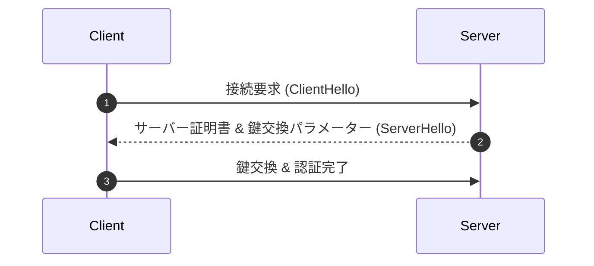

# [タイトル] 学習コンテンツ解説

## 1. 概要 & シラバス位置付け
本記事では、シラバス項目 `[シラバスコード: 小項目名]` について、試験で問われるコア概念と実務上の重要ポイントを解説します。

---

## 2. コア技術解説 & 構成図

### 2.1 技術概念
ここに技術の基本原則、プロトコル仕様、メッセージフォーマットを記述します。

---

## 3. 午後記述試験（科目B）解法テクニック

> [!IMPORTANT]
> **採点基準必須キーワード**: **認証付き暗号 (AEAD)**, **改ざん検知メッセージ認証コード (MAC)**, **初期化ベクトル (IV) 重複禁止**

### 設問解法モデル (30文字〜40文字要約例)
- **Q. GCMモードを採用する利点は何か？ (40字以内)**
  - **模範解答**: **暗号化と改ざん検知メッセージ認証コードの生成を同時に高速処理できる点。**

---

## 4. 過去問題演習
- [2025年春期 午後問題 問1](../../references/okf/past_exams/2025_haru/2025r07a_sc_pm_qs.md)
