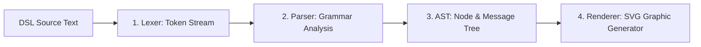

# [FEAT] 外部依存ゼロの自作シーケンス図 (Sequence Diagram) Lexer/Parser/AST/Renderer ライブラリの構築と HTML ビルド統合 (ID: 098)

## 1. 概要 / Summary
ドキュメント内（`docs/` や `project-docs/`）の ```` ```mermaid ```` 等で記述されたシーケンス図（`sequenceDiagram`, `autonumber`, `actor`, `participant`, メッセージ矢印など）が、HTML 変換時に生のテキストコードブロックとして露出してしまう課題を解決する。
サードパーティの外部重厚ライブラリ (Mermaid.js CDN 等) に依存することなく、標準のコンパイラ/トランスパイラ設計パターン（**Lexer $\rightarrow$ Parser $\rightarrow$ AST $\rightarrow$ Renderer**）に基づき、完全ネイティブな自作シーケンス図解釈・SVG 生成ライブラリを構築し、`scripts/build_html_docs.py` およびクライアント側表示環境に組み込んで美しいダイアグラムとして描画する。

---

## 2. 利用箇所の特定 / Target Identification
リポジトリ全体を走査・調査し、以下の利用箇所を特定：
- [x] [docs/scenarios/attack_scenarios_analysis.md](../docs/scenarios/attack_scenarios_analysis.md) (サイバー攻撃シナリオシーケンス図)
- [x] [docs/glossary/syllabus_tsuiho_ver4_0.md](../docs/glossary/syllabus_tsuiho_ver4_0.md) (各種プロトコルシーケンス図)
- [x] [docs/glossary/syllabus_ver2_1.md](../docs/glossary/syllabus_ver2_1.md)
- [x] [docs/glossary/terms/zero-trust.md](../docs/glossary/terms/zero-trust.md) (ゼロトラスト認可シーケンス図)
- [x] [docs/template_article.md](../docs/template_article.md) (テンプレート記事)
- [x] [project-docs/architecture/ARCH-01-docs_architecture_and_layout_design.md](../project-docs/architecture/ARCH-01-docs_architecture_and_layout_design.md) (設計ガイドライン)

---

## 3. アーキテクチャ設計 / Architecture Design
標準コンパイラ設計パターンに従い、以下の 4 層モジュール構造で設計・実装を行う：



1. **Lexer (字句解析器 - `SequenceLexer`)**:
   - `sequenceDiagram`, `autonumber`, `actor`, `participant`, `as`, メッセージ矢印 (`->>`, `-->>`, `->`, `-->`, `-x`), テキストラベルをトークン化。
2. **Parser (構文解析器 - `SequenceParser`)**:
   - トークン列から文法構造を解析し、構造化ノードツリーを検証構築。
3. **AST (抽象構文木 - `SequenceAST`)**:
   - 参加者ノード群 (`participants`), 自動採番設定 (`autonumber`), メッセージステップ配列 (`messages`) を含む不変データ構造モデル。
4. **Renderer (SVG レンダラー - `SequenceRenderer`)**:
   - AST を入力とし、各アクター位置 $X$, メッセージ行 $Y$, ライフライン縦線, SVG 矢印マーカー (`<marker>`), ステップ番号バッジ, テキスト表示を包含した美しいレスポンシブ SVG (`<svg class="sequence-diagram">...`) を生成。

---

## 4. 影響範囲と関連ファイル / Scope and Affected Files
- [x] [scripts/sequence_diagram_parser.py](../scripts/sequence_diagram_parser.py) [NEW - Lexer/Parser/AST/Renderer Python モジュール]
- [x] [src/js/sequence_renderer.js](../src/js/sequence_renderer.js) [NEW - クライアント JS レンダラー]
- [x] [scripts/build_html_docs.py](../scripts/build_html_docs.py) [MODIFY - HTML ビルド時インライン SVG 埋め込み]
- [x] [src/assets/sw.js](../src/assets/sw.js)
- [x] [package.json](../package.json)
- [x] [tests/unit/sequence_renderer.test.js](../tests/unit/sequence_renderer.test.js) [NEW]

---

## 5. 完了条件 / Success Criteria (DoD)
- [x] Lexer $\rightarrow$ Parser $\rightarrow$ AST $\rightarrow$ Renderer アーキテクチャに基づき、外部ライブラリ非依存で `sequenceDiagram` を解析し高画質な SVG にレンダリングできること。
- [x] `scripts/build_html_docs.py` による静的サイト変換時、Mermaid シーケンス図が全て美しい SVG ダイアグラムとして出力・表示されること。
- [x] 循環的複雑度上限 (10 以下: ADR-02) を全関数でクリアすること。
- [x] `npm run build && npm test` が 100% PASS すること。
