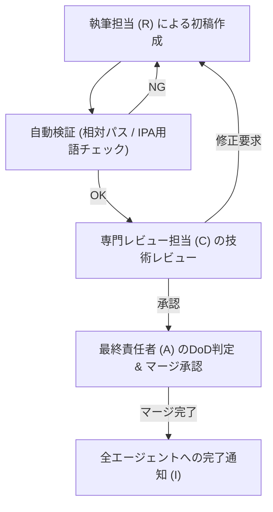

# マルチエージェント役割分担ガイド (Agent RACI Matrix)

本ドキュメントは、プロジェクトに取り込まれた 10 大スペシャリストエージェントが、どのシラバス領域の執筆・専門レビュー・品質検証・承認を担当するかを定めた **RACI マトリックス** およびレビュー・マージフローの規定書です。

---

## 1. 10大スペシャリストエージェント概要 & 役割

| エージェントID | 専門領域 | 主な責務とカバー範囲 |
|---|---|---|
| `information-security-specialist` | 全体アーキテクチャ・セキュリティ運用 | 全体アーキテクチャ監修、暗号技術、インシデントハンドリング、EDR/XDR、脅威ハンティング、フォレンジック |
| `network-specialist` | ネットワークセキュリティ | 境界防御 (FW/IDS/IPS)、IPsec/TLS/VPN、DNS/Web/Mailセキュリティ、SASE/SSE、Microsegmentation |
| `database-specialist` | データベース & データセキュリティ | DB暗号化、SQLインジェクション対策、IndexedDB/LocalStorage、DSPM (データセキュリティポスチャ) |
| `systems-architect` | クラウド & IAM / システムアーキテクチャ | SAML/OAuth/OIDC認証基盤、ゼロトラスト (NIST SP 800-207)、コンテナ/Kubernetes、CSPM、SCIM |
| `systems-auditor` | 監査・コンプライアンス・ガバナンス | ISMS/ISO 27001、リスクアセスメント、個人情報保護法/GDPR、EU CRA、セキュリティ監査 |
| `software-quality-assurance-specialist` | 脆弱性診断・セキュアプログラミング | OWASP Top 10、DevSecOps/SBOM、コード検証、ペネトレーションテスト、AI/LLMセキュリティ |
| `project-manager` | プロジェクト管理 & QA統括 | WBS・進捗管理、DoD評価判定、Issue起票・管理、総合品質ゲート承認 |
| `information-technology-strategist` | セキュリティ戦略 & BCP | 経営セキュリティ戦略、サプライチェーンリスク (SCRM)、BCP/DR、重要インフラガイドライン |
| `information-technology-service-manager` | ITSM & ログ運用・自動化 | ITSM、変更・障害管理、ログ解析/SIEM、SOAR/IRプレイブック、SLA管理 |
| `embedded-systems-specialist` | IoT & OT / 組込みセキュリティ | IoT端末セキュリティ、組込みOS・ハードウェアセキュリティ、OT/ICS (IEC 62443) |

---

## 2. シラバス分野別 RACI マトリックス

### 2.1 RACI の定義
- **R (Responsible / 実行責任者)**: コンテンツの執筆、図表作成、コード例の作成を行う主体。
- **A (Accountable / 最終責任者)**: 内容の正確性、IPAシラバス適合性、DoD達成を判定し承認する主体（1項目につき原則1名）。
- **C (Consulted / 助言・レビュー者)**: 専門技術的な観点からレビューを行いアドバイスを提供する主体。
- **I (Informed / 報告先)**: 完成通知および更新情報を受け取る主体。

### 2.2 シラバス大分類別 RACI 割当表

| シラバス大分類 | 主な対象トピック | Accountable (A) | Responsible (R) | Consulted (C) | Informed (I) |
|---|---|---|---|---|---|
| **1. 情報セキュリティの基礎** | CIA、脅威と脆弱性、事故前提社会 | `information-security-specialist` | `information-security-specialist` | `project-manager` | 全エージェント |
| **2. セキュリティガバナンス・リスク管理** | ISMS、リスクアセスメント、方針 | `systems-auditor` | `systems-auditor` | `information-technology-strategist` | `project-manager` |
| **3. 暗号・認証・アクセス制御** | 共通鍵/公開鍵/PKI、SAML/OAuth | `information-security-specialist` | `systems-architect` | `database-specialist` | `network-specialist` |
| **4. ネットワーク & Webセキュリティ** | IPsec/TLS、FW/IDS/IPS、OWASP | `network-specialist` | `network-specialist` | `software-quality-assurance-specialist` | `systems-architect` |
| **5. システム・クラウド・エンプリ** | OSハードニング、DB/クラウド/EDR | `systems-architect` | `systems-architect` / `database-specialist` | `embedded-systems-specialist` | `information-security-specialist` |
| **6. 開発セキュリティ・脆弱性** | セキュアプログラミング、SBOM | `software-quality-assurance-specialist` | `software-quality-assurance-specialist` | `systems-architect` | `project-manager` |
| **7. インシデント対応・運用・BCP** | CSIRT/SOC、フォレンジック、SIEM | `information-security-specialist` | `information-technology-service-manager` | `information-technology-strategist` | `systems-auditor` |
| **8. ガイドライン・法規・環境** | 関連法規、個人情報、物理 | `systems-auditor` | `systems-auditor` | `information-technology-strategist` | 全エージェント |

---

## 3. レビュー & マージ承認フロー

1. **初稿執筆**: RACI の **R** 担当エージェントが記事を作成。
2. **自動チェック**: 静的チェックツール（パス検証・用語チェック）を実行。
3. **ピアレビュー**: RACI の **C** 担当エージェントが専門技術レビューを実施。
4. **DoD判定・マージ**: RACI の **A** 担当（および `project-manager`）が最終検証を行い、DoD 判定を通過した場合に `main` へマージ。
