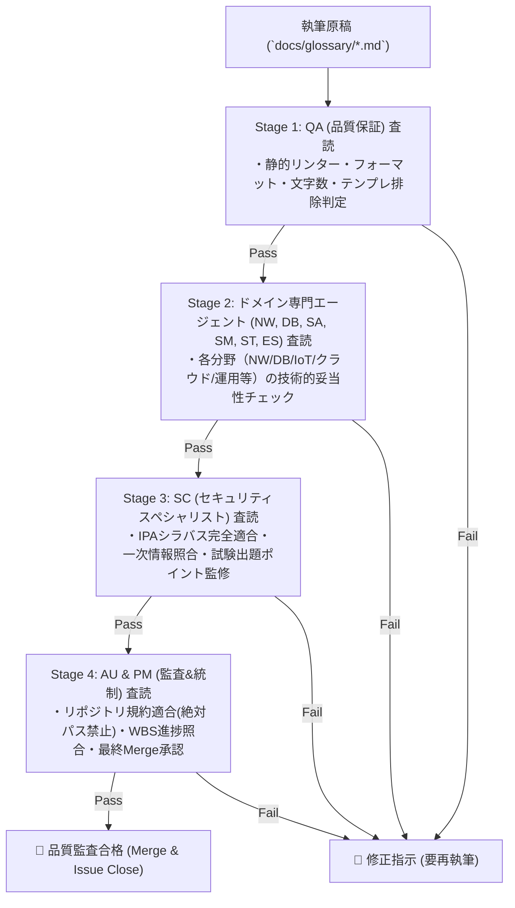

# 用語集継続的品質改修ロードマップ & 人間代行多層化自動QA監査計画書 (Glossary Refinement Roadmap & Multi-Stage Automated QA Framework)

本ドキュメントは、**情報処理安全確保支援士試験コンテンツ制作プロジェクト**における用語集（`docs/glossary/syllabus_ver2_1.md` および `docs/glossary/syllabus_tsuiho_ver4_0.md`）の機械的テンプレ文言を全廃し、実践的で高品質な解説へ継続的にアップデートするための**全体ロードマップ**および**人間代行多層化自動品質保証 (QA) プロセス**を定義したものです。

---

## 🗺️ 1. 用語集継続的改修ロードマップ (Glossary Refinement Roadmap)

全2,100余りのシラバス登録用語を専門ドメインごとに細分化し、段階的に確実な品質改修を推進します。

| Phase | 対象ドメイン | 対象主要キーワード例 | ステータス | 担当Issue |
| :---: | :--- | :--- | :---: | :---: |
| **Phase 1** | 暗号・PKI・鍵管理・認証 | AES, RSA, AEAD, SHA-2/3, HMAC, PKI, PFS, RBAC, ABAC, PAM, SoD | **完了** | [#020](file:///workspace/registered-Information-security-specialist-examination/issues/closed/020-refine-glossary-explanations-crypto-auth.md) |
| **Phase 2-1** | ネットワーク・通信セキュリティ | TLS 1.3, IPsec, DNSSEC, SPF/DKIM/DMARC, FW, WAF, IDS/IPS, WPA3 | **完了** | [#021](file:///workspace/registered-Information-security-specialist-examination/issues/closed/021-refine-glossary-network-security.md) |
| **Phase 2-2** | Web・開発セキュリティ | XSS, SQLi, CSRF, OSコマンド注入, ディレクトリトラバーサル, SAST, DAST | **完了** | [#022](file:///workspace/registered-Information-security-specialist-examination/issues/closed/022-refine-glossary-web-dev-security.md) |
| **Phase 2-3** | マルウェア・端末・SOC/インシデント対応 | EDR, EPP, SOAR, SIEM, サンドボックス, CSIRT, デジタルフォレンジック | **進行中** | [#023](file:///workspace/registered-Information-security-specialist-examination/issues/023-refine-glossary-malware-soc-incident.md) |
| **Phase 2-4** | クラウド・データ・ゼロトラスト | CSPM, DSPM, ZTA, SASE, SSE, CASB, SCIM, FIDO2 | **予定** | Issue #024 |
| **Phase 3** | ガバナンス・法規・マネジメント | ISMS, BCMS, SCRM, 個人情報保護法, サイバーセキュリティ基本法 | **予定** | Issue #025 |
| **Phase 4** | 追補版シラバス用語群 (Ver.4.0) | AI脅威, SBOM, PQC, LLMセキュリティ, 暗号試行, クラウドポスチャ | **予定** | Issue #026〜 |

---

## 🛡️ 2. 全10大スペシャリストエージェント完全協調による多層化品質保証 (QA) 査読体制

単なる定型自動チェックに留まらず、本プロジェクトに参画する**全10種の専門エージェント**がそれぞれの専門領域（ネットワーク、DB、ITS M、IoT、戦略、クラウド、監査、品質等）に応じてレビュー・技術監修を行う**10大エージェント連携型・多層化品質保証パイプライン**を導入します。

### 👥 全10大スペシャリストエージェントの専門領域と査読・監修分担

| エージェントID | 専門領域 | 主な査読・監修対象用語カテゴリ & 査読観点 | 介在Stage |
| :--- | :--- | :--- | :---: |
| **`software-quality-assurance-specialist` (QA)** | **品質保証 & 脆弱性** | プレースホルダー文言の完全排除、必須4構造（概要/技術/出題/参照）のフォーマット検査、SAST/DAST/ファジング等開発テスト用語の技術レビュー | Stage 1 & Stage 2 |
| **`network-specialist` (NW)** | **ネットワークセキュリティ** | IPsec, TLS 1.3, DNSSEC, SPF/DKIM/DMARC, FW, WAF, IDS/IPS, WPA3, SASE/SSE 等のプロトコル・通信機器用語の技術検証 | Stage 2 |
| **`database-specialist` (DB)** | **DB & データセキュリティ** | SQLインジェクション、DB暗号化、DSPM、IndexedDB/LocalStorage、データライフサイクル管理等の技術検証 | Stage 2 |
| **`systems-architect` (SA)** | **クラウド & IAM / 構成** | SAML/OAuth/OIDC, ゼロトラスト (NIST SP 800-207), CSPM, SCIM, コンテナ/Kubernetes 等のアーキテクチャ用語検証 | Stage 2 |
| **`information-technology-service-manager` (SM)** | **ITSM & ログ運用** | SOC, SIEM, SOAR, 相関分析, EDR/EPP, NTP時刻同期, ITSM, ログ保管・改ざん防止等の運用・インシデント用語検証 | Stage 2 |
| **`information-technology-strategist` (ST)** | **セキュリティ戦略 & BCP** | SCRM (サプライチェーンリスク), BCP/DR, 経営セキュリティ戦略, 重要インフラガイドライン等の戦略用語検証 | Stage 2 |
| **`embedded-systems-specialist` (ES)** | **IoT & OT / 組込み** | IoT端末セキュリティ, TPM/HSM (ハードウェア耐タンパー性), OT/ICS (IEC 62443), セキュアブーツ等の物理・組込み用語検証 | Stage 2 |
| **`information-security-specialist` (SC)** | **セキュリティスペシャリスト** | 全用語のIPA公式シラバス適合性、CRYPTREC/NIST一次情報検証、午前II・午後記述試験の採点キーワード・ひっかけポイント監修 | Stage 3 |
| **`systems-auditor` (AU)** | **システム監査 & 規約** | ISMS/ISO 27001, 法規・個人情報保護法, リポジトリ規約（相対パスルール・絶対パス排除）の遵守状態の監査 | Stage 4 |
| **`project-manager` (PM)** | **PM & 最終品質ゲート** | ロードマップWBSとの進捗照合、全エージェントレビュー結果の最終判定 (DoD達成確認)、IssueクローズおよびMerge承認 | Stage 4 |

---

## 📈 3. 品質指標 (KPI)

- **定型プレースホルダー残存率**: **0.0%**（全2,100+項目中 0件）
- **10大エージェント査読通過率**: **100.0%**
- **4構造（概要/技術/出題/参照）適合率**: **100.0%**（改修対象項目）

