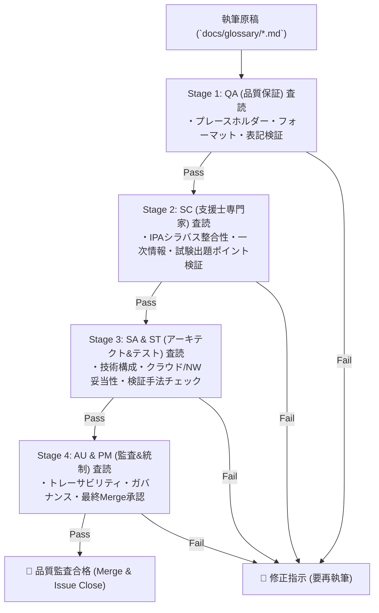

# 用語集継続的品質改修ロードマップ & 人間代行多層化自動QA監査計画書 (Glossary Refinement Roadmap & Multi-Stage Automated QA Framework)

本ドキュメントは、**情報処理安全確保支援士試験コンテンツ制作プロジェクト**における用語集（`docs/glossary/syllabus_ver2_1.md` および `docs/glossary/syllabus_tsuiho_ver4_0.md`）の機械的テンプレ文言を全廃し、実践的で高品質な解説へ継続的にアップデートするための**全体ロードマップ**および**人間代行多層化自動品質保証 (QA) プロセス**を定義したものです。

---

## 🗺️ 1. 用語集継続的改修ロードマップ (Glossary Refinement Roadmap)

全2,100余りのシラバス登録用語を専門ドメインごとに細分化し、段階的に確実な品質改修を推進します。

| Phase | 対象ドメイン | 対象主要キーワード例 | ステータス | 担当Issue |
| :---: | :--- | :--- | :---: | :---: |
| **Phase 1** | 暗号・PKI・鍵管理・認証 | AES, RSA, AEAD, SHA-2/3, HMAC, PKI, PFS, RBAC, ABAC, PAM, SoD | **完了** | [#020](file:///workspace/registered-Information-security-specialist-examination/issues/closed/020-refine-glossary-explanations-crypto-auth.md) |
| **Phase 2-1** | ネットワーク・通信セキュリティ | TLS 1.3, IPsec, DNSSEC, SPF/DKIM/DMARC, FW, WAF, IDS/IPS, WPA3 | **完了** | [#021](file:///workspace/registered-Information-security-specialist-examination/issues/closed/021-refine-glossary-network-security.md) |
| **Phase 2-2** | Web・開発セキュリティ | XSS, SQLi, CSRF, OSコマンド注入, ディレクトリトラバーサル, SAST, DAST | **完了** | [#022](file:///workspace/registered-Information-security-specialist-examination/issues/closed/022-refine-glossary-web-dev-security.md) |
| **Phase 2-3** | マルウェア・端末・SOC/インシデント対応 | EDR, EPP, SOAR, SIEM, サンドボックス, CSIRT, デジタルフォレンジック | **進行中** | [#023](file:///workspace/registered-Information-security-specialist-examination/issues/023-refine-glossary-malware-soc-incident.md) |
| **Phase 2-4** | クラウド・データ・ゼロトラスト | CSPM, DSPM, ZTA, SASE, SSE, CASB, SCIM, FIDO2 | **予定** | Issue #024 |
| **Phase 3** | ガバナンス・法規・マネジメント | ISMS, BCMS, SCRM, 個人情報保護法, サイバーセキュリティ基本法 | **予定** | Issue #025 |
| **Phase 4** | 追補版シラバス用語群 (Ver.4.0) | AI脅威, SBOM, PQC, LLMセキュリティ, 暗号試行, クラウドポスチャ | **予定** | Issue #026〜 |

---

## 🛡️ 2. マルチエージェント協調による多層化品質保証 (QA) 査読体制

単なる機械的チェックに留まらず、本プロジェクトに参画する**5つの専門エージェント（QA, SC, SA, ST, AU, PM）がそれぞれの専門視点で相互レビュー・承認を行う多層化品質保証パイプライン**を導入します。

### 👥 各専門エージェントの査読担当領域 (RACI)

| エージェント | 担当ロール | 介在する査読フェーズ & 具体的チェック内容 |
| :--- | :--- | :--- |
| **QA** (Software Quality Assurance) | **品質保証** | **Stage 1 (静的品質検証)** ・定型句（プレースホルダー文言）の完全排除判定 ・必須4要素（概要/技術/出題/参照）の構造フォーマットチェック ・文字数（120文字以上）およびタイポ・表記揺れの自動検出 |
| **SC** (Information Security Specialist) | **支援士・セキュリティ監修** | **Stage 2 (学術・出題適性検証)** ・IPA公式シラバス（Ver.2.1 / 追補版）の用語定義との100%整合性 ・午後記述式試験の採点基準に直結する核心キーワードの含有判定 ・CRYPTREC / NIST SP 800 等の一次情報参照の正当性確認 |
| **SA** (Systems Architect) & **ST** (Software Tester) | **システム設計・テスト検証** | **Stage 3 (技術実装・検証実効性)** ・クラウド、ネットワーク、IAM等のシステム構成論の妥当性評価（SA） ・SAST/DAST/ファジング/ペネトレーションテスト等の検証手順の整合性確認（ST） |
| **AU** (Systems Auditor) & **PM** (Project Manager) | **システム監査 & 全体統制** | **Stage 4 (ガバナンス & 最終承認)** ・リポジトリ規約（絶対パス禁止、相対パス強制）の適合性監査（AU） ・ロードマップWBSとの進捗照合、Issueクローズ判断およびMerge承認（PM） |

---

## 📈 3. 品質指標 (KPI)

- **定型プレースホルダー残存率**: **0.0%**（全2,100+項目中 0件）
- **多層化エージェント査読通過率**: **100.0%**
- **4構造（概要/技術/出題/参照）適合率**: **100.0%**（改修対象項目）

