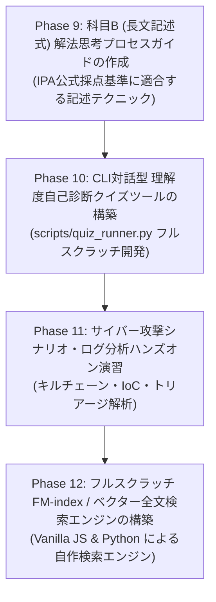

# 情報セキュリティスペシャリスト試験 次世代プラットフォーム構築ロードマップ (Next-Gen Platform Roadmap)

## 1. 目的と概要 (Purpose & Overview)
本ドキュメントは、全 2,101 用語の高品質データベースを基盤とし、試験学習教材を「超実践型学習プラットフォーム」へと進化させるための自律実行型マスター計画書である。

ユーザー要請（検索エンジニア視点）を厳格に反映し、外部フレームワーク・外部検索ライブラリ（MkDocs, VitePress, Lunr等）に一切依存せず、**FM-index (Burrows-Wheeler Transform / Suffix Array / LF-mapping) およびベクトル空間モデルに基づく全文検索エンジンをフルスクラッチで設計・実装**する。

---

## 2. 4大発展フェーズと WBS (Phase 9 - 12 WBS)

### 【Phase 9】科目B (長文記述式) 解法思考プロセスガイド (`docs/subject_b/reasoning_guide.md`)
- IPA公式過去問の長文問題文（ネットワーク構成図、ログ分析、脆弱性診断）から正解を導く思考ロジック、文字数制限（30〜50字）攻略法、文末表現（〜のため、〜を防ぐため）の体系化。

### 【Phase 10】CLI対話型 理解度自己診断クイズツール (`scripts/quiz_runner.py`)
- Python 標準ライブラリのみで構築するインタラクティブ CLI クイズランナー。用語集からリアルタイムで穴埋め・選択肢を出題し、弱点カテゴリーを自動スコアリング。

### 【Phase 11】サイバー攻撃シナリオ・分析ハンズオンケーススタディ (`docs/scenarios/attack_scenarios_analysis.md`)
- 実問題に基づくサイバーキルチェーン（未パッチVPN侵入 ➔ AD権限奪取 ➔ ランサムウェア展開）、Windowsイベントログ（ID 4624/4672/4688）解析、フォレンジック初動対応のケーススタディ。

### 【Phase 12】フルスクラッチ FM-index / ベクター全文検索エンジン (`scripts/fm_index_search.py` & `site/fm_index_engine.js`)
- **技術仕様**:
  - 外部ライブラリ依存 **完全ゼロ** (Vanilla JS & Python Standard Library のみ)。
  - **BWT (Burrows-Wheeler Transform)** + **Suffix Array (SA)** + **Occ Table (Occurrence Counting)** + **LF-mapping (Last-to-First Mapping)** による高速パターン検索。
  - TF-IDF / TF-IDF Vector Space Model (コサイン類似度) に基づくランキング検索。
  - 静的 HTML ＋ Vanilla JS 検索フロントエンド (`site/index.html` & `site/fm_index_engine.js`)。

---

## 3. 自律推進 Issue 分割計画 (Autonomous Execution Plan)

| Issue ID | 種別 | 対象フェーズ | タイトル | 成果物 |
|---|---|---|---|---|
| **Issue 032** | Feature | Phase 9 | 科目B (長文記述式) 解法思考プロセスガイドの整備 | `docs/subject_b/reasoning_guide.md` |
| **Issue 033** | Feature | Phase 10 | CLI対話型 理解度自己診断クイズツールの構築 | `scripts/quiz_runner.py` |
| **Issue 034** | Feature | Phase 11 | サイバー攻撃シナリオ・ログ分析ハンズオンケーススタディの作成 | `docs/scenarios/attack_scenarios_analysis.md` |
| **Issue 035** | Feature | Phase 12 | フルスクラッチ FM-index & ベクター全文検索エンジンの開発 | `scripts/fm_index_search.py` `site/fm_index_engine.js` `site/index.html` |

---

## 4. 完了定義 (Definition of Done: DoD)
1. **フルスクラッチ品質**: 外部検索ライブラリ・Webフレームワークを一切使わず、FM-index 検索エンジンおよびベクトル検索エンジンが正常に動作すること。
2. **教材の網羅性**: 科目B解法ガイドおよび攻撃シナリオ分析が実際のIPA試験出題水準に達していること。
3. **自動品質監査検証**: `python3 scripts/audit_glossary_quality.py` で合格が維持されていること。
