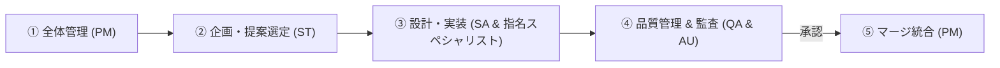
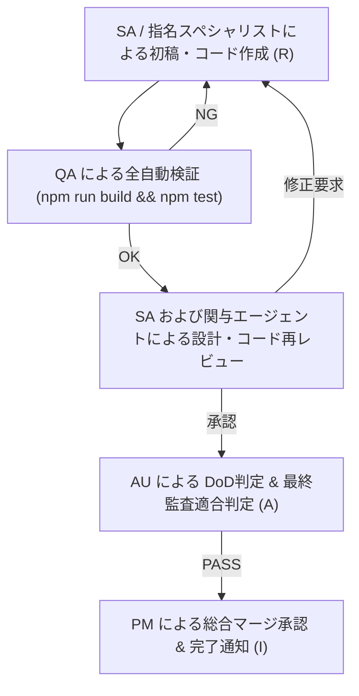

# マルチエージェント役割分担ガイド (Agent RACI Matrix & Phase Roles)

Document ID: `PROC-02-agent_roles`

本ドキュメントは、プロジェクトに取り込まれた **全 13 大スペシャリストエージェント**が、どのフェーズ・シラバス領域・機能開発を担当するかを定めた **フェーズ別責任体制** および **RACI マトリックス** の規定書です。

---

## 🏛️ 1. フェーズ別エージェント責任体制 (Phase Accountabilities)

開発・改善ライフサイクルにおける各フェーズの主担当エージェントと役割規定は以下の通りです。

| フェーズ | 主担当エージェント | 役割と責務 |
|---|---|---|
| **全体管理** | **PM** (`project-manager`) | プロジェクト全体の推進・WBS管理・DoD評価・最終マージ承認 |
| **企画・提案選定** | **ST** (`information-technology-strategist`) | 全エージェントヒアリング分析・戦略・企画観点での最重要課題選定・企画構想 |
| **設計・実装** | **SA** (`systems-architect`) + **SA指名スペシャリスト** | SA および課題に応じて SA から指名された専門エージェント（SC, NW, DB, EP, SM, IR, EDU, UIUX 等）による詳細設計・コーディング・基盤構築 |
| **品質管理 & 監査** | **QA** + **AU** | QA による全自動テスト（ビルド・ユニット・トレース・監査テスト）の検証、AU によるシステム適合度最終監査および【適合(PASS)】判定 |

---

## 2. 13 大スペシャリストエージェント概要 & 役割

| エージェントID | 専門領域 | 主な責務とカバー範囲 |
|---|---|---|
| `information-technology-strategist` (ST) | セキュリティ戦略・企画 & BCP | 企画主導、経営セキュリティ戦略、サプライチェーンリスク (SCRM)、BCP/DR、重要インフラ |
| `systems-architect` (SA) | クラウド & IAM / システムアーキテクチャ | 設計・実装主導、SAML/OAuth/OIDC認証基盤、ゼロトラスト (NIST SP 800-207)、コンテナ、CSPM |
| `information-security-specialist` (SC) | 全体アーキテクチャ・セキュリティ運用 | 全体アーキテクチャ監修、暗号技術、インシデントハンドリング、EDR/XDR、脅威ハンティング |
| `network-specialist` (NW) | ネットワークセキュリティ | 境界防御 (FW/IDS/IPS)、IPsec/TLS/VPN、DNS/Web/Mailセキュリティ、SASE/SSE |
| `database-specialist` (DB) | データベース & データセキュリティ | DB暗号化、SQLインジェクション対策、IndexedDB/LocalStorage、DSPM (データセキュリティポスチャ) |
| `systems-auditor` (AU) | 監査・コンプライアンス・ガバナンス | 最終システム監査、ISMS/ISO 27001、リスクアセスメント、個人情報保護法/GDPR、セキュリティ監査 |
| `software-quality-assurance-specialist` (QA) | 脆弱性診断・セキュアプログラミング | 品質管理統括、OWASP Top 10、DevSecOps/SBOM、全自動コード検証、ペネトレーションテスト |
| `project-manager` (PM) | プロジェクト管理 & 全体統括 | 全体管理統括、WBS・進捗管理、DoD評価判定、Issue起票・管理、総合品質ゲート承認 |
| `information-technology-service-manager` (SM) | ITSM & ログ運用・自動化 | ITSM、変更・障害管理、ログ解析/SIEM、SOAR/IRプレイブック、SLA管理 |
| `embedded-systems-specialist` (EP) | IoT & OT / 組込みセキュリティ | IoT端末セキュリティ、組込みOS・ハードウェアセキュリティ、OT/ICS (IEC 62443) |
| `it-specialist-information-retrieval` (IR) | 情報検索・インデックス・アルゴリズム | FM-Index, BM25スコアリング, Web Worker高速検索, 外部JSON辞書統合 |
| `education-specialist` (EDU) | 教材設計・ITSS教育指導 | ITSSセルフアセスメントガイド, 対話型クイズ設計, シラバス難易度調整 |
| `ui-ux-designer` (UIUX) | UI/UX デザイン & Web アクセシビリティ | ユーザー中心設計 (UCD)、情報アーキテクチャ (IA)、デザインシステム、アクセシビリティ (WCAG 2.1) |

---

## 3. シラバス分野別 RACI マトリックス

### 3.1 RACI の定義
- **R (Responsible / 実行責任者)**: コンテンツの執筆、図表作成、コード例の作成を行う主体。
- **A (Accountable / 最終責任者)**: 内容の正確性、IPAシラバス適合性、DoD達成を判定し承認する主体（1項目につき原則1名）。
- **C (Consulted / 助言・レビュー者)**: 専門技術的な観点からレビューを行いアドバイスを提供する主体。
- **I (Informed / 報告先)**: 完成通知および更新情報を受け取る主体。

### 3.2 シラバス大分類別 RACI 割当表

| シラバス大分類 | 主な対象トピック | Accountable (A) | Responsible (R) | Consulted (C) | Informed (I) |
|---|---|---|---|---|---|
| **1. 情報セキュリティの基礎** | CIA、脅威と脆弱性、事故前提社会 | `information-security-specialist` | `information-security-specialist` | `project-manager` | 全エージェント |
| **2. セキュリティガバナンス・リスク管理** | ISMS、リスクアセスメント、方針 | `systems-auditor` | `systems-auditor` | `information-technology-strategist` | `project-manager` |
| **3. 暗号・認証・アクセス制御** | 共通鍵/公開鍵/PKI、SAML/OAuth | `information-security-specialist` | `systems-architect` | `database-specialist` | `network-specialist` |
| **4. ネットワーク & Webセキュリティ** | IPsec/TLS、FW/IDS/IPS、OWASP | `network-specialist` | `network-specialist` | `software-quality-assurance-specialist` | `systems-architect` |
| **5. システム・クラウド・エンプリ** | OSハードニング、DB/クラウド/EDR | `systems-architect` | `systems-architect` / `database-specialist` | `embedded-systems-specialist` | `information-security-specialist` |
| **6. 開発セキュリティ・脆弱性** | セキュアプログラミング、SBOM | `software-quality-assurance-specialist` | `software-quality-assurance-specialist` | `systems-architect` | `project-manager` |
| **7. インシデント対応・運用・BCP** | CSIRT/SOC、フォレンジック、SIEM | `information-security-specialist` | `information-technology-service-manager` | `information-technology-strategist` | `systems-auditor` |
| **8. ガイドライン・法規・環境** | 関連法規、個人情報、物理 | `systems-auditor` | `systems-auditor` | `information-technology-strategist` | 全エージェント |
| **9. 情報検索 & ポータルアルゴリズム** | BM25, FM-Index, Web Worker | `it-specialist-information-retrieval` | `it-specialist-information-retrieval` | `systems-architect` | `ui-ux-designer` |
| **10. ITSS セルフチェック & 教育指導** | ITSS Level 1〜4, 4択問題演習 | `education-specialist` | `education-specialist` | `information-technology-strategist` | `project-manager` |
| **11. UI/UX & アクセシビリティ** | UCD、デザインシステム、WCAG 2.1 | `ui-ux-designer` | `ui-ux-designer` | `systems-architect` | `software-quality-assurance-specialist` |

---

## 4. レビュー & マージ承認フロー

