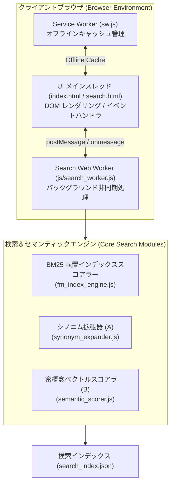

# システム基本設計書 (High-Level Design Document: HLD)

本ドキュメントは、情報処理安全確保支援士（SC）総合学習プラットフォームにおける全システムアーキテクチャ、コンポーネント構成、検索処理パイプライン、PWA キャッシュ構造、および ITSS マルチエージェント体系を定義する**システム基本設計書 (HLD)** です。

---

## 1. システム全体アーキテクチャ (System Architecture)

本システムは、完全クライアントサイド（サーバーレス / PWA）動作を中心とし、大容量インデックスロード時や複雑な検索計算処理時においても UI 描画スレッドを完全非ブロッキングに保つ **Web Worker 非同期マルチスレッド型アーキテクチャ** を採用しています。

---

## 2. 主要サブシステムおよびコンポーネント仕様

### 2.1 Web Worker 非同期パイプライン (Worker Subsystem)
- **役割**: UI メインスレッドから検索・トークナイズ・スコアリング処理を完全に分離し、画面のスクロール・文字入力・描画フリーズ（Jank）を完全排除。
- **データフロー**: UI 側から `postMessage({ action: 'SEARCH', query, topK })` を送信し、Worker 側で非同期並列計算後に `RESULTS` メッセージを即座に返送。

### 2.2 ハイブリッド検索エンジン (Hybrid Search Subsystem)
従来の完全一致マッチングの限界を克服し、語彙不一致（Vocabulary Mismatch）や製品名・略語クエリ（例: 「ヤマハ」「パロアルト」「MFA」等）から関連セキュリティ技術文書を引き当てるハイブリッド構成。

1. **アプローチ A (シノニムクエリ拡張 - `synonym_expander.js`)**:
   - ベンダー名（ヤマハ, シスコ, Palo Alto, AWS等）やセキュリティ略語を決定論的同義語マップに展開。
2. **アプローチ B (密概念ベクトル・セマンティック検索 - `semantic_scorer.js`)**:
   - 暗号、認証、通信境界、Webセキュリティ、クラウド、ガバナンス等の 6 大概念ベクトルによる文脈類似度スコアリング。
3. **転置インデックス & BM25 スコアラー (`fm_index_engine.js`)**:
   - 転置インデックス (Inverted Index) による高速文書絞り込みと BM25 ($k_1=1.2, b=0.75$) 順位付け。

### 2.3 PWA & オフラインキャッシュサブシステム (`sw.js`)
- **キャッシュ戦略**: Stale-While-Revalidate / Cache-First 戦略。
- **対象アセット**: HTML、CSS、JS、および `search_index.json` をローカル保持し、ネットワーク完全切断（オフライン）環境での全学習動作を保障。

### 2.4 ITSS エデュケーション・マルチエージェントサブシステム
- **構成エージェント**:
  - SC (Information Security Specialist)
  - EDU (Education Specialist / ITSS 到達度診断)
  - IR (Information Retrieval Specialist / 検索アルゴリズム)
  - DB, NW, SA
- **指導体系**: ITSS レベル 1〜4 に準拠した段階的評価と個別セッション指導。

---

## 3. セキュリティアーキテクチャ (Security Architecture)

1. **プロトタイプ汚染防御 (Prototype Pollution Defense)**:
   - 全辞書キーおよびトークン生成処理において `Map` オブジェクトおよび `isSafeKey` ガードを徹底し、`__proto__`, `prototype`, `constructor` 注入によるスクリプト破壊・コード実行を防御。
2. **Safe DOM レンダリング & Strict CSP**:
   - `innerHTML` 直代入を排除し、`textContent` による Safe DOM 生成を徹底。
   - Content Security Policy Meta タグ (`default-src 'self'`) により通信境界とスクリプト実行範囲を厳格制御。

---

## 4. 関連ドキュメント
- [システム詳細設計書 (LLD: Low-Level Design)](system_low_level_design.md)
- [レイアウト・設計ガイドライン](docs_architecture_and_layout_design.md)
- [ITSS 到達度セルフチェックガイド](../docs/itss_self_assessment_guide.md)
