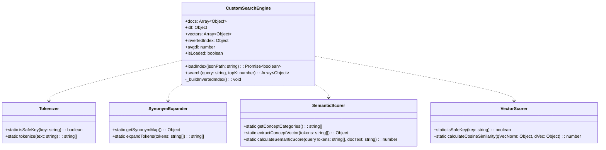

# システム詳細設計書 (Low-Level Design Document: LLD)

本ドキュメントは、システム基本設計書 (HLD) に基づき、各 JavaScript モジュールの詳細なクラス設計、データ構造、通信プロトコル、計算アルゴリズム、プロトタイプ汚染防御ロジックを定義する**システム詳細設計書 (LLD)** です。

---

## 1. モジュールクラス設計 (Module & Class Specifications)



---

## 2. モジュール詳細仕様

### 2.1 `Tokenizer` (`site/js/tokenizer.js`)
- **メソッド**: `tokenize(text: string): Array<string>`
- **正規化ロジック**:
  - 全角・半角記号 (`[!"#$%&'()*+,\-./:;<=>?@\[\\\]^_`{|}~、。！？「」『』（）［］【】\s]+`) をスペース置換。
  - 英字の小文字化 (`toLowerCase()`)。
  - 単語分割（空白区切り）および文字 Bigram 分割の複合抽出。
  - `Map` オブジェクトを使用した重複除外と `isSafeKey` ガード。

---

### 2.2 `SynonymExpander` (`site/js/synonym_expander.js`)
- **メソッド**: `expandTokens(tokens: Array<string>): Array<string>`
- **同義語マッピング定義 (一部抜粋)**:

```javascript
{
    'ヤマハ': ['ヤマハ', 'yamaha', 'ルーター', 'rtx', 'vpn', 'ipsec', '拠点間接続', '境界防御'],
    'シスコ': ['シスコ', 'cisco', 'catalyst', 'スイッチ', 'ルーター', '802.1x', 'ios'],
    'パロアルト': ['パロアルト', 'paloalto', '次世代fw', 'ngfw', 'pan-os', 'app-id'],
    'フォーティネット': ['フォーティネット', 'fortinet', 'fortigate', 'utm', 'waf'],
    'aws': ['aws', 'クラウド', 's3', 'iam', '責任共有モデル', 'vpc'],
    'mfa': ['mfa', '多要素認証', 'totp', 'fido2', 'バイオメトリクス']
}
```

---

### 2.3 `SemanticScorer` (`site/js/semantic_scorer.js`)
- **概念カテゴリ**: `['network', 'crypto', 'web_sec', 'cloud', 'governance', 'incident']`
- **計算式**:
  $$\text{Score}_{\text{semantic}} = 2.5 \times \sum_{k \in \text{Categories}} \hat{v}_{\text{query}}[k] \cdot \hat{v}_{\text{doc}}[k]$$

---

### 2.4 `CustomSearchEngine` (`site/js/fm_index_engine.js`)
- **転置インデックス構造**: `invertedIndex[token] = [docId1, docId2, ...]`
- **BM25 スコア計算式**:

$$\text{Score}_{\text{BM25}}(D, Q) = \sum_{i=1}^{n} \text{IDF}(q_i) \cdot \frac{f(q_i, D) \cdot (k_1 + 1)}{f(q_i, D) + k_1 \cdot \left(1 - b + b \cdot \frac{|D|}{\text{avgdl}}\right)}$$

- **パラメータ定数**:
  - $k_1 = 1.2$
  - $b = 0.75$
  - $\text{avgdl} = \text{ドキュメント平均長}$

- **ハイブリッド総合統合スコア公式**:

$$\text{Score}_{\text{final}} = \text{Score}_{\text{BM25\_Synonym}} + 0.5 \cdot \text{Score}_{\text{Cosine}} + \text{Score}_{\text{Semantic}} + \text{Boost}_{\text{ExactMatch}}$$

---

## 3. Web Worker メッセージ通信プロトコル (`site/js/search_worker.js`)

| アクション (Action) | 送信元 ➔ 受信元 | ペイロードデータ (Payload) | 返答ステータス |
| :---: | :---: | :--- | :--- |
| `INIT` | UI ➔ Worker | `{ action: 'INIT', dataPath: 'search_index.json' }` | `{ status: 'READY', totalDocs: number }` |
| `SEARCH` | UI ➔ Worker | `{ action: 'SEARCH', query: string, topK: number }` | `{ status: 'RESULTS', query: string, results: Array }` |
| `ERROR` | Worker ➔ UI | - | `{ status: 'ERROR', error: string }` |

---

## 4. 関連ドキュメント
- [システム基本設計書 (HLD: High-Level Design)](system_high_level_design.md)
- [レイアウト・設計ガイドライン](docs_architecture_and_layout_design.md)
